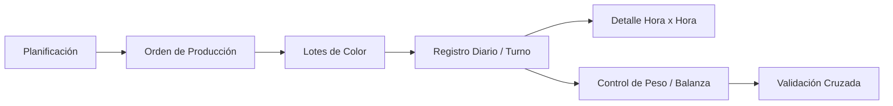

# Arquitectura Global — EnvaPeru SCM

## Descripción del Sistema
Sistema de gestión de cadena de suministro (Supply Chain Management) para la empresa EnvaPeru, especializada en manufactura por inyección de plásticos.

## Módulos Principales

### 1. Backend (Core)
- **Stack:** Python (Flask/FastAPI) + PostgreSQL
- **Responsabilidad:** Lógica de negocio, cálculos de producción, API REST
- **Entidades principales:** [[Orden_Produccion]], [[Lote_Color]], [[Registro_Diario]], [[Control_Peso]]

### 2. Frontend
- **Responsabilidad:** Interfaz de usuario para planificación, seguimiento y reportes
- **Vistas clave:** Órdenes de producción, registro diario, control de peso

### 3. Módulo de Pesaje
- **Responsabilidad:** Integración con balanzas físicas, captura de pesos en tiempo real
- **Relación:** Alimenta los datos de [[Control_Peso]] como doble verificación

## Flujo General de Datos

## Convenciones Generales
- Los cálculos se persisten en BD y se actualizan via `actualizar_metricas()`
- Snapshots se congelan al crear entidades hijas para consistencia histórica
- Unidades: gramos (g) para pesos unitarios, kilogramos (kg) para totales
- Los Float se usan sin redondeo (`math.ceil` solo en capa de presentación)
