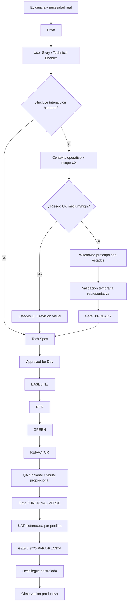

# Estándar del Pipeline Agéntico EnvaPeru

## 1. Objetivo

Convertir conocimiento de planta en incrementos pequeños, verificables, revisables y utilizables. El pipeline distingue corrección funcional, operabilidad y validación física: ninguna de ellas se infiere automáticamente de las otras.

> [!IMPORTANT]
> `Implementado`, `funcionalmente aceptado`, `UX validada` y `listo para planta` son estados diferentes.

## 2. Flujo canónico



Los ciclos `RED -> GREEN -> REFACTOR` se repiten por escenario o porción vertical. Una épica nunca entra directamente a implementación.

## 3. Ejes independientes de estado

Los documentos nuevos o actualizados conservan `estado` por compatibilidad, pero deben añadir los ejes aplicables cuando el trabajo avance. Ningún valor de un eje permite inferir los demás.

### `spec_phase`

| Valor | Significado |
|---|---|
| `draft` | Necesidad todavía no estructurada. |
| `story` | Comportamiento y aceptación definidos. |
| `tech_spec` | Contratos y estrategia técnica definidos. |
| `approved` | Instrucción consolidada y autorizada para desarrollo. |

### `delivery_state`

| Valor | Significado |
|---|---|
| `not_started` | No existe implementación activa. |
| `developing` | Incremento en construcción. |
| `review` | Implementación esperando o atendiendo revisión. |
| `ci_green` | Verificaciones automáticas acordadas verdes. |
| `deployed` | Publicado en el entorno declarado. |

### `functional_validation`

| Valor | Significado |
|---|---|
| `untested` | Sin aceptación registrada. |
| `qa_green` | Verificaciones funcionales acordadas verdes; no implica aceptación humana. |
| `uat_accepted` | Reglas y efectos aceptados por negocio; no implica usabilidad. |
| `rejected` | La validación funcional encontró un bloqueo. |

### `ux_validation`

| Valor | Significado |
|---|---|
| `not_applicable` | No existe una interacción humana material en el incremento. |
| `needs_context` | Falta evidencia del puesto, usuario o dispositivo. |
| `provisional` | Existe UI revisable, pero falta validación representativa. |
| `ux_ready` | La interacción fue validada con evidencia proporcional al riesgo. |
| `rejected` | La validación de usabilidad encontró un bloqueo. |

### `physical_uat`

| Valor | Significado |
|---|---|
| `not_required` | El incremento no involucra un recorrido u objeto físico. |
| `pending` | La prueba física o de hardware sigue pendiente. |
| `accepted` | El recorrido físico/hardware fue aceptado. |
| `rejected` | La prueba física encontró un bloqueo. |

`release_constraint: none | no_habilitar_en_planta` gobierna la activación operativa. La observación posterior al despliegue se registra en el recibo de ejecución o marcha blanca, sin confundirse con los gates anteriores.

Ejemplo válido:

```yaml
spec_phase: approved
delivery_state: deployed
functional_validation: uat_accepted
ux_validation: provisional
physical_uat: pending
release_constraint: no_habilitar_en_planta
```

## 4. Clasificación de riesgo UX

| Riesgo | Ejemplos | Evidencia mínima |
|---|---|---|
| `none` | Backend o tooling sin interacción humana | Pruebas técnicas y revisión. |
| `low` | Consulta interna poco frecuente y reversible | Estados UI, revisión visual y accesibilidad básica. |
| `medium` | Planificación, supervisión o gestión frecuente | Contexto operativo, wireflow, evidencia visual y prueba representativa. |
| `high` | Pesaje, QR, inventario, impresión, captura repetitiva o acción difícil de revertir | Observación del puesto, prototipo, validación con trabajadores, QA visual y UAT física. |

Sube el riesgo cuando la tarea sea repetitiva, ocurra bajo presión, use hardware, cambie custodia/saldo, produzca una etiqueta física o un error sea costoso. El agente puede elevar el riesgo; no puede reducir uno declarado sin decisión humana registrada.

## 5. Gates

### READY-FOR-DESIGN

- actor, objetivo, resultado, límites e invariantes inequívocos;
- ejemplos principales, errores, reintentos y correcciones;
- contexto operativo enlazado cuando existe interacción humana;
- `ux_risk`, dispositivos y perfiles UAT propuestos;
- preguntas humanas pendientes visibles.

### UX-READY

Es el camino normal obligatorio para riesgo `medium` o `high` antes de cerrar la Tech Spec:

- wireflow o prototipo de estados relevantes;
- información y acción primarias declaradas;
- datos secundarios y divulgación progresiva definidos;
- prueba con usuarios representativos y evidencia identificable;
- hallazgos críticos corregidos;

Si falta validación humana, solo una excepción de riesgo explícita puede autorizar implementación exploratoria o staging; se usa `ux_validation: provisional` y `release_constraint: no_habilitar_en_planta`. La excepción no equivale a `UX-READY` y nunca habilita uso operativo en planta.

### APPROVED-FOR-DEV

- contratos de dominio, API, interacción y presentación;
- escenarios mapeados a pruebas;
- primera prueba RED y baseline declaradas;
- dependencias, migración, reversibilidad y observabilidad;
- artefactos UX y UAT enlazados;
- límites de liberación explícitos.

### FUNCIONAL-VERDE

- pruebas acordadas verdes y evidencia registrada;
- diff revisable y sin alcance accidental;
- comportamiento, estados de error y recuperación implementados;
- QA visual proporcional al riesgo;
- comprobaciones omitidas y riesgos restantes declarados.

Al alcanzar este gate puede declararse `functional_validation: qa_green`; la aceptación UAT continúa siendo una decisión humana distinta.

### LISTO-PARA-PLANTA

- `functional_validation: uat_accepted`;
- `ux_validation: ux_ready` para interacción operativa;
- `physical_uat: accepted` cuando hay hardware u objeto físico;
- contingencia, rollback y soporte definidos;
- ausencia de `release_constraint: no_habilitar_en_planta`.

## 6. Diseño operativo de UI

Toda interfaz operativa parte de `[[../99_Plantillas/TPL_Contexto_Operativo_UI|TPL_Contexto_Operativo_UI]]`. Para riesgo `medium` o `high`, registra el wireflow y la sesión temprana con `[[../99_Plantillas/TPL_Prototipo_Operativo_UI|TPL_Prototipo_Operativo_UI]]`.

Antes de implementar define:

1. tarea inmediata del trabajador;
2. objeto físico presente y método de entrada;
3. información primaria que debe reconocer primero;
4. acción primaria y condición de habilitación;
5. estados `inicial`, `esperando`, `listo`, `confirmando`, `éxito`, `error recuperable` y `desconectado` cuando apliquen;
6. información secundaria y cómo se oculta o difiere;
7. resolución/dispositivo objetivo y condiciones de uso;
8. recuperación sin perder contexto ni duplicar efectos.

La implementación entrega capturas de los estados relevantes en el viewport objetivo. Los tests de componentes no sustituyen esta evidencia ni la observación con trabajadores.

## 7. UAT modular e instanciación

`[[../99_Plantillas/TPL_UAT_Fisica_SCM|TPL_UAT_Fisica_SCM]]` es la base común. Una UAT concreta selecciona perfiles de `[[../99_Plantillas/Perfiles_UAT/README|Perfiles UAT]]` y **copia dentro de la instancia** sus preguntas aplicables.

La instancia registra:

- modalidad: `funcional`, `operativa`, `fisica` o combinación;
- contexto operativo;
- perfiles seleccionados y versión;
- preguntas aplicables, adaptadas al caso;
- preguntas descartadas y justificación;
- resultados independientes por modalidad;
- evidencia y participantes.

Enlazar un perfil sin expandir sus preguntas no constituye una UAT preparada. La plantilla permanece genérica; la instancia nunca debe serlo.

## 8. Responsabilidades de agentes y humanos

| Responsabilidad | Agente | Humano representativo |
|---|---:|---:|
| Explorar código y documentación | Sí | Opcional |
| Proponer riesgo, perfiles y alternativas | Sí | Revisa |
| Inventar condiciones de planta | No | Aporta evidencia |
| Ejecutar pruebas automáticas | Sí | Opcional |
| Revisar evidencia visual | Sí | Participa según riesgo |
| Aprobar UX de riesgo alto | No | Sí |
| Aprobar UAT física | No | Sí |
| Declarar listo para planta | Solo tras evidencia | Sí |

## 9. Playbooks ejecutables

| Acción | Playbook | Salida esperada |
|---|---|---|
| Enriquecer una necesidad | `.agents/workflows/enrich-story.md` | Story trazable, riesgo UX, contexto y gates. |
| Diseñar la solución | `.agents/workflows/generate-tech-spec.md` | Cuatro contratos y estrategia de pruebas. |
| Implementar lo aprobado | `.agents/workflows/implement-feature.md` | Incremento, QA y recibo con estados honestos. |
| Preparar aceptación | `.agents/workflows/instantiate-uat.md` | UAT concreta con preguntas de perfiles expandidas. |

## 10. Recibo de ejecución

Cada incremento material usa `[[../99_Plantillas/TPL_Recibo_Ejecucion_Agentica|TPL_Recibo_Ejecucion_Agentica]]` y registra alcance, archivos, comandos con resultado, capturas, comprobaciones omitidas, riesgos y gate alcanzado. El agente no puede convertir su propia afirmación de finalización en evidencia de aceptación humana.

## 11. Adopción

- No se exige migrar inmediatamente todas las notas históricas.
- Toda historia, Tech Spec, DEV o UAT nueva aplica este estándar.
- Una nota histórica se normaliza cuando vuelva a modificarse materialmente.
- Las etiquetas antiguas de `estado` pueden permanecer como resumen humano; no deben usarse para inferir los ejes de especificación, entrega o validación.
