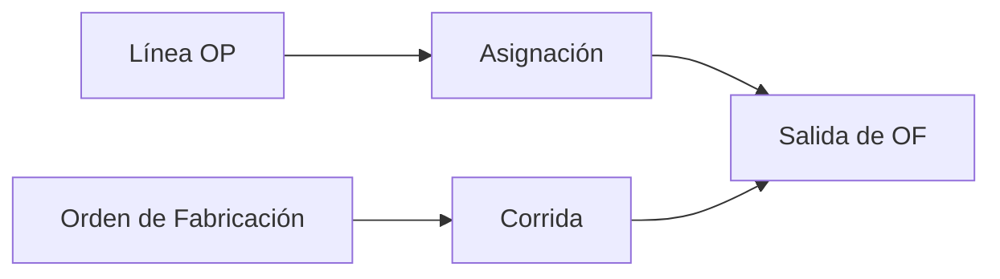

# Orden de Fabricación

Instrucción técnica ejecutable para fabricar mediante molde. Es la evolución
canónica de la entidad actualmente persistida como `OrdenProduccion`.

La OF responde **cómo fabricar** y no representa por sí misma una solicitud de
`ProductoTerminado`. Puede aportar salidas a varias líneas de
[[Orden_Produccion|OP]], producir para stock o generar WIP/producto final según
la operación de [[Ruta_Produccion]] congelada.

## Identidad

| Campo | Regla |
|---|---|
| `id`, `public_id` | Identidad estable interna y pública. |
| `codigo_of` | Correlativo humano `OF-######`; no se reutiliza. |
| `codigo_legacy_op` | Número `OP-*` anterior, solo para compatibilidad histórica. |
| `origen` | `DEMANDA_OP`, `REPOSICION_STOCK`, `MUESTRA`, `REPROCESO`, `PRUEBA_TECNICA` u otro catálogo gobernado. |
| `motivo`, `autorizacion_id` | Obligatorios cuando no nace de cobertura normal o excede lo autorizado. |
| `estado` | `BORRADOR`, `LIBERADA`, `PROGRAMADA`, `EN_EJECUCION`, `CERRADA` o `ANULADA`. |

## Configuración técnica congelada

| Campo | Regla |
|---|---|
| `molde_id` | Molde que define la fabricación. |
| `snapshot_composicion_molde_id/revision` | Cavidades y pesos por pieza congelados al liberar. |
| `ruta_operacion_snapshot_id/hash` | Operación ejecutada y artículo(s) de salida. |
| `maquina_prevista_id` | Recurso propuesto; cada OT conserva la máquina real. |
| `tiempo_ciclo_seg` | Ciclo técnico de referencia. |
| `horas_turno` | Base de capacidad planificada. |
| `peso_colada_gr` | Runner/ramal por golpe. |
| `revision`, `liberada_at`, `liberada_por_id` | Gobierno de la versión ejecutable. |

Modificar maestros después de liberar no reescribe la OF. Una corrección
material crea una nueva revisión o una orden sucesora enlazada; no sobrescribe
la fotografía técnica ejecutada.

## CorridaFabricacion

Una OF contiene una o más corridas secuenciales compatibles con el mismo molde.
Cada corrida declara exactamente:

- un `ColorProduccion`;
- una receta/revisión aprobada;
- material o política material;
- ciclos/coladas enteras objetivo;
- salidas esperadas por `ArticuloSCM`;
- kg estándar por salida;
- merma técnica y excedentes;
- orden de ejecución y estado.

`LoteColor` evoluciona hacia este concepto. Durante la transición puede
conservarse la tabla física, pero `meta_kg` deja de ser la única autoridad:
planificación parte de unidades faltantes y deriva ciclos enteros, salidas y kg.

Un [[Trabajo_Color|Trabajo de color]] referencia una sola corrida. La OT de
máquina puede contener varios Trabajos de color ordenados para la misma fecha y
turno. El cambio de color pausa/completa un trabajo e inicia otro, sin guardar
el color como texto ambiguo en la cabecera OT.

## Contexto temporal

La OF no posee una fecha productiva editable porque puede cubrir varias líneas
de OP y ejecutarse en varias OT. La consulta proyecta el rango de necesidad de
sus asignaciones de demanda y la primera/última fecha operativa de sus Trabajos
de color. `created_at`, `liberada_at`, inicio y cierre son auditoría del ciclo de
vida, no compromisos de programación.

Una OF sin OP muestra **Sin fecha de necesidad** y una OF sin Trabajo de color
programado muestra **Sin jornada programada**. La planificación finita y el
cálculo automático de fecha de inicio no pertenecen a este agregado.

## SalidaFabricacion

Por cada corrida y artículo producido conserva:

| Campo | Regla |
|---|---|
| `articulo_scm_id` | `PiezaColor`, WIP o `ProductoTerminado` permitido por la ruta. |
| `cantidad_por_ciclo_snapshot` | Derivada de cavidades efectivas para esa salida. |
| `peso_unitario_gr_snapshot` | Base técnica congelada. |
| `cantidad_objetivo` | Ciclos por cantidad por ciclo. |
| `kg_estandar_objetivo` | Cantidad objetivo por peso snapshot. |
| `cantidad_asignada_demanda` | Proyección desde asignaciones activas, no input duplicado. |
| `cantidad_excedente` | Resultado inevitable no asignado inicialmente. |

Un molde multipieza produce varias líneas de salida en la misma corrida. No
existe un “producto principal” ficticio para esconder coproductos.

## Cobertura de demanda

La OF se relaciona N:M con líneas de OP mediante
`AsignacionDemandaSuministro`. Una asignación indica qué cantidad de una salida
esperada cubre una demanda, sin adjudicar toda la OF a una OP singular.



La cantidad no asignada puede permanecer como excedente previsto o abastecer
reposición de stock. La asignación de planificación no reemplaza la recepción
física ni el consumo de inventario.

## Relación con OT, mangas y pesajes

- una OF posee N corridas;
- una corrida puede ejecutarse mediante N Trabajos de color;
- una [[Registro_Diario|OT]] de máquina contiene N Trabajos de color;
- cada Trabajo de color planifica N mangas;
- una manga pesada conserva OF, corrida, Trabajo de color y OT por ID;
- el avance real de OF se proyecta desde salidas confirmadas de sus OT;
- el avance de OP se proyecta atravesando asignaciones satisfechas.

El código visible recomendado para una manga es `OF####-OT####-M###`. El QR
contiene el `public_id` de manga y versión del contrato; no codifica relaciones
mediante concatenación.

## Cálculos

```text
peso_neto_golpe_gr =
    SUM(cantidad_por_ciclo_snapshot * peso_unitario_gr_snapshot)

peso_tiro_gr =
    peso_neto_golpe_gr + peso_colada_gr

merma_runner_pct =
    peso_colada_gr / peso_tiro_gr

cantidad_salida_objetivo =
    ciclos_objetivo * cantidad_por_ciclo_snapshot

kg_estandar_salida =
    cantidad_salida_objetivo * peso_unitario_gr_snapshot / 1000

horas_objetivo =
    ciclos_objetivo * tiempo_ciclo_seg / 3600
```

Los ciclos son enteros. Los decimales pueden presentarse como estimación antes
de confirmar la propuesta, pero una OF liberada no ordena fracciones de ciclo.

## Impresión A4

El documento que actualmente se imprime como OP pasa a ser la hoja técnica de
OF. Incluye:

- código OF y alias legacy cuando corresponda;
- molde, revisión y composición por pieza;
- rango de necesidad, jornadas programadas y capacidad;
- ciclo, colada, pesos y merma técnica;
- corridas por color;
- receta, materiales y pigmentos congelados;
- ciclos y salidas objetivo;
- referencias compactas de demanda, sin asumir una sola OP.

No imprime producción real ni avance acumulado porque es una fotografía de
requisitos. Los resultados se consultan en OT, mangas, pesajes y dashboards.

## Invariantes

1. Una OF liberada posee molde y snapshot de composición válidos.
2. Cada corrida usa un único color y revisión de receta.
3. Los ciclos liberados son enteros positivos.
4. Cada salida se deriva de la composición/ruta congelada.
5. Una OF no usa un `ProductoTerminado` singular como identidad del resultado.
6. Una salida puede cubrir varias OP y una OP puede usar varias OF.
7. Una OF sin demanda OP conserva origen, motivo y autorización aplicable.
8. Un Trabajo de color referencia una OF/corrida exacta; la OT solo agrega la
   jornada de máquina y no infiere ese vínculo por códigos.
9. Corregir una orden ejecutada no borra snapshots, OT, mangas ni pesajes.
10. Cerrar OF no libera Calidad ni ingresa automáticamente unidades a Kardex.

## Compatibilidad

Hasta ejecutar la migración, `OrdenProduccion`, `orden_produccion`,
`numero_op` y `/api/ordenes` son nombres legacy del agregado técnico. Los
contratos nuevos usarán `OrdenFabricacion`, `orden_fabricacion`, `codigo_of` y
`/api/scm/ordenes-fabricacion`; el adaptador legacy será de solo compatibilidad
y tendrá fecha de retiro definida por la Tech Spec.
