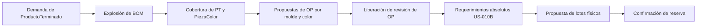

# Navegación del SCM por Procesos

## Objetivo

La navegación principal representa procesos de trabajo, no una lista de todas las entidades ni todas las pantallas. Los catálogos, configuraciones y herramientas de soporte quedan separados para evitar que una misma acción aparezca en varios lugares con significados distintos.

Esta ficha describe arquitectura de información. Las US y TS conservan la autoridad sobre reglas de negocio, permisos y persistencia.

## Niveles de Navegación

### Nivel 1: procesos principales

| Entrada | Pregunta que responde | Ruta inicial |
| :--- | :--- | :--- |
| Inicio | ¿Qué requiere atención en el sistema? | `/` |
| Planificación | ¿Qué ProductoTerminado se necesita y qué OP técnicas hacen falta? | `/planificacion` |
| Materias primas | ¿Qué se compró, recibió, liberó, reservó o entregó? | `/materiales/recepciones` |
| Producción | ¿Qué OP se ejecutan y qué avance o pesajes reportan? | `/produccion/ordenes` |

### Nivel 2: pestañas del módulo

Las pestañas aparecen únicamente al entrar a un módulo:

- **Materias primas:** Recepciones, Órdenes de compra, Calidad, Lotes e inventario, Reservas y entregas, Documentos.
- **Producción:** Órdenes de producción, Registro diario, Avance de planta, Histórico de pesajes, Talonarios OT.
- **Datos maestros:** Resumen, Productos, Piezas y SKU, Moldes, Materias primas, Trabajadores, Máquinas.

### Soporte transversal

`Datos maestros`, `Configuración` y `Guía SCM` permanecen como accesos de soporte. No compiten con los procesos diarios en el primer nivel.

## Flujo Canónico de Demanda a Reserva

Reglas de ubicación:

1. Pedir `1,000` productos comienza en **Planificación**, no en el formulario técnico de OP.
2. La BOM determina las PiezaColor faltantes y puede producir cero, una o varias OP.
3. `OP excepcional` conserva el formulario directo para contingencias justificadas; no es el camino normal de demanda.
4. La reserva no ocurre al crear la OP. Empieza en `Materias primas > Reservas y entregas` después de liberar una revisión válida.
5. La cobertura calcula necesidad; la reserva compromete lotes físicos. Son acciones distintas.

## Rutas Canónicas

| Área | Rutas |
| :--- | :--- |
| Planificación | `/planificacion`, `/planificacion/:solicitudId` |
| Producción | `/produccion/ordenes`, `/produccion/registros`, `/produccion/avance`, `/produccion/pesajes`, `/produccion/talonarios` |
| Recepción y abastecimiento | `/materiales/recepciones`, `/materiales/compras`, `/materiales/calidad`, `/materiales/inventario`, `/materiales/documentos` |
| Reserva US-010B | `/materiales/preparaciones`, `/materiales/preparaciones/:numeroOp` |
| Datos maestros | `/datos-maestros` y sus subrutas de catálogo |
| Soporte | `/configuracion`, `/guia/scm` |

## Compatibilidad

Las rutas históricas `/ordenes`, `/registros`, `/pesaje/*`, `/materiales/catalogos` y `/catalogo/*` se conservan como alias o vistas compatibles. No deben usarse para enlaces nuevos.

`/ordenes/:numeroOp/materiales` sigue resolviendo la preparación de materiales para no romper marcadores ni enlaces anteriores, pero la ruta canónica es `/materiales/preparaciones/:numeroOp`.

## Preparación para Roles

La arquitectura no depende todavía de autenticación. Cuando se incorporen roles, estos controlarán visibilidad de acciones, permisos y alcance de datos sobre la misma estructura. No se crearán menús completamente distintos por cargo salvo que una prueba operativa demuestre un flujo realmente diferente.

## Implementación

- Configuración central: `frontend/src/config/navigation.js`.
- Shell: `frontend/src/components/layout/AppShell.jsx`.
- Navegación principal: `frontend/src/components/Sidebar.jsx`.
- Pestañas contextuales: `frontend/src/components/ui/ModuleTabs.jsx`.
- Hub de catálogos: `frontend/src/components/MasterDataHub.jsx`.
- Pruebas de resolución: `frontend/src/tests/navigation.spec.js`.

