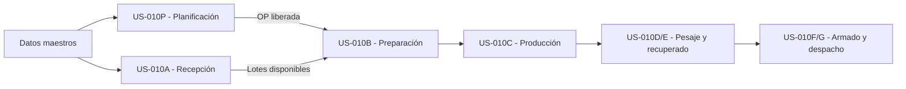

# Guía Operativa SCM - US-010

## Propósito

La ruta `/guia/scm` ofrece un recorrido navegable para explicar a Gerencia y responsables de planta:

- qué problema resuelve cada etapa del SCM;
- qué representa cada zona de sus pantallas;
- qué actor toma la decisión principal;
- qué entrada recibe y qué objeto trazable entrega;
- qué reglas no deben romperse;
- qué vistas son mock, parciales o futuras;
- qué decisiones deben salir de la reunión.

La guía es una superficie de presentación y capacitación. **No reemplaza las User Stories ni las Tech Specs como fuente de verdad funcional o técnica.** Un texto de la guía debe corregirse cuando contradiga una US aprobada; nunca debe usarse para aprobar silenciosamente una política pendiente.

## Audiencia y Duración

| Audiencia | Uso esperado |
| :--- | :--- |
| Gerencia | Comprender el recorrido completo y validar autoridad, límites y excepciones. |
| Producción | Validar planificación, ejecución, salidas físicas y decisiones por turno. |
| Almacén | Validar custodia, disponibilidad, reservas, emisiones y ubicaciones. |
| Calidad | Validar cuarentena, liberación parcial, bloqueo, rechazo y evidencia. |
| Desarrollo | Mantener fronteras entre historias y no fingir persistencia mediante mocks. |

Duración sugerida del recorrido completo: **20 a 25 minutos**.

## Arquitectura del Recorrido

Planificación y Recepción son entradas independientes. La primera entrega una OP liberada y la segunda lotes de materiales disponibles. US-010B es el primer punto donde ambas fronteras se encuentran.

## Etapas de la Página

| Orden | Etapa | Madurez | Escenario o ruta |
| :---: | :--- | :--- | :--- |
| 1 | Cómo leer la demostración | Guía | `/guia/scm?etapa=lectura` |
| 2 | Datos maestros | Disponible | `/catalogo/productos` |
| 3 | Planificación de demanda | Mock validable | `/planificacion/SP-00041` |
| 4 | Recepción y Calidad | Mock validable | `/materiales/recepciones/REC-000183` |
| 5 | Reserva y preparación | Mock validable | `/ordenes/OP-B-TEST-001/materiales` |
| 6 | Ejecución y registro diario | Por normalizar | `/registros` |
| 7 | Pesaje, empaque y recuperado | Módulo local existente; integración parcial | Estación local independiente; monitor central pendiente |
| 8 | Armado, despacho y consulta | Próxima fase | Sin vista implementada |

## Anatomía Común

Cada etapa explica las mismas dimensiones para evitar que la reunión se limite a revisar colores o campos:

1. título y frontera funcional;
2. fuente de datos;
3. indicadores de situación;
4. lista de trabajo;
5. etapas o pestañas del ciclo de vida;
6. estados y alertas;
7. comandos y capacidades de API;
8. eventos de trazabilidad.

## Convenciones de Lectura

| Señal | Significado |
| :--- | :--- |
| `Datos mock` | Fixture reproducible para validar escenarios; no es stock real. |
| Candado | Acción diseñada que todavía no posee API transaccional. |
| Estado | Condición de negocio que habilita o bloquea acciones posteriores. |
| Evento | Hecho auditable con actor, fecha, motivo y objeto afectado. |
| Vista futura | Alcance del recorrido completo, sin afirmar que la capacidad esté implementada. |

Una acción con candado nunca debe mostrar éxito, alterar saldos ni aparentar persistencia.

El módulo de pesaje existente opera como estación local y no debe exponerse directamente a Gerencia. [[US-011_Monitorear_Estaciones_de_Pesaje|US-011]] define un monitor central de solo lectura; US-010D continúa siendo responsable de normalizar el pesaje, la unidad logística y su efecto en inventario.

## Guion Recomendado

1. Comenzar en `Cómo leer la demostración` y explicar mock, candado, estado y evento.
2. Mostrar que `ProductoTerminado` agrupa `PiezaColor` y no posee color propio.
3. Abrir `SP-00041` y recorrer Demanda, Cobertura, Propuestas, Configuración y Liberación.
4. Abrir `REC-000183` y demostrar que recibir físicamente no equivale a disponer para producción.
5. Abrir `OP-B-TEST-001` y separar Reserva, Emisión, Premezcla y Consumo.
6. Presentar Producción como la transformación que crea la salida física `PiezaColor`.
7. Explicar pesaje, QR, molienda y creación de un nuevo lote recuperado.
8. Cerrar armando `ProductoTerminado` y recorriendo la genealogía hacia atrás y adelante.
9. Registrar las decisiones gerenciales pendientes sin convertir ejemplos mock en políticas.

## Decisiones Esperadas al Cierre

- roles y segregación de funciones;
- validar en planta la orden interna y el catálogo ya definidos como fuentes v1 de OC/proveedores;
- estados elegibles para cobertura, reserva, emisión y despacho;
- tolerancias y límites de aprobación;
- consolidación, prioridad, replanificación y contingencia;
- alcance, responsables y ubicaciones del piloto.

Los nombres reales de personas, zonas, límites y motivos pueden configurarse después. La semántica de las decisiones y sus responsables sí debe validarse antes de habilitar los comandos operativos.

## Evidencia Automatizada

`frontend/src/tests/ScmGuide.spec.jsx` verifica que:

- se expliquen mock, candado, estado y evento;
- Planificación enlace `SP-00041`;
- Recepción enlace el ejemplo de liberación parcial `REC-000183`;
- Preparación sea accesible desde el recorrido;
- las vistas futuras permanezcan bloqueadas;
- las decisiones para Gerencia estén visibles.

## Regla de Mantenimiento

Cuando una etapa pase de mock a API parcial o real:

1. actualizar su etiqueta de madurez;
2. revisar el enlace de escenario;
3. retirar candados solo para capacidades con contrato implementado;
4. mantener visibles las fronteras entre reserva, emisión, consumo y transformación;
5. actualizar esta ficha y [[SCM_Frontend_Overview_US-010]] en la misma entrega.
