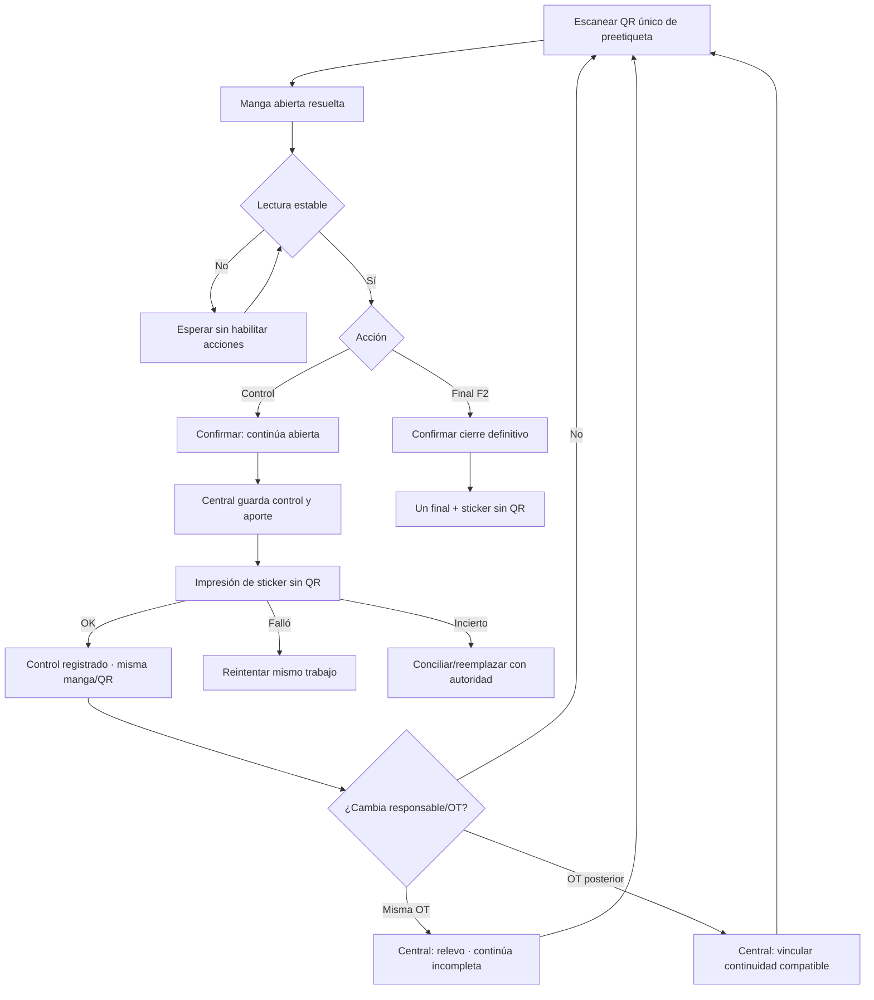

# PROTO US-010K2: relevo multi-jornada y stickers de peso

## Objetivo y evidencia

Prototipo textual previo a implementación. Recoge decisiones de Gerencia del
2026-08-29; no fue observado todavía con maquinistas ni hardware real.

## Wireflow



## Estación de Pesaje — jerarquía

```text
┌──────────────────────────────────────────────────────────┐
│ MANGA OF0021-OT0410-M007                ● CENTRAL ONLINE │
│ WIP / ARTÍCULO · COLOR · RESPONSABLE ACTUAL              │
├──────────────────────────────────────────────────────────┤
│ PESO NETO REAL (kg)                                      │
│                                                          │
│                       8.950                              │
│                                                          │
│ APORTE DESDE CONTROL ANTERIOR (kg)        +4.150         │
│ Peso estándar según unidades (kg)           8.750        │
│ Conteo acumulado                              35 UN       │
├──────────────────────────────────────────────────────────┤
│ [ Registrar control — continúa abierta ]   [ FINAL F2 ]  │
└──────────────────────────────────────────────────────────┘
```

`FINAL F2` requiere separación visual, texto de cierre definitivo y una
confirmación inequívoca. No comparte color/posición con el control.

## Central — declaración de relevo

```text
┌──────────────────────────────────────────────────────────┐
│ Registrar relevo — manga continúa incompleta             │
├──────────────────────────────────────────────────────────┤
│ Manga              OF0021-OT0410-M007  [solo lectura]     │
│ Último control     8.950 kg · 35 UN     [solo lectura]    │
│ Responsable sale   José Quispe           [solo lectura]  │
│ Responsable entra  [ Pedro Huaman ▼ ]                    │
│ Motivo              [ Salida anticipada_______________ ] │
│ Destino             (•) Misma OT  ( ) OT posterior       │
│                                                          │
│ [ Cancelar ]       [ Confirmar relevo y conservar manga ]│
└──────────────────────────────────────────────────────────┘
```

Central no solicita redigitar peso ni frontera si existe un control vigente.
Si no existe frontera válida, deriva a Pesaje antes de confirmar.

## Sticker de control 2-up — copia individual

```text
┌──────────────────────────────────────────┐
│ CONTROL · MANGA CONTINÚA ABIERTA         │
│ OF0021-OT0410-M007 · 29/08 14:35         │
│ WIP/ARTÍCULO: ORRINES · BLANCO           │
│                                          │
│ PESO NETO REAL (kg)                      │
│                 8.950                    │
│                                          │
│ APORTE ANTERIOR (kg)          +4.150     │
│ CONTEO ACUMULADO                 35 UN   │
│ RESPONSABLE: PEDRO HUAMAN                 │
└──────────────────────────────────────────┘
```

- Sin QR.
- El valor `8.950` es el texto de mayor tamaño.
- `CONTROL · MANGA CONTINÚA ABIERTA` evita confundirlo con inventario/final.
- La preetiqueta con QR debe quedar fuera del área de superposición.
- El estándar y diagnóstico técnico pueden quedar en Central si no caben sin
  competir con neto/aporte.

## Sticker final 2-up — copia individual

```text
┌──────────────────────────────────────────┐
│ FINAL · MANGA CERRADA                    │
│ OF0021-OT0410-M007 · 30/08 09:10         │
│ WIP/ARTÍCULO: ORRINES · BLANCO           │
│                                          │
│ PESO NETO FINAL (kg)                     │
│                12.000                    │
│                                          │
│ APORTE ÚLTIMO TRAMO (kg)       +3.050    │
│ CONTEO FINAL                       50 UN  │
│ 1 QR: CONSERVAR PREETIQUETA               │
└──────────────────────────────────────────┘
```

La leyenda de conservación es provisional: puede omitirse del papel si la UAT
demuestra que consume espacio sin prevenir errores.

## Estados y recuperación

| Estado | Mensaje/acción primaria |
|---|---|
| Esperando | `Escanea el QR de la preetiqueta` |
| Inestable | `Esperando peso estable`; acciones deshabilitadas |
| Listo | Neto y aporte visibles; control disponible |
| Guardando | Bloqueo de doble submit |
| Impresión pendiente | Control vigente; no volver a pesar |
| Impreso | `Sticker impreso · manga continúa abierta` |
| Fallo sin emisión | `Reintentar este mismo sticker` |
| Emisión incierta | `No reimprimir; solicitar conciliación` |
| Desconectado | Control/final autoritativos bloqueados |
| Relevo registrado | Mismo código/QR y nuevo responsable visibles |

## Evidencia pendiente

- render SVG/TSPL a tamaño `109 × 50 mm`;
- lectura del QR tras tres stickers superpuestos;
- reconocimiento `CONTROL` frente a `FINAL` por maquinistas;
- legibilidad de neto/aporte a distancia real;
- prueba con emisión fallida e incierta;
- validación de densidad para nombres WIP largos.
