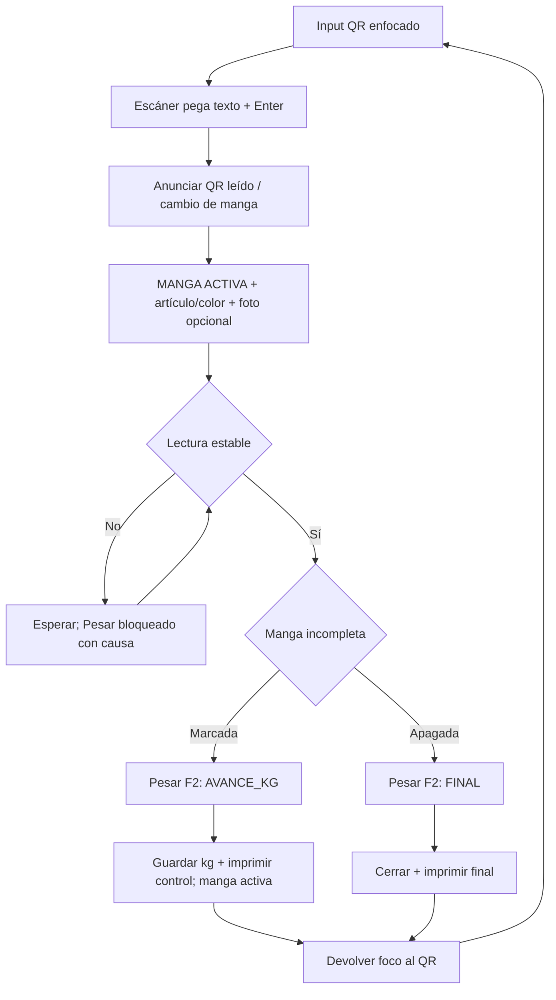

# PROTO US-010K3: pesaje único y contexto visible

## Wireflow



## Jerarquía objetivo

```text
┌────────────────────────────────────────────────────────────┐
│ ✓ CAMBIO DE MANGA · …M001 → …M002                          │
├───────────────────────────────┬────────────────────────────┤
│ MANGA ACTIVA                  │ [ foto de pieza ]          │
│ OF000017-OT007-M002           │ o “Sin foto registrada”    │
│ IDENTIDAD DEL CONTENIDO                                    │
│ EMBUDO #4                                                  │
│ [muestra] ANARANJADO SÓLIDO   │                            │
│ OT / máquina / maquinista     │                            │
├───────────────────────────────┴────────────────────────────┤
│ PESO NETO REAL                                            │
│                         7.600 kg                           │
│                                                            │
│ [✓] Manga incompleta · registrar solo avance en kg         │
│ MODO: SEGUIRÁ ABIERTA · no confirma unidades               │
│                                                            │
│                 [ PESAR MANGA (F2) ]                        │
└────────────────────────────────────────────────────────────┘
```

Checkbox apagado cambia la línea de modo a:
`MODO: CIERRE FINAL · confirma el objetivo e imprime`.

El cierre final parcial se presenta como excepción supervisada secundaria y
no puede coexistir con `Manga incompleta`.

La muestra de color tiene 44 px, borde visible y nombre textual. Para la
familia `TRANSPARENTE` usa cuadriculado gris/blanco; el blanco sólido conserva
una muestra blanca con borde y por ello no se confunden. El patrón no invade
la tarjeta ni compite con el código de manga.

## Estados

| Estado | Señal primaria | Recuperación |
|---|---|---|
| Esperando QR | Input enfocado; no hay manga activa | Escanear + Enter |
| QR resuelto | Anuncio textual + código grande | Verificar pieza, color y foto |
| Inestable | `Esperando peso estable` | Mantener manga en balanza |
| Listo avance | `SEGUIRÁ ABIERTA` | Pesar/F2 |
| Listo final | `CIERRE FINAL` | Pesar/F2 |
| Guardando | Botón bloqueado y texto de progreso | Esperar/replay |
| Avance aceptado | Neto/aporte, `sigue abierta`, impresión | Foco vuelve al QR |
| Final aceptado | Neto final, estado e impresión | Foco vuelve al QR |
| Foto ausente | Placeholder textual | Ninguna; no bloquea |
| Error | Código/mensaje textual; sin éxito falso | Reintentar o escanear |

## Evidencia pendiente

- captura a resolución real de `PESAJE-PLANTA-01`;
- tres QR consecutivos sin mouse;
- foto con nombres largos y fallback;
- reconocimiento de Transparente frente a blanco sólido desde el puesto;
- doble F2/click y respuesta perdida;
- control real impreso sin conteo;
- reconocimiento del modo por operador representativo.
