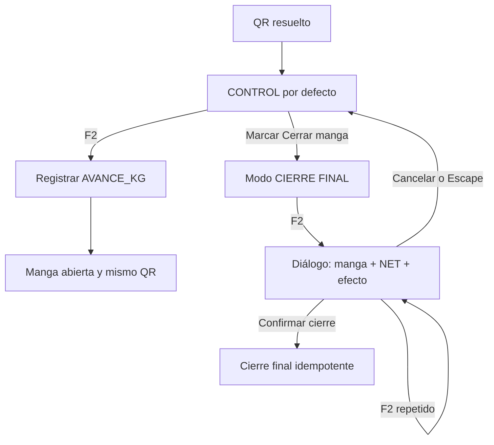

# PROTO US-010K7: control seguro y cierre deliberado

## Wireflow



## Estados principales

```text
┌──────────────────────────────────────────────────────┐
│ CONTROL DE PESO · LA MANGA CONTINUARÁ ABIERTA       │
│ Solo kg · no cambia OT, turno ni maquinista          │
│                                                      │
│ [ ] Cerrar manga en este pesaje                      │
│     Requiere confirmación antes de enviar            │
│                                                      │
│              [ PESAR MANGA (F2) ]                    │
└──────────────────────────────────────────────────────┘

┌──────────── CONFIRMAR CIERRE FINAL ─────────────────┐
│ OF000001-OT002-M001                                  │
│ NET 4.970 kg                                         │
│ No es un control. La manga quedará cerrada y se      │
│ generará el comprobante final.                       │
│                                                      │
│ [Cancelar; volver a Control] [Confirmar cierre]      │
└──────────────────────────────────────────────────────┘
```

El foco inicial del diálogo queda en Cancelar. Escape cancela. F2 dentro del
diálogo no confirma. El selector y los textos usan palabras además de color.
La confirmación debe caber en el viewport de UAT local; la aceptación desde el
puesto real continúa pendiente.
