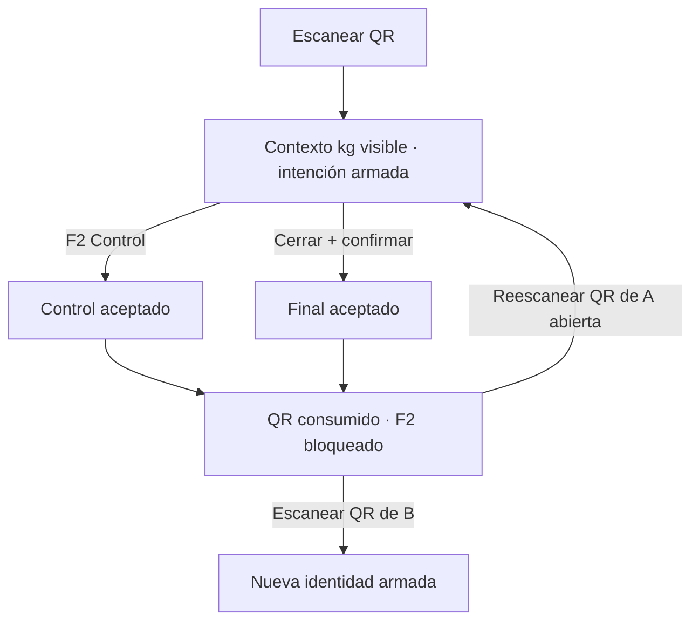
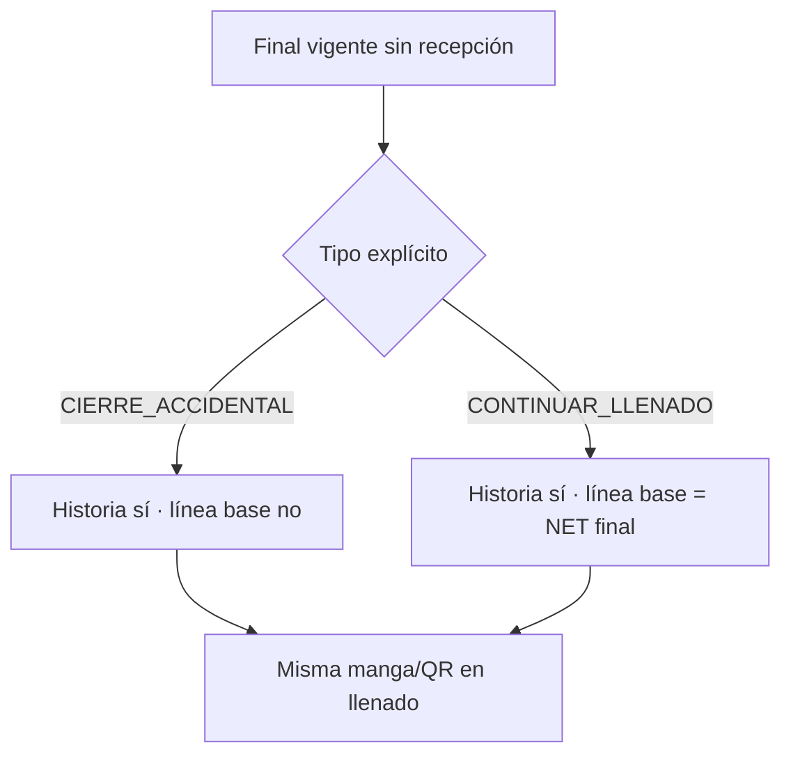

# PROTO US-010K8

## Wireflow de estación



```text
MANGA OF000001-OT002-M001     ABIERTA
EMBUDO #4 · ANARANJADO SÓLIDO
Peso fabricado teórico       7.440 kg
Último NET aceptado          4.790 kg
NET actual                   4.970 kg
Diferencia                   0.180 kg

[ PESAR MANGA (F2) ]

ÉXITO · 4.970 kg registrados
F2 BLOQUEADO
Retire la manga y escanee el QR del siguiente pesaje.
```

## Wireflow de reapertura



La selección administrativa muestra antes de confirmar el NET final, la
invalidación de la postetiqueta y si ese NET será referencia del siguiente
pesaje. La validación representativa sigue pendiente.
