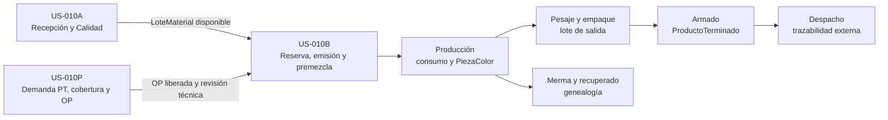

# Frontend SCM — Overview US-010

## Propósito

Este documento convierte el alcance end-to-end de [[US-010_Trazabilidad_End_to_End_SCM]] en un mapa de vistas. Es una estructura evolutiva: permite diseñar con datos mock sin congelar endpoints, permisos ni decisiones operativas todavía pendientes.

La presentación integrada para Gerencia y usuarios de planta se encuentra en [[Guia_Operativa_SCM_US-010]] y en la ruta frontend `/guia/scm`.

## Mapa de Madurez

| Tramo | Resultado visible esperado | Madurez frontend | Documento |
| :--- | :--- | :--- | :--- |
| US-010A | Recibir, identificar, ubicar y decidir disponibilidad de materia prima | `mock` | [[Vista_US-010A_Recepcion_Materiales]] |
| US-010P | Convertir demanda de ProductoTerminado en cobertura, faltantes y OP técnicas | `mock` | [[Vista_US-010P_Planificacion_Demanda_OP]] |
| US-010B | Preparar materiales por OP, desde plan hasta premezcla trazable | `mock` | [[Vista_US-010B_Preparacion_Materiales]] |
| Producción | Registrar consumo y salida física de PiezaColor | `legacy/por normalizar` | Pendiente de ficha hija |
| Pesaje y empaque | Formar lotes y unidades logísticas identificadas | `por relevar` | Pendiente de ficha hija |
| Recuperación | Moler merma y crear material recuperado con genealogía | `concepto` | Pendiente de historia hija |
| Armado | Consumir PiezaColor y formar ProductoTerminado | `concepto` | Pendiente de historia hija |
| Despacho | Identificar salida, destinatario y alcance trazable | `concepto` | Pendiente de historia hija |

## Fronteras entre US-010A, US-010P y US-010B

Ahora existen tres superficies mock conectadas:

- el mock US-010A representa recepción, cuarentena, inspección, Calidad y disponibilidad;
- el mock US-010P comienza con demanda de `ProductoTerminado`, calcula cobertura y propuestas, y representa la entrega de una OP liberada;
- el mock US-010B comienza con una OP y lotes ya recibidos, consumiendo ambas fronteras mediante `/materiales/preparaciones/:numeroOp`; la ruta histórica permanece como alias.

US-010P y US-010A son entradas independientes de US-010B:

| Frontera | Entrega a US-010B |
| :--- | :--- |
| US-010P -> US-010B | OP liberada, lote de producción, ciclos/salidas y revisión técnica/de receta. |
| US-010A -> US-010B | `LoteMaterial` identificado, liberado, ubicado y con cantidad disponible. |

El mock de US-010B continúa sin duplicar la recepción. Recibe lotes que ya poseen los datos necesarios para decidir si pueden reservarse:

| Dato procedente de US-010A | Uso en el mock de US-010B |
| :--- | :--- |
| `loteInterno`, `proveedor` y estado del lote externo | Identificación de la recepción aunque el lote del proveedor esté `NO_INFORMADO`. |
| identidad de material | Correspondencia con el requerimiento de la OP. |
| `calidad` | Solo un lote `LIBERADO` puede ser candidato. |
| `incidencia` o retención | Impide considerar disponible un lote retenido aunque Calidad lo haya liberado. |
| `ubicacion` | Confirma que se encuentra en un almacén compatible de materias primas. |
| `disponibleKg` | Límite físico utilizable por la reserva. |

La pantalla `/materiales/preparaciones` de US-010B **no representa** la creación de demanda, explosión de BOM, configuración de OP, documentos de recepción, pesaje, inspección, cuarentena ni resolución de Calidad. Planificación pertenece a [[Vista_US-010P_Planificacion_Demanda_OP]] y recepción a [[Vista_US-010A_Recepcion_Materiales]]. Correcciones, devoluciones y demás escrituras se muestran como capacidades pendientes, sin fingir persistencia.

## Regla de Crecimiento

1. Se puede construir una vista mock cuando la US ya define estados, invariantes y ejemplos observables.
2. Los comandos sin transacción real permanecen bloqueados según [[Patron_Capacidades_API_y_Mocks]].
3. Una Tech Spec reemplaza supuestos técnicos por contratos; no obliga a rediseñar la arquitectura de información validada.
4. Cada tramo se integra mediante un contrato de frontera explícito. En A->B es `LoteMaterial` identificado, ubicado, con Calidad, retención y disponibilidad independientes; en P->B es una OP liberada con revisión técnica inmutable desde la cual B calcula requerimientos.
