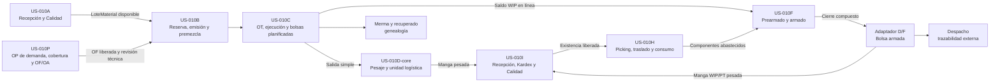

# Frontend SCM — Overview US-010

## Propósito

Este documento convierte el alcance end-to-end de [[US-010_Trazabilidad_End_to_End_SCM]] en un mapa de vistas. Distingue superficies conectadas a la API de los cortes todavía conceptuales o en refinamiento.

La presentación integrada para Gerencia y usuarios de planta se encuentra en `/guia/scm`. Su migración desde el walkthrough histórico hacia Markdown operativo se define en [[Arquitectura_Guia_SCM_Markdown]].

## Mapa de Madurez

| Tramo | Resultado visible esperado | Madurez frontend | Documento |
| :--- | :--- | :--- | :--- |
| US-010A | Recibir, identificar, ubicar y decidir disponibilidad de materia prima | `mock` | [[Vista_US-010A_Recepcion_Materiales]] |
| US-010P | Crear OP de demanda y convertir faltantes en OF/OA | `mock a adaptar` | [[Vista_US-010P_Planificacion_Demanda_OP]] |
| US-010B | Preparar materiales por OF, desde plan hasta premezcla trazable | `mock a adaptar` | [[Vista_US-010B_Preparacion_Materiales]] |
| US-010C | Crear OT central, registrar ejecución y preparar identidades de bolsa | `legacy/por normalizar` | [[US-010C_Orden_Trabajo_Ejecucion_y_Planificacion_Bolsas]] |
| US-010D-core | Pesar bolsas simples y materializar unidades logísticas | `piloto local/por normalizar` | [[US-010D_Pesaje_Bolsas_Unidad_Logistica_y_Sincronizacion]] |
| US-010I | Recibir la manga por QR, crear Kardex no disponible y resolver Calidad | `implementado local; pendiente UAT` | [[Vista_US-010I_Recepcion_Mangas_Kardex]] |
| US-010H | Preparar picking, traslado, consumo parcial y retorno hacia Armado | `historia cerrada; TS y desarrollo pendientes` | [[US-010H_Abastecimiento_Interno_Picking_QR_y_Consumo_Mangas]] |
| US-010F + D/F | Crear OT de Armado en mesa o concurrente, consumir piezas actuales/previas y cerrar la bolsa sin inflar la OT | `piloto local; modalidad diaria integrada` | [[Vista_US-010F_Ordenes_Armado]] |
| Recuperación | Moler merma y crear material recuperado con genealogía | `concepto` | Pendiente de historia hija |
| Despacho | Identificar salida, destinatario y alcance trazable | `concepto` | Pendiente de historia hija |
| Workspace transversal | Encontrar Planificación, Producción, Materiales, Almacén, Control y soporte según capacidades | `concepto aprobado` | [[Vista_US-010N_Workspace_Navegacion_e_Inicio]] |
| Control / Supervisión | Consultar Fabricación y Armado como read model de lista, detalle y resumen, sin comandos ni mezcla legacy | `implementado local; smoke/UAT pendientes` | [[Vista_US-010N4_Supervision_de_Produccion]] |

La arquitectura transversal vigente se define en
[[Arquitectura_Workspace_SCM_por_Areas]]. No cambia las fronteras de dominio
del diagrama; cambia cómo el usuario descubre y enlaza cada superficie.

**Jornadas de Planta** sigue siendo la superficie operativa para preparar y
abrir una OT/OA concreta. **Supervisión de producción** vive en Control y
consulta el universo normalizado de Fabricación y Armado; no reemplaza Jornadas
ni absorbe el dashboard legacy de avance/pesajes.

## Fronteras entre US-010A, US-010P y US-010B

Ahora existen tres superficies mock conectadas:

- el mock US-010A representa recepción, cuarentena, inspección, Calidad y disponibilidad;
- el mock US-010P comienza con una OP de `ProductoTerminado`, calcula cobertura y propuestas OF/OA, y representa la entrega de una OF liberada;
- el mock US-010B comienza con una OF y lotes ya recibidos; la ruta histórica por `numeroOp` permanece solo como alias de transición.

US-010P y US-010A son entradas independientes de US-010B:

| Frontera | Entrega a US-010B |
| :--- | :--- |
| US-010P -> US-010B | OF/corrida liberada, ciclos/salidas y revisión técnica/de receta. |
| US-010A -> US-010B | `LoteMaterial` identificado, liberado, ubicado y con cantidad disponible. |

El mock de US-010B continúa sin duplicar la recepción. Recibe lotes que ya poseen los datos necesarios para decidir si pueden reservarse:

| Dato procedente de US-010A | Uso en el mock de US-010B |
| :--- | :--- |
| `loteInterno`, `proveedor` y estado del lote externo | Identificación de la recepción aunque el lote del proveedor esté `NO_INFORMADO`. |
| identidad de material | Correspondencia con el requerimiento de la OF/corrida. |
| `calidad` | Solo un lote `LIBERADO` puede ser candidato. |
| `incidencia` o retención | Impide considerar disponible un lote retenido aunque Calidad lo haya liberado. |
| `ubicacion` | Confirma que se encuentra en un almacén compatible de materias primas. |
| `disponibleKg` | Límite físico utilizable por la reserva. |

La pantalla `/materiales/preparaciones` de US-010B **no representa** la creación
de OP de demanda, explosión de BOM, configuración de OF, documentos de
recepción, pesaje, inspección, cuarentena ni resolución de Calidad.
Planificación pertenece a [[Vista_US-010P_Planificacion_Demanda_OP]] y recepción
a [[Vista_US-010A_Recepcion_Materiales]].

## Regla de Crecimiento

1. Se puede construir una vista mock cuando la US ya define estados, invariantes y ejemplos observables.
2. Los comandos sin transacción real permanecen bloqueados según [[Patron_Capacidades_API_y_Mocks]].
3. Una Tech Spec reemplaza supuestos técnicos por contratos; no obliga a rediseñar la arquitectura de información validada.
4. Cada tramo se integra mediante un contrato de frontera explícito. En A->B es
   `LoteMaterial` identificado, ubicado, con Calidad, retención y disponibilidad
   independientes; en P->B es una OF/corrida liberada con revisión técnica
   inmutable desde la cual B calcula requerimientos.
