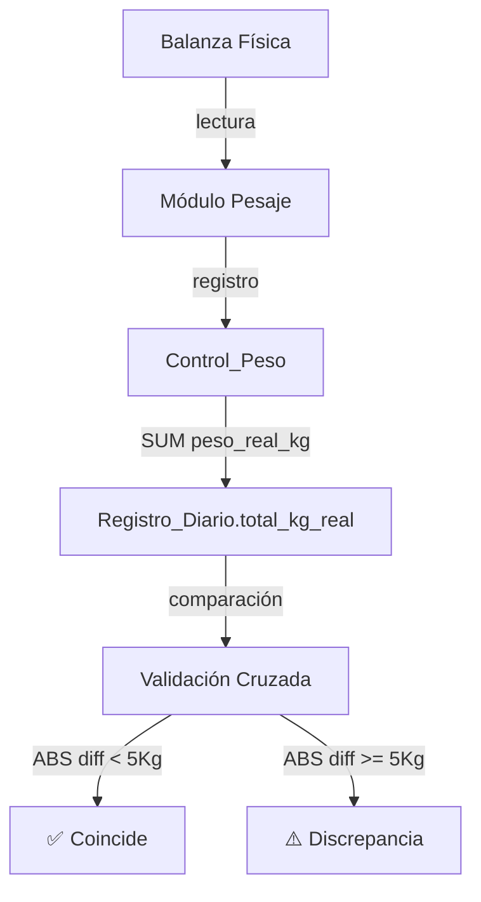

# Sincronización de Datos — Pesaje

Documenta cómo se cruzan los datos del módulo de pesaje con el resto del sistema.

## Flujo Legacy

## Regla de Prioridad
`total_kg_real` del [[Registro_Diario]] se calcula así:
1. **Prioridad 1:** `SUM(ControlPeso.peso_real_kg)` — pesajes físicos reales
2. **Prioridad 2 (fallback):** `total_coladas × (peso_neto_gr + peso_colada_gr) / 1000`

> El contrato legacy no posee reservas, estado pendiente ni idempotencia suficiente para inventario; no se amplía como solución SCM.

## Flujo SCM objetivo

El flujo anterior no es autoritativo para inventario SCM. La evolución se divide entre:

- [[US-010C_Orden_Trabajo_Ejecucion_y_Planificacion_Bolsas|US-010C]]: central crea la OT/Hoja, saldo/reservas WIP y las bolsas que la estación descarga;
- [[US-010D_Pesaje_Bolsas_Unidad_Logistica_y_Sincronizacion|US-010D-core]]: la estación pesa una salida simple por `bag_id`, persiste outbox y central debita WIP/materializa una sola unidad logística.
- [[US-010F_Prearmado_y_Armado_Concurrente_Trazable|US-010F + adaptador D/F]]: cuando la bolsa contiene producto armado, el outbox conserva un único `CONFIRMAR_BOLSA_ENSAMBLADA`; central registra peso, cantidad, consumos, lote y unidad en una transacción y no atribuye todo el neto a la OT de contexto.

El contrato nuevo exige `station_id`, `operation_id`, identidad/reserva/version de bolsa, `unidad_tipo`, `content_lot_type` y lote; `source_event_id=operation_id` en el evento superior y `ot_id` es contexto cuando corresponde. El QR usa `SCM_BAG`; el modo UI se deriva. No crea una OT por coincidencia de textos ni amplía silenciosamente `sync-pesajes-legacy-v1`.

El peso enviado es el neto físico completo. Una bolsa armada sincroniza idempotentemente un solo envelope con `operation_id`; no envía pesaje y consumos como operaciones finales separadas. Un porcentaje de descuento legacy nunca sustituye sus consumos.

El transporte es al-menos-una-vez y central aplica efectos una sola vez. Hasta el acuse, la captura queda `CAPTURADA_PENDIENTE_SYNC`, la etiqueta indica no disponibilidad y la bolsa se aísla. Una reserva vencida o un conflicto queda en conciliación; nunca se libera stock automáticamente mientras una estación pueda conservar el evento.
