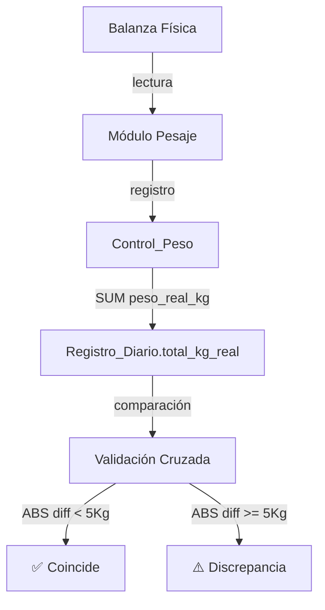

# Sincronización de Datos — Pesaje

Documenta cómo se cruzan los datos del módulo de pesaje con el resto del sistema.

## Flujo de Datos

## Regla de Prioridad
`total_kg_real` del [[Registro_Diario]] se calcula así:
1. **Prioridad 1:** `SUM(ControlPeso.peso_real_kg)` — pesajes físicos reales
2. **Prioridad 2 (fallback):** `total_coladas × (peso_neto_gr + peso_colada_gr) / 1000`

> **TODO:** Definir comportamiento offline y sincronización batch.
