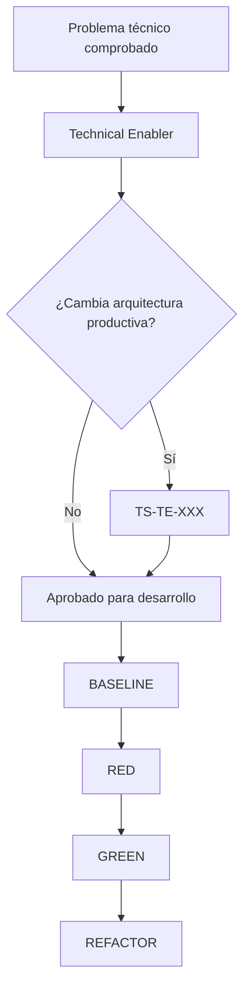

# 02_Technical_Enablers

## Propósito

Este directorio contiene trabajo técnico que habilita o reduce el riesgo de futuras historias, pero que no representa por sí mismo una necesidad observable de un usuario de planta.

Ejemplos válidos:

- infraestructura y reproducibilidad de pruebas;
- observabilidad y diagnóstico;
- herramientas de migración;
- seguridad transversal;
- rendimiento o capacidad;
- reducción controlada de deuda técnica;
- pruebas de concepto para resolver incertidumbre técnica.

Un Technical Enabler no debe utilizarse para esconder decisiones de negocio pendientes ni para implementar anticipadamente una User Story.

## Registro

| Enabler | Capacidad | Estado |
|---|---|---|
| [[TE-001_Infraestructura_TDD_Reproducible|TE-001]] | Línea base TDD reproducible | Implementado |
| [[TE-002_CI_Coordinado_Multirepositorio|TE-002]] | CI por componente y workspace | En desarrollo; pendiente primera ejecución remota |
| [[TE-003_Contratos_Central_Pesaje_y_E2E_Aislado|TE-003]] | Contrato legacy-v1 y E2E aislado | Implementado |
| [[TE-004_Despliegue_Operativo_y_Observabilidad_Estacion_Pesaje|TE-004]] | Estación de pesaje desplegable, recuperable y observable | En refinamiento |

## Estructura Recomendada

Cada `TE-XXX` debe incluir:

1. Problema y evidencia verificable.
2. Capacidad que habilita.
3. Alcance y fuera de alcance.
4. Componentes afectados.
5. Criterios de aceptación automatizables o verificables.
6. Riesgos y reversibilidad.
7. Estrategia de pruebas.
8. Definición de Terminado.

## Relación con Tech Specs

### Enabler autocontenido

Puede pasar directamente a aprobación y desarrollo cuando:

- solo modifica herramientas o infraestructura de desarrollo;
- no altera reglas de negocio ni contratos externos;
- es reversible y de impacto acotado;
- sus criterios técnicos son suficientes para implementarlo sin ambigüedad.

### Enabler con impacto arquitectónico

Debe producir una `TS-TE-XXX` cuando:

- cambia arquitectura productiva;
- introduce servicios, protocolos o dependencias de runtime;
- modifica seguridad, disponibilidad o recuperación;
- requiere migraciones o compatibilidad entre módulos;
- existen varias alternativas con consecuencias relevantes.

## Flujo

## Convención de Estado

- `propuesto`: problema identificado, todavía no aprobado.
- `en-refinamiento`: alcance o criterios incompletos.
- `aprobado`: listo para desarrollar.
- `en-desarrollo`: implementación activa.
- `implementado`: criterios cumplidos y evidencia registrada.
- `bloqueado`: existe una dependencia externa explícita.
