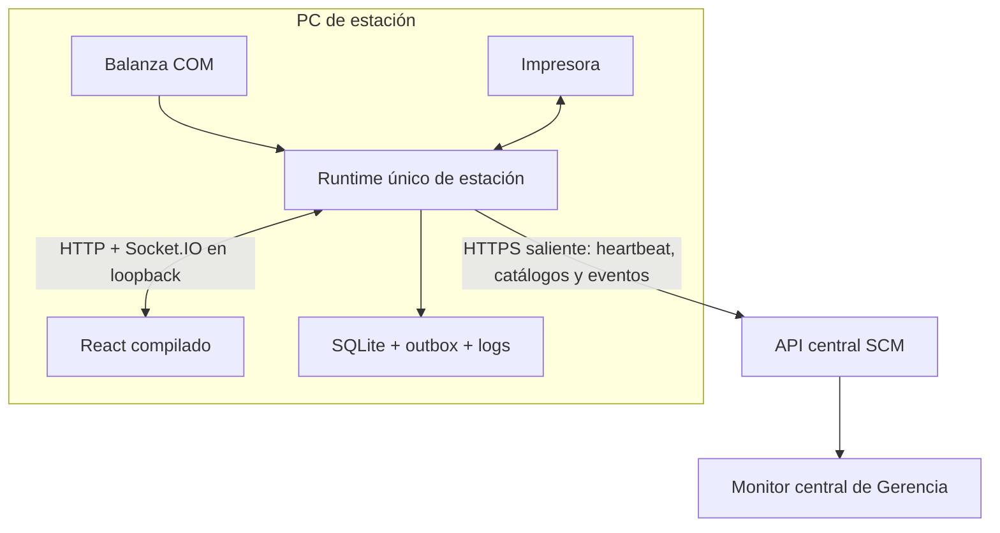

# TE-004: Despliegue Operativo y Observabilidad de la Estación de Pesaje

## 1. Problema y Evidencia

El módulo de pesaje funciona localmente, pero su forma actual de ejecución es un entorno de desarrollo, no una unidad operativa reproducible:

- `start-windows.bat` abre Flask en otro `cmd /k` y mantiene Vite como proceso de desarrollo;
- `backend/run.py` activa el reloader cuando `DEBUG=True`;
- `create_app()` inicia un worker de sincronización durante el bootstrap;
- el reloader puede crear procesos adicionales y workers duplicados;
- cerrar la ventana web o el wrapper no garantiza detener todos los procesos ni liberar el puerto;
- React codifica `127.0.0.1:5050` para API y Socket.IO;
- CORS y Socket.IO aceptan cualquier origen;
- no existe autenticación local ni frontera entre lectura y comandos de hardware;
- SQLite, logs, backup, restauración y actualización no poseen un ciclo operativo documentado;
- el contrato central `legacy-v1` no es globalmente idempotente, según TE-003.

La consecuencia es doble: el piloto puede pesar, pero no puede instalarse, supervisarse, detenerse, recuperarse o actualizarse con garantías repetibles.

## 2. Decisión Arquitectónica

El módulo se desplegará como una **estación edge de pesaje** junto a la balanza:

1. Un único runtime local sirve la UI React compilada, la API local y Socket.IO.
2. La API y Socket.IO escuchan solo en loopback.
3. Socket.IO conserva el peso en vivo y las notificaciones dentro de la estación.
4. La sincronización con central se realiza mediante peticiones salientes autenticadas y una cola durable.
5. El backend central nunca abre el puerto serial ni depende de una conexión Socket.IO con la estación.
6. El navegador es un cliente; cerrarlo no detiene el servicio de estación.
7. El proceso de estación es iniciado y supervisado por Windows y se detiene mediante un procedimiento explícito.

## 3. Socket.IO No Impide el Despliegue

Socket.IO es desplegable, pero necesita un servidor y una política de procesos compatibles. No debe confundirse con la sincronización durable:

- **Socket.IO local:** peso instantáneo, conexión de balanza y refresco de pantalla. Si se corta, el cliente reconecta.
- **SQLite/outbox local:** persistencia de hechos aceptados. No depende de que el navegador esté conectado.
- **API central:** recepción durable, autenticada, versionada e idempotente.
- **Monitor central:** puede consultar REST o usar su propio canal de tiempo real; no reutiliza el Socket.IO privado de la balanza.

Una estación tendrá un solo proceso servidor y pocos clientes locales, por lo que no necesita escalado horizontal ni un broker para Socket.IO. [[TS-TE-004_Despliegue_y_Comunicacion_Estacion_Pesaje|TS-TE-004]] selecciona Waitress multihilo con transporte polling para el piloto y exige probar Windows, Socket.IO, pyserial y apagado ordenado. No se aprobará un runner solo porque abre la pantalla.

Si ningún runner WebSocket resulta estable en la PC objetivo, el transporte local puede degradarse temporalmente a long-polling o polling explícito sin alterar la arquitectura central. El pesaje confirmado siempre se persiste antes de notificarse a la UI.

## 4. Capacidad Habilitada

**Como** equipo responsable de operar y mantener las estaciones de pesaje  
**Queremos** una unidad desplegable, reiniciable, observable, respaldable y reversible  
**Para** ejecutar un piloto continuo junto a la balanza sin depender de consolas de desarrollo ni exponer el hardware a la red.

TE-004 habilita [[US-011_Monitorear_Estaciones_de_Pesaje|US-011]] y reduce el riesgo operativo previo a US-010D. No implementa las reglas funcionales de pesaje trazable de esa historia futura.

## 5. Alcance

- build reproducible de React y backend;
- UI estática servida por el runtime local;
- eliminación de Node/Vite del runtime de estación;
- configuración productiva con `DEBUG=False` y sin reloader;
- una sola instancia por estación;
- selección y prueba de un servidor compatible con Socket.IO en Windows;
- inicio automático y reinicio ante fallo;
- apagado ordenado y liberación verificable del puerto y puertos COM;
- identidad persistente de estación y versión instalada;
- endpoints locales de liveness y readiness;
- heartbeat saliente hacia central;
- logs rotativos y diagnóstico sin secretos;
- directorios estables para datos, configuración y logs;
- backup consistente, verificación y restauración de SQLite;
- configuración de firewall, origen y autenticación;
- paquete versionado, instalación, actualización y rollback documentados;
- pruebas automatizadas sin hardware y smoke test con balanza e impresora reales.

## 6. Fuera de Alcance

- empaquetar nuevamente con Electron como requisito del piloto;
- exponer Flask, Socket.IO o SQLite a otras computadoras;
- administrar remotamente la balanza;
- sustituir el contrato de pesaje de US-010D;
- migrar todos los datos legacy a unidades logísticas;
- definir reglas de negocio para tara, bultos, rechazo o material recuperado;
- alta disponibilidad con varias PCs controlando la misma balanza;
- actualización automática sin ventana y autorización de soporte.

## 7. Componentes Afectados

| Componente | Responsabilidad del cambio |
|---|---|
| `modulo-pesaje/frontend` | Build estático, same-origin y estados de conexión claros. |
| `modulo-pesaje/backend` | Runtime único, shutdown, health, station ID, heartbeat, seguridad y rutas de datos. |
| Scripts Windows | Instalar, iniciar, detener, diagnosticar, respaldar, restaurar y actualizar. |
| Backend central | Registrar estaciones, autenticar heartbeat y conservar estado observable. |
| Frontend central | Monitor de solo lectura definido por US-011. |
| Contratos | Heartbeat versionado y convivencia explícita con `legacy-v1`. |
| CI workspace | Build de release, tests de lifecycle, contrato y E2E aislado. |

## 8. Perfil de Runtime Objetivo

### 8.1. Proceso

- un proceso servidor por estación;
- `DEBUG=False` y `use_reloader=False`;
- bloqueo de segunda instancia mediante mecanismo verificable;
- bind exclusivo a `127.0.0.1`;
- puerto configurable y reservado para la estación;
- supervisor de Windows con inicio automático y reinicio limitado ante fallo;
- navegador desacoplado del ciclo de vida del servidor;
- comandos administrativos separados para abrir UI, consultar estado, detener y reiniciar.

La opción inicial recomendada para el piloto es inicio al iniciar sesión mediante una tarea supervisada, porque el proceso necesita acceso a la sesión y a puertos COM. La Tech Spec comparará esta opción con un servicio Windows antes de decidir.

### 8.2. UI

- `npm run build` se ejecuta en CI o preparación de release, no en la estación durante cada arranque;
- el contenido de `dist` se distribuye junto al backend;
- API y Socket.IO usan same-origin y rutas relativas;
- no se requiere Node.js para operar la estación;
- recargar o cerrar el navegador no altera la captura persistida ni el worker de sincronización.

### 8.3. Persistencia

Datos, logs y configuración residen fuera del código instalado, en rutas estables con permisos mínimos. Como mínimo se separan:

- base SQLite;
- copias de seguridad;
- logs rotativos;
- configuración no secreta;
- secretos protegidos;
- archivos temporales de impresión o exportación.

Actualizar o reemplazar binarios no puede eliminar esos directorios.

### 8.4. Apagado Ordenado

Al recibir una señal de parada, la estación debe:

1. impedir nuevas operaciones durante el cierre;
2. detener la escucha de la balanza;
3. cerrar puertos seriales;
4. finalizar o interrumpir de forma segura impresión y tareas en background;
5. persistir el estado de outbox;
6. detener el worker de sincronización;
7. cerrar conexiones de base de datos;
8. terminar el servidor y liberar el puerto dentro del tiempo configurado.

Forzar el proceso es una contingencia posterior al timeout y debe quedar registrada.

## 9. Fronteras de Red y Seguridad

1. La estación no acepta conexiones entrantes desde la LAN.
2. React, API y Socket.IO comparten origen local; se elimina CORS wildcard.
3. La estación se autentica ante central con una credencial distinta por `station_id`.
4. Toda comunicación fuera de localhost usa transporte protegido en entornos no aislados.
5. Los permisos humanos del SCM no se reutilizan como secreto embebido en la estación.
6. El heartbeat no contiene secretos, datos de conexión ni trazas completas.
7. Los endpoints locales que modifican hardware no se publican mediante proxy central.
8. El firewall conserva bloqueados los puertos locales incluso si una configuración accidental cambia el bind.
9. Rotar o revocar una credencial de estación no elimina su cola ni su historial.

## 10. Observabilidad Mínima

### 10.1. Liveness

Indica que el proceso responde. No afirma que la balanza, impresora o central estén disponibles.

### 10.2. Readiness

Indica si la estación puede aceptar una operación local segura. Debe distinguir, como mínimo:

- base de datos disponible;
- migraciones compatibles;
- instancia primaria activa;
- configuración esencial válida;
- balanza disponible o modo operativo explícitamente degradado.

La falta de conexión central no vuelve automáticamente `not ready` a una estación offline-first.

### 10.3. Heartbeat

El informe saliente incluye:

- `station_id` y versión;
- instante de origen;
- uptime y reinicio reciente;
- estado de balanza, escucha e impresora;
- último pesaje aceptado;
- cantidad de eventos pendientes y antigüedad del más antiguo;
- último acuse y error resumido;
- versión del contrato legacy o normalizado utilizada.

La ruta, esquema, frecuencia y autenticación exactas se definen en [[TS-TE-004_Despliegue_y_Comunicacion_Estacion_Pesaje|TS-TE-004]].

### 10.4. Logs

- formato estructurado o parseable;
- timestamp con zona o UTC;
- `station_id`, versión y correlación cuando aplique;
- rotación por tamaño o tiempo y retención configurable;
- niveles coherentes;
- sin contraseñas, tokens, payloads completos sensibles ni datos seriales innecesarios;
- diagnóstico de arranque, apagado, COM, impresión, sincronización y backup.

## 11. Backup y Recuperación

- el backup usa un mecanismo consistente para SQLite, no una copia ciega durante una escritura;
- se genera al menos una copia diaria y antes de actualizar;
- las copias se retienen según una política configurable;
- cada copia se verifica mediante apertura o comprobación de integridad;
- una restauración se ensaya en ubicación temporal antes del piloto;
- restaurar no cambia el `station_id` ni vuelve a sincronizar como nuevos eventos ya confirmados;
- el procedimiento documenta quién autoriza, cómo se detiene la estación y cómo se valida la recuperación.

El backup local protege contra corrupción o actualización fallida; no sustituye la sincronización central.

## 12. Convivencia con `legacy-v1`

Durante el piloto temprano:

- TE-003 continúa protegiendo el payload existente;
- el estado visible declara `LEGACY`;
- los IDs locales se interpretan junto con `station_id` para monitoreo, aunque el endpoint antiguo todavía no ofrezca idempotencia global;
- reintentos legacy no se presentan como garantía de exactamente una vez;
- el monitor separa información local pendiente de datos centrales confirmados;
- retirar `legacy-v1` exige comprobar que ninguna estación desplegada depende de él.

US-010D introducirá el contrato objetivo de eventos de pesaje con identidad global, lote de salida y unidad logística. TE-004 debe permitir actualizar el contrato sin reinstalar o perder la base local.

## 13. Entrega por Fases

### Fase 0: Estación piloto endurecida

- build estático;
- runtime único sin reloader;
- inicio, parada y una sola instancia;
- datos y logs estables;
- backup/restore;
- smoke de balanza e impresora;
- `legacy-v1` explícito.

Resultado: puede instalarse junto a la balanza y operar localmente de forma repetible.

### Fase 1: Observabilidad central

- identidad de estación;
- heartbeat y health;
- dashboard de US-011;
- alertas por comunicación y cola;
- autenticación de estación.

Resultado: Gerencia puede monitorear sin acceso directo a la PC.

### Fase 2: Integración US-010D

- contrato idempotente versionado;
- eventos con UUID de origen;
- lote de salida, tara/bruto/neto, cantidad y unidad logística;
- QR y kardex normalizados;
- retiro controlado de `legacy-v1`.

Resultado: el pesaje deja de ser solo un piloto operativo y participa en la trazabilidad SCM definitiva.

## 14. Criterios de Aceptación

### TE-004-01: Release reproducible

Un comando de CI genera un artefacto versionado con backend, UI compilada, manifiesto y checksum, sin depender del directorio `node_modules` en la estación.

### TE-004-02: Instancia única

Con una estación activa, un segundo intento de inicio termina con diagnóstico claro, no crea otro worker y no altera la base ni el puerto COM.

### TE-004-03: Socket.IO local estable

Un E2E abre la UI compilada, recibe eventos de peso simulados, pierde y recupera la conexión, y confirma que el pesaje persistido no depende de la entrega WebSocket.

### TE-004-04: Apagado y puerto liberado

Después de una parada normal, proceso, puerto HTTP y puertos COM quedan liberados dentro del timeout. El siguiente arranque no requiere matar procesos ni cambiar puertos.

### TE-004-05: Reinicio ante fallo

El supervisor reinicia un proceso terminado inesperadamente con política limitada y registra el incidente. Una falla repetida evita un bucle infinito y deja diagnóstico visible.

### TE-004-06: Operación sin central

Con la API central inaccesible, la estación persiste pesajes simulados, imprime mediante doble de prueba, conserva outbox tras reinicio y reanuda al recuperar central.

### TE-004-07: Backup restaurable

Una prueba crea datos, genera backup consistente, restaura en una base temporal y verifica identidad, pesajes, correlativos y pendientes.

### TE-004-08: Frontera de red

La UI funciona por loopback y un test desde una interfaz no autorizada no puede acceder a API o Socket.IO. No existe CORS wildcard en el perfil de release.

### TE-004-09: Heartbeat observable

Una estación simulada se registra, reporta estado, acumula pendientes, se vuelve atrasada según reloj controlado y recupera estado reciente sin duplicar identidad.

### TE-004-10: Actualización y rollback

Se instala una versión nueva conservando datos y configuración; ante fallo se restaura el binario anterior y la estación vuelve a operar sin perder la cola.

### TE-004-11: Controles no expuestos

El backend central y el monitor no ofrecen una ruta para conectar, desconectar, eliminar, reabrir o imprimir en la estación.

### TE-004-12: Smoke físico

En la PC piloto se verifica arranque de Windows, lectura real de balanza, impresión, cierre administrativo, reinicio, heartbeat y sincronización diferida. La evidencia registra versiones y puertos sin guardar secretos.

## 15. Estrategia TDD y Verificación

1. **BASELINE:** conservar verdes TE-003, backend y frontend antes de cambiar runtime.
2. **RED:** prueba de doble inicio demuestra worker o puerto duplicado.
3. **GREEN:** introducir instancia única, perfil sin reloader y lifecycle explícito.
4. **RED:** UI compilada falla al depender de URLs absolutas o Vite.
5. **GREEN:** servir `dist` y usar same-origin.
6. **RED:** E2E corta Socket.IO y central durante pesajes simulados.
7. **GREEN:** persistir primero, reintentar y recuperar outbox.
8. **RED:** pruebas de shutdown, backup y rollback fallan bajo proceso real.
9. **GREEN:** scripts y supervisor satisfacen los contratos operativos.
10. **REFACTOR:** unificar configuración, logs, rutas y diagnósticos.
11. **SMOKE:** ejecutar matriz con balanza e impresora reales antes de declarar piloto operativo.

La suite automatizada no sustituye el smoke físico, pero el smoke físico tampoco sustituye las pruebas de reinicio, red e idempotencia.

## 16. Riesgos y Reversibilidad

| Riesgo | Mitigación |
|---|---|
| Runner Socket.IO inestable en Windows | Spike con proceso real, reconexión y apagado antes de elegirlo. |
| Servicio Windows sin acceso correcto a COM o sesión | Comparar tarea al iniciar sesión y servicio; conservar fallback documentado. |
| SQLite corrupta o bloqueada | Backup consistente, integrity check, timeouts y una sola instancia. |
| Duplicación legacy | Etiquetar legado, conservar pruebas TE-003 y no prometer exactamente una vez. |
| Actualización deja estación inoperativa | Release inmutable, backup previo y rollback probado. |
| Exposición accidental de hardware | Loopback, firewall, same-origin y ausencia de proxy de comandos. |
| Gerencia interpreta pendientes como stock | Fuente visible y separación obligatoria de totales. |

La reversión consiste en detener el supervisor, restaurar el release anterior y conservar datos/configuración externos. No requiere revertir la base salvo migración incompatible, que deberá tener su propio plan.

## 17. Clasificación y Tech Spec Requerida

TE-004 cambia arquitectura productiva, lifecycle, seguridad, red, persistencia y recuperación. Por ello produce [[TS-TE-004_Despliegue_y_Comunicacion_Estacion_Pesaje|TS-TE-004]] antes de implementar el perfil de release.

La Tech Spec deberá decidir y demostrar:

- runner Socket.IO compatible con Windows;
- tarea al iniciar sesión versus servicio Windows;
- esquema exacto de directorios y ACL;
- contrato versionado de heartbeat;
- mecanismo de credenciales y rotación;
- estrategia de SQLite, migraciones y backup;
- formato del artefacto y mecanismo de rollback;
- timeouts, intervalos y política de reinicio;
- matriz automatizada y smoke físico.

Son decisiones técnicas. No requieren redefinir el flujo SCM ni esperar todas las reglas funcionales de US-010D.

## 18. Definición de Terminado

- [ ] Existe `TS-TE-004` aprobada.
- [ ] Perfil de release sin debug, reloader ni Vite en runtime.
- [ ] Una sola instancia y apagado ordenado verificados.
- [ ] Socket.IO local probado con reconexión.
- [ ] Persistencia, backup y restauración verificados.
- [ ] Supervisor e instalación reproducibles.
- [ ] Identidad, health y heartbeat integrados.
- [ ] Frontera de red y autenticación verificadas.
- [x] Dashboard mínimo de US-011 consume datos centrales mediante US-011A.
- [ ] TE-003 y suites existentes permanecen verdes.
- [ ] Smoke físico aprobado en la PC junto a la balanza.
- [ ] Runbook de instalación, operación, diagnóstico, actualización y rollback disponible.
