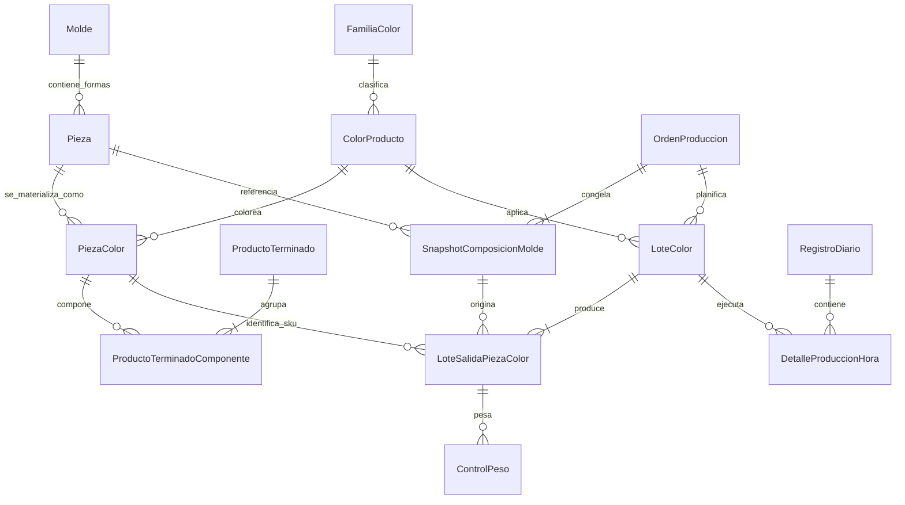

# US-007: Normalizar ProductoTerminado, PiezaColor y Salidas de la OP

> [!IMPORTANT] Decisión ya confirmada
> La posibilidad que esta historia dejó pendiente de validar quedó resuelta en [[TS-012_Normalizacion_Relacion_Molde_Pieza_NM|TS-012]]: una `Pieza` puede participar en varios moldes mediante `MoldePieza`. Cavidades y peso operativo pertenecen a esa asociación; `PiezaColor` sigue siendo global por pieza y color.

> [!IMPORTANT] Clasificación normalizada
> [[TS-014_Normalizacion_Linea_Familia_NM_y_CRUD|TS-014]] confirma que Línea y Familia se relacionan N:M. Todo par persistido en `ProductoTerminado`, `Pieza` o compatibilidad legacy de `PiezaColor` debe corresponder a una asociación activa; `PiezaColor` continúa derivando su clasificación canónica desde `Pieza`.

> [!NOTE] Avance de OP al 2026-07-23
> La identidad canónica del snapshot es `pieza_id` y se congelan código y nombre de la pieza. El SKU anterior queda como `pieza_sku_legacy`, nullable y sin FK, solo para evidencia de reconciliación. Además, las OP nuevas ya crean un `LoteSalidaPiezaColor` por combinación lote–pieza, con `PiezaColor` exacto y objetivos congelados de unidades y kg netos. En `enva_test` la revisión `d7e9a4c2f105` migró cinco snapshots de demostración: cuatro llegaron de forma exacta hasta `Pieza` y uno quedó deliberadamente sin resolver. No existen OP legacy reales; por ello su backfill y certificación siguen condicionados a la primera prueba controlada. Ejecución horaria, pesaje e inventario todavía deben enlazarse a estas salidas.

## 1. Corrección Conceptual

El dominio canónico de EnvaPerú queda definido así:

| Concepto | Definición |
|---|---|
| **Molde** | Herramental físico que produce una o varias formas en cada golpe |
| **Pieza** | Forma abstracta sin color definida dentro de la composición del molde |
| **ColorProducto** | Color de producción seleccionable, perteneciente obligatoriamente a una `FamiliaColor` |
| **PiezaColor** | Pieza física e inventariable resultante de combinar `Pieza + ColorProducto`; posee el SKU de pieza |
| **ProductoTerminado** | SKU-paquete del catálogo compuesto por una o varias `PiezaColor` con cantidades determinadas |
| **OrdenProduccion** | Instrucción de ejecutar un molde usando su composición abstracta de `Pieza` |
| **LoteColor** | Segmento de una OP que aplica un color concreto a todas las piezas producidas por el golpe |

Por tanto:

1. Se mantiene `ProductoTerminado -> ProductoPieza -> PiezaColor` como BOM de catálogo.
2. No se introduce una separación artificial entre `Producto` y `ProductoVariante`.
3. `PiezaColor` es la salida física del moldeo y el SKU inventariable.
4. La OP usa `Pieza` en su snapshot porque el color se define después, por cada `LoteColor`.
5. Para cada combinación `Pieza snapshot + ColorProducto del lote`, el sistema debe resolver la `PiezaColor` que realmente se produce.

## 2. Decisión sobre FamiliaColor

`FamiliaColor` **no debe almacenarse como atributo directo de `ProductoTerminado`**.

La familia pertenece al `ColorProducto` y llega al producto terminado a través de sus componentes:

```text
ProductoTerminado
  -> ProductoPieza
    -> PiezaColor
      -> ColorProducto
        -> FamiliaColor
```

Esto permite que un paquete de catálogo:

- contenga varias piezas del mismo color;
- contenga colores diferentes de la misma familia;
- contenga piezas de familias diferentes, si el catálogo lo requiere.

La información de familia del producto debe ser **derivada**, no persistida:

```text
familias_color_derivadas = DISTINCT(
    producto.componentes.pieza_color.color.familia_color
)
```

Presentación sugerida:

- Cero familias: `SIN DEFINIR`.
- Una familia: mostrar su nombre.
- Más de una familia: `MIXTA` y mostrar el desglose.

Los campos actuales `familia_color`, `cod_familia_color` y `familia_color_id` deben retirarse de `ProductoTerminado` después de migrar y validar el catálogo.

> [!IMPORTANT]
> El SKU histórico de un producto no debe regenerarse al retirar esos campos. Los SKUs existentes se conservan como identificadores inmutables aunque su formato legado haya incluido un código de familia de color.

## 3. Historia de Usuario

**Como** Administrador de Catálogo y Planificador de Producción  
**Quiero** que el sistema distinga la forma abstracta (`Pieza`), la salida física coloreada (`PiezaColor`) y el paquete comercial (`ProductoTerminado`)  
**Para** crear OPs por molde y color, registrar correctamente todas las piezas físicas producidas y evitar duplicar `FamiliaColor` en el producto terminado.

## 4. Reglas Empíricas del Negocio

1. El molde no tiene color.
2. La pieza abstracta no tiene color ni SKU de inventario coloreado.
3. `PiezaColor` sí es una entidad física, almacenable y pesable.
4. El SKU de pieza identifica una combinación única de `Pieza + ColorProducto`.
5. Un golpe multipieza produce simultáneamente una `PiezaColor` por cada `Pieza` del molde.
6. Todas las piezas de un mismo golpe/lote comparten el mismo `ColorProducto`.
7. Una OP puede tener varios lotes de colores diferentes.
8. `ProductoTerminado` agrupa `PiezaColor` ya determinadas, no piezas abstractas.
9. Un paquete puede requerir cantidades distintas de cada `PiezaColor`.
10. La cantidad de paquetes completos posibles depende del componente limitante disponible.
11. La fabricación de `PiezaColor` y el armado físico de un paquete son operaciones conceptualmente distintas.
12. Los snapshots históricos no deben cambiar cuando se edita el catálogo.

## 5. Lagunas Lógicas Encontradas

| # | Laguna | Consecuencia |
|---:|---|---|
| 1 | `ProductoTerminado` almacena familia de color y además contiene `PiezaColor` | La misma información puede discrepar entre cabecera y componentes |
| 2 | La documentación anterior trataba la BOM como si debiera apuntar a `Pieza` | Se perdería la identidad física y el SKU exacto de cada componente del paquete |
| 3 | `PiezaColor.tipo=KIT` y `PiezaComponente` duplican la responsabilidad de `ProductoTerminado` y `ProductoPieza` | Existen dos modelos incompatibles para representar un paquete |
| 4 | `SnapshotComposicionMolde` referencia `pieza_color.sku` | La geometría de la OP queda ligada a un color arbitrario |
| 5 | El auto-snapshot toma la primera `PiezaColor` encontrada para una `Pieza` | El resultado depende del orden de la consulta y puede congelar el color incorrecto |
| 6 | `LoteColor` solo guarda `color_id` y un `producto_sku_output` singular | No identifica todas las `PiezaColor` producidas por un molde multipieza |
| 7 | No existe una entidad que materialice `Pieza snapshot + Color del lote -> PiezaColor` | No hay trazabilidad exacta de las salidas físicas esperadas |
| 8 | `OrdenProduccion.calculo_familia_color` guarda una sola familia desde el producto | Una OP puede contener varios lotes y el producto puede contener familias mixtas |
| 9 | `ColorProducto.familia_id` es nullable y su nombre es ambiguo | Se pueden crear colores sin familia y confundirla con `Familia` de producto |
| 10 | La API crea colores usando solo el nombre | No distingue, por ejemplo, `ROJO SOLIDO` de `ROJO TRANSPARENTE` |
| 11 | La OP puede crear colores sin familia durante el guardado | Se generan maestros incompletos que no pueden resolver receta ni clasificación |
| 12 | La receta propuesta usa `(color_id, familia_color_id)` | La familia es redundante si `ColorProducto` ya la determina |
| 13 | `DetalleProduccionHora.color` es texto libre | No se puede saber qué lote ni qué fórmula se ejecutó en esa hora |
| 14 | `RegistroDiario.total_piezas_buenas` es un único número | Un molde multipieza necesita cantidades buenas por cada `PiezaColor` |
| 15 | `ControlPeso` no identifica de forma obligatoria la `PiezaColor` del bulto | Un peso no puede aplicarse con seguridad a una salida específica |
| 16 | El fallback de kilos usa peso de tiro, pero los bultos contienen piezas netas | Se comparan magnitudes distintas: salida buena versus piezas más ramal |
| 17 | Cavidades y peso se copian en `PiezaColor` además de existir en `Pieza` | Los catálogos pueden divergir sin una fuente de verdad clara |
| 18 | Línea y familia se duplican en `Pieza` y `PiezaColor`, sin validar su asociación N:M | Una variante puede contradecir su forma base o usar un par no autorizado |

## 6. Modelo Normalizado Objetivo

### 6.1. `Pieza`

Forma abstracta sin color que participa en la composición del molde.

Campos relevantes:

- `id`
- `molde_id`
- `codigo` o identificador estable
- `nombre`
- `linea_id` y `familia_id` opcionales, solo si clasifican técnicamente la forma y siempre como un par activo de `LineaFamilia`
- `cavidades`
- `peso_unitario_gr`
- `activo`

Reglas:

- No contiene `color_id`.
- No representa un kit ni un producto terminado.
- Cavidades y peso estándar son la fuente técnica usada para crear el snapshot.
- La posibilidad de compartir una misma pieza entre moldes distintos queda fuera de esta historia y requiere confirmación empírica antes de convertir la relación en N:M.

### 6.2. `FamiliaColor`

Clasificación del acabado del color, por ejemplo:

- `SOLIDO`
- `CARAMELO`
- `TRANSPARENTE`
- `PASTEL`

No se relaciona directamente con `Pieza`, `Molde` ni `ProductoTerminado`.

### 6.3. `ColorBase` y `ColorProduccion`

El concepto legacy `ColorProducto` ha sido erradicado (ver ADR Reemplazo de ColorProducto). Se divide en:

- `ColorBase`: Pigmento puro (ej. ROJO). No pertenece a ninguna familia.
- `ColorProduccion`: La combinación `(color_base_id, familia_color_id)`. Es la selección operativa concreta (ej. "ROJO SÓLIDO").

Campos mínimos en `ColorProduccion`:

- `id`
- `color_base_id`
- `familia_color_id`
- `activo`

Constraints:

- `NOT NULL(familia_color_id)`.
- `UNIQUE(familia_color_id, nombre_normalizado)`.
- `UNIQUE(codigo)` si el código participa en la generación del SKU de pieza.

Ejemplos de registros distintos:

- `ROJO / SOLIDO`
- `ROJO / TRANSPARENTE`

La FK actual `ColorProducto.familia_id` debe renombrarse a `familia_color_id` para no confundirla con `Familia` de producto.

### 6.4. `PiezaColor`

Salida física e inventariable del molde. Representa un SKU de pieza.

Campos mínimos:

- `sku`
- `pieza_id`
- `color_id`
- `activo`
- campos de revisión/auditoría

Constraint principal:

```text
UNIQUE(pieza_id, color_id)
```

Datos derivados, no duplicados:

- nombre: `Pieza.nombre + ColorProduccion.nombre`;
- cavidades: desde `MoldePieza` o snapshot de OP;
- peso estándar operativo: desde `MoldePieza` o snapshot de OP;
- clasificación técnica: desde `Pieza`, cuyo par `linea_id + familia_id` debe estar activo en `LineaFamilia`, sin duplicarlo definitivamente en la variante;
- familia de color: desde `ColorProduccion.familia_id`.

La línea y familia comerciales pertenecen a `ProductoTerminado`; no deben copiarse al SKU de pieza desde el producto que circunstancialmente la utiliza.

`PiezaColor` deja de soportar `tipo=KIT`. [[US-010R_Rutas_BOM_Multinivel_WIP_y_Perfiles_Empaque|US-010R]] refina la clasificación: una composición física corresponde a `SUBENSAMBLE_WIP` cuando seguirá procesándose o a `ProductoTerminado` cuando ya es comercialmente completa. Una eventual composición fantasma queda fuera de su primer corte y no puede generar artículo inventariable, lote ni bolsa.

### 6.5. `ProductoTerminado`

SKU-paquete del catálogo. Puede contener una o varias `PiezaColor`.

Conserva:

- `cod_sku_pt`
- `producto`
- `linea_id`
- `familia_id` de producto
- unidad de medida
- datos de empaque
- código de barras
- precios y estado comercial

Elimina:

- `familia_color`
- `cod_familia_color`
- `familia_color_id`

El SKU es un identificador inmutable y no debe recalcularse automáticamente desde la familia de color.

La combinación `linea_id + familia_id` es obligatoria y debe existir activa en `LineaFamilia`, conforme a [[TS-014_Normalizacion_Linea_Familia_NM_y_CRUD|TS-014]].

### 6.6. `ProductoPieza`

Se mantiene conceptualmente, pero se recomienda renombrarla a `ProductoTerminadoComponente` para hacer explícita su función.

Campos:

- `producto_terminado_id`
- `pieza_color_sku`
- `cantidad`

Constraint:

```text
UNIQUE(producto_terminado_id, pieza_color_sku)
CHECK(cantidad > 0)
```

Esta BOM es específica: cada componente ya posee forma, color y SKU físico.

### 6.7. `SnapshotComposicionMolde`

Debe congelar la forma abstracta, no una variante coloreada.

Campos:

- `id`
- `orden_id`
- `pieza_id` FK a `Pieza`
- `pieza_codigo_snapshot`
- `pieza_nombre_snapshot`
- `cavidades`
- `peso_unit_gr`
- `pieza_sku_legacy` nullable y sin FK, únicamente durante la transición

La migración estructural elimina `pieza_sku` como FK a `PiezaColor`. Su texto previo se renombra a `pieza_sku_legacy` para conservar evidencia importada sin mantener una relación referencial incorrecta.

Los textos snapshot se conservan para que la historia siga legible aunque la pieza sea renombrada o desactivada.

Reglas de escritura y transición:

- toda OP creada por el flujo vigente guarda `pieza_id`, `pieza_codigo_snapshot` y `pieza_nombre_snapshot`;
- las OP nuevas dejan `pieza_sku_legacy` en `NULL`;
- `pieza_id` es nullable solo para permitir cargar y diagnosticar una fila legacy todavía no conciliada;
- ningún proceso de negocio usa `pieza_sku_legacy` para resolver color, inventario o salida física;
- la reconciliación solo asigna `pieza_id` cuando `pieza_sku_legacy -> PiezaColor -> Pieza` sea unívoco.

### 6.8. `LoteColor`

Continúa siendo hijo de la OP y representa una corrida de color.

Campos relevantes:

- `id`
- `numero_op`
- `color_id` obligatorio
- `meta_kg`
- `formula_revision_id` nullable
- `secuencia`
- `estado`

La familia se obtiene desde `ColorProducto`; no se duplica en el lote.

`producto_sku_output` no puede representar por sí solo las salidas físicas del lote. Puede mantenerse temporalmente como destino comercial opcional, pero no como fuente de verdad de lo producido.

### 6.9. Nueva entidad `LoteSalidaPiezaColor`

Materializa la relación que falta entre la pieza abstracta de la OP y la pieza física producida.

Campos mínimos:

- `id`
- `lote_color_id`
- `snapshot_pieza_id`
- `pieza_id`
- `pieza_color_sku`
- `cavidades_snapshot`
- `peso_unitario_snapshot_gr`
- `cantidad_objetivo`
- `kg_objetivo_neto`
- `cantidad_buena_real`
- `cantidad_rechazada_real`
- `kg_bueno_real`

Constraints:

```text
UNIQUE(lote_color_id, pieza_id)
```

Reglas:

- `PiezaColor.pieza_id` debe coincidir con `pieza_id`.
- `PiezaColor.color_id` debe coincidir con `LoteColor.color_id`.
- Cada pieza del snapshot genera exactamente una salida para cada lote.

Cálculos objetivo por salida:

```text
cantidad_objetivo = lote.calculo_coladas * cavidades_snapshot
kg_objetivo_neto = cantidad_objetivo * peso_unitario_snapshot_gr / 1000
```

## 7. Diagrama ER Corregido



## 8. Invariantes de Negocio

1. `Pieza` nunca tiene color.
2. `PiezaColor` siempre tiene `pieza_id` y `color_id`.
3. `ColorProducto` siempre tiene `familia_color_id`.
4. Una combinación `Pieza + ColorProducto` produce como máximo una `PiezaColor` activa.
5. En el corte transitorio de US-007, la BOM de `ProductoTerminado` referencia únicamente `PiezaColor`; al implementar US-010R se sustituye por `RevisionEstructuraArticulo`, que también puede consumir WIP WIP sin mantener dos fuentes de verdad.
6. `ProductoTerminado` no almacena una familia de color propia.
7. La familia o familias de un producto se derivan de sus componentes.
8. `PiezaColor` no puede representar un kit.
9. Cada `LoteColor` aplica un único color a todas las piezas del golpe.
10. Cada pieza del snapshot tiene una `LoteSalidaPiezaColor` por lote.
11. Una salida solo puede referenciar la `PiezaColor` formada por su pieza y el color de su lote.
12. El snapshot de la OP referencia `Pieza`, no `PiezaColor`.
13. Editar una pieza, color o producto no modifica OPs históricas.
14. El detalle horario debe identificar el `LoteColor` ejecutado.
15. Cada bulto pesado debe identificar la salida o, como mínimo, la `PiezaColor` y el lote.
16. Peso neto bueno, peso de ramal/merma y peso bruto consumido son métricas diferentes.
17. Toda clasificación `linea_id + familia_id` debe corresponder a una asociación `LineaFamilia` activa; una variante no contradice a su Pieza.

## 9. Flujo Objetivo

### 9.1. Catálogo Molde-Pieza-PiezaColor

1. Crear el molde.
2. Definir sus `Pieza` abstractas con cavidades y peso.
3. Mantener el catálogo de `ColorProducto`, cada uno con familia obligatoria.
4. Crear o consultar `PiezaColor` como combinaciones físicas inventariables.

La generación de SKU debe vivir en un servicio único, por ejemplo:

```text
resolver_o_crear_pieza_color(pieza_id, color_id)
```

Ese servicio:

- busca primero `UNIQUE(pieza_id, color_id)`;
- crea la variante solo si el color maestro existe y tiene familia;
- usa una regla de SKU determinista y sin truncamientos ambiguos;
- nunca crea un `ColorProducto` incompleto.

### 9.2. Creación de Orden de Producción

En el flujo normal, [[US-010P_Planificar_Demanda_ProductoTerminado_y_Generar_OP]] calcula primero los faltantes desde demanda de `ProductoTerminado` y entrega una propuesta técnica. La creación directa por molde queda como una excepción documentada para reposición de `PiezaColor`, muestras o reemplazos.

1. El sistema recibe una propuesta o un propósito manual con motivo.
2. El usuario confirma el molde.
3. El sistema congela sus `Pieza`, cavidades y pesos en `SnapshotComposicionMolde`.
4. Se agregan uno o varios `ColorProduccion`, cada uno como lote separado y con ciclos enteros planificados.
5. Para cada lote, el sistema recorre todas las piezas snapshot.
6. Para cada combinación pieza-color, resuelve la `PiezaColor` correspondiente.
7. Crea una `LoteSalidaPiezaColor` por cada resultado físico y calcula unidades, kg y excedentes.

Ejemplo:

```text
Molde: Regadera
Piezas snapshot: Cuerpo, Tapa
Lotes: Rojo, Azul

Salidas:
- Lote Rojo -> Cuerpo Rojo, Tapa Roja
- Lote Azul -> Cuerpo Azul, Tapa Azul
```

### 9.3. Relación con ProductoTerminado

La OP produce `PiezaColor`; no debe asumir que un golpe equivale automáticamente a un paquete terminado.

`ProductoTerminado` se utiliza como:

- origen normal de demanda en US-010P, sin convertirse en salida física de la OP;
- validación de que las salidas planificadas cubren su BOM;
- cálculo de paquetes potencialmente armables.

Una OP manual puede no tener demanda de `ProductoTerminado`, pero exige propósito y motivo. Una OP asociada a demanda puede cubrir varios productos o solicitudes, por lo que la relación es N:M y no un `producto_sku` singular.

Fórmula de paquetes completos potenciales:

```text
paquetes_posibles = MIN(
    FLOOR(stock_o_salida_buena_componente / cantidad_requerida_bom)
)
```

Las piezas excedentes permanecen como inventario de `PiezaColor`.

### 9.4. Registro Diario y Detalle Horario

- `DetalleProduccionHora` reemplaza `color` texto por `lote_color_id`.
- Las coladas continúan registrándose por hora.
- Las cantidades teóricas por salida se derivan de coladas por cavidades snapshot.
- Las cantidades buenas y rechazadas se registran por `LoteSalidaPiezaColor`.
- El total general de piezas puede mostrarse, pero no sustituye el desglose por SKU.

### 9.5. Control de Peso

Cada pesaje debe incluir:

- `registro_id`
- `lote_color_id`
- `lote_salida_id` o `pieza_color_sku`
- peso neto real del bulto
- identificador único del bulto
- fecha, operador y balanza

La validación compara el bulto contra el peso neto teórico de esa `PiezaColor`, no contra el peso de tiro completo.

## 10. Fórmulas de Producción

La fórmula maestra se asocia al `ColorProducto`, cuya `FamiliaColor` ya está determinada.

Por eso la clave no debe duplicar `familia_color_id`:

```text
FormulaProduccion(
    color_id,
    variante_codigo,
    revision,
    proceso,
    alcance_material_o_producto
)
```

Se distinguen:

- **Fórmula aprobada**: versión controlada por Ingeniería.
- **Composición copiada al lote**: snapshot editable con trazabilidad de origen.
- **Sugerencia histórica**: promedio aprendido actualmente por `RecetaColorNormalizada`.

Una sugerencia histórica nunca reemplaza silenciosamente una fórmula aprobada.

## 11. Criterios de Aceptación BDD

### Escenario 1: ProductoTerminado agrupa PiezaColor

**Dado** que existen `Cuerpo Rojo` y `Tapa Roja` como `PiezaColor`  
**Cuando** el administrador crea el producto terminado “Regadera Roja”  
**Entonces** agrega ambos SKUs a su BOM con sus cantidades  
**Y** el producto se guarda sin `familia_color_id` propio.

### Escenario 2: Familia derivada desde la BOM

**Dado** que todos los componentes de un producto pertenecen a colores de familia `SOLIDO`  
**Cuando** se consulta el detalle del producto  
**Entonces** el sistema muestra `SOLIDO` como valor derivado  
**Y** no persiste ese valor en la tabla de producto terminado.

### Escenario 3: Paquete con familias mixtas

**Dado** que un paquete contiene una pieza sólida y una pieza transparente  
**Cuando** se consulta su clasificación de color  
**Entonces** el sistema muestra `MIXTA` y ambas familias  
**Y** no obliga a seleccionar una única familia para el producto.

### Escenario 4: Snapshot usa piezas abstractas

**Dado** que un molde tiene las piezas abstractas cuerpo y tapa  
**Cuando** se crea una OP  
**Entonces** el snapshot referencia los `pieza_id` de cuerpo y tapa  
**Y** no selecciona arbitrariamente una `PiezaColor` existente.

### Escenario 5: Resolver salidas para un lote

**Dado** que la OP tiene cuerpo y tapa en su snapshot  
**Y** el usuario agrega un lote Rojo Sólido  
**Cuando** guarda la orden  
**Entonces** el sistema resuelve `Cuerpo Rojo Sólido` y `Tapa Rojo Sólido`  
**Y** crea dos registros `LoteSalidaPiezaColor`.

### Escenario 6: Varios lotes en la misma OP

**Dado** que la OP contiene lotes Rojo y Azul  
**Cuando** se generan las salidas  
**Entonces** cada lote obtiene el conjunto completo de piezas del molde en su color  
**Y** ninguna salida mezcla colores dentro del mismo lote.

### Escenario 7: PiezaColor inexistente

**Dado** que existe la pieza “Asa” y el color “Verde Sólido”, pero no su combinación  
**Cuando** una OP requiere esa salida  
**Entonces** el servicio central crea exactamente una `PiezaColor` con SKU determinista  
**Y** llamadas repetidas reutilizan el mismo registro.

### Escenario 8: Color sin familia rechazado

**Dado** que un color maestro no tiene `familia_color_id`  
**Cuando** se intenta utilizarlo en el wizard o en una OP  
**Entonces** el sistema rechaza la operación  
**Y** solicita completar el maestro de color.

### Escenario 9: Calcular paquetes potenciales

**Dado** que la BOM requiere 1 cuerpo y 1 tapa  
**Y** hay 1,000 cuerpos buenos y 900 tapas buenas  
**Cuando** se calcula la disponibilidad del producto terminado  
**Entonces** el sistema informa 900 paquetes completos potenciales  
**Y** 100 cuerpos permanecen como excedente.

### Escenario 10: Registrar producción multipieza

**Dado** que durante una hora se realizan 100 golpes de un molde con 1 cuerpo y 2 tapas por golpe  
**Cuando** se actualizan las salidas horarias  
**Entonces** se calculan 100 cuerpos y 200 tapas teóricas  
**Y** los rechazos y cantidades buenas pueden registrarse por SKU.

### Escenario 11: Pesar un bulto específico

**Dado** que el operador pesa un bulto de tapas azules  
**Cuando** se registra el pesaje  
**Entonces** queda vinculado al lote Azul y al SKU `Tapa Azul`  
**Y** su validación usa el peso neto teórico de esa pieza.

### Escenario 12: Preservar historia y SKUs

**Dado** que existen productos, piezas coloreadas y OPs actuales  
**Cuando** se ejecuta la migración  
**Entonces** se conservan los SKUs de producto y pieza  
**Y** los snapshots históricos mantienen nombres, cavidades, pesos y colores originalmente ejecutados.

### Escenario 13: Primera OP legacy controlada

**Dado** que la estructura canónica ya está instalada, pero aún no existen OP reales del esquema anterior

**Cuando** se incorpore la primera OP legacy en un entorno de prueba controlado

**Entonces** el sistema conserva `pieza_sku_legacy` como evidencia y propone `pieza_id` solo mediante una resolución unívoca `PiezaColor -> Pieza`

**Y** cualquier fila ambigua o sin correspondencia queda reportada, no inventada

**Y** no se endurece `pieza_id` a `NOT NULL` hasta aprobar la reconciliación.

## 12. Estrategia de Migración

1. Auditar `ColorProducto` sin familia y asignar o marcar los casos ambiguos.
2. Renombrar `ColorProducto.familia_id` a `familia_color_id` y volverlo obligatorio.
3. Crear constraints de unicidad para color y para `PiezaColor(pieza_id, color_id)`.
4. Completar `pieza_id` y `color_id` faltantes en `PiezaColor`.
5. Verificar que no existan filas `PiezaColor.tipo=KIT` ni `PiezaComponente`, porque EnvaPerú confirmó que ese flujo nunca se utilizó. Con preflight vacío, retirar el soporte; ante cualquier fila inesperada, abortar y conciliar sin migrarla automáticamente a producto.
6. Mantener la BOM `ProductoTerminado -> PiezaColor`; renombrar columnas y tabla para mayor claridad si se aprueba.
7. Derivar y comparar las familias de los componentes contra los campos actuales de `ProductoTerminado`.
8. Conservar los SKUs existentes y retirar `familia_color`, `cod_familia_color` y `familia_color_id` del producto.
9. **Realizado en estructura:** cambiar el snapshot de `pieza_sku` a `pieza_id`, congelar código y nombre, y conservar el texto previo como `pieza_sku_legacy` nullable sin FK.
10. Crear `LoteSalidaPiezaColor` y poblarla para OPs migrables usando snapshot más color del lote.
11. Eliminar `OrdenProduccion.calculo_familia_color`.
12. Vincular detalles horarios con `lote_color_id`.
13. Vincular controles de peso con lote y salida/pieza-color.
14. Separar métricas de kg netos buenos, kg de ramal y kg brutos.
15. Ejecutar reconciliación de conteos, pesos, BOMs y SKUs antes de eliminar columnas legacy.

### 12.1. Pendiente condicionado: backfill de la primera OP legacy

No se certificó un backfill de negocio al aplicar la migración estructural porque el sistema todavía no contiene OP legacy reales. La migración técnica se verificó en `enva_test` con cinco snapshots locales de demostración: preservó las cinco evidencias SKU, resolvió cuatro por clave exacta y dejó sin inferir `OP-1322 / 10101-BALDE`, cuya `PiezaColor` existía pero no estaba vinculada a una `Pieza` abstracta. Esta fila es evidencia de desarrollo, no una OP histórica certificada.

La siguiente lista se activa cuando se disponga de la primera OP legacy real de prueba o de un restore anonimizado que la contenga.

#### Preparación

- [ ] Trabajar sobre un backup, fixture o restore controlado; no experimentar directamente sobre una base desplegada.
- [ ] Registrar conteos iniciales de OP y filas de `snapshot_composicion_molde` y conservar una copia verificable de sus valores.
- [ ] Ejecutar primero un modo diagnóstico que no escriba y clasifique cada fila como `RESOLUBLE`, `AMBIGUA` o `SIN_CORRESPONDENCIA`.
- [ ] Verificar que `pieza_sku_legacy` se resuelva por clave exacta a una `PiezaColor` y de allí a una única `Pieza`; nombres parecidos no constituyen identidad.

#### Ejecución

- [ ] Poblar `pieza_id`, `pieza_codigo_snapshot` y `pieza_nombre_snapshot` únicamente para filas `RESOLUBLE`.
- [ ] Mantener sin cambios `orden_id`, `pieza_sku_legacy`, cavidades y peso unitario históricos.
- [ ] No seleccionar la primera variante, no crear piezas por texto y no completar una fila ambigua por heurística.
- [ ] Emitir un reporte por OP con mapeo aplicado, filas omitidas, motivo y totales antes/después.
- [ ] Asegurar transacción reversible e idempotencia: una segunda ejecución no crea cambios adicionales.

#### Criterios de aceptación

- [ ] El número de OP y de filas snapshot es idéntico antes y después.
- [ ] Los cálculos históricos de peso neto por golpe y cavidades totales no cambian.
- [ ] Toda fila marcada `RESOLUBLE` queda vinculada a la `Pieza` exacta derivada de su `PiezaColor` legacy.
- [ ] Toda fila no conciliable conserva su evidencia y aparece explícitamente en el reporte; la migración no inventa genealogía.
- [ ] Las OP creadas con el flujo nuevo completan los campos canónicos y dejan `pieza_sku_legacy` en `NULL`.
- [ ] Las pruebas cubren éxito, SKU inexistente, correspondencia ambigua, rollback e idempotencia.
- [ ] Solo con cero filas pendientes en el universo que se vaya a migrar puede proponerse `pieza_id NOT NULL`; retirar `pieza_sku_legacy` requiere además una decisión separada de retención histórica.

## 13. Impacto en Historias y Documentos

| Documento | Corrección requerida |
|---|---|
| `US-001` | Mantener `Pieza -> PiezaColor`; aclarar que el color elegido genera salidas físicas para todas las piezas del molde |
| `US-002` | El CRUD debe mostrar piezas abstractas y sus variantes `PiezaColor`, sin usar `PiezaColor` como kit |
| `US-003` | Mantener la BOM de `ProductoTerminado` basada en `PiezaColor`; retirar FamiliaColor del formulario del producto |
| `US-005` | Imprimir piezas snapshot y, por lote, las `PiezaColor` físicas de salida |
| `US-006` | Asociar fórmula con `ColorProducto` y contexto de proceso/material; no con FamiliaColor del producto |
| ADR FamiliaColor | Sustituir la conclusión que preserva `familia_color_id` en `ProductoTerminado` |
| `Orden_Produccion` | Eliminar familia de color cacheada y exponer salidas por lote |
| `Lote_Color` | Agregar relación con sus múltiples salidas `PiezaColor` |
| `Snapshot_Composicion_Molde` | Estructura cambiada de FK a `PiezaColor` hacia FK canónica a `Pieza`; backfill real sujeto al checklist de la primera OP legacy |
| `Registro_Diario` | Desglosar cantidades por salida física |
| `Detalle_Produccion_Hora` | Reemplazar color texto por `lote_color_id` |
| `Control_Peso` | Identificar lote, salida y SKU de pieza pesados |

## 14. Alcance

Incluye:

- Corrección conceptual del catálogo.
- Normalización de `FamiliaColor` y `ColorProducto`.
- BOM de `ProductoTerminado` basada en `PiezaColor`.
- Generación/resolución de `PiezaColor` desde la OP.
- Salidas multipieza por lote.
- Cambios mínimos de trazabilidad en registro diario y pesajes.

No incluye todavía:

- Ejecución física de armado o empaquetado de `ProductoTerminado`.
- Consumo de inventario de piezas durante el armado.
- Orden de Armado.
- Trazabilidad de lotes de materia prima de proveedor.
- Costeo completo del paquete terminado.

## 15. Orden de Implementación Recomendado

1. Aprobar este glosario e invariantes.
2. Registrar una ADR que sustituya la decisión actual sobre FamiliaColor.
3. Normalizar `ColorProducto` y `PiezaColor`.
4. Corregir `ProductoTerminado`, comprobar vacío y retirar kits legacy; US-010R introduce la estructura multinivel nueva.
5. Corregir snapshots de OP: estructura realizada; backfill y reconciliación real pendientes según §12.1.
6. Implementar `LoteSalidaPiezaColor` y el resolver de SKU.
7. Adaptar registro diario, pesajes e impresión.
8. Retirar campos y rutas legacy después de reconciliar datos.
