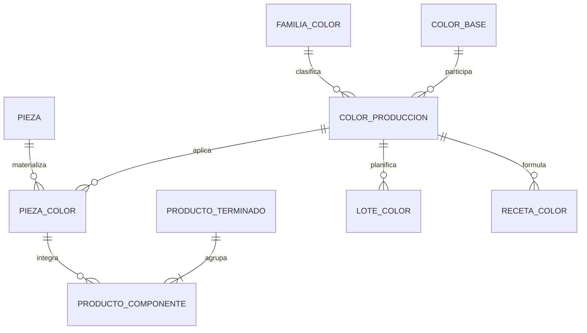

# US-008: Normalización de Dominio: Reemplazo de ColorProducto por ColorBase y ColorProduccion

> [!IMPORTANT] Alcance de BOM refinado
> Esta historia continúa siendo la autoridad del dominio de color. Sus referencias a una BOM de producto formada exclusivamente por `PiezaColor` describen el primer corte plano; [[US-010R_Rutas_BOM_Multinivel_WIP_y_Perfiles_Empaque|US-010R]] introduce la estructura multinivel canónica, cuyos nodos intermedios pueden ser WIP y cuyas hojas físicas continúan llegando a `PiezaColor`.

## 1. Contexto y Hallazgo Empírico

Durante el desarrollo de la aplicación, se ha estado utilizando el modelo `ColorProducto`, el cual asume una relación "muchos a uno" con `FamiliaColor` (es decir, cada color pertenece a una única familia, como "ROJO pertenece a SOLIDO"). 

Un análisis exhaustivo del catálogo de SKUs reales de la empresa demostró que este modelo es incorrecto:
1. **Los colores base se repiten entre familias:** Colores como "ROJO", "AZUL", "AMARILLO" existen simultáneamente en las familias "SOLIDO", "TRANSPARENTE", "PASTEL", etc.
2. **Conflictos de nomenclatura:** Existen códigos de color que significan colores distintos dependiendo de la familia (ej. el código 15 significa "ANARANJADO" o "FUCSIA").
3. **Clasificación comercial engañosa:** `ProductoTerminado` mantiene campos de familia de color (`familia_color`, `cod_familia_color`) puramente comerciales que a menudo entran en conflicto con la verdadera familia de color de las piezas que lo componen.

Mantener la clase `ColorProducto` es insostenible y generará inconsistencias en las recetas, las Órdenes de Producción (OP) y la generación de SKUs físicos.

## 2. La Solución Arquitectónica

Se debe rediseñar el dominio de color para reflejar la realidad industrial:

1. **`ColorBase`**: El pigmento puro (ej. ROJO). No pertenece a ninguna familia.
2. **`FamiliaColor`**: El acabado o tipo de inyección (ej. SOLIDO, TRANSPARENTE).
3. **`ColorProduccion`**: La combinación exacta de operación (`ColorBase` + `FamiliaColor`). Ej: "ROJO SÓLIDO".
4. **`PiezaColor`**: La manifestación física final, uniendo la `Pieza` (forma) + el `ColorProduccion`.

**Diagrama de Entidad Relación actualizado:**

## 3. Criterios de Aceptación (BDD)

**Escenario 1: Refactorización de Modelos Base**
*   **Given** el esquema de base de datos actual
*   **When** se aplican las migraciones de Alembic correspondientes a esta US
*   **Then** la tabla `color_producto` es eliminada o transformada
*   **And** se crean las tablas `color_base` y `color_produccion` (este último con FKs a `color_base` y `familia_color`)
*   **And** la tabla `pieza_color` (antigua `pieza`) ahora posee un `color_produccion_id` con un constraint `UNIQUE(pieza_id, color_produccion_id)`.

**Escenario 2: Limpieza Definitiva de ProductoTerminado**
*   **Given** la entidad `ProductoTerminado`
*   **When** se actualiza su modelo y rutas asociadas
*   **Then** los campos `familia_color`, `cod_familia_color` y `familia_color_id` dejan de existir en la base de datos
*   **And** la lógica de autogeneración de SKUs en base a familias comerciales se elimina por completo.
*   **And** `ProductoTerminado` actúa únicamente como una Lista de Materiales (BOM) agrupando referencias a `PiezaColor`.

**Escenario 3: Actualización de Órdenes de Producción (OP) y Wizard**
*   **Given** que el usuario crea una Orden de Producción o configura un producto en el Wizard
*   **When** el usuario selecciona el color a producir
*   **Then** la interfaz le exige seleccionar un `ColorProduccion` completo (ej. "ROJO - SÓLIDO"), no solo un color base
*   **And** no se permite planificar la producción de un color base que carezca de familia.

**Escenario 4: Ajuste de Recetas (US-006)**
*   **Given** el catálogo de fórmulas de color
*   **When** se registra una nueva composición
*   **Then** la receta se vincula explícitamente a un `ColorProduccion` y una `variante`, garantizando que "ROJO SOLIDO" y "ROJO TRANSPARENTE" posean recetas mecánicamente aisladas.

**Escenario 5: Refactorización de Salidas y Pesajes**
*   **Given** el módulo de pesaje y registro de producción
*   **When** se asocia una jaba a una OP
*   **Then** la clave foránea apunta a `lote_salida_pieza_color_id`
*   **And** el texto del color enviado al pesaje (ej. "ROJO SÓLIDO") se convierte en un snapshot en texto plano para impresión del ticket, previniendo errores de hidratación si el catálogo se altera.

**Escenario 6: Migrador de SKUs (Legacy)**
*   **Given** el script `migrar_skus.py` encargado de poblar el catálogo inicial
*   **When** el script procesa los excels de "SKU PRODUCTOS TERMINADOS" y "SKU PIEZAS"
*   **Then** construye correctamente el puente `ColorBase` + `FamiliaColor` -> `ColorProduccion`
*   **And** no asume dependencias cruzadas (ej. no mapea BOMs por coincidencia difusa de nombres de variantes de color).
