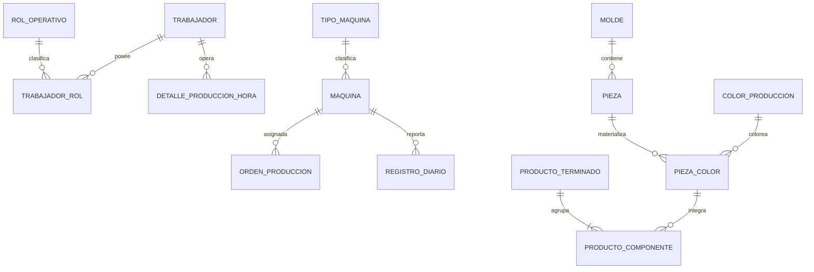

# US-009: Normalizar Trabajadores y Máquinas y Actualizar las Vistas de Catálogo

## 1. Descripción

**Como** Administrador del Sistema y Supervisor de Planta  
**Quiero** administrar catálogos normalizados de trabajadores y máquinas, y disponer de vistas de catálogo consistentes para `Pieza`, `PiezaColor` y `ProductoTerminado`  
**Para** eliminar textos libres y duplicados, mantener trazabilidad histórica, seleccionar datos maestros confiables en las operaciones y completar visualmente el refactor de dominio realizado en US-008.

## 2. Contexto

El sistema ya cuenta con una entidad `Maquina`, relacionada mediante FK con `OrdenProduccion` y `RegistroDiarioProduccion`. Sin embargo, su modelo actual solo contiene `id`, `nombre` y `tipo`, y la API únicamente permite listarla. No existe una vista para crear, editar, desactivar o clasificar máquinas.

Los maquinistas y operadores no están normalizados. Actualmente se guardan como texto libre en distintos puntos:

- `DetalleProduccionHora.maquinista`.
- Resultados procesados por OCR.
- Pesajes del módulo offline mediante el campo `operador`.
- Orden de Trabajo y tickets impresos.
- Listas estáticas de nombres en el frontend del módulo de pesaje.

Esto permite variantes como abreviaciones, errores ortográficos, nombres incompletos o duplicados para la misma persona, impidiendo responder con confianza quién operó una máquina, en qué turno y qué producción reportó.

Por otra parte, US-008 reemplazó `ColorProducto` por `ColorBase`, `FamiliaColor` y `ColorProduccion`, y estableció que:

- `Pieza` representa la forma abstracta que pertenece a un molde.
- `PiezaColor` representa el SKU físico: `Pieza + ColorProduccion`.
- `ProductoTerminado` agrupa `PiezaColor` mediante su BOM.
- `ProductoTerminado` no tiene color ni familia de color propios.

Las vistas actuales de catálogo todavía mezclan esos conceptos y conservan campos obsoletos como `familia_color_id`, `color_id` y la etiqueta “Color Producto”. Esta US completa el refactor en la experiencia de usuario y en los contratos de catálogo.

## 3. Actores

- **Administrador del Sistema:** crea, edita y desactiva trabajadores, roles, tipos de máquina y máquinas.
- **Supervisor de Planta:** consulta catálogos activos, asigna máquinas a OP y selecciona maquinistas en el Registro Diario.
- **Maquinista / Trabajador de Planta:** aparece como responsable operativo de las horas producidas y de los pesajes realizados.
- **Gestor de Catálogo:** mantiene `Pieza`, `PiezaColor`, `ProductoTerminado` y sus relaciones.
- **Módulo de Pesaje Offline:** sincroniza trabajadores, máquinas y salidas físicas para operar sin conexión.

## 4. Lagunas Lógicas Identificadas

### 4.1. Maquinista no es un texto

`maquinista` y `operador` representan a la misma clase de actor operativo, pero se almacenan con nombres distintos y como texto libre. Debe existir una entidad maestra `Trabajador` y los registros operativos deben referenciarla por ID.

El término visible puede seguir siendo “Maquinista” cuando el contexto sea una máquina, pero la entidad debe llamarse `Trabajador` para permitir otros roles sin crear tablas paralelas.

### 4.2. Un trabajador puede cumplir más de un rol

Un trabajador puede actuar como maquinista, ayudante, mezclador, supervisor u operador de pesaje. Por ello, el rol no debe codificarse en el nombre ni restringirse a una única columna de texto.

Se propone:

- `Trabajador` como persona operativa.
- `RolOperativo` como catálogo de roles.
- `TrabajadorRol` como relación N:M.

La primera implementación debe incluir como mínimo los roles `MAQUINISTA`, `OPERADOR_PESAJE`, `MEZCLADOR`, `AYUDANTE` y `SUPERVISOR`.

### 4.3. Máquina existe, pero no está suficientemente normalizada

El campo actual `Maquina.tipo` contiene descripciones libres como “HAI TIAN 350T”. Esto mezcla fabricante, modelo, capacidad y tipo operativo.

Se propone separar:

- `TipoMaquina`: clasificación reusable, proceso y características generales.
- `Maquina`: activo físico identificado por un código estable.

Las máquinas con historial no se eliminan físicamente; se desactivan o cambian de estado.

### 4.4. La trazabilidad histórica no debe depender del nombre actual

Si un trabajador corrige su nombre o una máquina cambia de denominación, una OP, RDP o etiqueta histórica debe conservar el texto utilizado en el momento de la operación.

Los registros operativos guardarán:

- FK al dato maestro actual.
- Snapshot de nombre/código para documentos, sincronización offline y auditoría histórica.

### 4.5. OCR y sincronización no deben crear maestros silenciosamente

El OCR puede devolver un nombre escrito a mano y el módulo offline puede enviar un nombre antiguo. El sistema debe intentar resolverlo contra aliases aprobados, pero no debe crear automáticamente un trabajador o una máquina por cada texto desconocido.

Los valores no resueltos deben quedar pendientes de conciliación, conservando el texto original.

### 4.6. Catálogo de piezas sigue confundiendo forma y SKU físico

La ruta y vistas actuales denominadas “Piezas” consultan principalmente `PiezaColor`. Después de US-008 deben distinguirse explícitamente:

- Catálogo de `Pieza`: formas abstractas, molde, cavidades y peso estándar.
- Catálogo de `PiezaColor`: SKUs físicos y su `ColorProduccion`.
- Catálogo de `ProductoTerminado`: datos comerciales y BOM de `PiezaColor`.

### 4.7. ProductoTerminado conserva controles visuales obsoletos

Las vistas de producto no deben mostrar ni enviar:

- `familia_color`.
- `cod_familia_color`.
- `familia_color_id`.
- color directo del producto.

La información cromática visible en un producto se obtiene exclusivamente de las `PiezaColor` de su BOM.

### 4.8. Residuos del refactor verificados en el código actual

| Componente | Residuo actual | Corrección requerida |
|---|---|---|
| `models/producto.py` | Los docstrings de `FamiliaColor` y `ProductoTerminado` aún afirman que la familia de color pertenece al producto | Actualizar documentación interna para reflejar `ColorBase + FamiliaColor -> ColorProduccion` |
| `rutas_catalogo.listar_productos` | Busca `ProductoTerminado.familia_color`, aunque US-008 retiró ese atributo del modelo | Eliminar búsqueda y serialización de familia de color del producto |
| `rutas_catalogo.actualizar_producto` | Intenta asignar `familia_color_id` | Retirar el campo del contrato de escritura |
| `PiezaDialog.jsx` | Mantiene `color_id` y la etiqueta “Color Producto” | Usar `color_produccion_id` y mostrar el nombre completo de `ColorProduccion` |
| `ProductoDialog.jsx` | Mantiene el selector `familia_color_id` | Eliminar el selector y mostrar el color solo dentro de los componentes de la BOM |
| `CatalogoSKU.jsx` | Muestra columnas de familia de color en ProductoTerminado | Retirar columnas y separar responsabilidades de catálogo |
| `GET /api/catalogo/piezas` | Lista `PiezaColor` bajo el nombre genérico “piezas” | Reservar `/piezas` para formas abstractas y crear `/piezas-color` para SKUs físicos |
| `Maquina` | Solo posee `nombre` y `tipo`, con `GET /maquinas` | Agregar código, tipo normalizado, estado, baja lógica y CRUD |
| `DetalleProduccionHora` | Guarda `maquinista` como texto libre | Agregar FK a `Trabajador` y conservar el texto únicamente como snapshot |
| Módulo de pesaje | Usa operadores hardcodeados y sincroniza nombres | Sincronizar trabajadores por identificador estable |

## 5. Modelo de Dominio Objetivo

### 5.1. Trabajador

Campos mínimos:

- `id` PK.
- `codigo` único, estable y no reutilizable.
- `nombres`.
- `apellidos`.
- `nombre_corto` opcional para impresión.
- `activo`.
- `observaciones` opcional.
- auditoría de creación y actualización.

No se incluye información de planilla, remuneración, domicilio ni otros datos de RR. HH.

### 5.2. RolOperativo y TrabajadorRol

`RolOperativo`:

- `id` PK.
- `codigo` único.
- `nombre`.
- `activo`.

`TrabajadorRol`:

- `trabajador_id` FK.
- `rol_operativo_id` FK.
- `UNIQUE(trabajador_id, rol_operativo_id)`.

### 5.3. TipoMaquina

Campos mínimos:

- `id` PK.
- `codigo` único.
- `nombre`.
- `proceso`: `INYECCION`, `SOPLADO` u `OTRO`.
- `fabricante` opcional.
- `modelo` opcional.
- `capacidad_toneladas` opcional.
- `activo`.

### 5.4. Maquina

Campos mínimos:

- `id` PK.
- `codigo` único y estable, por ejemplo `INY-05`.
- `nombre` descriptivo.
- `tipo_maquina_id` FK.
- `estado`: `OPERATIVA`, `MANTENIMIENTO`, `FUERA_SERVICIO` o `BAJA`.
- `activo`.
- `numero_serie` opcional.
- `observaciones` opcional.
- auditoría de creación y actualización.

El nombre no debe utilizarse como clave de sincronización. La integración usa `id` central o `codigo` estable.

### 5.5. Cambios en registros operativos

`DetalleProduccionHora`:

- agregar `trabajador_id` FK nullable durante migración;
- renombrar `maquinista` a `maquinista_snapshot` o conservarlo temporalmente como snapshot;
- para nuevos registros, exigir un trabajador activo con rol `MAQUINISTA` o `SUPERVISOR` autorizado.

Pesaje central y módulo offline:

- agregar `trabajador_id` o identificador central sincronizable;
- conservar `operador_snapshot` para impresión;
- sincronizar por identificador, no por comparación de nombres.

`OrdenProduccion` y `RegistroDiarioProduccion`:

- conservar `maquina_id` como FK;
- agregar snapshots de `maquina_codigo`, `maquina_nombre` y `tipo_maquina_nombre` donde el documento histórico lo requiera;
- un RDP toma por defecto la máquina de su OP;
- cualquier cambio de máquina debe validarse y quedar auditado.

## 6. Vistas de Gestión Requeridas

### 6.1. Gestión de Trabajadores

Ruta frontend: `/catalogo/trabajadores`.

Debe permitir:

- buscar por código, nombres o apellidos;
- filtrar por rol y estado;
- crear y editar trabajadores;
- asignar uno o varios roles;
- activar o desactivar;
- impedir códigos duplicados;
- mostrar uso histórico sin permitir borrado físico si existen registros asociados.

### 6.2. Gestión de Máquinas

Ruta frontend: `/catalogo/maquinas`.

Debe permitir:

- listar código, nombre, tipo, proceso y estado;
- crear y editar máquinas;
- administrar tipos de máquina;
- cambiar estado operativo;
- activar o desactivar;
- mostrar la OP activa, cuando exista;
- impedir eliminación física si la máquina tiene OP o RDP asociados.

### 6.3. Selección operativa

- `OrdenForm` lista solo máquinas activas y aptas para producción.
- `RegistroForm` toma la máquina de la OP y no permite texto libre.
- Las filas horarias del RDP usan un `Autocomplete` de trabajadores activos con rol de maquinista.
- La acción “copiar hacia abajo” copia `trabajador_id`, no solamente el nombre.
- OCR propone coincidencias, pero el usuario confirma los valores ambiguos.
- El módulo de pesaje usa trabajadores sincronizados y elimina las listas hardcodeadas.

### 6.4. Catálogo de Piezas

Ruta frontend: `/catalogo/piezas`.

La pantalla administra `Pieza` abstracta y muestra:

- nombre de la forma;
- molde asociado;
- cavidades;
- peso unitario estándar;
- estado;
- cantidad de variantes físicas.

Al expandir o abrir una pieza se muestran sus `PiezaColor` con:

- SKU físico;
- `ColorProduccion` completo, por ejemplo “ROJO - SÓLIDO”;
- estado;
- peso efectivo si existe una excepción aprobada;
- productos terminados que la utilizan.

No debe mostrar “Color Producto” ni usar `color_id` legacy.

### 6.5. Catálogo de Productos Terminados

Ruta frontend: `/catalogo/productos`.

La pantalla muestra:

- SKU del producto terminado;
- nombre comercial;
- línea y familia comercial;
- unidad de medida y datos de empaque;
- estado;
- cantidad de componentes de su BOM.

La creación y edición permite buscar `PiezaColor`, visualizar SKU y `ColorProduccion`, definir cantidad y ordenar componentes cuando sea relevante para impresión.

No debe mostrar ni persistir familia de color del producto. Si la BOM contiene varias familias o colores, la vista puede mostrar un resumen derivado, pero nunca almacenarlo como atributo del `ProductoTerminado`.

### 6.6. Retiro de la vista legacy combinada

La ruta actual `/catalogo/sku` y `CatalogoSKU.jsx` deben:

- retirarse y redirigir a las vistas específicas; o
- convertirse en una consulta de solo lectura con pestañas explícitas `Piezas físicas` y `Productos terminados`.

No debe seguir siendo la pantalla principal de mantenimiento porque mezcla responsabilidades y contratos diferentes.

## 7. Contratos API Esperados

### 7.1. Trabajadores y roles

- `GET /api/catalogo/trabajadores`.
- `POST /api/catalogo/trabajadores`.
- `GET /api/catalogo/trabajadores/<id>`.
- `PUT /api/catalogo/trabajadores/<id>`.
- `PATCH /api/catalogo/trabajadores/<id>/estado`.
- `GET /api/catalogo/roles-operativos`.
- `POST /api/catalogo/roles-operativos`.
- `PUT /api/catalogo/roles-operativos/<id>`.

Los listados soportan `q`, `rol`, `activo`, paginación y ordenamiento.

### 7.2. Máquinas y tipos

- `GET /api/catalogo/maquinas`.
- `POST /api/catalogo/maquinas`.
- `GET /api/catalogo/maquinas/<id>`.
- `PUT /api/catalogo/maquinas/<id>`.
- `PATCH /api/catalogo/maquinas/<id>/estado`.
- `GET /api/catalogo/tipos-maquina`.
- `POST /api/catalogo/tipos-maquina`.
- `PUT /api/catalogo/tipos-maquina/<id>`.

El endpoint de selección operativa debe poder filtrar `activo=true` y `estado=OPERATIVA`.

### 7.3. Catálogos de producto y pieza post-US-008

- `GET /api/catalogo/piezas`: formas abstractas.
- `GET /api/catalogo/piezas/<id>`: forma con variantes `PiezaColor`.
- `GET /api/catalogo/piezas-color`: SKUs físicos.
- `GET /api/catalogo/piezas-color/<sku>`.
- `GET /api/catalogo/productos`: productos terminados.
- `GET /api/catalogo/productos/<sku>`: producto con BOM física.

Los endpoints legacy que actualmente llaman “piezas” a `PiezaColor` deben cambiar de forma coordinada con el frontend y las pruebas.

## 8. Reglas de Negocio

1. Un trabajador inactivo permanece visible en registros históricos, pero no aparece en nuevas selecciones operativas.
2. Una máquina inactiva, en baja o fuera de servicio no puede asignarse a una nueva OP.
3. Una máquina con OP activa no puede pasar a mantenimiento o baja sin advertencia y confirmación autorizada.
4. Una máquina o trabajador con historial no se elimina físicamente.
5. El código de máquina y el código de trabajador son estables y no se reutilizan.
6. Un detalle horario nuevo debe tener `trabajador_id`; el snapshot de nombre no sustituye la FK.
7. OCR y sincronización conservan el texto original cuando no pueden resolver una identidad.
8. `Pieza` nunca tiene color.
9. `PiezaColor` siempre referencia una `Pieza` y un `ColorProduccion`.
10. `ProductoTerminado` no tiene color ni familia de color propios.
11. La BOM de `ProductoTerminado` referencia exclusivamente SKUs `PiezaColor` activos o históricamente válidos.
12. Las vistas no deben enviar campos eliminados por US-008 aunque el backend los ignore temporalmente.

## 9. Criterios de Aceptación BDD

### Escenario 1: Crear un trabajador con rol de maquinista

**Dado** que no existe un trabajador con código `TR-001`  
**Cuando** el administrador registra sus nombres, apellidos y rol `MAQUINISTA`  
**Entonces** el trabajador queda activo y disponible en el Registro Diario  
**Y** no se permite crear otro trabajador con el mismo código.

### Escenario 2: Registrar producción con trabajador normalizado

**Dado** que un trabajador activo tiene rol `MAQUINISTA`  
**Cuando** el supervisor lo selecciona en una fila horaria del RDP  
**Entonces** se guarda su `trabajador_id`  
**Y** se guarda su nombre como snapshot histórico  
**Y** la acción de copiar hacia abajo replica el ID y el snapshot.

### Escenario 3: Desactivar un trabajador con historial

**Dado** que un trabajador aparece en registros históricos  
**Cuando** el administrador lo desactiva  
**Entonces** deja de aparecer para nuevos registros  
**Y** los RDP y pesajes históricos continúan mostrando correctamente su nombre.

### Escenario 4: OCR devuelve un nombre ambiguo

**Dado** que el OCR detecta un nombre que coincide con más de un trabajador o con ninguno  
**Cuando** el usuario revisa el RDP importado  
**Entonces** el sistema conserva el texto detectado  
**Y** solicita seleccionar o confirmar un trabajador  
**Y** no crea un maestro automáticamente.

### Escenario 5: Crear y clasificar una máquina

**Dado** que existe el tipo de máquina `INYECTORA_HIDRAULICA`  
**Cuando** el administrador crea la máquina `INY-05` y la marca `OPERATIVA`  
**Entonces** queda disponible para nuevas OP  
**Y** su código no puede duplicarse.

### Escenario 6: Máquina fuera de servicio

**Dado** que una máquina está `FUERA_SERVICIO`  
**Cuando** el planificador abre el formulario de OP  
**Entonces** la máquina no aparece entre las opciones asignables  
**Y** una petición API directa que intente asignarla es rechazada.

### Escenario 7: Registro Diario hereda la máquina de la OP

**Dado** que una OP está asignada a `INY-05`  
**Cuando** se crea su Registro Diario  
**Entonces** el formulario precarga `INY-05`  
**Y** cualquier cambio requiere permiso y queda auditado.

### Escenario 8: Consultar una pieza abstracta y sus variantes

**Dado** que la pieza “Tapa Regadera” pertenece a un molde y tiene variantes “ROJO - SÓLIDO” y “AZUL - PASTEL”  
**Cuando** el gestor abre `/catalogo/piezas`  
**Entonces** ve una sola forma “Tapa Regadera”  
**Y** al expandirla ve dos `PiezaColor` con sus SKUs y `ColorProduccion`.

### Escenario 9: Editar una PiezaColor

**Dado** que existe una `PiezaColor`  
**Cuando** el gestor abre su edición  
**Entonces** selecciona un `ColorProduccion` completo  
**Y** el formulario no muestra “Color Producto” ni envía `color_id` legacy.

### Escenario 10: Crear ProductoTerminado con BOM

**Dado** que existen `PiezaColor` activas para cuerpo y tapa  
**Cuando** el gestor crea un `ProductoTerminado`  
**Entonces** agrega ambas piezas físicas y sus cantidades a la BOM  
**Y** el producto se guarda sin `familia_color_id` ni otro color propio.

### Escenario 11: Producto con componentes de distintos colores

**Dado** que la BOM contiene piezas de colores o familias diferentes  
**Cuando** se consulta el producto  
**Entonces** la vista muestra un resumen derivado de sus componentes  
**Y** no persiste ese resumen como propiedad cromática del producto.

### Escenario 12: Sincronización offline de trabajadores y máquinas

**Dado** que el módulo de pesaje sincroniza los catálogos centrales  
**Cuando** queda sin conexión  
**Entonces** permite seleccionar trabajadores y máquinas activos desde su caché  
**Y** al recuperar conexión envía identificadores estables y snapshots  
**Y** no depende de listas hardcodeadas ni de coincidencia por nombre.

## 10. Migración de Datos

1. Crear `rol_operativo`, `trabajador`, `trabajador_rol` y tablas de aliases o conciliación si se requieren.
2. Extraer valores distintos de `DetalleProduccionHora.maquinista`, OCR, pesajes y órdenes de trabajo.
3. Normalizar espacios, mayúsculas y variantes evidentes sin fusionar automáticamente personas ambiguas.
4. Presentar una matriz de conciliación para asignar textos históricos a trabajadores aprobados.
5. Poblar `trabajador_id` donde exista coincidencia confirmada y conservar el texto como snapshot.
6. Crear `tipo_maquina` y transformar las máquinas actuales asignándoles código, tipo y estado.
7. Cambiar la sincronización offline para usar código o ID central de máquina y trabajador.
8. Reconciliar OP y RDP que tengan máquinas inexistentes o nombres no coincidentes.
9. Actualizar rutas y frontend de forma atómica para los contratos `Pieza`/`PiezaColor`.
10. Retirar campos y controles frontend legacy de color después de comprobar que no se envían en ninguna vista.

## 11. Pruebas Requeridas

- Unicidad de códigos de trabajador, rol, tipo de máquina y máquina.
- Asignación N:M de roles a trabajadores.
- Filtro de trabajadores y máquinas activos.
- Protección contra borrado con historial.
- Selección de trabajador por ID en RDP y copia hacia abajo.
- Resolución y casos ambiguos del OCR.
- Sincronización offline por identificador estable.
- Validación de estado de máquina al crear OP.
- Herencia de máquina OP -> RDP.
- CRUD de `Pieza` separado del CRUD de `PiezaColor`.
- Formularios sin `ColorProducto`, `color_id` ni familia de color del producto.
- BOM de `ProductoTerminado` basada exclusivamente en `PiezaColor`.
- Redirección o retiro de `/catalogo/sku` legacy.

## 12. Impacto en Archivos y Módulos

### Backend central

- `app/models/maquina.py`.
- nuevo modelo de trabajadores y roles.
- `app/models/registro.py`.
- `app/models/orden.py`.
- `app/api/rutas_catalogo.py`.
- `app/api/rutas_produccion.py`.
- `app/api/rutas_sync.py`.
- `app/services/ocr_service.py`.
- servicios de impresión, QR y Excel.

### Frontend central

- nuevas vistas `TrabajadoresAdmin` y `MaquinasAdmin`.
- `Sidebar.jsx` y `App.jsx`.
- `OrdenForm.jsx`.
- `RegistroForm.jsx`.
- `PiezasAdmin.jsx` y `PiezaDialog.jsx`.
- `ProductosAdmin.jsx` y `ProductoDialog.jsx`.
- `CatalogoSKU.jsx`.
- `services/api.js`.

### Módulo de pesaje

- caché local de trabajadores y máquinas.
- formularios de pesaje y Orden de Trabajo.
- sincronización de pesajes.
- snapshots para etiquetas.
- retiro de listas hardcodeadas de operadores.

### Documentación

- [[Detalle_Produccion_Hora]].
- [[Registro_Diario]].
- [[Orden_Produccion]].
- especificaciones de impresión, OCR, QR y pesaje offline.

## 13. Fuera de Alcance

- Gestión de planillas, remuneraciones o asistencia.
- Usuarios de autenticación y permisos vinculados automáticamente a trabajadores.
- Programación de mantenimiento preventivo o correctivo.
- Telemetría automática desde PLC o sensores de máquina.
- Asignación de turnos laborales permanentes.
- Cálculo de eficiencia individual para evaluación de desempeño.

Estas capacidades podrán construirse posteriormente sobre los catálogos normalizados sin contaminar esta primera implementación.

## 14. Definición de Terminado

La historia se considera terminada cuando:

1. Trabajadores, roles, tipos de máquina y máquinas tienen CRUD funcional con baja lógica.
2. OP, RDP, OCR y pesaje usan identificadores normalizados y snapshots históricos.
3. El módulo offline sincroniza trabajadores y máquinas sin depender de nombres libres.
4. Las vistas de `Pieza`, `PiezaColor` y `ProductoTerminado` reflejan el dominio de US-008.
5. Ningún formulario de producto conserva campos de familia de color.
6. Ningún formulario de `PiezaColor` usa `ColorProducto` o `color_id` legacy.
7. Las pruebas de migración, integridad, UI y flujo operativo están aprobadas.
