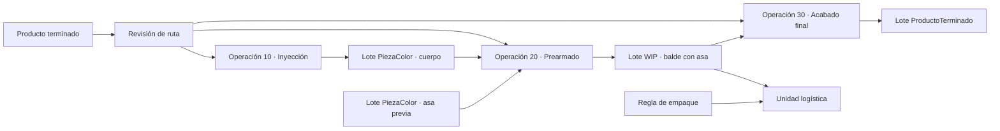

# US-010R: Rutas, BOM Multinivel, WIP y Perfiles de Empaque

## 1. Decisión de alcance

EnvaPerú conoce antes de producir qué referencias permiten adelantar parte del armado durante los ciclos lentos. Esa actividad reduce trabajo posterior, pero no siempre completa un producto vendible. El resultado puede embolsarse, pesarse, moverse y continuar en otro módulo; por tanto es un WIP WIP inventariable.

Esta historia introduce el fundamento transversal para:

- representar piezas, WIP y producto terminado sin reutilizar `PiezaColor.tipo=KIT`;
- definir estructuras/BOM multinivel;
- congelar rutas de producción con operaciones intermedias;
- ejecutar una misma operación parcialmente entre ciclos y parcialmente en un módulo posterior;
- planificar bolsas desde reglas de empaque físicas, versionadas y aplicables también a WIP.

La implementación legacy `PiezaColor.tipo=KIT` + `PiezaComponente` nunca tuvo datos operativos. Se retira sin migrar filas de negocio, pero la migración debe comprobar el vacío y bloquearse si encuentra datos inesperados.

## 2. Historia de usuario

**Como** responsable de Planificación y Producción  
**Quiero** definir rutas revisionadas con salidas WIP y reglas de empaque para piezas, WIP y productos  
**Para** adelantar operaciones entre ciclos sin inflar producto terminado, calcular bolsas trazables y entregar al siguiente módulo inventario intermedio correctamente identificado.

## 3. Resultado observable

1. Una pieza simple, un WIP WIP y un producto terminado poseen identidades diferenciadas bajo un contrato común de artículo SCM.
2. Una estructura puede consumir piezas o WIP y producir otro WIP o producto terminado.
3. El sistema rechaza estructuras y rutas cíclicas.
4. La planificación confirmada congela estructura y ruta; cada `PlanBolsa` congela la regla de empaque exacta al crearse.
5. Una operación de prearmado puede repartirse entre ejecución concurrente y estación dedicada sin cambiar el artículo resultante.
5.1. La ejecución concurrente no exige al maquinista registrar avances por ciclo; el responsable de Armado confirma la manga y puede registrar checkpoints opcionales.
6. Confirmar prearmado consume componentes y acredita `LoteWIP`; no incrementa producto terminado.
7. Una bolsa de prearmado referencia `LOTE_WIP` y conserva genealogía hacia cuerpos, asas u otros componentes.
8. El número de bolsas se propone desde una capacidad físicamente probada y límites de peso, no solo desde kg.
9. La última bolsa puede planificarse parcial; etiquetas sobrantes se anulan sin generar saldo.
10. La cantidad real nunca se infiere desde el peso.
11. El frontend y la API dejan de crear kits en `PiezaColor`.
12. La migración demuestra que no existen kits legacy usados antes de retirar tabla y campos.

## 4. Lenguaje de dominio

### 4.1. ArticuloSCM

Supertipo de identidad descrito en [[Articulo_SCM]]. En el primer corte cubre:

- `PIEZA_COLOR`;
- `SUBENSAMBLE_WIP`;
- `PRODUCTO_TERMINADO`.

Los subtipos 1:1 conservan integridad referencial. No se usa un `tipo + id_externo` polimórfico como sustituto de claves foráneas.

### 4.2. RevisionEstructuraArticulo

BOM aprobada e inmutable de un artículo resultado. Sus componentes también son artículos, por lo que soporta niveles sucesivos. La aprobación valida cantidades, unidades, referencias activas y ausencia de ciclos.

### 4.3. RevisionRutaProducto y OperacionRuta

La ruta define precedencias, centros, entradas y salidas de las operaciones.
Véase [[Ruta_Produccion]]. Una BOM explica composición; una ruta no la duplica.
Cada operación congela `executor_kind=ORDEN_FABRICACION | ORDEN_ENSAMBLE`: la
primera se ejecuta mediante OF/OT, usa molde/receta de la OF y puede producir
`PiezaColor`, WIP o PT; la segunda consume una estructura de artículos mediante
[[Orden_Armado]] y produce WIP o producto final. `OP_OT` y
`ORDEN_OPERACION` son aliases transitorios.

### 4.4. OrdenOperacion y EjecucionOperacion

Objetivo ejecutable derivado de una operación congelada. Una Orden de Trabajo/RDP puede actuar como contexto de una ejecución concurrente, mientras otra ejecución de la misma orden ocurre después en un módulo dedicado.

La Tech Spec decidirá si `OrdenArmado` se migra o se expone como especialización de `OrdenOperacion`; conceptualmente deja de estar limitada a resultados `ProductoTerminado`.

### 4.5. LoteWIP

Salida confirmada de una transformación intermedia, definida en [[Lote_WIP]]. No es sinónimo de [[Saldo_WIP_Salida]]:

- `SaldoWIPSalida`: piezas buenas sueltas producidas por la OT;
- `LoteWIP`: WIP acreditado después de consumir componentes.

### 4.6. TipoManga, PerfilEmpacable y ReglaEmpaqueRevision

Definidos en [[Perfil_Empaque]]:

- [[Tipo_Manga]] describe la manga física y su tara/límite bruto;
- el perfil describe geometría y acomodo del contenido;
- la regla revisionada determina cantidad objetivo, máximo probado, límites y tolerancias.

No existe una capacidad universal `bolsa -> pieza`. El mismo balde ocupa diferente volumen suelto y con un asa incorporada.

### 4.7. PlanManga

Identidad prevista que congela artículo/lote esperado, regla de empaque, cantidad y peso teórico. La OP conserva primero un plan agregado y cada OT genera las identidades de su jornada. Ni planificar ni pesar crea inventario: una manga pesada permanece `PENDIENTE_RECEPCION_ALMACEN` hasta el escaneo futuro de Almacén.

## 5. Modelo conceptual



## 6. Invariantes

1. `PiezaColor` representa una pieza coloreada, no un kit.
2. Todo WIP físicamente contado, pesado, movido o almacenado posee artículo y `LoteWIP`.
3. Una salida solo acredita `ProductoTerminado` cuando completa su estructura comercial aprobada.
4. Una revisión aprobada no se edita.
5. Todo plan y ejecución conserva revisión, hash y snapshot.
6. Un artículo no puede ser ancestro de sí mismo en una estructura.
7. Una ruta no puede contener ciclos de precedencia.
8. Confirmar una operación consume entradas y acredita el resultado en una transacción idempotente.
9. La cantidad incorporada cumple la estructura congelada; merma y rotura se registran aparte.
10. Ejecutar una operación entre ciclos no atribuye componentes previos ni peso compuesto a la OT de inyección.
11. Una misma operación puede tener ejecuciones `CONCURRENTE_ENTRE_CICLOS` y `ESTACION_DEDICADA`.
12. La suma confirmada no excede el objetivo sin ampliación autorizada.
13. `LoteWIP` y `SaldoWIPSalida` no comparten saldo ni identidad.
14. Una bolsa WIP contiene un lote principal; sus entradas se recorren mediante genealogía.
15. La capacidad efectiva respeta cantidad físicamente probada, peso neto operativo y peso bruto máximo descontando tara superior/margen.
16. La capacidad de una bolsa no se duplica por color cuando la geometría es igual.
17. Las unidades asignadas son el dato productivo autoritativo; pesar las confirma implícitamente sin digitación y el peso es control físico.
18. Planificar, imprimir o anular una etiqueta no acredita ni consume inventario.
19. Un cambio de regla de empaque no modifica bolsas históricas.
20. Ninguna migración elimina datos de kit sin comprobar previamente que las tablas están vacías.
21. En `ORDEN_ENSAMBLE`, las cantidades de componentes viven únicamente en
    `RevisionEstructuraArticulo`; la ruta referencia esa revisión y no mantiene
    una BOM paralela. Los insumos de `ORDEN_FABRICACION` se gobiernan por
    molde/receta de la OF.
22. Cada operación declara exactamente una autoridad de ejecución; una
    `ORDEN_FABRICACION` no crea `OrdenArmado` y una `ORDEN_ENSAMBLE` no
    acredita ciclos ni kg de máquina.
23. Un override de empaque requiere permiso, motivo y auditoría; puede reducir el plan, pero nunca superar capacidades o pesos máximos.

## 7. Cálculo de empaque

```text
tara_superior_kg =
  (tara_nominal_g + tolerancia_tara_g) / 1000

limite_neto_por_bruto_kg =
  peso_bruto_max_kg
  - tara_superior_kg
  - margen_seguridad_kg

limite_neto_efectivo_kg =
  min(
    peso_neto_operativo_max_kg,
    limite_neto_por_bruto_kg
  )

capacidad_por_peso =
  floor(
    limite_neto_efectivo_kg * 1000
    / peso_unitario_snapshot_g
  )

capacidad_efectiva =
  min(
    cantidad_objetivo_un,
    cantidad_maxima_probada_un,
    capacidad_por_peso
  )

numero_bolsas =
  ceil(cantidad_objetivo_operacion / capacidad_efectiva)
```

La tara superior procede del `TipoContenedor`: `(tara_nominal_g + tolerancia_tara_g) / 1000`. Si el límite neto efectivo o la capacidad resultan menores o iguales a cero, no se genera ningún plan y se informa `REGLA_EMPAQUE_NO_VIABLE`.

Para WIP:

```text
peso_unitario_wip_snapshot_g =
  SUM(cantidad_componente * peso_unitario_componente_snapshot_g)
```

El cálculo propone el plan. La confirmación conserva cantidad real, peso real y diferencias. Nunca reconstruye unidades dividiendo kg.

## 8. Flujo principal

1. Maestros define el artículo WIP `Balde con asa prearmada`.
2. Se aprueba su estructura: un cuerpo + un asa.
3. Se aprueba la ruta del producto con inyección, prearmado y acabado.
4. Se aprueba el perfil físico y la regla de empaque del WIP.
5. US-010P congela estructura/ruta, `executor_kind` y el objetivo de cada operación.
6. Planificación estima qué parte del prearmado puede adelantarse entre ciclos; el resto permanece asignado al módulo posterior.
7. US-010C ejecuta operaciones `ORDEN_FABRICACION`, produce cuerpos y acredita su `SaldoWIPSalida`.
8. US-010F crea `PlanBolsa` con su regla de empaque congelada, ejecuta `ORDEN_ENSAMBLE`, consume cuerpos y asas y acredita `LoteWIP`.
9. US-010D pesa las mangas WIP usando el plan congelado y las deja pendientes de recepción, sin Kardex.
10. El módulo posterior consume esos lotes WIP y continúa la ruta hasta producto terminado.

## 9. Criterios de aceptación ATDD/BDD

### RWE-01 — WIP, no producto terminado

**Dado** una estructura comercial que exige cuerpo, asa, tapa y acabado  
**Cuando** se confirman 100 cuerpos con sus asas  
**Entonces** se acredita un `LoteWIP` de 100 unidades  
**Y** no se acredita ningún `ProductoTerminado`.

### RWE-02 — BOM multinivel

**Dado** que el producto consume un WIP y el WIP consume dos `PiezaColor`  
**Cuando** Planificación explota la estructura  
**Entonces** conserva ambos niveles y sus revisiones  
**Y** calcula necesidades finales sin duplicar componentes.

### RWE-03 — Ciclo directo

**Dado** una estructura A  
**Cuando** se intenta agregar A como componente de A  
**Entonces** la aprobación se rechaza.

### RWE-04 — Ciclo indirecto

**Dado** A contiene B y B contiene C  
**Cuando** se intenta aprobar C conteniendo A  
**Entonces** se rechaza el grafo completo sin publicar la revisión.

### RWE-05 — Ejecución repartida

**Dado** una Orden de Operación para 1,000 prearmados  
**Cuando** se confirman 400 entre ciclos y 600 en estación dedicada  
**Entonces** ambas ejecuciones acreditan el mismo artículo WIP  
**Y** el objetivo queda completado exactamente una vez.

### RWE-06 — Bolsa por estado físico

**Dado** una bolsa que admite 120 baldes sueltos o 100 baldes con asa  
**Cuando** se planifica el WIP `Balde con asa prearmada`  
**Entonces** aplica la regla de 100 y no la de la pieza suelta.

### RWE-07 — Límite de peso

**Dado** una cantidad probada superior a lo permitido por el peso bruto máximo  
**Cuando** se calcula la capacidad efectiva  
**Entonces** se usa el menor límite y ninguna bolsa planificada lo excede.

### RWE-08 — Última bolsa parcial

**Dado** un objetivo de 250 unidades y capacidad efectiva 100  
**Cuando** se generan bolsas  
**Entonces** se planifican cantidades 100, 100 y 50 con identidades distintas.

### RWE-09 — Cantidad no inferida

**Dado** una manga cuyo peso difiere del teórico  
**Cuando** se confirma en balanza  
**Entonces** conserva la cantidad asignada confirmada implícitamente y registra desviación  
**Y** no reemplaza la cantidad dividiendo el peso.

### RWE-10 — Snapshot histórico

**Dado** una OP con ruta R3 y una de sus bolsas ya planificada con empaque E2  
**Cuando** se aprueban R4 y E3  
**Entonces** la OP conserva R3 y esa bolsa conserva E2.

### RWE-11 — Etiquetas no utilizadas

**Dado** cinco bolsas planificadas y solo cuatro utilizadas  
**Cuando** Producción cierra la ejecución  
**Entonces** la quinta se anula con motivo y no genera saldo.

### RWE-12 — Retiro seguro del kit legacy

**Dado** que las consultas de precondición devuelven cero kits y cero componentes  
**Cuando** se ejecuta la migración aprobada  
**Entonces** se retiran API/UI y estructura legacy sin crear datos sustitutos.

### RWE-13 — Dato inesperado bloquea migración

**Dado** una fila inesperada en `PiezaComponente`  
**Cuando** se intenta el contract destructivo  
**Entonces** la migración falla y exige conciliación explícita.

### RWE-14 — Ruta sin composición duplicada

**Dado** una operación que produce un WIP mediante una estructura aprobada<br>
**Cuando** se configura su ruta<br>
**Entonces** la operación referencia esa revisión de estructura<br>
**Y** no permite registrar otra cantidad por componente en la ruta.

### RWE-15 — Una sola autoridad de ejecución

**Dado** una operación de inyección con `executor_kind=ORDEN_FABRICACION`<br>
**Cuando** se materializa el plan<br>
**Entonces** crea una OF/OT y nunca una `OrdenArmado` paralela<br>
**Y** una operación `ORDEN_ENSAMBLE` sigue la regla inversa.

### RWE-16 — Regla de empaque inviable

**Dado** un límite bruto que, descontando tara superior y margen, deja capacidad neta no positiva<br>
**Cuando** se intenta planificar bolsas<br>
**Entonces** no se crea ninguna identidad<br>
**Y** se informa `REGLA_EMPAQUE_NO_VIABLE`.

### RWE-17 — Override no excede límites

**Dado** una regla aprobada con máximos físicos<br>
**Cuando** un usuario autorizado registra un override con motivo<br>
**Entonces** puede reducir la cantidad objetivo o usar tara real<br>
**Pero** no puede aumentar la capacidad probada ni los límites de peso.

### RWE-18 — El CRUD no revive KIT

**Dado** el catálogo nuevo de artículos y estructuras<br>
**Cuando** un cliente intenta enviar `PiezaColor.tipo=KIT`<br>
**Entonces** la API rechaza el valor sin crear filas<br>
**Y** la interfaz ofrece crear un WIP WIP o producto terminado con estructura, no una `PiezaColor` artificial.

### RWE-19 — Producto terminado directo desde Producción

**Dado** una ruta cuya operación terminal de inyección usa `executor_kind=ORDEN_FABRICACION`  
**Cuando** el resultado ya cumple la definición de producto terminado  
**Entonces** la salida de la operación es `LOTE_PRODUCTO_TERMINADO`  
**Y** no obliga a crear WIP ni una operación de armado ficticia.

## 10. Responsabilidad de historias relacionadas

| Historia | Responsabilidad después de US-010R |
|---|---|
| US-007 | Conserva `Pieza`, `PiezaColor`, molde y producto normalizados; no restaura kits. |
| US-010P | Congela BOM/ruta, explota necesidades multinivel y crea objetivos de operación. |
| US-010C | Ejecuta inyección, acredita piezas y planifica bolsas simples con perfiles congelados. |
| US-010F | Ejecuta operaciones intermedias o finales y genera `LoteWIP` o producto según la salida congelada. |
| US-010D | Captura peso y deja mangas de pieza, WIP o producto pendientes de recepción. |
| US-010I | Recibe por QR en Almacén y crea el movimiento inicial de Kardex. |
| US-010G | Despacha únicamente artículos/lotes elegibles y liberados. |

## 11. Migración sin kits legacy

No se necesita mapear ni conservar contenido funcional de kits porque nunca se
utilizó en operación. Los seeds y pruebas ya no crean nuevos KIT. Los dos KIT de
demostración encontrados en `enva_test` fueron declarados mocks descartables por
el usuario y eliminados de forma controlada el 2026-07-25, sin convertirlos en
WIP real. Se exige evidencia reproducible por ambiente:

```text
COUNT(PiezaColor WHERE tipo = 'KIT') = 0
COUNT(PiezaComponente) = 0
```

La precondición local devolvió cero y, con autorización expresa posterior, la
revisión `a61c8d2f4e90` eliminó `pieza_componente` y `pieza_color.tipo` en
`enva_test`. La Tech Spec conserva las consultas por ambiente: este resultado
local no autoriza un `DROP` silencioso ni demuestra el estado de otra base.

## 12. Permisos mínimos

Se usan los códigos estables existentes en backend:

- `ARTICULO_VER`, `ARTICULO_ADMINISTRAR`;
- `ESTRUCTURA_VER`, `ESTRUCTURA_ADMINISTRAR`, `ESTRUCTURA_APROBAR`;
- `RUTA_VER`, `RUTA_ADMINISTRAR`, `RUTA_APROBAR`;
- `EMPAQUE_VER`, `EMPAQUE_ADMINISTRAR`, `EMPAQUE_APROBAR`;
- `OPERACION_PLANIFICAR`, `OPERACION_EJECUTAR`, `OPERACION_CORREGIR`;
- `WIP_VER`, `WIP_LIBERAR`;
- `AUTORIZACION_SCM_ADMINISTRAR`.

La matriz completa se encuentra en [[Matriz_Roles_Capacidades_SCM_Produccion]]. Gerencia/Administración asignará estos permisos mediante roles al cierre del desarrollo; las acciones de aprobación y corrección no deben depender solo de ocultar botones.

## 13. Fuera de alcance

- Optimización automática de cuántas unidades conviene prearmar según IA/OEE.
- Sensores automáticos de ciclos o conteo.
- Solver volumétrico que sustituya pruebas físicas de capacidad.
- Costeo completo de WIP.
- Despacho del WIP como producto comercial.
- Migrar kits funcionales inexistentes.

## 14. Decisiones validadas

1. Se mantiene la optimización de prearmar entre ciclos.
2. Un avance incompleto genera WIP, no producto terminado.
3. La composición recursiva se conserva en `ArticuloSCM`, no en `PiezaColor`.
4. El prearmado puede dividirse entre ejecución concurrente y módulo posterior.
5. El maestro de empaque separa contenedor, perfil físico y regla revisionada.
6. La capacidad primaria de artículos discretos se gobierna en unidades físicamente probadas; kg actúa como límite y control.
7. No existen datos operativos legacy de kits que deban migrarse; los seeds/fixtures técnicos actuales se retiran antes del contract.
8. Cada operación tiene una única autoridad `ORDEN_FABRICACION` u `ORDEN_ENSAMBLE`.
9. US-010P congela estructura/ruta; la OP calcula el plan agregado y US-010C/F congela la regla exacta al crear cada manga de OT.

## 15. Decisiones operativas pendientes

1. Catálogo inicial de WIP WIP reales.
2. Tipos de bolsas, dimensiones, tara y peso máximo.
3. Cantidades físicamente probadas para pieza suelta y prearmado.
4. Criterio para estimar el objetivo concurrente por producto/máquina/turno.
5. Política de Calidad para consumir cuerpo recién producido y liberar WIP.
6. Centro/ubicación exactos de cada operación posterior.

## 16. Definición de preparada para Tech Spec

- [x] Se separaron pieza, WIP y producto terminado.
- [x] Se definieron BOM multinivel y ruta como conceptos distintos.
- [x] Se definió la ejecución concurrente y dedicada de una misma operación.
- [x] Se separó la autoridad de OF/OT frente a Orden de Armado.
- [x] Se definieron contenedor, perfil, regla y cálculo de bolsas.
- [x] Se combinaron límite neto operativo, peso bruto, tara superior y margen en la capacidad.
- [x] Se declaró retiro del kit legacy con precondición de vacío.
- [ ] Planta entrega al menos una ruta real completa.
- [ ] Planta mide una bolsa real para pieza suelta y otra para prearmado.
- [ ] Calidad valida la política de uso en proceso.
- [x] Se registró [[Baseline_TS-010R_C_D_2026-07-24]]; suites rápidas verdes y PostgreSQL rojo por tres pruebas previas.
