# US-010: Trazabilidad End-to-End del Flujo SCM

## 1. Decisión Ejecutiva

El sistema actual posee una base valiosa de trazabilidad de ejecución: puede relacionar una Orden de Producción con molde, máquina, trabajador, color de producción, Registro Diario y pesajes. También existe un kardex liviano que permite registrar movimientos de bultos mediante QR.

Sin embargo, todavía no existe trazabilidad SCM end-to-end. El sistema no puede responder de manera completa, verificable y bidireccional:

> ¿Qué lotes de materia prima y colorantes fueron consumidos para producir este bulto o producto terminado, por quién, en qué máquina, con qué fórmula y parámetros, qué controles superó, por qué ubicaciones pasó y a qué cliente o despacho fue entregado?

Tampoco puede responder la consulta inversa:

> Si un lote de materia prima resulta no conforme, ¿qué OF/OT, piezas, bultos, OP de demanda, productos terminados, ubicaciones y despachos fueron afectados?

La clasificación honesta del sistema, asumiendo US-008 y US-009 implementadas, es:

- **MES / Manufacturing Operations Management parcial:** planificación y ejecución interna razonablemente modeladas.
- **WMS liviano:** seguimiento de mangas o bultos y movimientos, todavía basado en textos y QR posicional.
- **SCM incompleto:** no existen recepción por lote de proveedor, consumo real por lote, armado trazado, despacho con destinatario ni genealogía bidireccional.

Esta US define la arquitectura y el comportamiento mínimo para cerrar la cadena completa. No declara certificación ISO ni convierte por sí sola al sistema en un ERP.

## 2. Historia de Usuario

**Como** responsable de Planta, Calidad, Almacén y Cadena de Suministro  
**Quiero** identificar cada lote, unidad logística y evento crítico desde la recepción de materiales hasta el despacho  
**Para** reconstruir la genealogía completa de cualquier material o producto, contener no conformidades, reconciliar cantidades y demostrar con evidencia quién hizo qué, cuándo, dónde, por qué y con qué insumos.

## 3. Objetivos

1. Lograr trazabilidad hacia atrás desde cualquier bulto o lote de producto hasta los lotes reales consumidos cuando se registraron, o hasta el conjunto conservador de recepciones/proveedores candidatos cuando la operación perdió granularidad en la tolva.
2. Lograr trazabilidad hacia adelante desde cualquier lote, recepción o proveedor candidato hasta todas las salidas, existencias, transformaciones y despachos potencialmente afectados.
3. Identificar inequívocamente lotes, unidades logísticas, ubicaciones, actores, equipos, documentos y eventos.
4. Separar datos planificados de consumos y resultados reales.
5. Mantener un historial append-only de eventos con correcciones auditables.
6. Controlar estado logístico y estado de calidad de forma independiente.
7. Reconciliar el balance de masa de cada transformación.
8. Soportar operación offline idempotente sin duplicar pesajes ni movimientos.
9. Permitir una adopción futura de identificadores GS1 sin depender de ellos para operar internamente.

## 4. Perfil de Estandarización Seleccionado

### 4.1. ISO 9001 como línea base de gestión y evidencia

Se adopta **ISO 9001:2015 con su enmienda 2024** como referencia vigente al 2026-07-12 para el sistema de gestión de calidad. La edición 2015 continúa vigente, aunque ISO informa que se espera una nueva edición en septiembre de 2026.

La implementación debe preparar evidencia para los siguientes temas de la norma:

| Referencia orientativa | Aplicación en el sistema |
|---|---|
| 7.5 Información documentada | Registros íntegros, versionados, legibles y recuperables |
| 8.4 Control de suministros externos | Proveedor, recepción, lote de proveedor, inspección y liberación |
| 8.5.1 Producción controlada | OP de demanda, OF/OA, OT, recursos, fórmula, parámetros, ejecución y resultados |
| 8.5.2 Identificación y trazabilidad | IDs únicos, estado y genealogía de materiales y salidas |
| 8.5.4 Preservación | Ubicación, almacenamiento, manipulación y movimiento |
| 8.5.6 Control de cambios | Revisiones, snapshots y eventos de corrección |
| 8.6 Liberación | Evidencia de aprobación antes del uso o despacho |
| 8.7 Salidas no conformes | Cuarentena, bloqueo, disposición, reproceso y descarte |
| 9.1 Seguimiento y medición | Indicadores de completitud, balance y desempeño |
| 10.2 No conformidad y acción correctiva | Investigación de alcance y trazabilidad de afectados |

Estas referencias son una guía de diseño y no sustituyen una copia licenciada de la norma, el análisis de aplicabilidad ni una auditoría de certificación.

### 4.2. ISA-95 / IEC 62264 como arquitectura de manufactura

ISA-95 se usa para distinguir:

- **Nivel 4:** planificación empresarial y logística, incluyendo documentos de compra, venta, recepción y despacho.
- **Nivel 3:** operaciones de manufactura, inventario, calidad y mantenimiento; este es el núcleo del sistema actual.
- **Niveles 0-2:** proceso físico, balanza, máquina, sensores y supervisión.

Mapeo conceptual:

| ISA-95 | Dominio EnvaPerú |
|---|---|
| Material definition | `MateriaPrima`, `Colorante` y `ArticuloSCM` (`PiezaColor`, WIP WIP o `ProductoTerminado`) |
| Material lot / sublot | `LoteMaterial`, `LoteProduccion`, `LoteSalida`, [[Lote_WIP]] y [[Lote_Producto_Terminado]] |
| Equipment resource | `Maquina`, `Molde`, balanza |
| Personnel resource | `Trabajador`, `RolOperativo` |
| Production request | `OrdenProduccion` y sus líneas de `ProductoTerminado` |
| Work/production order | `OrdenFabricacion` y `OrdenArmado` |
| Production response/performance | OT/RDP, detalle horario, consumos, salidas y pesajes reales |
| Operations event | `EventoTrazabilidad` |

La integración futura con un ERP debe realizarse mediante contratos y eventos; no mediante acceso directo a tablas del MES.

### 4.3. GS1 Global Traceability Standard

Se adopta el patrón de:

- **Critical Tracking Events (CTE):** eventos críticos como recibir, transformar, pesar, empacar, mover, despachar, devolver o destruir.
- **Key Data Elements (KDE):** datos mínimos que explican quién, qué, dónde, cuándo, por qué y con qué documento ocurrió el evento.
- **One-up, one-down:** conocer al proveedor directo de cada entrada y al receptor directo de cada salida.

### 4.4. GS1 EPCIS 2.0.1 como semántica de eventos

No es obligatorio desplegar inicialmente un repositorio EPCIS completo. El modelo interno debe ser compatible conceptualmente con:

- `ObjectEvent`: observación, creación, movimiento o cambio de estado de un objeto.
- `TransformationEvent`: consumo de lotes de entrada y generación de lotes de salida.
- `AggregationEvent`: agrupación reversible de piezas, cajas, bultos o pallets.
- `TransactionEvent`: relación con compra, pedido, guía o despacho.
- `AssociationEvent`: asociación persistente con una ubicación o activo cuando corresponda.

### 4.5. Identificación GS1 opcional

- `GTIN`: identificación comercial de `ProductoTerminado` cuando corresponda.
- `SSCC`: identificación global de pallet o unidad logística de despacho.
- AI `(10)`: lote o batch.
- AI `(21)`: serial individual.
- AI `(00)`: SSCC.

EnvaPerú puede iniciar con IDs internos globalmente únicos. No debe generar identificadores GS1 ficticios sin prefijo empresarial asignado.

### 4.6. Estándares no seleccionados como base

- **ISO 22005:** no se adopta porque está orientada a trazabilidad de alimentos y piensos.
- **ISO 28000:** puede evaluarse posteriormente para seguridad de la cadena, pero no resuelve por sí sola la genealogía productiva.
- **ISO 14001:** es complementaria para desempeño ambiental y residuos, no el estándar principal de tracking de esta US.

## 5. Evaluación Actual del Flujo

| Área | Evidencia actual | Evaluación | Brecha principal |
|---|---|---|---|
| Datos maestros | Además de moldes, piezas, colores, máquinas y trabajadores, US-010A ya incorporó proveedor, categoría de recepción e identidad común de material | Parcial | Faltan clientes, ubicaciones y unidades de medida más allá de `KG` |
| Compras de material | Proveedor y OC internas versionadas con edición de borrador, aprobación segregada y auditoría | Parcial | Faltan documentos externos, imputaciones de recepción, rechazo/cierre y saldo recibido real |
| Planificación | Mock de demanda PT y entidad técnica legacy con snapshot de molde, colores y metas | Parcial | Falta persistir la nueva OP de demanda y migrar la orden técnica a OF/corridas |
| Ejecución horaria | RDP, máquina, trabajador, coladas y parámetros | Parcial | El detalle usa color texto y no identifica siempre el lote ejecutado ni cada salida física |
| Materiales | `MateriaPrima` y `Colorante` poseen identidad común `scm_material` 1:1 obligatoria y categoría configurable | Parcial | No existen todavía lotes recibidos, saldos físicos ni consumos reales |
| Salidas de producción | `PiezaColor` y `LoteSalidaPiezaColor` creados para órdenes técnicas legacy/OF nuevas | Parcial | Falta completar el vínculo OF/corrida/OT, pesajes, bultos e inventario |
| Pesaje | Pesaje offline y `ControlPeso` central | Parcial | No hay FK central a la salida, tara, cantidad, UUID global ni idempotencia completa |
| Inventario | `InventarioManga` y `MovimientoKardex` append-only | Parcial | Bulto identificado por ID local, ubicaciones texto y contenido cacheado sin genealogía |
| Calidad | Peso como verificación | Ausente como sistema | No hay inspección, cuarentena, liberación, bloqueo ni disposición no conforme |
| Material de segunda | Catálogo `tipo=SEGUNDA` o `MOLIDO` | Débil | No se genera un lote de material recuperado ni se enlaza al lote de origen |
| Armado | Operación `SAL-ARMAR` en kardex | Ausente como transformación | Consume el bulto completo sin crear lote de producto ni registrar componentes usados |
| Despacho | Estado `DESPACHADO` y locación `CLIENTE_FINAL` | Débil | No existen cliente, documento, líneas, cantidades, receptor ni unidad logística de envío |
| Auditoría | Historial legacy más `scm_evento` append-only y `scm_operacion` idempotente para el corte de compras | Parcial | Falta extender el envelope a recepción, inventario, correcciones y el resto de la cadena |
| Consulta de genealogía | Consultas legacy por código OP técnico y manga | Ausente | Falta recorrido OP-demanda → asignaciones → OF/OA/OT y backward/forward |

## 6. Lagunas Lógicas Verificadas en el Código Actual

### 6.1. La receta no demuestra el consumo

`SeCompone` y `SeColorea` indican qué material y cuánto se planeó utilizar, pero no qué lote físico fue abierto, pesado y consumido.

Una receta responde “qué debería usarse”. La trazabilidad exige responder “qué lote se usó realmente y cuánto”.

### 6.2. MateriaPrima y Colorante ya tienen identidad común, pero no lotes

US-010A ya enlaza cada fila legacy 1:1 con `scm_material`, código estable y categoría de recepción. Esto resuelve la identidad de catálogo, no la existencia física. Faltan:

- proveedor;
- lote del proveedor;
- lote interno;
- fecha y documento de recepción;
- cantidad recibida y disponible;
- cantidades físicas en unidad controlada;
- estado de calidad;
- ubicación;
- certificado o evidencia asociada.

### 6.3. LoteColor es una corrida planificada, no un lote trazable completo

`LoteColor` posee la orden técnica legacy, `ColorProduccion` y meta, pero no dispone de:

- código de lote estable;
- secuencia gobernada dentro de la futura OF;
- estado de ejecución;
- fecha real de inicio y fin;
- revisión de fórmula;
- consumos reales;
- relación completa con sus resultados físicos.

Se recomienda evolucionar conceptualmente `LoteColor` a `LoteProduccion`. El nombre físico de la tabla puede conservarse temporalmente durante la migración.

### 6.4. LoteSalidaPiezaColor implementado como objetivo técnico legacy/OF

Desde la revisión `b7e9f1a4d510`, una orden técnica legacy crea transaccionalmente
una salida por cada combinación lote–pieza del snapshot. La adaptación OP/OF la
preserva como salida de `CorridaFabricacion`; referencia el `PiezaColor` exacto
y congela cavidades, peso unitario, cantidad objetivo y kg netos objetivo.

La brecha restante ya no es la identidad de la salida: los pesajes y el kardex aún deben referenciarla, y la ejecución debe completar cantidades buenas, rechazadas y kg reales.

### 6.5. ControlPeso continúa siendo ambiguo

El modelo central se vincula al RDP y opcionalmente al color, pero no al bulto ni a `LoteSalidaPiezaColor`. Tampoco distingue:

- peso bruto;
- tara;
- peso neto;
- cantidad de piezas;
- balanza utilizada;
- origen offline globalmente único;
- estado de verificación.
- contenido simple, WIP WIP o producto terminado;
- peso físico total frente a kg atribuibles a la OT actual;
- componentes previos consumidos durante prearmado.

El porcentaje legacy “descuento ajeno a la pieza” puede modificar un peso numérico, pero no demuestra cantidad, lote de origen ni ejecución de armado. No debe migrarse como genealogía.

### 6.6. La sincronización offline no es idempotente de extremo a extremo

El módulo local posee un ID entero y el servidor central no conserva ese identificador como clave única de origen. Reintentos o dos dispositivos pueden generar duplicados o colisiones.

Cada evento offline debe tener un UUID/ULID y una restricción `UNIQUE(source_system, source_event_id)` en el servidor.

### 6.7. El QR actual es posicional y frágil

El QR del sticker concatena campos separados por comas. Agregar, omitir o reordenar una posición cambia su significado. Además, no incluye de forma efectiva el `lote_salida_pieza_color_id` aunque el modelo offline ya contiene la columna.

El QR debe identificar una entidad estable y versionada, no convertirse en la base de datos completa.

### 6.8. InventarioManga mezcla identidad, snapshot y stock

`InventarioManga` utiliza `pesaje_id` como identidad, almacena el código OP
técnico legacy —futura OF—, molde, color, peso y pieza como textos cacheados, y
usa `locacion_actual` como string.

Debe evolucionar a una `UnidadLogistica` identificada globalmente y vinculada a una salida o lote. Su estado y ubicación actuales serán una proyección del historial, no la única evidencia.

### 6.9. Las ubicaciones no son datos maestros

Valores como `ALMACEN_PRINCIPAL`, `TRANSITO`, `ZONA_ARMADO` o `CLIENTE_FINAL` son strings sin FK ni jerarquía. No puede validarse origen, destino, tipo de ubicación o capacidad.

Además, “almacén” no identifica un único ámbito: EnvaPerú separa físicamente materias primas, piezas y productos terminados. El modelo debe impedir movimientos entre ámbitos incompatibles sin crear catálogos aislados que rompan la trazabilidad común.

### 6.10. Estado logístico y estado de calidad están mezclados

`EN_INVENTARIO`, `TRANSITO`, `CONSUMIDO`, `MERMA` y `DESPACHADO` mezclan ubicación, disponibilidad, calidad y disposición.

Un objeto puede estar físicamente en una ubicación de cuarentena y tener estado de Calidad `PENDIENTE` o `BLOQUEADO`. Ubicación, calidad y disponibilidad deben permanecer independientes.

### 6.11. SAL-ARMAR no registra el producto creado

La operación marca una manga como consumida, pero no registra:

- orden de armado;
- cantidades parciales consumidas;
- lotes de componentes;
- versión o snapshot de BOM;
- lote de producto terminado resultante;
- paquetes, cajas o pallets creados.

### 6.12. Un bulto puede consumirse parcialmente

El kardex actual cambia el estado del bulto completo. Armado, reproceso o transferencia pueden consumir solo parte del peso o de las piezas.

Se requieren eventos de consumo parcial, división y consolidación con saldo controlado.

### 6.13. Despacho no identifica al receptor

`SAL-DESPACHO` cambia el estado y usa una locación genérica, pero no registra cliente, pedido, guía, vehículo, transportista, líneas ni cantidades entregadas.

### 6.14. Todo el ramal se trata como merma

En plásticos, ramal y rechazo pueden molerse y regresar como materia prima de segunda. Deben separarse:

- ramal generado;
- ramal recuperado;
- rechazo recuperable;
- material molido producido;
- merma irreversible;
- destrucción o disposición externa.

Cuando el material se recupera, debe crear un nuevo `LoteMaterial` con relación genealógica al lote de producción que lo originó.

### 6.15. No existe simulación de alcance

No hay una consulta que, partiendo de un lote de entrada o no conformidad, determine inventario, WIP, productos y despachos afectados.

## 7. Principios e Invariantes de Trazabilidad

1. Toda entidad trazable tiene un identificador inmutable y globalmente único dentro de su namespace.
2. Los nombres, códigos visuales y QR no sustituyen FKs o IDs estables.
3. Todo evento registra como mínimo: quién, qué, dónde, cuándo, por qué, acción, estado y documento relacionado.
4. `event_time` y `record_time` son diferentes y se almacenan en UTC; se conserva el offset local del evento.
5. Los eventos confirmados no se editan ni eliminan. Se corrigen mediante reversa, anulación o evento compensatorio.
6. Todo evento offline es idempotente por sistema y UUID de origen.
7. Los snapshots preservan legibilidad histórica, pero nunca reemplazan la relación normalizada.
8. Receta planificada, reserva, emisión y consumo real son conceptos diferentes.
9. Un material no puede consumirse si su estado de calidad no permite uso.
10. Estado logístico y estado de calidad son ortogonales.
11. Todo movimiento tiene origen y destino válidos, salvo creación o destrucción documentada.
12. Toda transformación relaciona entradas reales con salidas reales. Si el proceso mezcló orígenes sin cantidades observadas, conserva todos los candidatos posibles y declara la pérdida de granularidad.
13. Toda agregación mantiene la relación padre-hijo y permite desagregación cuando el proceso sea reversible.
14. Ningún despacho se registra sin receptor y documento o motivo autorizado.
15. El stock no se modifica directamente; cambia mediante eventos o movimientos válidos.
16. El saldo disponible no puede ser negativo.
17. Los registros legacy no conciliables se marcan como tales; no se inventa genealogía inexistente.
18. Debe poder ejecutarse trazabilidad un paso atrás y un paso adelante para todo lote liberado o despachado.
19. Los colorantes se dosifican sobre los kg de material virgen declarados por la receta, no sobre material de segunda, mezcla total ni `meta_kg`.
20. La premezcla junta materias primas, colorante y aditivos aplicables; produce un WIP identificable a la salida de la tolva antes de la transformación por inyección o soplado.
21. `CONJUNTO_CANDIDATOS` nunca se presenta como genealogía exacta. Toda consulta de impacto incluye a todos sus orígenes plausibles y no inventa porcentajes.
22. Las piezas buenas sueltas se acreditan a un `SaldoWIPSalida` y se debitan una sola vez por embalaje directo o consumo en línea.
23. El avance provisional de una operación de prearmado o armado no crea inventario ni consume componentes; la confirmación de manga consume/acredita producción, pero todavía no crea stock para la manga resultante.
24. Una manga transformada se confirma mediante un único comando idempotente y transaccional; no se encadenan pesaje, consumo y acreditación como operaciones finales independientes.
25. El cierre de una OT espera sus mangas directas y cualquier `CREDITO_EN_LINEA_PENDIENTE`; una vez acreditados sus cuerpos y conciliado el WIP, no invalida una `OrdenOperacion` que solo la referencia como contexto.
26. Toda manga que debita WIP posee cantidad asignada centralmente y confirmada implícitamente al pesar; nunca se infiere desde kg.
27. Genealogía candidata/legacy degrada conocimiento de origen, no la existencia: siempre debita un pool o apertura contada y jamás permite saldo negativo.
28. La idempotencia es obligatoria incluso en el piloto conectado; el transporte offline queda como incremento posterior.
29. Planificación, pesaje, recepción de Almacén, ubicación, estado de inventario y Calidad son ejes distintos.
30. La OP congela la base de planificación; cada OF/OA congela estructura, ruta
    y configuración ejecutable; cada plan de manga congela por separado la
    regla de empaque exacta. Cambiar un maestro no reescribe ejecuciones.
31. Cada `OperacionRuta` declara una única autoridad.
    `ORDEN_FABRICACION` puede acreditar `PiezaColor`, WIP o producto terminado
    según su salida congelada; `ORDEN_ENSAMBLE` ejecuta transformaciones sin
    crear una autoridad paralela.
32. Pesar una manga no crea stock ni Kardex; el movimiento inicial nace con el escaneo de recepción de Almacén.
33. `OT.fecha_operativa`, `OT.created_at` y `Manga.pesada_at` son tiempos distintos; el avance se atribuye siempre a la fecha operativa.

## 8. Modelo de Dominio Objetivo

```mermaid
erDiagram
    PROVEEDOR ||--o{ RECEPCION_MATERIAL : entrega
    RECEPCION_MATERIAL ||--|{ LOTE_MATERIAL : crea
    MATERIA_PRIMA ||--o{ LOTE_MATERIAL : define
    UBICACION ||--o{ UNIDAD_LOGISTICA : contiene

    ORDEN_PRODUCCION ||--|{ LOTE_PRODUCCION : planifica
    LOTE_PRODUCCION ||--o{ REQUERIMIENTO_MATERIAL : requiere
    MATERIA_PRIMA ||--o{ REQUERIMIENTO_MATERIAL : especifica
    REQUERIMIENTO_MATERIAL ||--o{ RESERVA_LOTE_MATERIAL : asigna
    LOTE_MATERIAL ||--o{ RESERVA_LOTE_MATERIAL : compromete
    RESERVA_LOTE_MATERIAL ||--o{ EMISION_LOTE_MATERIAL : emite
    EMISION_LOTE_MATERIAL ||--o{ DEVOLUCION_MATERIAL : devuelve
    EMISION_LOTE_MATERIAL }o--o{ PREPARACION_MEZCLA : aporta
    PREPARACION_MEZCLA ||--|| LOTE_MEZCLA_PREPARADA : produce
    LOTE_MEZCLA_PREPARADA ||--o{ CONSUMO_LOTE_MATERIAL : alimenta
    EMISION_LOTE_MATERIAL ||--o{ CONSUMO_LOTE_MATERIAL : alimenta
    LOTE_PRODUCCION ||--o{ CONSUMO_LOTE_MATERIAL : confirma
    LOTE_PRODUCCION ||--|{ LOTE_SALIDA_PIEZA_COLOR : produce
    PIEZA_COLOR ||--o{ LOTE_SALIDA_PIEZA_COLOR : identifica
    LOTE_SALIDA_PIEZA_COLOR ||--|| SALDO_WIP_SALIDA : proyecta
    SALDO_WIP_SALIDA ||--o{ RESERVA_WIP_SALIDA : asigna
    RESERVA_WIP_SALIDA }o--|| UNIDAD_LOGISTICA : destina
    LOTE_SALIDA_PIEZA_COLOR ||--o{ UNIDAD_LOGISTICA : embala

    ORDEN_OPERACION ||--o{ CONFIRMACION_BOLSA_OPERACION : ejecuta
    CONFIRMACION_BOLSA_OPERACION ||--o{ CONSUMO_COMPONENTE : incorpora
    CONSUMO_COMPONENTE ||--o{ ASIGNACION_ORIGEN_EXACTA : distribuye
    CONSUMO_COMPONENTE ||--o| GRUPO_ORIGEN_CANDIDATO : usa_pool
    GRUPO_ORIGEN_CANDIDATO ||--|{ ORIGEN_CANDIDATO : relaciona
    SALDO_WIP_SALIDA ||--o{ ASIGNACION_ORIGEN_EXACTA : aporta_en_linea
    ARTICULO_SCM ||--o{ REVISION_ESTRUCTURA_ARTICULO : versiona
    REVISION_ESTRUCTURA_ARTICULO ||--|{ COMPONENTE_ESTRUCTURA_ARTICULO : contiene
    ARTICULO_SCM ||--o{ COMPONENTE_ESTRUCTURA_ARTICULO : participa
    PRODUCTO_TERMINADO ||--o{ REVISION_RUTA_PRODUCTO : organiza
    REVISION_RUTA_PRODUCTO ||--|{ OPERACION_RUTA : secuencia
    ORDEN_OPERACION ||--o{ LOTE_WIP : produce_intermedio
    ORDEN_OPERACION ||--o{ LOTE_PRODUCTO_TERMINADO : produce_final
    CONFIRMACION_BOLSA_OPERACION }o--o| LOTE_WIP : acredita_wip
    CONFIRMACION_BOLSA_OPERACION }o--o| LOTE_PRODUCTO_TERMINADO : acredita_pt
    ARTICULO_SCM ||--o{ LOTE_WIP : define
    PRODUCTO_TERMINADO ||--o{ LOTE_PRODUCTO_TERMINADO : define
    LOTE_WIP ||--o{ UNIDAD_LOGISTICA : embala
    LOTE_PRODUCTO_TERMINADO ||--o{ UNIDAD_LOGISTICA : embala
    TIPO_CONTENEDOR ||--o{ REGLA_EMPAQUE_REVISION : limita
    PERFIL_EMPACABLE ||--o{ REGLA_EMPAQUE_REVISION : configura
    REGLA_EMPAQUE_REVISION ||--o{ UNIDAD_LOGISTICA : congela_plan

    UNIDAD_LOGISTICA ||--o{ MOVIMIENTO_INVENTARIO : mueve
    DESPACHO ||--|{ DESPACHO_DETALLE : contiene
    UNIDAD_LOGISTICA ||--o{ DESPACHO_DETALLE : entrega
    CLIENTE ||--o{ DESPACHO : recibe

    EVENTO_TRAZABILIDAD ||--|{ EVENTO_OBJETO : relaciona
    INSPECCION_CALIDAD ||--o{ DISPOSICION_CALIDAD : resuelve
```



### 8.1. Datos maestros nuevos o ampliados

- `Proveedor`.
- `Cliente`.
- `Ubicacion` con jerarquía planta/ámbito/almacén/zona/rack-silo/posición y propósito compatible: materia prima, `PiezaColor`, WIP o producto terminado.
- `UnidadMedida` y reglas de conversión aprobadas.
- `PoliticaToleranciaRecepcion` por categoría de material y modalidad, con límites, vigencia y autorizadores.
- `TipoContenedor`: BOLSA, JABA, BULTO, CAJA, PALLET u otro soporte físico gobernado.
- `ArticuloSCM` como identidad común de `PiezaColor`, WIP WIP y `ProductoTerminado`, con subtipos 1:1.
- `RevisionEstructuraArticulo` para BOM multinivel acíclica y aprobada.
- `RevisionRutaProducto` y `OperacionRuta` para precedencias, entradas, salidas,
  `executor_kind=ORDEN_FABRICACION | ORDEN_ENSAMBLE` y ejecución concurrente.
- `PerfilEmpacable` y `ReglaEmpaqueRevision`; la capacidad física no se guarda directamente en `PiezaColor`.
- `MotivoMovimiento`.
- `MotivoNoConformidad`.
- `DisposicionCalidad`.
- `Balanza` como equipo identificado y, cuando aplique, con estado de calibración.
- Gobierno de aprobación, vigencia y hash para cada revisión de estructura, ruta y empaque.

Si un ERP será dueño de proveedor, cliente, compra o venta, el MES almacenará el ID externo, namespace, versión y snapshot necesarios para trazabilidad.

### 8.2. RecepcionMaterial

Cabecera del evento de recepción:

- proveedor;
- documento de compra o guía;
- fecha/hora efectiva;
- responsable;
- ubicación de recepción;
- estado;
- cantidades documentales, nominales y medidas;
- diferencia en kg y porcentaje;
- política de tolerancia aplicada o marca `SIN_POLITICA`;
- decisión autorizada cuando la diferencia queda fuera de tolerancia;
- evidencias adjuntas.

### 8.3. LoteMaterial

Representa un lote físico de materia prima, colorante, aditivo o material de segunda:

- `id` UUID/ULID;
- código interno único;
- definición de material;
- lote de proveedor;
- proveedor y recepción de origen;
- cantidades esperada, neta recibida y existencia física actual, junto con su unidad;
- fecha de recepción y fabricación si se conoce;
- estado de calidad;
- ubicación;
- certificado/documento opcional;
- lote padre cuando proviene de molienda, mezcla o reproceso.

La cantidad disponible es una proyección derivada de existencia, Calidad, retenciones, ubicación, reservas y compromisos; no se edita como stock independiente.

### 8.4. LoteProduccion

Evolución de `LoteColor`:

- código único y secuencia en la OF/corrida;
- `color_produccion_id`;
- fórmula y revisión snapshot;
- meta planificada;
- inicio y fin reales;
- estado: PLANIFICADO, LIBERADO, EN_EJECUCION, PAUSADO, COMPLETADO, CANCELADO;
- máquina y molde snapshots;
- responsable de liberación.

`producto_sku_output` deja de ser fuente de verdad de la salida.

### 8.5. Requerimiento, Reserva, Emisión y Consumo de Material

Son hechos relacionados, pero no columnas intercambiables de un único registro mutable:

- `RequerimientoMaterial` congela material, cantidad planificada, unidad, base de dosificación y revisión de receta.
- `ReservaLoteMaterial` compromete una cantidad de un lote físico sin moverla ni consumirla.
- `EmisionLoteMaterial` mueve una cantidad reservada hacia Producción y conserva lote, origen, destino, balanza, actor y tiempo.
- `DevolucionMaterial` retorna material emitido que conserva identidad; por defecto restaura el saldo no emitido de la misma reserva.
- `PreparacionMezcla` consume cantidades emitidas realmente incorporadas y conserva su genealogía.
- `LoteMezclaPreparada` representa la resina ya coloreada como WIP identificable, incluso si pasa inmediatamente a máquina.
- `ConsumoLoteMaterial` registra la cantidad real confirmada como entrada de una transformación de US-010C.

Los eventos compensatorios corrigen cada hecho sin sobrescribir los anteriores. El modelo se aplica a resinas, colorantes, aditivos y material de segunda.

La regla de negocio validada el 2026-07-15 expresa el colorante en gramos por cada `25 kg` de material virgen. El material de segunda, tanto recuperado internamente como comprado, el peso total de mezcla y `meta_kg` no forman parte de esa base.

### 8.6. LoteSalidaPiezaColor

Implementa la entidad definida en US-007, actualizada a `ColorProduccion`:

- lote de producción;
- pieza abstracta snapshot;
- `PiezaColor` física;
- cantidad y kg objetivo;
- cantidad buena, rechazada y reprocesable real;
- kg buenos reales;
- estado de calidad;
- código de lote de salida.

Cada salida mantiene además un [[Saldo_WIP_Salida|SaldoWIPSalida]] derivado de movimientos firmados: acredita unidades buenas/reingresos y debita embalaje directo, consumo en línea o bajas. Los ciclos solo generan expectativa; no acreditan unidades reales. Este saldo permite que una pieza pase directamente a armado sin una unidad logística ficticia y nunca puede ser negativo. Si el conteo bueno se confirma al cerrar la bolsa armada, la acreditación y el débito ocurren dentro del mismo comando.

`ReservaWIPSalida` asigna cantidad a una manga/armado antes de pesar. `SALDO_EXISTENTE` reduce disponibilidad para asignar; `CREDITO_EN_LINEA_PENDIENTE` autoriza un crédito futuro y bloquea el cierre de la OT. Vencer conduce a conciliación, no a liberación automática.

### 8.7. UnidadLogistica

Generaliza `InventarioManga`:

- `id` UUID/ULID interno;
- tipo de unidad;
- contenido tipado: lote material, lote de salida, lote WIP o lote de producto terminado;
- SKU/definición derivada;
- cantidades planificada, asignada, confirmada y contenida, con fuente explícita;
- peso bruto, tara y neto;
- ubicación de inventario nula hasta recepción;
- estado de manga y estado de inventario como ejes distintos;
- estado de calidad proyectado;
- unidad padre opcional para caja/pallet;
- relación 1:N con etiquetas identificadas y versionadas.

Una unidad contiene un solo lote y SKU, salvo una agregación explícita que registre cada hijo.

El tipo físico de manga se gobierna mediante [[Tipo_Manga]]/`TipoContenedor`; no codifica el estado comercial del contenido. `content_lot_type` distingue `LOTE_SALIDA_PIEZA_COLOR`, `LOTE_WIP` y `LOTE_PRODUCTO_TERMINADO`. Los componentes se consultan por la genealogía de la `OrdenOperacion`, sin convertir automáticamente un prearmado parcial en producto terminado.

El primer corte operativo C/D/F se limita a mangas con `qr_object_type=SCM_MANGA`. Cada impresión posee además `SCM_MANGA_LABEL`, `label_id` y versión. `tipo_contenedor_id`, `content_lot_type` y el modo UI son clasificadores distintos. Una manga pesada sigue `NO_INGRESADA` hasta US-010I.

### 8.8. MovimientoInventario

Evoluciona `MovimientoKardex`:

- evento append-only;
- unidad o lote;
- cantidad movida;
- origen y destino FKs;
- trabajador;
- fecha efectiva y fecha de registro;
- motivo controlado;
- documento relacionado;
- source system/source event ID;
- reversa o evento corregido cuando corresponda.

### 8.9. Calidad

Se separan:

**Estado de calidad aprobado para primera versión:** PENDIENTE, LIBERADO, BLOQUEADO, RECHAZADO.

`CUARENTENA` puede ser una ubicación física o condición operativa, pero no un estado de Calidad adicional. `LIBERACION_CONDICIONAL` queda fuera hasta que exista una política de negocio aprobada.

El estado se asigna por cantidad y ubicación dentro del lote. Por ello, la existencia física actual debe coincidir con la suma de sus cantidades pendientes, liberadas, bloqueadas y rechazadas. Una decisión parcial conserva identidad y genealogía.

**Estado de manga previo a inventario:** BORRADOR, PLANIFICADA, PREETIQUETADA, PESADA, ETIQUETADA_FINAL, PENDIENTE_RECEPCION_ALMACEN, ANULADA, CONCILIACION.

**Estado logístico posterior a recepción:** EN_STAGING, DISPONIBLE, RESERVADO, EN_TRANSITO, CONSUMIDO, DESPACHADO, DESTRUIDO.

`DISPONIBLE` es una proyección y no una fuente de verdad independiente: exige cantidad físicamente existente, estado `LIBERADO`, ausencia de retenciones y saldo no reservado.

Almacén registra identidad/grado, lote, integridad del empaque y contaminación visible. Calidad decide la disposición y puede exigir certificado, muestra o ensayo mediante política de categoría. Una liberación directa requiere política versionada para la combinación material-proveedor, aprobada por Calidad y Gerencia y revocable para futuras recepciones.

`InspeccionCalidad` registra cantidad, ubicación, resultado, especificación o criterio, responsable, fecha y evidencia. `DisposicionNoConforme` registra retrabajo, molienda, devolución, uso condicionado, donación o destrucción.

### 8.10. OrdenOperacion, LoteWIP y LoteProductoTerminado

La orden de operación:

- congela la operación de ruta y la revisión de estructura aplicable;
- reserva y consume lotes o unidades de `PiezaColor` o de WIP;
- soporta consumos parciales;
- registra trabajador, ubicación, fecha y cantidades;
- produce mangas WIP cuando la ruta todavía no termina o mangas de
  `ProductoTerminado` al completar la estructura comercial;
- genera unidades logísticas con contenido tipado;
- conserva la relación entre cada lote resultante y sus lotes componentes.

La estructura/BOM canónica es revisionada (`RevisionEstructuraArticulo`) con estado, vigencia, hash y aprobador. Cada confirmación de bolsa conserva revisión/hash y sus consumos concretos. La genealogía exacta usa asignaciones con cantidad; `CONJUNTO_CANDIDATOS` usa un pool contado con orígenes N:M sin reparto; `LEGACY_SIN_ORIGEN` usa apertura contada.

Una `OrdenOperacion` de prearmado o armado —denominada funcionalmente `OrdenArmado`— puede ejecutarse concurrentemente con una OT de inyección. El `ot_contexto_id` facilita operación y monitoreo, pero no convierte piezas traídas de inventario en producción del molde actual. La ejecución conserva por separado:

- unidades y kg estándar producidos por la OT actual;
- unidades de WIP o producto confirmadas y componentes anteriores consumidos;
- peso físico total de sus bolsas;
- residual entre el peso esperado por BOM y el medido.

Durante el llenado se permiten eventos idempotentes/secuenciados de `AvanceOperacion` para mostrar cantidad provisional abierta. Esos eventos no consumen saldo ni acreditan inventario. Al pesar una manga, `provisional_cutoff_seq` liquida el avance y el comando de confirmación aplica en una sola transacción central la cantidad asignada, la acreditación de cuerpos buenos aún pendiente, reservas/consumos de inventario/WIP, validación de estructura, acreditación del lote productivo y pesaje. La manga resultante queda pendiente de recepción y sin Kardex.

Componentes incorporados cumplen `cantidad_confirmada × cantidad_bom_snapshot`; scrap de armado se consume aparte y no forma parte del peso esperado de la bolsa. Una corrección de peso no corrige cantidades automáticamente, ni una corrección de cantidad altera el peso físico sin repesaje/reapertura.

### 8.11. Despacho

- cliente/receptor;
- pedido o documento externo;
- guía o referencia de transporte;
- fecha efectiva;
- trabajador responsable;
- origen;
- unidades logísticas y cantidades;
- transportista/vehículo opcionales;
- evidencia y estado.

### 8.12. EventoTrazabilidad y EventoObjeto

Se adopta un modelo híbrido:

- Las tablas de negocio mantienen constraints e integridad relacional.
- `EventoTrazabilidad` registra el envelope común append-only.
- `EventoObjeto` relaciona el evento con objetos en roles INPUT, OUTPUT, PARENT, CHILD, OBSERVED o AFFECTED.

Campos mínimos del evento:

- UUID/ULID;
- tipo de evento y versión;
- `event_time` UTC y offset;
- `record_time` UTC;
- trabajador/usuario;
- ubicación;
- paso de negocio;
- disposición resultante;
- sistema y evento de origen;
- correlation/transformation ID;
- documento y motivo;
- payload snapshot versionado;
- referencia al evento corregido o anulado.

No se debe reemplazar todo el modelo relacional por un JSON genérico.

En comandos externos, `operation_id` es la clave del inbox y se copia como `source_event_id` del evento superior. Los múltiples efectos relacionales no compiten por esa unicidad: derivan `effect_id` determinísticos mediante tipo y clave estable de línea. Un hash canónico distingue replay exacto de conflicto.

## 9. Critical Tracking Events y KDE Obligatorios

| CTE | Qué se rastrea | KDE mínimos |
|---|---|---|
| RECEPCION | Lote de materia prima/colorante | proveedor, material, lote proveedor, cantidad, UOM, documento, trabajador, ubicación, fecha/offset |
| RECHAZO_RECEPCION | Entrega no aceptada en custodia | proveedor, material, cantidades conocidas, lote si existe, documento, motivo, evidencia, trabajador, fecha/offset |
| INSPECCION | Lote o salida | objeto, criterio, resultado, estado anterior/nuevo, responsable, evidencia, fecha |
| UBICACION | Lote/unidad | objeto, origen, destino, cantidad, trabajador, fecha, motivo |
| RESERVA | Lote material o unidad | objeto, cantidad, OF/OA, responsable, fecha |
| EMISION_MATERIAL | Lote material | lote entrada, lote producción, cantidad, origen, destino, balanza, trabajador, fecha |
| DEVOLUCION_MATERIAL | Material emitido no consumido | emisión de origen, lote material, cantidad, condición de identidad, origen, destino, trabajador, fecha |
| TRANSFORMACION_PRODUCCION | Entradas y salidas | lotes input, cantidades, lote producción, salidas, máquina, molde, fórmula, trabajadores, tiempo |
| PESAJE_EMBALAJE | Unidad logística | salida, peso bruto/tara/neto, cantidad/fuente, reserva, balanza, trabajador, ubicación, fecha, estado sync |
| AGREGACION | Caja/pallet/paquete | padre, hijos, acción ADD/DELETE, ubicación, trabajador, fecha |
| TRANSFORMACION_OPERACION | Componentes y salida WIP/PT | confirmación/bolsa, componentes incorporados, scrap separado, asignaciones/pool candidato, estructura y ruta revisión/hash, lote WIP o PT, responsable, ubicación, fecha |
| DESPACHO | Unidades/lotes | cliente, documento, unidades, cantidades, origen, transportista, fecha |
| DEVOLUCION_PROVEEDOR | Cantidad total/parcial devuelta después de recepción | proveedor destino, recepción/lote original, cantidad, origen, estado calidad, documento, motivo, evidencia, trabajador, fecha |
| MOLIENDA_REPROCESO | Rechazo/ramal y material segunda | inputs, cantidades, lote material output, máquina/proceso, responsable, fecha |
| MERMA_DESTRUCCION | Material eliminado | objeto, cantidad, causa, autorización, método, evidencia, fecha |
| CORRECCION | Evento previo | evento corregido, valores anteriores/nuevos o delta, motivo, evidencia, solicitante, autorizador/nivel, fecha |

## 10. Flujo End-to-End Objetivo

### 10.1. Recepción y liberación de materiales

1. Registrar proveedor, OC y documento físico.
2. Capturar conteo, peso nominal y peso neto medido según la modalidad.
3. Evaluar la política de tolerancia de recepción; conservar la diferencia y resolver explícitamente cualquier resultado fuera de tolerancia.
4. Crear recepción y un `LoteMaterial` por lote físico aceptado.
5. Etiquetar cada unidad o lote.
6. Crear la cantidad en estado `PENDIENTE` y en una ubicación compatible con materias primas; cuando corresponda, usar recepción/cuarentena.
7. Registrar la inspección mínima de Almacén y los requisitos adicionales de categoría.
8. Calidad libera, bloquea o rechaza cantidades totales o parciales; una política material-proveedor puede registrar liberación directa.
9. Mover a otra ubicación de materias primas mediante evento.

### 10.2. Planificación y reserva

1. Registrar demanda de uno o más `ProductoTerminado` y congelar la revisión de su BOM.
2. Explotar la demanda hacia `PiezaColor`, descontar únicamente cobertura no comprometida y mostrar faltantes netos.
3. Convertir faltantes en propuestas por molde y `ColorProduccion`, con ciclos enteros, salidas y excedentes visibles.
4. Confirmar una o varias propuestas OF/OA en borrador y sus asignaciones N:M a líneas OP.
5. Liberar explícitamente OF/OA, congelando configuración técnica, ruta, fórmula/revisión y salidas.
6. Resolver materiales planificados a cantidades absolutas con base de dosificación explícita.
7. Reservar lotes disponibles mediante una política versionada o selección autorizada.
8. No afirmar FEFO mientras no existan fechas de vencimiento/reanálisis confiables.
9. Impedir reserva de lotes bloqueados, retenidos, incompatibles o sin saldo.

### 10.3. Preparación y emisión a Producción

1. Escanear un lote material reservado.
2. Registrar la cantidad emitida mediante el método operativo aprobado; incluir balanza solo cuando exista pesaje.
3. Registrar trabajador, método de cantidad, balanza cuando aplique, origen, destino y lote de producción.
4. Mover la cantidad a preparación o pie de máquina sin declararla consumida.
5. Devolver al lote original solo material identificado, no mezclado y apto.
6. Calcular los colorantes sobre los kg de virgen de la revisión, nunca sobre mezcla total o `meta_kg`.
7. Confirmar la mezcla que sale de la tolva creando un `LoteMezclaPreparada` con genealogía `EXACTA` o `CONJUNTO_CANDIDATOS` según la evidencia real.
8. Mantener separados planificado, reservado, emitido, consumido en preparación, WIP, devuelto y consumido en máquina.

### 10.4. Transformación por inyección o soplado

1. Crear centralmente una OT —la misma cabecera que la Hoja/Registro Diario— desde una OF/corrida liberada.
2. Asignar identificador global y correlativo idempotente; la estación imprime sin convertirse en autoridad de la OT.
3. Iniciar lote de producción.
4. Confirmar qué cantidades emitidas o lotes de mezcla entran realmente a la transformación.
5. Registrar máquina, molde, trabajadores y parámetros efectivos.
6. Enlazar detalles horarios con `ot_id` y `lote_produccion_id`.
7. Calcular y registrar salidas por cada `LoteSalidaPiezaColor`.
8. Al liberar la OF/corrida, calcular el plan agregado de mangas; al crear la OT, asignar el tramo diario, generar identidades sin peso/inventario e imprimirlas localmente en formato 2-up.
9. Registrar buenos, rechazados, ramal, reproceso y pérdida real por separado; solo los buenos confirmados acreditan `SaldoWIPSalida`.
10. Debitar ese WIP una sola vez como `EMBALAJE_DIRECTO` o `CONSUMO_EN_LINEA_ARMADO`, sin exigir bolsa intermedia para el segundo destino.
11. Crear `ReservaWIPSalida` antes de habilitar una manga; salida simple fija cantidad asignada y armado fija modo/cantidad máxima.
12. Proyectar en tiempo real ciclos, unidades/masa estándar de la OT, avance provisional de armado, armado confirmado y kg físicos embalados como métricas distintas.
13. Cerrar el lote solo si el balance está conciliado o existe desviación autorizada, todas sus mangas directas están pesadas/anuladas y cada salida buena conserva destino o WIP explícito.
14. El cierre de la OT espera todo `CREDITO_EN_LINEA_PENDIENTE`; después no cancela una `OrdenOperacion` que solo la usa como contexto y cuyos pendientes se resuelven bajo esa orden.

### 10.5. Pesaje y manga pendiente de recepción

1. Escanear una etiqueta vigente de manga y resolver su contenido tipado: salida simple, WIP o producto terminado.
2. Capturar tara y peso bruto desde balanza.
3. Calcular peso neto.
4. Tomar la cantidad asignada como confirmación implícita, sin input manual ni inferencia desde kg.
5. Aplicar la reserva, debitar WIP y registrar el pesaje sin cambiar el identificador de manga.
6. Imprimir una etiqueta `POSTPESAJE` versionada y distinta de la de prepesaje.
7. Exigir conexión central en el piloto y conservar idempotencia ante pérdida de respuesta.
8. Dejar `ubicacion_id=null`, `estado_inventario=NO_INGRESADA` y `PENDIENTE_RECEPCION_ALMACEN`.
9. Conservar el neto físico completo; para armado, no atribuirlo íntegramente a la OT de contexto.
10. Para una transformación embolsada, usar un solo comando idempotente que confirme pesaje, cantidad, consumos y lote WIP o terminado, sin movimiento inicial de Kardex.

### 10.6. Inventario interno

1. Escanear unidad en origen.
2. Registrar salida a tránsito.
3. Registrar recepción en destino.
4. Validar que la unidad no esté consumida, bloqueada o despachada y que origen/destino sean compatibles con su tipo de inventario.
5. Permitir división o consolidación explícita conservando genealogía.

### 10.7. Molienda y material de segunda

1. Seleccionar unidades o lotes de ramal/rechazo recuperable.
2. Registrar transformación de molienda.
3. Consumir cantidades de entrada.
4. Crear `LoteMaterial` de segunda como salida.
5. Registrar pérdida irreversible del proceso.
6. Someter el lote recuperado al estado de calidad definido.
7. **Validación operativa 2026-07-14:** EnvaPerú muele la merma y vuelve a procesarla. La salida puede embolsarse en cantidades variables cercanas a `30 kg` y se pesa durante la operación del molino. Ese valor no es un peso nominal fijo; US-010E debe conservar la medición real y la genealogía hacia todos los lotes de origen.
8. Ubicar el material de segunda en una zona compatible con materias primas recuperadas, nunca en almacén de piezas o producto terminado.

### 10.8. Prearmado WIP y armado final

1. Crear `OrdenOperacion` y congelar ruta, estructura y artículo de salida.
2. Crear una OT de Armado para la cuota diaria, fecha, turno, centro y
   responsable.
3. Vincular opcionalmente una OT de Fabricación como contexto cuando el armado
   ocurre entre ciclos.
4. Reservar lotes/unidades `LIBERADO` de cada `PiezaColor` o WIP requerido; una mezcla usa pool candidato contado y legacy usa apertura contada.
5. Vincular el `SaldoWIPSalida` de cuerpos producidos en línea y crear centralmente la reserva `SALDO_EXISTENTE` o `CREDITO_EN_LINEA_PENDIENTE`.
6. Reservar las mangas planificadas, todavía sin cantidad real, peso ni saldo,
   con revisiones/hashes congelados.
7. Solicitar preetiquetas desde Armado; temporalmente la impresión se ejecuta
   en la estación de pesaje.
8. Registrar avances incrementales provisionales durante el armado.
9. El responsable de Armado confirma cantidad real y consumos mediante
   `CERRAR_MANGA_ARMADO`; acredita el resultado y deja la manga pendiente de
   pesaje.
10. Pesar obligatoriamente toda manga PT mediante `CONFIRMAR_PESAJE_MANGA`, sin
   volver a consumir ni acreditar.
11. Separar peso físico medido de aportes estándar derivados.
12. Recibir en Almacén con Calidad `PENDIENTE`; Calidad libera posteriormente.
13. Registrar agregaciones caja/pallet cuando correspondan.
12. Liberar el resultado conforme a su política de calidad; solo un producto terminado liberado puede despacharse.
13. Entregar las mangas a Almacén; su ingreso a ubicación e inventario pertenece a US-010I.

### 10.9. Despacho

1. Crear despacho con cliente y documento.
2. Reservar unidades liberadas.
3. Escanear y verificar contenido.
4. Registrar salida, responsable, vehículo/transportista y fecha.
5. Mantener consulta un paso adelante hasta el receptor directo.

### 10.10. Devolución, no conformidad y retiro

1. Antes de aceptar custodia, registrar `RECHAZO_RECEPCION` sin crear inventario.
2. Después de confirmar una recepción, identificar cantidad y ubicación física actuales.
3. Bloquear o rechazar la cantidad que se devolverá sin afectar automáticamente el resto del lote.
4. Validar que la devolución total o parcial no exceda la existencia actual.
5. Registrar `DEVOLUCION_PROVEEDOR` como movimiento de salida y conservar la recepción original.
6. No modificar silenciosamente saldos comerciales de OC; comunicar el evento al sistema dueño cuando exista integración.
7. Para una no conformidad posterior, ejecutar genealogía backward/forward e identificar WIP, stock, consumos, clientes y despachos afectados.
8. Registrar disposición y acciones correctivas.

### 10.11. Corrección de Hechos Confirmados

1. Permitir a Almacén modificar borradores que aún no produjeron inventario.
2. Rechazar edición o eliminación directa de recepciones y movimientos confirmados.
3. Registrar solicitud compensatoria con motivo, evidencia e impacto.
4. Aplicar el nivel de autorización configurado por cantidad o valor confiable.
5. Impedir compensaciones sobre cantidad ya consumida, devuelta o dispuesta.
6. Registrar evento `CORRECCION` enlazado y actualizar la proyección sin destruir el hecho original.

## 11. Balance de Masa para Plásticos

Para cada `LoteProduccion` se debe reconciliar:

```text
input_real_kg + wip_entrada_kg =
    salida_buena_neta_kg
  + rechazo_recuperable_kg
  + ramal_recuperable_kg
  + merma_irreversible_kg
  + wip_salida_kg
  + diferencia_no_explicada_kg
```

Reglas:

- El peso de bulto usado para inventario es neto, no bruto.
- La tara se conserva como evidencia.
- Ramal recuperado y rechazo molido no son merma irreversible.
- Todo material de segunda producido se convierte en lote de salida de una transformación.
- La tolerancia de balance se configura por proceso o familia de máquina.
- Una diferencia fuera de tolerancia requiere motivo y aprobación.
- El balance de una OT de inyección excluye componentes anteriores incorporados por armado.
- El balance de armado conserva el neto físico del producto y compara contra cantidades/pesos unitarios de su BOM ejecutada.
- Un único pesaje compuesto no demuestra el peso real aislado de cada componente; sus aportes son estándar derivados.

## 12. Identificación y Etiquetado

### 12.1. IDs internos

- `LoteMaterial`: UUID/ULID + código legible.
- `CorridaFabricacion`: UUID/ULID + código OF/secuencia.
- `LoteSalidaPiezaColor`: UUID/ULID + código de lote de salida.
- `LoteWIP`: UUID/ULID + código legible.
- [[Lote_Producto_Terminado]]: UUID/ULID + código legible.
- `UnidadLogistica`: UUID/ULID.
- `EventoTrazabilidad`: UUID/ULID.

### 12.2. Payload QR

Se reemplaza el formato posicional por uno de estos contratos versionados:

- URI interna: `https://sistema.envaperu.pe/t/<trace_id>`; o
- JSON compacto firmado/versionado para integridad y evolución del contrato.

El payload mínimo incluye versión, tipo de objeto, ID y checksum o firma. Los datos descriptivos se consultan o cachean; no son la identidad.

La primera integración distingue como mínimo:

- `FABRICATION_ORDER`: permite a la estación resolver una OF/corrida liberada;
- `WORK_ORDER`: identifica la OT/Hoja de Producción canónica;
- `SCM_MANGA`: identifica la manga estable antes y después de pesarla;
- `SCM_MANGA_LABEL`: identifica una impresión concreta mediante `manga_id`, `label_id`, tipo y versión;
- `OPERATION_ORDER`: identifica una `OrdenOperacion`, incluida una ejecución de prearmado realizada en línea. `ASSEMBLY_ORDER` puede mantenerse solo como alias de compatibilidad;

Para `SCM_MANGA_LABEL`, la API valida vigencia de la etiqueta y resuelve por `manga_id` el tipo físico, contenido, estado y modo UI. Reemplazar una etiqueta invalida su `label_id`, no crea otra manga.

El QR posicional legacy separado por `;` puede leerse únicamente en conciliación; no crea OT, pesaje ni inventario SCM autoritativos.

### 12.3. GS1

Cuando la organización disponga de prefijo GS1:

- usar GTIN existente del ProductoTerminado;
- usar lote con AI `(10)`;
- usar SSCC AI `(00)` para pallets/unidades logísticas externas;
- mantener mapeo entre ID interno y clave GS1.

## 13. APIs Requeridas

### 13.0. Fundamento US-010A ya implementado en local

El primer corte real usa base `/api/scm/v1` y mantiene `SCM_RECEPCION_ENABLED=false`:

- CRUD lógico y versionado de `/config/categorias-recepcion`, `/materiales` y `/proveedores`;
- creación/consulta de `/ordenes-compra-material`;
- creación y edición de revisiones `BORRADOR`;
- envío y aprobación idempotentes con segregación Compras/Gerencia.
- registro versionado de documentos externos con identidad única;
- borradores de recepción con documentos N:M y un pesaje persistente por bolsa de segunda.

Estas APIs todavía no confirman custodia: no crean lote, sticker, saldo ni movimiento.

### 13.1. Recepción y lotes

- `POST /api/scm/recepciones`.
- `POST /api/scm/recepciones/<id>/lotes`.
- `GET /api/scm/lotes-material`.
- `GET /api/scm/lotes-material/<id>`.
- `POST /api/scm/lotes-material/<id>/inspecciones`.
- `PATCH /api/scm/lotes-material/<id>/estado-calidad`.

### 13.2. Preparación y producción

- `POST /api/produccion/lotes/<id>/reservas-material`.
- `POST /api/produccion/lotes/<id>/emisiones-material`.
- `POST /api/produccion/lotes/<id>/devoluciones-material`.
- `POST /api/produccion/lotes/<id>/consumos`.
- `POST /api/produccion/lotes/<id>/iniciar`.
- `POST /api/produccion/lotes/<id>/cerrar`.
- `GET /api/produccion/lotes/<id>/balance`.
- `POST /api/produccion/ordenes/<op_id>/ots` para crear idempotentemente la OT canónica.
- `GET /api/produccion/ots/<id>` para entregar a la estación el snapshot operativo.
- `POST /api/scm/ordenes-trabajo/<id>/salidas` para vincular a la OT los `LoteSalidaPiezaColor` derivados de la OF/corrida.
- `POST /api/scm/ordenes-fabricacion/<of_id>/plan-mangas/recalcular` para calcular el plan agregado al liberar/replanificar una OF.
- `POST /api/produccion/ots/<id>/mangas-planificadas` para asignar el tramo diario y reservar identidades físicas sin peso ni saldo.
- `POST /api/produccion/ots/<id>/salidas/<salida_id>/buenos` para acreditar unidades reales al `SaldoWIPSalida` mediante `operation_id`.
- `POST /api/produccion/ots/<id>/salidas/<salida_id>/reservas-wip` para asignar cantidad/modo/manga/estación antes de pesar.
- `POST /api/produccion/ots/<id>/reservas-wip/<reserva_id>/anular` para liberar o conciliar explícitamente sin reutilización silenciosa.
- `GET /api/produccion/ots/<id>/saldo-wip` para consultar la proyección y sus destinos.
- `POST /api/produccion/ots/<id>/cerrar` valida balance, bolsas directas pendientes y WIP explícito antes de cerrar.

### 13.3. Salidas, pesaje e inventario

- `GET /api/produccion/lotes/<id>/salidas`.
- `GET /api/produccion/ots/<ot_id>/mangas` para consultar el trabajo autorizado de la estación.
- `POST /api/scm/mangas/<id>/pesaje` con `station_id`, `operation_id`, etiqueta/reserva/versiones y cantidad asignada; aplica la reserva, debita WIP, registra el peso y deja `PENDIENTE_RECEPCION_ALMACEN` en una sola transacción idempotente.
- `POST /api/scm/mangas/<id>/correcciones-peso` para compensaciones auditadas.
- `POST /api/scm/mangas/<id>/etiquetas/<label_id>/reemplazos` para invalidación y nueva versión autorizadas por JP.
- `POST /api/scm/v1/recepcion-mangas/confirmar` implementa US-010I y crea de forma idempotente la existencia 1:1, el saldo físico/no disponible y el movimiento `INGRESO_PRODUCCION`.
- `POST /api/inventario/unidades/<id>/movimientos` para movimientos posteriores al alta inicial.
- `POST /api/inventario/unidades/<id>/dividir`.
- `POST /api/inventario/unidades/consolidar`.
- `GET /api/inventario/unidades/<id>`.

Las rutas son contratos conceptuales que la Tech Spec fijará. El flujo de pesaje no llama a inventario: un reintento nunca duplica captura, consumos ni manga. La recepción de Almacén es una operación posterior y explícita.

### 13.4. Operaciones de prearmado/armado y despacho

- `POST /api/scm/ordenes-operacion`.
- `POST /api/scm/ordenes-operacion/<id>/iniciar`.
- `POST /api/scm/ordenes-operacion/<id>/mangas-planificadas`.
- `POST /api/scm/ordenes-operacion/<id>/avances` registra incrementos provisionales idempotentes con `bag_progress_seq`, sin efecto de inventario.
- `POST /api/scm/v1/mangas/<manga_id>/cerrar-armado` recibe
  `CERRAR_MANGA_ARMADO`; concilia avance, confirma cantidad real, consume
  inventario/WIP, valida estructura/scrap y acredita el resultado sin peso ni
  Kardex.
- `POST /api/integration/v1/manga-weighings` registra después el peso físico y
  deja la manga pendiente de recepción, sin repetir los efectos de Armado.
- `POST /api/scm/ordenes-operacion/<id>/correcciones` aplica compensaciones coherentes a todos los efectos del comando original.
- `POST /api/scm/ordenes-operacion/<id>/cerrar` rechaza bolsas, reservas o comandos pendientes.
- `POST /api/scm/despachos`.
- `POST /api/scm/despachos/<id>/unidades`.
- `POST /api/scm/despachos/<id>/confirmar`.

La Tech Spec de US-010R decidirá si expone temporalmente `/ordenes-armado` y `CONFIRMAR_BOLSA_ENSAMBLADA` como aliases de compatibilidad; no serán otro agregado ni otra transacción.

Los endpoints de reserva o borrador pueden preparar asignaciones, pero F2 no encadena `pesaje -> consumos -> completar`. El outbox conserva un único envelope y central devuelve el mismo resultado ante replay exacto o `IDEMPOTENCY_CONFLICT` si cambia el payload.

El inbox usa `(source_system, operation_id)` más hash canónico. Los `effect_id` hijos se derivan de `operation_id + effect_kind + line_key`; `source_event_id` del evento superior es el mismo `operation_id` y no compite como otra clave.

### 13.5. Trazabilidad

- `GET /api/trazabilidad/objetos/<tipo>/<id>`.
- `GET /api/trazabilidad/lotes/<tipo>/<id>/hacia-atras`.
- `GET /api/trazabilidad/lotes/<tipo>/<id>/hacia-adelante`.
- `GET /api/trazabilidad/eventos?objeto=...`.
- `POST /api/trazabilidad/simulaciones-retiro`.
- `POST /api/trazabilidad/eventos/<id>/corregir`.

## 14. Vistas Requeridas

### 14.1. Recepciones y lotes de material

- recepción por proveedor/documento;
- lotes y unidades recibidas;
- estado de calidad;
- saldo y ubicación;
- certificados/evidencia;
- historial de movimientos y consumos.

### 14.2. Planificación de demanda OP y órdenes ejecutables

- demanda de uno o más `ProductoTerminado` con cantidad y fecha requerida;
- snapshot y explosión de BOM hacia `PiezaColor`;
- cobertura con stock y suministro no comprometidos;
- propuestas por molde/color con ciclos enteros, contingencia y excedentes visibles;
- configuración y liberación de OF antes de calcular materiales.

### 14.3. Preparación de materiales

- plan de receta vs. lotes reservados;
- escaneo y pesaje de consumos;
- devolución de sobrantes;
- alerta de lote bloqueado, equivocado o insuficiente.

### 14.4. Ejecución del lote

- lote de producción activo;
- entradas reales;
- salidas por `PiezaColor`;
- buenos, rechazo, ramal y pérdida;
- balance de masa y desviaciones.

### 14.5. Inventario

- unidades por ubicación, SKU, lote, calidad y estado logístico;
- movimientos pendientes en tránsito;
- división, consolidación y agregación;
- bloqueo de unidades afectadas.

### 14.6. Armado

- BOM snapshot;
- disponibilidad por lote de componente;
- consumos reales;
- manga PT y confirmación productiva creadas; partida PT opcional;
- paquetes y pallets resultantes.
- OT de contexto cuando el armado ocurre en línea;
- avance separado de máquina, conjuntos armados y peso físico;
- nivel de genealogía y desviación contra BOM.

### 14.7. Despacho

- cliente/documento;
- picking por lote/unidad;
- validación de calidad;
- confirmación y evidencia.

### 14.8. Explorador de trazabilidad

Debe mostrar:

- resumen del objeto;
- timeline de eventos;
- grafo de genealogía de entradas y salidas;
- ubicación y estado actuales;
- OP de demanda, OF/OA, OT, máquina, molde, trabajadores, fórmula y calidad;
- proveedor hacia atrás;
- despacho y receptor hacia adelante;
- huecos o eventos no conciliados.

## 15. Consultas Obligatorias

1. Dado un QR de bulto, mostrar su lote de salida, OF/corrida, OT, OP asignadas,
   pesaje, trabajadores, máquina, molde, materiales consumidos y movimientos.
2. Dado un lote de materia prima, mostrar saldo, consumos, lotes de producción, salidas, unidades, productos y despachos afectados.
3. Dado un lote de producto terminado, mostrar todos los lotes de `PiezaColor` que lo componen.
4. Dado un cliente o despacho, mostrar lotes y unidades enviados.
5. Dada una OP, reconciliar demanda, asignaciones y PT satisfechos; dada una OF,
   reconciliar plan técnico, consumo, salidas, WIP, rechazo y merma.
6. Dada una no conformidad, producir una lista bloqueable de objetos afectados.
7. Dado un evento offline, demostrar si fue aplicado, rechazado, duplicado o corregido.

## 16. Criterios de Aceptación BDD

### Escenario 1: Recepción de lote de proveedor

**Dado** un proveedor, material y documento válidos  
**Cuando** almacén recibe dos lotes físicos  
**Entonces** el sistema crea dos `LoteMaterial` distintos  
**Y** conserva lote del proveedor, cantidad, ubicación, responsable y fecha  
**Y** cada cantidad inicia `PENDIENTE`, salvo la transición auditada de liberación directa autorizada.

### Escenario 2: Material bloqueado no puede reservarse ni emitirse

**Dado** una cantidad `PENDIENTE` o `BLOQUEADA`, aunque esté físicamente en almacén o cuarentena
**Cuando** se intenta emitirlo a una OF<br>
**Entonces** la UI y API rechazan la reserva o emisión
**Y** registran el intento con su motivo.

### Escenario 3: Consumo real diferente al plan

**Dado** que la receta planifica 100 kg de resina  
**Cuando** se emiten 100 kg de dos lotes distintos, se devuelven 2 kg identificados y la transformación confirma 98 kg
**Entonces** el consumo real es 98 kg y no los 100 kg originalmente emitidos
**Y** se conserva la contribución exacta de cada lote.

### Escenario 4: Transformación crea salidas por pieza

**Dado** un molde con cuerpo y tapa y un `LoteProduccion` ROJO SÓLIDO  
**Cuando** se inicia la ejecución  
**Entonces** existen salidas distintas para Cuerpo Rojo Sólido y Tapa Roja Sólida  
**Y** ambas comparten el lote de producción e inputs reales.

### Escenario 5: Detalle horario identifica lote

**Dado** un RDP con cambio de color durante el turno  
**Cuando** se registran las horas  
**Entonces** cada fila referencia el `LoteProduccion` ejecutado  
**Y** no depende del color escrito como texto libre.

### Escenario 6: Pesaje crea unidad logística idempotente

**Dado** un pesaje offline con identificador global `E1`<br>
**Cuando** el dispositivo lo sincroniza dos veces  
**Entonces** se crea un solo pesaje y una sola unidad logística  
**Y** ambos intentos retornan el mismo resultado central.

### Escenario 7: Peso neto controlado

**Dado** un bulto con peso bruto y tara  
**Cuando** se confirma el pesaje  
**Entonces** el inventario utiliza el peso neto  
**Y** conserva bruto, tara, balanza y operador como evidencia.

### Escenario 8: Movimiento en dos pasos

**Dado** una unidad disponible en ubicación A  
**Cuando** se despacha internamente hacia B  
**Entonces** queda EN_TRANSITO hasta que B la recibe  
**Y** el historial conserva ambos eventos y responsables.

### Escenario 9: Consumo parcial de bulto

**Dado** un bulto con 500 piezas  
**Cuando** armado consume 300  
**Entonces** quedan 200 disponibles en la unidad o subunidad resultante  
**Y** la genealogía vincula la cantidad consumida con la `OrdenOperacion`.

### Escenario 10: Prearmado concurrente no infla la OT

**Dado** una OT que produce cuerpos de balde y un prearmado que consume asas de otra OT y otro molde<br>
**Cuando** se pesan juntos 100 baldes con sus asas<br>
**Entonces** se crea un `LoteWIP` trazable hacia ambos lotes componente si aún quedan operaciones de ruta<br>
**Y** solo se crea [[Lote_Producto_Terminado]] cuando la confirmación completa la estructura comercial<br>
**Y** la OT actual acredita solo cuerpos y kg estándar correspondientes<br>
**Y** el dashboard separa WIP confirmados, asas consumidas y peso físico total.

### Escenario 11: Molienda genera material de segunda

**Dado** ramal y rechazo recuperables  
**Cuando** se ejecuta molienda  
**Entonces** se consumen las entradas  
**Y** se crea un nuevo `LoteMaterial` de segunda  
**Y** la pérdida irreversible queda separada.

### Escenario 12: Balance de masa fuera de tolerancia

**Dado** un lote cerrado con diferencia no explicada mayor a la tolerancia  
**Cuando** el supervisor intenta completarlo  
**Entonces** el sistema exige motivo y aprobación  
**Y** conserva la desviación como evidencia.

### Escenario 13: Calidad y ubicación independientes

**Dado** una unidad ubicada en almacén  
**Cuando** Calidad la bloquea  
**Entonces** su ubicación no cambia  
**Y** no puede reservarse, consumirse ni despacharse.

### Escenario 14: Despacho trazado

**Dado** unidades liberadas y un despacho abierto  
**Cuando** se confirma la salida  
**Entonces** se registran cliente, documento, unidades, cantidades, origen, responsable y fecha  
**Y** cada unidad queda enlazada al receptor directo.

### Escenario 15: Trazabilidad hacia atrás

**Dado** el QR de un producto o bulto  
**Cuando** se consulta su genealogía  
**Entonces** se muestran todas las transformaciones y lotes de entrada hasta proveedor  
**Y** se señalan explícitamente los eslabones legacy no conciliados.

### Escenario 16: Trazabilidad hacia adelante

**Dado** un lote de resina bloqueado  
**Cuando** se consulta su impacto  
**Entonces** se listan consumos, lotes de producción, piezas, unidades, productos terminados y despachos relacionados.

### Escenario 17: Corrección sin borrar historia

**Dado** un movimiento registrado con destino equivocado  
**Cuando** un usuario autorizado lo corrige con motivo y evidencia
**Entonces** el evento original permanece  
**Y** se registra reversa/corrección con solicitante, autorizador y timestamp.

### Escenario 18: Simulación de retiro

**Dado** un lote de entrada seleccionado  
**Cuando** Calidad ejecuta una simulación de retiro  
**Entonces** el sistema genera alcance por estado, ubicación y destinatario  
**Y** mide tiempo de respuesta y completitud de la genealogía.

### Escenario 19: Rechazo antes de custodia

**Dado** material presentado por un proveedor y todavía no recibido
**Cuando** Almacén rechaza la entrega con motivo y evidencia
**Entonces** se registra `RECHAZO_RECEPCION`
**Y** no se crea lote ni existencia de inventario.

### Escenario 20: Devolución después de recepción

**Dado** una cantidad recibida, existente y bloqueada o rechazada
**Cuando** Almacén confirma su devolución total o parcial al proveedor
**Entonces** se registra una salida enlazada a recepción y lote
**Y** la recepción original permanece consultable
**Y** no puede devolverse más que la existencia física actual.

## 17. Migración de Datos Existentes

La base de US-010A ya avanzó localmente mediante la cadena Alembic `f02b00ae2e67` (baseline), `91f3774850d8` (expand de material/capacidades), dual-write, `58b3dd5878cd` (contract `NOT NULL`), `23a5f8a99a0b` (proveedor, OC y auditoría) y `7c1e4a9d2b6f` (documentos, borradores de recepción y pesajes individuales). Esta validación usa bases descartables; la adopción real continúa bloqueada hasta comparar un restore anonimizado y obtener autorización separada.

1. Crear namespaces e IDs globales para objetos y eventos.
2. Crear catálogo jerárquico de ubicaciones con propósito de inventario y mapear strings actuales sin fusionar almacenes de materias primas, piezas y producto terminado.
3. Convertir `InventarioManga` en unidades logísticas o mantenerlo como vista de compatibilidad.
4. Preservar íntegramente `qr_data_original` y snapshots.
5. Migrar `LoteColor` a corridas de OF preservando IDs/alias legacy.
6. Crear o reconciliar `LoteSalidaPiezaColor` donde OF, snapshot y
   `ColorProduccion` permitan una resolución inequívoca.
7. Enlazar pesajes que contengan una salida válida.
8. Asignar `source_system` y `source_event_id` a registros offline migrables.
9. Importar movimientos kardex como eventos históricos sin reescribir timestamps.
10. Marcar como `LEGACY_NO_CONCILIADO` cualquier registro que no permita inferencia segura.
11. No inventar lotes de proveedor ni consumos reales para datos que nunca fueron capturados.
12. Mantener reportes de reconciliación antes de retirar columnas legacy.

## 18. Indicadores de Control

- `% lotes de entrada con proveedor y documento`.
- `% consumos reales asociados a un lote físico`.
- Porcentaje de salidas vinculadas a `LoteSalidaPiezaColor`.
- `% pesajes con unidad logística y UUID de origen`.
- `% eventos con quién/qué/dónde/cuándo/por qué completos`.
- `% lotes con balance de masa dentro de tolerancia`.
- `% unidades con ubicación y estado de calidad válidos`.
- `eventos offline duplicados evitados`.
- `registros legacy no conciliados`.
- `tiempo de trazabilidad hacia atrás`.
- `tiempo de trazabilidad hacia adelante`.
- `tiempo y cobertura de simulación de retiro`.

## 19. Estrategia de Implementación

Esta historia es una épica. Debe dividirse en cortes verticales que entreguen trazabilidad utilizable de extremo a extremo:

| Fase | Resultado observable | Capacidad transversal introducida | Dependencia |
|---|---|---|---|
| [[US-010A_Recepcion_Trazable_Materiales|US-010A]] | Recibir un lote y conocer su proveedor, documento, estado de calidad, cantidad y ubicación | Identidad global, actor, ubicación, tiempo, motivo e idempotencia de eventos | US-009 |
| [[US-010R_Rutas_BOM_Multinivel_WIP_y_Perfiles_Empaque|US-010R]] | Aprobar artículos, BOM multinivel, rutas, WIP y reglas de empaque para una referencia real | Artículo común, grafo acíclico, `LoteWIP` y capacidad de bolsa versionada | US-007/008 |
| [[US-010P_Planificar_Demanda_ProductoTerminado_y_Generar_OP|US-010P]] | Crear OP de demanda y convertir faltantes en OF/OA liberables | Snapshot BOM/ruta, cobertura N:M sin doble conteo, ciclos enteros y asignaciones de suministro | US-010R e inventario de piezas/WIP/PT |
| [[US-010B_Reserva_Emision_Materiales_OP|US-010B]] | Calcular requerimientos, reservar, emitir y preparar resina para una OF | Reserva atómica, dosificación explícita, transformación de premezcla y WIP | OF liberada US-010P y saldos nacidos por US-010A o apertura inicial aprobada |
| [[US-010C_Orden_Trabajo_Ejecucion_y_Planificacion_Bolsas|US-010C]] | Calcular mangas desde OF/corrida, crear centralmente OT/RDP y emitir etiquetas | Correlativo idempotente, fecha operativa, etiqueta, Saldo/ReservaWIPSalida y reglas normal/extra | OF liberada, US-007/008 y US-010B |
| [[US-010D_Pesaje_Bolsas_Unidad_Logistica_y_Sincronizacion|US-010D-core]] | Escanear una manga planificada de pieza, WIP o producto, pesarla y dejarla pendiente de recepción sin duplicados | QR/etiqueta versionados, contenido tipado, cantidad asignada sin digitación y cero Kardex | Kardex común, US-010C/R; no exige recepción de compras |
| [[US-010I_Ingreso_Almacen_Mangas_y_Nacimiento_Kardex|US-010I]] | Recibir la manga por QR en Almacén y crear su existencia inicial pendiente de Calidad | Recepción idempotente, ubicación, Calidad y movimiento inicial | US-010D/F |
| [[US-010E_Molienda_y_Material_Recuperado_Trazable|US-010E]] | Recuperar ramal, rechazo o PiezaColor dañada como material de segunda trazable | Compatibilidad por material/proceso/color, dilución controlada, balance y genealogía N:M | US-010B/C/D/F/I |
| [[US-010L_Material_Segunda_Reproceso_y_Mezcla_Preparada_Trazable|US-010L]] | Recibir/producir segunda coloreada y preparar mezclas mediante aportes realmente pesados | Generación R1…Rn, dosificación, formulación real, Calidad, inventario intermedio y abastecimiento a Trabajo de color | US-010A/B/E y refactor OT/Trabajo de color |
| [[US-010H_Abastecimiento_Interno_Picking_QR_y_Consumo_Mangas|US-010H]] | Abastecer una OT de Armado con mangas liberadas, transferir custodia y conciliar consumo o retorno | Picking QR, tránsito en dos pasos, consumo parcial, fraccionamiento y procedencia candidata | US-010I/P/R |
| [[US-010F_Prearmado_y_Armado_Concurrente_Trazable|US-010F]] | Ejecutar en línea o en área dedicada y cerrar mangas WIP/PT antes de pesarlas | Cantidad real de Armado, genealogía N:M y separación entre cierre productivo y peso físico | US-010R/C y D-core |
| [[US-010J_Alertas_Operativas_e_Inconsistencias|US-010J]] | Detectar y gestionar inconsistencias operativas configurables | Bandeja por capacidades, reglas versionadas y eventos origen inmutables | US-010C/D/I y US-011C |
| US-010G | Despachar, devolver y consultar impacto hacia atrás y adelante | Receptor, documentos, explorador y simulación de retiro | US-010I/F |

Ninguna fase debe crear un identificador o evento incompatible con el modelo común.

US-010R es fundamento semántico y no una fase tardía: el pipeline de
fabricación queda `R -> P -> B -> C -> D-core -> I`; para piezas o WIP que ya
entraron a Almacén, el ramal de armado continúa `I -> H -> F -> D-core -> I`.
Los cuerpos acreditados y usados en línea se enlazan directamente mediante F,
sin crear movimientos ficticios de Almacén. Esta secuencia evita dependencia
circular y conserva un contrato único de artículo, lote y unidad logística.

### 19.1. Corte conciliado para el nuevo piloto — 2026-08-03

El piloto no espera el cierre de US-010A. Comienza con un conteo físico y una
`APERTURA_INICIAL` auditada sobre el Kardex común. La apertura no representa una
compra, no crea proveedor, OC, guía ni lote externo y no se reutiliza para
reabastecimientos posteriores.

La apertura inicial está **implementada localmente y pendiente de UAT** como un
lote versionado con pegado tabular, revisión segregada y aplicación atómica. El
subledger de artículos conserva `UN`; materias primas y recuperados conservan
`ScmMaterial` y saldos en `KG`.

US-010A permanece **en desarrollo y fuera del primer lanzamiento**: identidad
material, categorías, proveedor, OC y auditoría base existen; la recepción
física ordinaria, documentos, lotes de proveedor, decisiones de Calidad,
correcciones y devoluciones todavía no están cerradas de extremo a extremo.

US-010B permanece **pendiente de desarrollo**. Su interfaz actual es mock y no
existen todavía comandos transaccionales de requerimiento, reserva, emisión,
devolución y premezcla. Este corte mínimo sí es obligatorio para el piloto,
aunque US-010A se difiera.

US-010R/P/C/D/E/F/H/I/J poseen implementación local en distintos grados y
requieren conciliación/UAT según su TS. Molienda no depende de recepción de
compras: el primer recorrido conserva la merma recuperable y un segundo
recorrido valida su transformación en material recuperado. US-010G queda fuera
del nuevo piloto.

US-010I está **implementada localmente y pendiente de UAT**: el ingreso por QR,
la ubicación compatible, el nacimiento de Kardex no disponible, la decisión
posterior de Calidad y la compensación por corrección post-recepción ya poseen
contrato, API, migración, permisos y vista por actor. Permanecen fuera del corte
la reversa segregada, la decisión masiva y los criterios concretos de inspección.

### Capacidad operativa complementaria

[[US-011_Monitorear_Estaciones_de_Pesaje|US-011]] permite a Gerencia observar estaciones, actividad y sincronización sin controlar remotamente la balanza. Puede pilotearse antes de US-010D mediante [[TE-004_Despliegue_Operativo_y_Observabilidad_Estacion_Pesaje|TE-004]], siempre que los datos locales pendientes y el contrato `legacy-v1` permanezcan identificados como no autoritativos. Esta capacidad no sustituye la unidad logística, el QR versionado ni la idempotencia definitiva de US-010D.

### 19.2. Puerta de refinamiento antes de Tech Spec

No se debe crear una `TS-010` monolítica. La épica completa contiene demasiadas decisiones de negocio y superficies técnicas para ser implementada o probada como una sola unidad.

Cada historia hija seguirá este flujo:

1. Definir resultado de negocio, límites e invariantes.
2. Escribir ejemplos de aceptación ATDD/BDD, incluidos errores, reintentos y correcciones.
3. Validar los ejemplos con usuarios de planta y marcar la historia como preparada.
4. Crear una Tech Spec exclusiva para esa historia hija.
5. Mapear cada escenario a pruebas unitarias, de integración, contrato, interfaz o E2E.
6. Ejecutar el ciclo TDD `RED -> GREEN -> REFACTOR` sobre una línea base verde.

Los IDs, ubicaciones y metadatos de evento son capacidades transversales. Se introducen con el mínimo alcance necesario dentro de US-010A y luego se reutilizan; no constituyen por sí solos una historia de usuario.

## 20. Pruebas Requeridas

- Unicidad e inmutabilidad de identificadores.
- Idempotencia por dispositivo/evento offline.
- Transiciones válidas de estado logístico y calidad.
- Compatibilidad entre tipo de inventario y propósito de ubicación.
- Tolerancias de recepción por categoría/modalidad, con y sin política activa.
- Prohibición de stock negativo.
- Reserva y consumo parcial.
- Conversión y exactitud de unidades de medida.
- Trazabilidad de lotes mezclados en una misma producción.
- Trazabilidad de un lote de entrada usado en varias OF y de sus OP cubiertas.
- Balance de masa dentro y fuera de tolerancia.
- Creación de material de segunda con genealogía.
- Agregación, desagregación, división y consolidación.
- Armado con componentes de múltiples lotes.
- Despacho con cliente y documento.
- Consulta backward y forward.
- Corrección mediante eventos compensatorios.
- Rechazo previo a custodia sin inventario y devolución posterior sin borrar la recepción.
- Idempotencia y límites de cantidad en correcciones y devoluciones.
- Concurrencia de movimientos y reservas.
- Reintentos offline y orden de llegada tardío.
- Migración y visibilidad de registros legacy no conciliados.
- Simulación de retiro con dataset conocido.

## 21. Impacto en el Sistema

### Backend central

- nuevos modelos SCM, calidad, eventos y ubicaciones;
- evolución de `LoteColor`, `ControlPeso`, kardex y sincronización;
- implementación de `LoteSalidaPiezaColor`;
- RDP vinculado al lote de producción;
- servicios de balance y genealogía;
- revisión de QR, impresión y APIs.

### Frontend central

- recepción y lotes;
- preparación y consumo de materiales;
- ejecución y balance;
- inventario por unidad/lote;
- calidad y bloqueos;
- armado y despacho;
- explorador gráfico de trazabilidad.

### Módulo de pesaje

- UUID por evento y dispositivo;
- selección de salida exacta;
- tara/bruto/neto y cantidad;
- payload QR versionado;
- cola offline idempotente;
- caché de lotes, salidas, ubicaciones, trabajadores y balanzas.

### Vault

- actualizar todos los documentos de `01_Dominio`;
- crear documentos para lotes, unidades, movimientos, calidad, armado, despacho y eventos;
- sustituir definiciones legacy de color, pesaje y kardex;
- registrar una ADR del perfil ISO 9001 + ISA-95 + GS1.

## 22. Fuera de Alcance

- Contabilidad, facturación y cuentas por pagar/cobrar.
- MRP completo y optimización automática de compras.
- Pronóstico de demanda.
- Gestión de transporte y ruteo.
- Evaluación comercial de proveedores.
- Laboratorio LIMS completo.
- Mantenimiento preventivo de máquinas.
- Certificación ISO automática o declaración de conformidad sin auditoría.
- Integración EPCIS externa obligatoria en la primera fase.

## 23. Definición de Terminado

La épica se considera terminada cuando:

1. Todo lote nuevo de material se recibe con proveedor, documento, cantidad, estado y ubicación.
2. Todo consumo de producción referencia lotes/cantidades reales cuando fueron observados o un conjunto conservador de candidatos explícitamente marcado cuando la tolva perdió granularidad.
3. Toda corrida produce uno o más `LoteSalidaPiezaColor` identificados.
4. Todo pesaje nuevo crea o referencia una unidad logística de forma idempotente.
5. Todo movimiento utiliza ubicaciones y actores normalizados y rechaza almacenes incompatibles con el tipo de inventario.
6. Calidad puede liberar, bloquear y disponer cantidades totales o parciales sin alterar existencia, genealogía ni historial.
7. Ramal y rechazo recuperados generan lotes trazables de material de segunda.
8. Cada prearmado o armado relaciona componentes consumidos con la manga WIP
   o PT concreta y su confirmación; una partida PT adicional es opcional.
9. Todo despacho identifica receptor, documento, unidades y cantidades.
10. Las consultas backward y forward recorren recepción, producción, inventario, armado y despacho.
11. Las correcciones se realizan mediante eventos auditables, no edición destructiva.
12. La simulación de retiro identifica el alcance conocido y señala los huecos legacy.
13. Los indicadores de completitud y balance están disponibles.
14. La documentación y pruebas reflejan el flujo real implementado.
15. Rechazos antes de custodia y devoluciones posteriores se distinguen sin duplicar ni borrar inventario.
16. Ningún reporte atribuye un proveedor o porcentaje exacto a una mezcla registrada solo con procedencia candidata.

## 24. Fuentes Normativas Oficiales

- [ISO 9001:2015 - Quality management systems — Requirements](https://www.iso.org/standard/62085.html).
- [ISO 9001 explained](https://www.iso.org/home/insights-news/resources/iso-9001-explained.html).
- [ISA-95 / IEC 62264 Enterprise-Control System Integration](https://www.isa.org/standards-and-publications/isa-standards/isa-95-standard).
- [GS1 Traceability](https://www.gs1.org/standards/traceability).
- [GS1 Global Traceability Standard](https://www.gs1.org/standards/gs1-global-traceability-standard/current-standard).
- [GS1 EPCIS 2.0.1](https://ref.gs1.org/standards/epcis/2.0.1/).
- [GS1 EPCIS TransformationEvent model](https://ref.gs1.org/epcis/TransformationEvent).
- [GS1 Application Identifiers](https://ref.gs1.org/ai/).
- [GS1 General Specifications](https://ref.gs1.org/standards/genspecs/).
