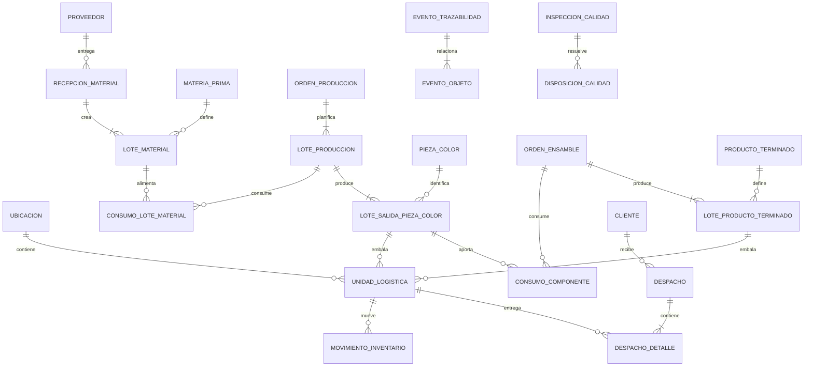

# US-010: Trazabilidad End-to-End del Flujo SCM

## 1. Decisión Ejecutiva

El sistema actual posee una base valiosa de trazabilidad de ejecución: puede relacionar una Orden de Producción con molde, máquina, trabajador, color de producción, Registro Diario y pesajes. También existe un kardex liviano que permite registrar movimientos de bultos mediante QR.

Sin embargo, todavía no existe trazabilidad SCM end-to-end. El sistema no puede responder de manera completa, verificable y bidireccional:

> ¿Qué lotes de materia prima y colorantes fueron consumidos para producir este bulto o producto terminado, por quién, en qué máquina, con qué fórmula y parámetros, qué controles superó, por qué ubicaciones pasó y a qué cliente o despacho fue entregado?

Tampoco puede responder la consulta inversa:

> Si un lote de materia prima resulta no conforme, ¿qué OP, piezas, bultos, productos terminados, ubicaciones y despachos fueron afectados?

La clasificación honesta del sistema, asumiendo US-008 y US-009 implementadas, es:

- **MES / Manufacturing Operations Management parcial:** planificación y ejecución interna razonablemente modeladas.
- **WMS liviano:** seguimiento de mangas o bultos y movimientos, todavía basado en textos y QR posicional.
- **SCM incompleto:** no existen recepción por lote de proveedor, consumo real por lote, armado trazado, despacho con destinatario ni genealogía bidireccional.

Esta US define la arquitectura y el comportamiento mínimo para cerrar la cadena completa. No declara certificación ISO ni convierte por sí sola al sistema en un ERP.

## 2. Historia de Usuario

**Como** responsable de Planta, Calidad, Almacén y Cadena de Suministro  
**Quiero** identificar cada lote, unidad logística y evento crítico desde la recepción de materiales hasta el despacho  
**Para** reconstruir la genealogía completa de cualquier material o producto, contener no conformidades, reconciliar cantidades y demostrar con evidencia quién hizo qué, cuándo, dónde, por qué y con qué insumos.

## 3. Objetivos

1. Lograr trazabilidad hacia atrás desde cualquier bulto o lote de producto hasta los lotes reales de materia prima, colorantes y material de segunda consumidos.
2. Lograr trazabilidad hacia adelante desde cualquier lote de proveedor hasta todas las salidas, existencias, transformaciones y despachos afectados.
3. Identificar inequívocamente lotes, unidades logísticas, ubicaciones, actores, equipos, documentos y eventos.
4. Separar datos planificados de consumos y resultados reales.
5. Mantener un historial append-only de eventos con correcciones auditables.
6. Controlar estado logístico y estado de calidad de forma independiente.
7. Reconciliar el balance de masa de cada transformación.
8. Soportar operación offline idempotente sin duplicar pesajes ni movimientos.
9. Permitir una adopción futura de identificadores GS1 sin depender de ellos para operar internamente.

## 4. Perfil de Estandarización Seleccionado

### 4.1. ISO 9001 como línea base de gestión y evidencia

Se adopta **ISO 9001:2015 con su enmienda 2024** como referencia vigente al 2026-07-12 para el sistema de gestión de calidad. La edición 2015 continúa vigente, aunque ISO informa que se espera una nueva edición en septiembre de 2026.

La implementación debe preparar evidencia para los siguientes temas de la norma:

| Referencia orientativa | Aplicación en el sistema |
|---|---|
| 7.5 Información documentada | Registros íntegros, versionados, legibles y recuperables |
| 8.4 Control de suministros externos | Proveedor, recepción, lote de proveedor, inspección y liberación |
| 8.5.1 Producción controlada | OP, recursos, fórmula, parámetros, ejecución y resultados |
| 8.5.2 Identificación y trazabilidad | IDs únicos, estado y genealogía de materiales y salidas |
| 8.5.4 Preservación | Ubicación, almacenamiento, manipulación y movimiento |
| 8.5.6 Control de cambios | Revisiones, snapshots y eventos de corrección |
| 8.6 Liberación | Evidencia de aprobación antes del uso o despacho |
| 8.7 Salidas no conformes | Cuarentena, bloqueo, disposición, reproceso y descarte |
| 9.1 Seguimiento y medición | Indicadores de completitud, balance y desempeño |
| 10.2 No conformidad y acción correctiva | Investigación de alcance y trazabilidad de afectados |

Estas referencias son una guía de diseño y no sustituyen una copia licenciada de la norma, el análisis de aplicabilidad ni una auditoría de certificación.

### 4.2. ISA-95 / IEC 62264 como arquitectura de manufactura

ISA-95 se usa para distinguir:

- **Nivel 4:** planificación empresarial y logística, incluyendo documentos de compra, venta, recepción y despacho.
- **Nivel 3:** operaciones de manufactura, inventario, calidad y mantenimiento; este es el núcleo del sistema actual.
- **Niveles 0-2:** proceso físico, balanza, máquina, sensores y supervisión.

Mapeo conceptual:

| ISA-95 | Dominio EnvaPerú |
|---|---|
| Material definition | `MateriaPrima`, `Colorante`, `PiezaColor`, `ProductoTerminado` |
| Material lot / sublot | `LoteMaterial`, `LoteProduccion`, `LoteSalida`, `LoteProductoTerminado` |
| Equipment resource | `Maquina`, `Molde`, balanza |
| Personnel resource | `Trabajador`, `RolOperativo` |
| Production request | `OrdenProduccion` y sus lotes planificados |
| Production response/performance | RDP, detalle horario, consumos, salidas y pesajes reales |
| Operations event | `EventoTrazabilidad` |

La integración futura con un ERP debe realizarse mediante contratos y eventos; no mediante acceso directo a tablas del MES.

### 4.3. GS1 Global Traceability Standard

Se adopta el patrón de:

- **Critical Tracking Events (CTE):** eventos críticos como recibir, transformar, pesar, empacar, mover, despachar, devolver o destruir.
- **Key Data Elements (KDE):** datos mínimos que explican quién, qué, dónde, cuándo, por qué y con qué documento ocurrió el evento.
- **One-up, one-down:** conocer al proveedor directo de cada entrada y al receptor directo de cada salida.

### 4.4. GS1 EPCIS 2.0.1 como semántica de eventos

No es obligatorio desplegar inicialmente un repositorio EPCIS completo. El modelo interno debe ser compatible conceptualmente con:

- `ObjectEvent`: observación, creación, movimiento o cambio de estado de un objeto.
- `TransformationEvent`: consumo de lotes de entrada y generación de lotes de salida.
- `AggregationEvent`: agrupación reversible de piezas, cajas, bultos o pallets.
- `TransactionEvent`: relación con compra, pedido, guía o despacho.
- `AssociationEvent`: asociación persistente con una ubicación o activo cuando corresponda.

### 4.5. Identificación GS1 opcional

- `GTIN`: identificación comercial de `ProductoTerminado` cuando corresponda.
- `SSCC`: identificación global de pallet o unidad logística de despacho.
- AI `(10)`: lote o batch.
- AI `(21)`: serial individual.
- AI `(00)`: SSCC.

EnvaPerú puede iniciar con IDs internos globalmente únicos. No debe generar identificadores GS1 ficticios sin prefijo empresarial asignado.

### 4.6. Estándares no seleccionados como base

- **ISO 22005:** no se adopta porque está orientada a trazabilidad de alimentos y piensos.
- **ISO 28000:** puede evaluarse posteriormente para seguridad de la cadena, pero no resuelve por sí sola la genealogía productiva.
- **ISO 14001:** es complementaria para desempeño ambiental y residuos, no el estándar principal de tracking de esta US.

## 5. Evaluación Actual del Flujo

| Área | Evidencia actual | Evaluación | Brecha principal |
|---|---|---|---|
| Datos maestros | Moldes, piezas, colores, máquinas y trabajadores normalizados | Fuerte | Faltan proveedores, clientes, ubicaciones y unidades de medida controladas |
| Planificación | OP, snapshot de molde, lotes por color, recetas y metas | Fuerte | El lote no tiene identidad, secuencia, revisión ni estado suficientemente controlados |
| Ejecución horaria | RDP, máquina, trabajador, coladas y parámetros | Parcial | El detalle usa color texto y no identifica siempre el lote ejecutado ni cada salida física |
| Materiales | `MateriaPrima`, `Colorante`, `SeCompone`, `SeColorea` | Débil | Son definiciones y cantidades planificadas; no existen lotes recibidos ni consumos reales |
| Salidas de producción | `PiezaColor` y diseño de `LoteSalidaPiezaColor` | Débil | La entidad de salida no está implementada en el código actual |
| Pesaje | Pesaje offline y `ControlPeso` central | Parcial | No hay FK central a la salida, tara, cantidad, UUID global ni idempotencia completa |
| Inventario | `InventarioManga` y `MovimientoKardex` append-only | Parcial | Bulto identificado por ID local, ubicaciones texto y contenido cacheado sin genealogía |
| Calidad | Peso como verificación | Ausente como sistema | No hay inspección, cuarentena, liberación, bloqueo ni disposición no conforme |
| Material de segunda | Catálogo `tipo=SEGUNDA` o `MOLIDO` | Débil | No se genera un lote de material recuperado ni se enlaza al lote de origen |
| Armado | Operación `SAL-ARMAR` en kardex | Ausente como transformación | Consume el bulto completo sin crear lote de producto ni registrar componentes usados |
| Despacho | Estado `DESPACHADO` y locación `CLIENTE_FINAL` | Débil | No existen cliente, documento, líneas, cantidades, receptor ni unidad logística de envío |
| Auditoría | Historial de estado OP y movimientos kardex | Parcial | No hay envelope común, correcciones por reversa, usuario normalizado ni integridad transversal |
| Consulta de genealogía | Consultas por OP y manga | Ausente | No existe recorrido backward/forward ni simulación de retiro |

## 6. Lagunas Lógicas Verificadas en el Código Actual

### 6.1. La receta no demuestra el consumo

`SeCompone` y `SeColorea` indican qué material y cuánto se planeó utilizar, pero no qué lote físico fue abierto, pesado y consumido.

Una receta responde “qué debería usarse”. La trazabilidad exige responder “qué lote se usó realmente y cuánto”.

### 6.2. MateriaPrima y Colorante no tienen lotes

Los modelos actuales solo contienen definición, nombre y tipo. Faltan:

- proveedor;
- lote del proveedor;
- lote interno;
- fecha y documento de recepción;
- cantidad recibida y disponible;
- unidad de medida;
- estado de calidad;
- ubicación;
- certificado o evidencia asociada.

### 6.3. LoteColor es una corrida planificada, no un lote trazable completo

`LoteColor` posee OP, `ColorProduccion` y meta, pero no dispone de:

- código de lote estable;
- secuencia dentro de la OP;
- estado de ejecución;
- fecha real de inicio y fin;
- revisión de fórmula;
- consumos reales;
- relación completa con sus resultados físicos.

Se recomienda evolucionar conceptualmente `LoteColor` a `LoteProduccion`. El nombre físico de la tabla puede conservarse temporalmente durante la migración.

### 6.4. LoteSalidaPiezaColor está documentado, pero no implementado

US-007 definió correctamente la entidad que conecta lote, pieza snapshot y SKU físico. El modelo no está presente en `backend/app/models`.

Sin esta entidad, los pesajes y el kardex conocen textos como OP, color o pieza, pero no la salida exacta que originó el material.

### 6.5. ControlPeso continúa siendo ambiguo

El modelo central se vincula al RDP y opcionalmente al color, pero no al bulto ni a `LoteSalidaPiezaColor`. Tampoco distingue:

- peso bruto;
- tara;
- peso neto;
- cantidad de piezas;
- balanza utilizada;
- origen offline globalmente único;
- estado de verificación.

### 6.6. La sincronización offline no es idempotente de extremo a extremo

El módulo local posee un ID entero y el servidor central no conserva ese identificador como clave única de origen. Reintentos o dos dispositivos pueden generar duplicados o colisiones.

Cada evento offline debe tener un UUID/ULID y una restricción `UNIQUE(source_system, source_event_id)` en el servidor.

### 6.7. El QR actual es posicional y frágil

El QR del sticker concatena campos separados por comas. Agregar, omitir o reordenar una posición cambia su significado. Además, no incluye de forma efectiva el `lote_salida_pieza_color_id` aunque el modelo offline ya contiene la columna.

El QR debe identificar una entidad estable y versionada, no convertirse en la base de datos completa.

### 6.8. InventarioManga mezcla identidad, snapshot y stock

`InventarioManga` utiliza `pesaje_id` como identidad, almacena OP, molde, color, peso y pieza como textos cacheados, y usa `locacion_actual` como string.

Debe evolucionar a una `UnidadLogistica` identificada globalmente y vinculada a una salida o lote. Su estado y ubicación actuales serán una proyección del historial, no la única evidencia.

### 6.9. Las ubicaciones no son datos maestros

Valores como `ALMACEN_PRINCIPAL`, `TRANSITO`, `ZONA_ARMADO` o `CLIENTE_FINAL` son strings sin FK ni jerarquía. No puede validarse origen, destino, tipo de ubicación o capacidad.

### 6.10. Estado logístico y estado de calidad están mezclados

`EN_INVENTARIO`, `TRANSITO`, `CONSUMIDO`, `MERMA` y `DESPACHADO` mezclan ubicación, disponibilidad, calidad y disposición.

Un objeto puede estar físicamente en almacén y simultáneamente en cuarentena. Esos estados deben ser independientes.

### 6.11. SAL-ARMAR no registra el producto creado

La operación marca una manga como consumida, pero no registra:

- orden de ensamble;
- cantidades parciales consumidas;
- lotes de componentes;
- versión o snapshot de BOM;
- lote de producto terminado resultante;
- paquetes, cajas o pallets creados.

### 6.12. Un bulto puede consumirse parcialmente

El kardex actual cambia el estado del bulto completo. Armado, reproceso o transferencia pueden consumir solo parte del peso o de las piezas.

Se requieren eventos de consumo parcial, división y consolidación con saldo controlado.

### 6.13. Despacho no identifica al receptor

`SAL-DESPACHO` cambia el estado y usa una locación genérica, pero no registra cliente, pedido, guía, vehículo, transportista, líneas ni cantidades entregadas.

### 6.14. Todo el ramal se trata como merma

En plásticos, ramal y rechazo pueden molerse y regresar como materia prima de segunda. Deben separarse:

- ramal generado;
- ramal recuperado;
- rechazo recuperable;
- material molido producido;
- merma irreversible;
- destrucción o disposición externa.

Cuando el material se recupera, debe crear un nuevo `LoteMaterial` con relación genealógica al lote de producción que lo originó.

### 6.15. No existe simulación de alcance

No hay una consulta que, partiendo de un lote de entrada o no conformidad, determine inventario, WIP, productos y despachos afectados.

## 7. Principios e Invariantes de Trazabilidad

1. Toda entidad trazable tiene un identificador inmutable y globalmente único dentro de su namespace.
2. Los nombres, códigos visuales y QR no sustituyen FKs o IDs estables.
3. Todo evento registra como mínimo: quién, qué, dónde, cuándo, por qué, acción, estado y documento relacionado.
4. `event_time` y `record_time` son diferentes y se almacenan en UTC; se conserva el offset local del evento.
5. Los eventos confirmados no se editan ni eliminan. Se corrigen mediante reversa, anulación o evento compensatorio.
6. Todo evento offline es idempotente por sistema y UUID de origen.
7. Los snapshots preservan legibilidad histórica, pero nunca reemplazan la relación normalizada.
8. Receta planificada, consumo reservado y consumo real son conceptos diferentes.
9. Un material no puede consumirse si su estado de calidad no permite uso.
10. Estado logístico y estado de calidad son ortogonales.
11. Todo movimiento tiene origen y destino válidos, salvo creación o destrucción documentada.
12. Toda transformación relaciona entradas reales con salidas reales.
13. Toda agregación mantiene la relación padre-hijo y permite desagregación cuando el proceso sea reversible.
14. Ningún despacho se registra sin receptor y documento o motivo autorizado.
15. El stock no se modifica directamente; cambia mediante eventos o movimientos válidos.
16. El saldo disponible no puede ser negativo.
17. Los registros legacy no conciliables se marcan como tales; no se inventa genealogía inexistente.
18. Debe poder ejecutarse trazabilidad un paso atrás y un paso adelante para todo lote liberado o despachado.

## 8. Modelo de Dominio Objetivo



### 8.1. Datos maestros nuevos o ampliados

- `Proveedor`.
- `Cliente`.
- `Ubicacion` con jerarquía planta/zona/almacén/posición.
- `UnidadMedida` y reglas de conversión aprobadas.
- `TipoUnidadLogistica`: BOLSA, JABA, BULTO, CAJA, PALLET.
- `MotivoMovimiento`.
- `MotivoNoConformidad`.
- `DisposicionCalidad`.
- `Balanza` como equipo identificado y, cuando aplique, con estado de calibración.

Si un ERP será dueño de proveedor, cliente, compra o venta, el MES almacenará el ID externo, namespace, versión y snapshot necesarios para trazabilidad.

### 8.2. RecepcionMaterial

Cabecera del evento de recepción:

- proveedor;
- documento de compra o guía;
- fecha/hora efectiva;
- responsable;
- ubicación de recepción;
- estado;
- evidencias adjuntas.

### 8.3. LoteMaterial

Representa un lote físico de materia prima, colorante, aditivo o material de segunda:

- `id` UUID/ULID;
- código interno único;
- definición de material;
- lote de proveedor;
- proveedor y recepción de origen;
- cantidad recibida, disponible y unidad;
- fecha de recepción y fabricación si se conoce;
- estado de calidad;
- ubicación;
- certificado/documento opcional;
- lote padre cuando proviene de molienda, mezcla o reproceso.

### 8.4. LoteProduccion

Evolución de `LoteColor`:

- código único y secuencia en la OP;
- `color_produccion_id`;
- fórmula y revisión snapshot;
- meta planificada;
- inicio y fin reales;
- estado: PLANIFICADO, LIBERADO, EN_EJECUCION, PAUSADO, COMPLETADO, CANCELADO;
- máquina y molde snapshots;
- responsable de liberación.

`producto_sku_output` deja de ser fuente de verdad de la salida.

### 8.5. ConsumoLoteMaterial

Registra consumo real:

- lote de producción;
- lote material;
- cantidad reservada;
- cantidad pesada/emitida;
- cantidad realmente consumida;
- devolución;
- unidad;
- evento, trabajador, balanza y timestamp;
- motivo de ajuste.

Se aplica tanto a resina como a colorantes, aditivos y material de segunda.

### 8.6. LoteSalidaPiezaColor

Implementa la entidad definida en US-007, actualizada a `ColorProduccion`:

- lote de producción;
- pieza abstracta snapshot;
- `PiezaColor` física;
- cantidad y kg objetivo;
- cantidad buena, rechazada y reprocesable real;
- kg buenos reales;
- estado de calidad;
- código de lote de salida.

### 8.7. UnidadLogistica

Generaliza `InventarioManga`:

- `id` UUID/ULID interno;
- tipo de unidad;
- contenido: lote de salida, lote material o lote de producto terminado;
- SKU/definición derivada;
- cantidad de unidades;
- peso bruto, tara y neto;
- ubicación actual proyectada;
- estado logístico proyectado;
- estado de calidad proyectado;
- unidad padre opcional para caja/pallet;
- etiqueta y versión de payload.

Una unidad contiene un solo lote y SKU, salvo una agregación explícita que registre cada hijo.

### 8.8. MovimientoInventario

Evoluciona `MovimientoKardex`:

- evento append-only;
- unidad o lote;
- cantidad movida;
- origen y destino FKs;
- trabajador;
- fecha efectiva y fecha de registro;
- motivo controlado;
- documento relacionado;
- source system/source event ID;
- reversa o evento corregido cuando corresponda.

### 8.9. Calidad

Se separan:

**Estado de calidad:** PENDIENTE, CUARENTENA, LIBERADO, BLOQUEADO, RECHAZADO, LIBERACION_CONDICIONAL.

**Estado logístico:** DISPONIBLE, RESERVADO, EN_TRANSITO, CONSUMIDO, DESPACHADO, DESTRUIDO.

`InspeccionCalidad` registra resultado, especificación o criterio, responsable, fecha y evidencia. `DisposicionNoConforme` registra retrabajo, molienda, devolución, uso condicionado, donación o destrucción.

### 8.10. OrdenEnsamble y LoteProductoTerminado

La orden de ensamble:

- congela la revisión de BOM;
- reserva y consume lotes o unidades de `PiezaColor`;
- soporta consumos parciales;
- registra trabajador, ubicación, fecha y cantidades;
- produce uno o más lotes de `ProductoTerminado`;
- genera unidades logísticas de producto terminado;
- conserva la relación entre cada lote de producto y sus lotes componentes.

### 8.11. Despacho

- cliente/receptor;
- pedido o documento externo;
- guía o referencia de transporte;
- fecha efectiva;
- trabajador responsable;
- origen;
- unidades logísticas y cantidades;
- transportista/vehículo opcionales;
- evidencia y estado.

### 8.12. EventoTrazabilidad y EventoObjeto

Se adopta un modelo híbrido:

- Las tablas de negocio mantienen constraints e integridad relacional.
- `EventoTrazabilidad` registra el envelope común append-only.
- `EventoObjeto` relaciona el evento con objetos en roles INPUT, OUTPUT, PARENT, CHILD, OBSERVED o AFFECTED.

Campos mínimos del evento:

- UUID/ULID;
- tipo de evento y versión;
- `event_time` UTC y offset;
- `record_time` UTC;
- trabajador/usuario;
- ubicación;
- paso de negocio;
- disposición resultante;
- sistema y evento de origen;
- correlation/transformation ID;
- documento y motivo;
- payload snapshot versionado;
- referencia al evento corregido o anulado.

No se debe reemplazar todo el modelo relacional por un JSON genérico.

## 9. Critical Tracking Events y KDE Obligatorios

| CTE | Qué se rastrea | KDE mínimos |
|---|---|---|
| RECEPCION | Lote de materia prima/colorante | proveedor, material, lote proveedor, cantidad, UOM, documento, trabajador, ubicación, fecha/offset |
| INSPECCION | Lote o salida | objeto, criterio, resultado, estado anterior/nuevo, responsable, evidencia, fecha |
| UBICACION | Lote/unidad | objeto, origen, destino, cantidad, trabajador, fecha, motivo |
| RESERVA | Lote material o unidad | objeto, cantidad, OP/orden ensamble, responsable, fecha |
| EMISION_CONSUMO | Lote material | lote entrada, lote producción, cantidad, balanza, trabajador, fecha |
| TRANSFORMACION_PRODUCCION | Entradas y salidas | lotes input, cantidades, lote producción, salidas, máquina, molde, fórmula, trabajadores, tiempo |
| PESAJE_EMBALAJE | Unidad logística | salida, peso bruto/tara/neto, cantidad, balanza, trabajador, ubicación, fecha |
| AGREGACION | Caja/pallet/paquete | padre, hijos, acción ADD/DELETE, ubicación, trabajador, fecha |
| ENSAMBLE | Componentes y PT | lotes componente, cantidades, BOM revisión, lote PT, responsable, ubicación, fecha |
| DESPACHO | Unidades/lotes | cliente, documento, unidades, cantidades, origen, transportista, fecha |
| DEVOLUCION | Unidad/lote devuelto | remitente, motivo, documento, estado calidad, ubicación, fecha |
| MOLIENDA_REPROCESO | Rechazo/ramal y material segunda | inputs, cantidades, lote material output, máquina/proceso, responsable, fecha |
| MERMA_DESTRUCCION | Material eliminado | objeto, cantidad, causa, autorización, método, evidencia, fecha |
| CORRECCION | Evento previo | evento corregido, motivo, autorizador, valores compensatorios, fecha |

## 10. Flujo End-to-End Objetivo

### 10.1. Recepción y liberación de materiales

1. Registrar proveedor y documento.
2. Crear recepción.
3. Crear un `LoteMaterial` por lote físico recibido.
4. Etiquetar cada unidad o lote.
5. Ingresar en CUARENTENA por defecto cuando se requiera inspección.
6. Registrar inspección y liberar, bloquear o rechazar.
7. Mover a ubicación de almacén mediante evento.

### 10.2. Planificación y reserva

1. Crear OP y `LoteProduccion`.
2. Congelar molde, piezas, fórmula/revisión, máquina prevista y BOM de salida.
3. Calcular materiales planificados.
4. Reservar lotes disponibles bajo FIFO/FEFO o selección autorizada.
5. Impedir reserva de lotes bloqueados o sin saldo.

### 10.3. Preparación y consumo real

1. Escanear lote de material.
2. Pesar cantidad emitida.
3. Registrar trabajador, balanza y lote de producción destino.
4. Confirmar consumo o devolución de sobrante.
5. Mantener diferencia entre planificado, emitido, consumido y devuelto.

### 10.4. Transformación por inyección o soplado

1. Iniciar lote de producción.
2. Registrar máquina, molde, trabajadores y parámetros efectivos.
3. Enlazar detalles horarios con `lote_produccion_id`.
4. Calcular y registrar salidas por cada `LoteSalidaPiezaColor`.
5. Registrar buenos, rechazados, ramal, reproceso y pérdida real por separado.
6. Cerrar el lote solo si el balance está conciliado o existe desviación autorizada.

### 10.5. Pesaje y creación de unidad logística

1. Seleccionar o escanear la salida exacta.
2. Capturar tara y peso bruto desde balanza.
3. Calcular peso neto.
4. Registrar cantidad de piezas cuando aplique.
5. Crear `UnidadLogistica` con UUID.
6. Imprimir etiqueta versionada.
7. Sincronizar de forma idempotente.
8. Ingresar la unidad a ubicación y estado de calidad válidos.

### 10.6. Inventario interno

1. Escanear unidad en origen.
2. Registrar salida a tránsito.
3. Registrar recepción en destino.
4. Validar que la unidad no esté consumida, bloqueada o despachada.
5. Permitir división o consolidación explícita conservando genealogía.

### 10.7. Molienda y material de segunda

1. Seleccionar unidades o lotes de ramal/rechazo recuperable.
2. Registrar transformación de molienda.
3. Consumir cantidades de entrada.
4. Crear `LoteMaterial` de segunda como salida.
5. Registrar pérdida irreversible del proceso.
6. Someter el lote recuperado al estado de calidad definido.

### 10.8. Armado de ProductoTerminado

1. Crear Orden de Ensamble y congelar BOM.
2. Reservar lotes/unidades de cada `PiezaColor` requerida.
3. Consumir cantidades reales, incluso parciales.
4. Crear lote de `ProductoTerminado`.
5. Empacar en unidades logísticas.
6. Registrar agregaciones caja/pallet cuando correspondan.
7. Liberar producto terminado antes de despacho.

### 10.9. Despacho

1. Crear despacho con cliente y documento.
2. Reservar unidades liberadas.
3. Escanear y verificar contenido.
4. Registrar salida, responsable, vehículo/transportista y fecha.
5. Mantener consulta un paso adelante hasta el receptor directo.

### 10.10. Devolución, no conformidad y retiro

1. Registrar devolución o no conformidad.
2. Bloquear objetos afectados sin cambiar su ubicación necesariamente.
3. Ejecutar consulta de genealogía backward y forward.
4. Identificar WIP, stock, consumo, clientes y despachos afectados.
5. Registrar disposición y acciones correctivas.

## 11. Balance de Masa para Plásticos

Para cada `LoteProduccion` se debe reconciliar:

```text
input_real_kg + wip_entrada_kg =
    salida_buena_neta_kg
  + rechazo_recuperable_kg
  + ramal_recuperable_kg
  + merma_irreversible_kg
  + wip_salida_kg
  + diferencia_no_explicada_kg
```

Reglas:

- El peso de bulto usado para inventario es neto, no bruto.
- La tara se conserva como evidencia.
- Ramal recuperado y rechazo molido no son merma irreversible.
- Todo material de segunda producido se convierte en lote de salida de una transformación.
- La tolerancia de balance se configura por proceso o familia de máquina.
- Una diferencia fuera de tolerancia requiere motivo y aprobación.

## 12. Identificación y Etiquetado

### 12.1. IDs internos

- `LoteMaterial`: UUID/ULID + código legible.
- `LoteProduccion`: UUID/ULID + código OP/secuencia.
- `LoteSalidaPiezaColor`: UUID/ULID + código de lote de salida.
- `LoteProductoTerminado`: UUID/ULID + código legible.
- `UnidadLogistica`: UUID/ULID.
- `EventoTrazabilidad`: UUID/ULID.

### 12.2. Payload QR

Se reemplaza el formato posicional por uno de estos contratos versionados:

- URI interna: `https://sistema.envaperu.pe/t/<trace_id>`; o
- JSON compacto firmado/versionado cuando deba funcionar totalmente offline.

El payload mínimo incluye versión, tipo de objeto, ID y checksum o firma. Los datos descriptivos se consultan o cachean; no son la identidad.

### 12.3. GS1

Cuando la organización disponga de prefijo GS1:

- usar GTIN existente del ProductoTerminado;
- usar lote con AI `(10)`;
- usar SSCC AI `(00)` para pallets/unidades logísticas externas;
- mantener mapeo entre ID interno y clave GS1.

## 13. APIs Requeridas

### 13.1. Recepción y lotes

- `POST /api/scm/recepciones`.
- `POST /api/scm/recepciones/<id>/lotes`.
- `GET /api/scm/lotes-material`.
- `GET /api/scm/lotes-material/<id>`.
- `POST /api/scm/lotes-material/<id>/inspecciones`.
- `PATCH /api/scm/lotes-material/<id>/estado-calidad`.

### 13.2. Producción y consumo

- `POST /api/produccion/lotes/<id>/reservas-material`.
- `POST /api/produccion/lotes/<id>/consumos`.
- `POST /api/produccion/lotes/<id>/devoluciones-material`.
- `POST /api/produccion/lotes/<id>/iniciar`.
- `POST /api/produccion/lotes/<id>/cerrar`.
- `GET /api/produccion/lotes/<id>/balance`.

### 13.3. Salidas, pesaje e inventario

- `GET /api/produccion/lotes/<id>/salidas`.
- `POST /api/pesajes` con `source_system` y `source_event_id`.
- `POST /api/inventario/unidades`.
- `POST /api/inventario/movimientos`.
- `POST /api/inventario/unidades/<id>/dividir`.
- `POST /api/inventario/unidades/consolidar`.
- `GET /api/inventario/unidades/<id>`.

### 13.4. Armado y despacho

- `POST /api/scm/ordenes-ensamble`.
- `POST /api/scm/ordenes-ensamble/<id>/consumos`.
- `POST /api/scm/ordenes-ensamble/<id>/completar`.
- `POST /api/scm/despachos`.
- `POST /api/scm/despachos/<id>/unidades`.
- `POST /api/scm/despachos/<id>/confirmar`.

### 13.5. Trazabilidad

- `GET /api/trazabilidad/objetos/<tipo>/<id>`.
- `GET /api/trazabilidad/lotes/<tipo>/<id>/hacia-atras`.
- `GET /api/trazabilidad/lotes/<tipo>/<id>/hacia-adelante`.
- `GET /api/trazabilidad/eventos?objeto=...`.
- `POST /api/trazabilidad/simulaciones-retiro`.
- `POST /api/trazabilidad/eventos/<id>/corregir`.

## 14. Vistas Requeridas

### 14.1. Recepciones y lotes de material

- recepción por proveedor/documento;
- lotes y unidades recibidas;
- estado de calidad;
- saldo y ubicación;
- certificados/evidencia;
- historial de movimientos y consumos.

### 14.2. Preparación de materiales

- plan de receta vs. lotes reservados;
- escaneo y pesaje de consumos;
- devolución de sobrantes;
- alerta de lote bloqueado, equivocado o insuficiente.

### 14.3. Ejecución del lote

- lote de producción activo;
- entradas reales;
- salidas por `PiezaColor`;
- buenos, rechazo, ramal y pérdida;
- balance de masa y desviaciones.

### 14.4. Inventario

- unidades por ubicación, SKU, lote, calidad y estado logístico;
- movimientos pendientes en tránsito;
- división, consolidación y agregación;
- bloqueo de unidades afectadas.

### 14.5. Armado

- BOM snapshot;
- disponibilidad por lote de componente;
- consumos reales;
- lote de producto terminado creado;
- paquetes y pallets resultantes.

### 14.6. Despacho

- cliente/documento;
- picking por lote/unidad;
- validación de calidad;
- confirmación y evidencia.

### 14.7. Explorador de trazabilidad

Debe mostrar:

- resumen del objeto;
- timeline de eventos;
- grafo de genealogía de entradas y salidas;
- ubicación y estado actuales;
- OP, máquina, molde, trabajadores, fórmula y calidad;
- proveedor hacia atrás;
- despacho y receptor hacia adelante;
- huecos o eventos no conciliados.

## 15. Consultas Obligatorias

1. Dado un QR de bulto, mostrar su lote de salida, OP, RDP, pesaje, trabajadores, máquina, molde, materiales consumidos y movimientos.
2. Dado un lote de materia prima, mostrar saldo, consumos, lotes de producción, salidas, unidades, productos y despachos afectados.
3. Dado un lote de producto terminado, mostrar todos los lotes de `PiezaColor` que lo componen.
4. Dado un cliente o despacho, mostrar lotes y unidades enviados.
5. Dada una OP, reconciliar plan, consumo, salidas, WIP, rechazo y merma.
6. Dada una no conformidad, producir una lista bloqueable de objetos afectados.
7. Dado un evento offline, demostrar si fue aplicado, rechazado, duplicado o corregido.

## 16. Criterios de Aceptación BDD

### Escenario 1: Recepción de lote de proveedor

**Dado** un proveedor, material y documento válidos  
**Cuando** almacén recibe dos lotes físicos  
**Entonces** el sistema crea dos `LoteMaterial` distintos  
**Y** conserva lote del proveedor, cantidad, ubicación, responsable y fecha  
**Y** cada lote inicia con el estado de calidad configurado.

### Escenario 2: Material bloqueado no puede consumirse

**Dado** un lote en CUARENTENA o BLOQUEADO  
**Cuando** se intenta emitirlo a una OP  
**Entonces** la UI y API rechazan el consumo  
**Y** registran el intento con su motivo.

### Escenario 3: Consumo real diferente al plan

**Dado** que la receta planifica 100 kg de resina  
**Cuando** se pesan 102 kg de dos lotes distintos y se devuelven 2 kg  
**Entonces** el consumo real neto es 100 kg  
**Y** se conserva la contribución exacta de cada lote.

### Escenario 4: Transformación crea salidas por pieza

**Dado** un molde con cuerpo y tapa y un `LoteProduccion` ROJO SÓLIDO  
**Cuando** se inicia la ejecución  
**Entonces** existen salidas distintas para Cuerpo Rojo Sólido y Tapa Roja Sólida  
**Y** ambas comparten el lote de producción e inputs reales.

### Escenario 5: Detalle horario identifica lote

**Dado** un RDP con cambio de color durante el turno  
**Cuando** se registran las horas  
**Entonces** cada fila referencia el `LoteProduccion` ejecutado  
**Y** no depende del color escrito como texto libre.

### Escenario 6: Pesaje crea unidad logística idempotente

**Dado** un pesaje offline con UUID `E1`  
**Cuando** el dispositivo lo sincroniza dos veces  
**Entonces** se crea un solo pesaje y una sola unidad logística  
**Y** ambos intentos retornan el mismo resultado central.

### Escenario 7: Peso neto controlado

**Dado** un bulto con peso bruto y tara  
**Cuando** se confirma el pesaje  
**Entonces** el inventario utiliza el peso neto  
**Y** conserva bruto, tara, balanza y operador como evidencia.

### Escenario 8: Movimiento en dos pasos

**Dado** una unidad disponible en ubicación A  
**Cuando** se despacha internamente hacia B  
**Entonces** queda EN_TRANSITO hasta que B la recibe  
**Y** el historial conserva ambos eventos y responsables.

### Escenario 9: Consumo parcial de bulto

**Dado** un bulto con 500 piezas  
**Cuando** armado consume 300  
**Entonces** quedan 200 disponibles en la unidad o subunidad resultante  
**Y** la genealogía vincula la cantidad consumida con la Orden de Ensamble.

### Escenario 10: Armado produce lote de ProductoTerminado

**Dado** una BOM con cuerpo y tapa  
**Cuando** se consumen lotes liberados de ambos componentes  
**Entonces** se crea un `LoteProductoTerminado`  
**Y** puede trazarse hacia cada lote componente y sus materiales de origen.

### Escenario 11: Molienda genera material de segunda

**Dado** ramal y rechazo recuperables  
**Cuando** se ejecuta molienda  
**Entonces** se consumen las entradas  
**Y** se crea un nuevo `LoteMaterial` de segunda  
**Y** la pérdida irreversible queda separada.

### Escenario 12: Balance de masa fuera de tolerancia

**Dado** un lote cerrado con diferencia no explicada mayor a la tolerancia  
**Cuando** el supervisor intenta completarlo  
**Entonces** el sistema exige motivo y aprobación  
**Y** conserva la desviación como evidencia.

### Escenario 13: Calidad y ubicación independientes

**Dado** una unidad ubicada en almacén  
**Cuando** Calidad la bloquea  
**Entonces** su ubicación no cambia  
**Y** no puede reservarse, consumirse ni despacharse.

### Escenario 14: Despacho trazado

**Dado** unidades liberadas y un despacho abierto  
**Cuando** se confirma la salida  
**Entonces** se registran cliente, documento, unidades, cantidades, origen, responsable y fecha  
**Y** cada unidad queda enlazada al receptor directo.

### Escenario 15: Trazabilidad hacia atrás

**Dado** el QR de un producto o bulto  
**Cuando** se consulta su genealogía  
**Entonces** se muestran todas las transformaciones y lotes de entrada hasta proveedor  
**Y** se señalan explícitamente los eslabones legacy no conciliados.

### Escenario 16: Trazabilidad hacia adelante

**Dado** un lote de resina bloqueado  
**Cuando** se consulta su impacto  
**Entonces** se listan consumos, lotes de producción, piezas, unidades, productos terminados y despachos relacionados.

### Escenario 17: Corrección sin borrar historia

**Dado** un movimiento registrado con destino equivocado  
**Cuando** un usuario autorizado lo corrige  
**Entonces** el evento original permanece  
**Y** se registra reversa/corrección con motivo, autor y timestamp.

### Escenario 18: Simulación de retiro

**Dado** un lote de entrada seleccionado  
**Cuando** Calidad ejecuta una simulación de retiro  
**Entonces** el sistema genera alcance por estado, ubicación y destinatario  
**Y** mide tiempo de respuesta y completitud de la genealogía.

## 17. Migración de Datos Existentes

1. Crear namespaces e IDs globales para objetos y eventos.
2. Crear catálogo de ubicaciones y mapear strings actuales.
3. Convertir `InventarioManga` en unidades logísticas o mantenerlo como vista de compatibilidad.
4. Preservar íntegramente `qr_data_original` y snapshots.
5. Crear `LoteProduccion` desde lotes actuales de OP.
6. Crear `LoteSalidaPiezaColor` donde OP, snapshot y `ColorProduccion` permitan una resolución inequívoca.
7. Enlazar pesajes que contengan una salida válida.
8. Asignar `source_system` y `source_event_id` a registros offline migrables.
9. Importar movimientos kardex como eventos históricos sin reescribir timestamps.
10. Marcar como `LEGACY_NO_CONCILIADO` cualquier registro que no permita inferencia segura.
11. No inventar lotes de proveedor ni consumos reales para datos que nunca fueron capturados.
12. Mantener reportes de reconciliación antes de retirar columnas legacy.

## 18. Indicadores de Control

- `% lotes de entrada con proveedor y documento`.
- `% consumos reales asociados a un lote físico`.
- Porcentaje de salidas vinculadas a `LoteSalidaPiezaColor`.
- `% pesajes con unidad logística y UUID de origen`.
- `% eventos con quién/qué/dónde/cuándo/por qué completos`.
- `% lotes con balance de masa dentro de tolerancia`.
- `% unidades con ubicación y estado de calidad válidos`.
- `eventos offline duplicados evitados`.
- `registros legacy no conciliados`.
- `tiempo de trazabilidad hacia atrás`.
- `tiempo de trazabilidad hacia adelante`.
- `tiempo y cobertura de simulación de retiro`.

## 19. Estrategia de Implementación

Esta historia es una épica. Debe dividirse en cortes verticales que entreguen trazabilidad utilizable de extremo a extremo:

| Fase | Alcance | Dependencia |
|---|---|---|
| US-010A | IDs globales, ubicaciones y envelope de eventos | US-009 |
| US-010B | Proveedores, recepciones, lotes de material y calidad | US-010A |
| US-010C | Consumos reales, `LoteProduccion`, salidas y balance de masa | US-007/008, US-010B |
| US-010D | Pesaje idempotente, unidad logística y kardex normalizado | US-010A/C |
| US-010E | Molienda, reproceso y material de segunda | US-010B/C/D |
| US-010F | Orden de ensamble y lote de ProductoTerminado | US-010C/D |
| US-010G | Despacho, devolución, explorador y simulación de retiro | US-010D/F |

Ninguna fase debe crear un identificador o evento incompatible con el modelo común.

## 20. Pruebas Requeridas

- Unicidad e inmutabilidad de identificadores.
- Idempotencia por dispositivo/evento offline.
- Transiciones válidas de estado logístico y calidad.
- Prohibición de stock negativo.
- Reserva y consumo parcial.
- Conversión y exactitud de unidades de medida.
- Trazabilidad de lotes mezclados en una misma producción.
- Trazabilidad de un lote de entrada usado en varias OP.
- Balance de masa dentro y fuera de tolerancia.
- Creación de material de segunda con genealogía.
- Agregación, desagregación, división y consolidación.
- Armado con componentes de múltiples lotes.
- Despacho con cliente y documento.
- Consulta backward y forward.
- Corrección mediante eventos compensatorios.
- Concurrencia de movimientos y reservas.
- Reintentos offline y orden de llegada tardío.
- Migración y visibilidad de registros legacy no conciliados.
- Simulación de retiro con dataset conocido.

## 21. Impacto en el Sistema

### Backend central

- nuevos modelos SCM, calidad, eventos y ubicaciones;
- evolución de `LoteColor`, `ControlPeso`, kardex y sincronización;
- implementación de `LoteSalidaPiezaColor`;
- RDP vinculado al lote de producción;
- servicios de balance y genealogía;
- revisión de QR, impresión y APIs.

### Frontend central

- recepción y lotes;
- preparación y consumo de materiales;
- ejecución y balance;
- inventario por unidad/lote;
- calidad y bloqueos;
- armado y despacho;
- explorador gráfico de trazabilidad.

### Módulo de pesaje

- UUID por evento y dispositivo;
- selección de salida exacta;
- tara/bruto/neto y cantidad;
- payload QR versionado;
- cola offline idempotente;
- caché de lotes, salidas, ubicaciones, trabajadores y balanzas.

### Vault

- actualizar todos los documentos de `01_Dominio`;
- crear documentos para lotes, unidades, movimientos, calidad, ensamble, despacho y eventos;
- sustituir definiciones legacy de color, pesaje y kardex;
- registrar una ADR del perfil ISO 9001 + ISA-95 + GS1.

## 22. Fuera de Alcance

- Contabilidad, facturación y cuentas por pagar/cobrar.
- MRP completo y optimización automática de compras.
- Pronóstico de demanda.
- Gestión de transporte y ruteo.
- Evaluación comercial de proveedores.
- Laboratorio LIMS completo.
- Mantenimiento preventivo de máquinas.
- Certificación ISO automática o declaración de conformidad sin auditoría.
- Integración EPCIS externa obligatoria en la primera fase.

## 23. Definición de Terminado

La épica se considera terminada cuando:

1. Todo lote nuevo de material se recibe con proveedor, documento, cantidad, estado y ubicación.
2. Todo consumo de producción referencia lotes reales y cantidades efectivas.
3. Toda corrida produce uno o más `LoteSalidaPiezaColor` identificados.
4. Todo pesaje nuevo crea o referencia una unidad logística de forma idempotente.
5. Todo movimiento utiliza ubicaciones y actores normalizados.
6. Calidad puede liberar, bloquear y disponer lotes o unidades sin destruir su historial.
7. Ramal y rechazo recuperados generan lotes trazables de material de segunda.
8. El armado relaciona componentes consumidos con el lote de producto creado.
9. Todo despacho identifica receptor, documento, unidades y cantidades.
10. Las consultas backward y forward recorren recepción, producción, inventario, armado y despacho.
11. Las correcciones se realizan mediante eventos auditables, no edición destructiva.
12. La simulación de retiro identifica el alcance conocido y señala los huecos legacy.
13. Los indicadores de completitud y balance están disponibles.
14. La documentación y pruebas reflejan el flujo real implementado.

## 24. Fuentes Normativas Oficiales

- [ISO 9001:2015 - Quality management systems — Requirements](https://www.iso.org/standard/62085.html).
- [ISO 9001 explained](https://www.iso.org/home/insights-news/resources/iso-9001-explained.html).
- [ISA-95 / IEC 62264 Enterprise-Control System Integration](https://www.isa.org/standards-and-publications/isa-standards/isa-95-standard).
- [GS1 Traceability](https://www.gs1.org/standards/traceability).
- [GS1 Global Traceability Standard](https://www.gs1.org/standards/gs1-global-traceability-standard/current-standard).
- [GS1 EPCIS 2.0.1](https://ref.gs1.org/standards/epcis/2.0.1/).
- [GS1 EPCIS TransformationEvent model](https://ref.gs1.org/epcis/TransformationEvent).
- [GS1 Application Identifiers](https://ref.gs1.org/ai/).
- [GS1 General Specifications](https://ref.gs1.org/standards/genspecs/).
