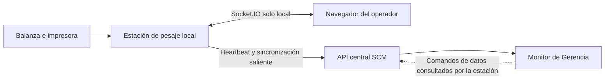

# US-011: Monitorear Estaciones de Pesaje y su Sincronización

## 1. Decisión Funcional

El módulo instalado junto a la balanza se conserva como una **estación de pesaje independiente y offline-first**. Su interfaz, la lectura serial y la impresión deben seguir funcionando aunque el backend central no esté disponible.

La necesidad de Gerencia no se resolverá abriendo remotamente la interfaz local ni exponiendo los controles de la balanza. Se entregará una vista central alimentada por comunicación saliente desde cada estación. La observación es de consulta; US-011C permite únicamente comandos auditados sobre datos legacy, nunca sobre hardware.

Socket.IO queda limitado al tiempo real local entre el navegador de la estación y su backend. Los pesajes, acuses y estados destinados al sistema central usarán contratos persistentes e idempotentes sobre la API central. Cerrar el navegador local no equivale a apagar la estación.

Esta historia permite observar el piloto actual, pero no convierte el contrato `legacy-v1` en trazabilidad SCM definitiva. El pesaje normalizado, la unidad logística, el QR versionado y la asociación efectiva a `LoteSalidaPiezaColor` continúan perteneciendo a US-010D.

La autenticación de usuarios humanos se difiere hasta el cierre funcional según
[[2026-07-17_Autenticacion_Humana_Diferida_Hasta_Cierre_Funcional]]. Esto no
bloquea el dashboard ni sus pruebas, pero limita su uso previo a un entorno
interno controlado. La autenticación técnica de cada estación permanece
obligatoria y separada.

## 2. Historia de Usuario

**Como** Gerencia o responsable de Producción  
**Quiero** consultar desde el sistema central el estado operativo, la actividad reciente y la salud de sincronización de cada estación de pesaje  
**Para** detectar interrupciones, atrasos o pérdida de visibilidad sin desplazarme a la balanza ni controlar remotamente el equipo.

## 3. Resultado de Negocio Observable

Al completar esta historia:

1. Gerencia puede identificar cada estación, su ubicación lógica y la versión instalada.
2. Puede distinguir si existe comunicación reciente con la estación, sin afirmar que una estación incomunicada está necesariamente apagada.
3. Puede observar por separado el estado informado de balanza, impresora y sincronización.
4. Puede conocer el último pesaje aceptado, la OP/OT reportada y el avance resumido del turno o día, declarando si proviene del contrato normalizado o del legado.
5. Puede ver cuántos eventos permanecen pendientes, desde cuándo y cuál fue el último error de sincronización.
6. Las cantidades locales pendientes y las recibidas mediante `legacy-v1` se muestran como información operativa, no como inventario central confirmado.
7. La estación continúa pesando e imprimiendo durante una caída del backend central.
8. Ningún usuario de Gerencia puede conectar, desconectar, eliminar, reabrir, reimprimir ni modificar datos de la estación desde el monitor.

## 4. Actores y Autoridad

| Actor | Capacidad |
|---|---|
| Gerencia | Consultar estaciones, actividad, alertas y antigüedad de sincronización. |
| Responsable de Producción | Consultar el avance y coordinar una revisión local cuando exista una alerta. |
| Operador de pesaje | Operar balanza e impresora desde la estación local según sus permisos. |
| Soporte autorizado | Instalar, detener, diagnosticar, respaldar o actualizar la estación mediante procedimientos técnicos auditables. |
| Estación de pesaje | Emitir heartbeat, resúmenes y eventos hacia la API central usando su propia identidad técnica. |

Estas capacidades describen la autoridad de negocio objetivo. Mientras no exista
autenticación humana, el acceso se controla por entorno y red; un actor visible
es declarado, no una identidad digital verificada. La consulta central nunca
concede autoridad operativa sobre el hardware local.

## 5. Límites de Responsabilidad

### 5.1. Incluido

- registro central de una o varias estaciones;
- identidad estable de estación y ubicación lógica;
- heartbeat y última comunicación recibida;
- estado reportado de balanza, impresora, proceso local y sincronización;
- versión instalada y versión de contrato soportada;
- último pesaje aceptado y contexto operativo resumido;
- totales informativos del turno o día;
- cantidad y antigüedad de eventos pendientes;
- alertas por falta de comunicación, periférico no disponible, cola atrasada o error repetido;
- historial mínimo de cambios de estado para diagnóstico;
- dashboard central de consulta y gestión auditada de datos del piloto;
- comportamiento explícito cuando la información está desactualizada.

### 5.2. Fuera de Alcance

- controlar balanza o impresora desde otra computadora;
- abrir los puertos internos de Flask o Socket.IO hacia la LAN o Internet;
- hard delete o edición libre de pesajes;
- cerrar o reabrir una `OrdenProduccion` SCM formal desde el flujo legacy;
- comandos remotos de balanza, impresora, puerto serial o proceso Windows;
- actualización remota automática de estaciones;
- sustituir US-010D o diseñar su QR, unidad logística y kardex;
- tratar el payload de heartbeat como movimiento de inventario;
- prometer continuidad eléctrica o de hardware que la estación no pueda medir.
- implementar login, sesiones o RBAC humano en esta historia.

## 6. Frontera Operativa

Solo la estación inicia comunicación con el sistema central. La interfaz de Gerencia consume el estado consolidado por la API central y no consulta directamente `127.0.0.1`, el puerto serial ni el proceso local.

## 7. Lenguaje de Dominio

### 7.1. EstacionPesaje

Identidad lógica y persistente de la instalación junto a una balanza. Como mínimo conserva:

- `station_id` global, estable y no reutilizable;
- nombre visible y ubicación lógica;
- estado administrativo `ACTIVA`, `MANTENIMIENTO` o `RETIRADA`;
- versión de aplicación y contratos soportados;
- fecha de alta y última comunicación;
- identidad técnica habilitada para autenticarse ante central.

Reinstalar la aplicación en la misma estación no debe crear otra identidad sin una decisión explícita de soporte.

### 7.2. HeartbeatEstacion

Informe periódico, no transaccional, que comunica la salud observada por la estación. Puede reemplazar el estado anterior de la misma estación y no crea movimientos de inventario.

Incluye como mínimo:

- instante UTC generado en origen e instante recibido por central;
- versión de la estación;
- estado del proceso, balanza e impresora;
- estado de la cola de sincronización;
- cantidad pendiente y antigüedad del evento más antiguo;
- último acuse central y último error resumido;
- contexto operativo y último pesaje, cuando existan.

### 7.3. Estado de Comunicación

Estado calculado por central a partir de la última recepción:

- `RECIENTE`: heartbeat dentro del umbral configurado;
- `ATRASADA`: superó el intervalo normal, pero no el umbral de desconexión;
- `SIN_COMUNICACION`: superó el umbral de desconexión;
- `NUNCA_REPORTO`: estación registrada sin heartbeat recibido.

`SIN_COMUNICACION` significa que central no puede observarla. No demuestra por sí solo que la PC, el proceso o la balanza estén apagados.

### 7.4. Estado de Sincronización

- `AL_DIA`: no existen eventos pendientes conocidos;
- `PENDIENTE`: existen eventos conservados localmente esperando acuse;
- `ERROR`: el último intento falló y requiere reintento o intervención;
- `LEGACY`: la estación usa todavía el contrato `legacy-v1` y sus datos no poseen todas las garantías de US-010D.

## 8. Invariantes

1. Cada estación posee un `station_id` global y no se identifica solo por IP, hostname o puerto.
2. El heartbeat es observabilidad; nunca crea, corrige ni confirma inventario.
3. Un resumen local pendiente no se suma silenciosamente al total central confirmado.
4. Todo total visible declara su fuente: `CENTRAL_CONFIRMADO`, `CENTRAL_RECIBIDO_LEGACY` o `LOCAL_REPORTADO_PENDIENTE`.
5. Una estación incomunicada muestra la antigüedad de la última observación y no inventa un estado actual.
6. Repetir el mismo heartbeat no crea estaciones ni historiales duplicados incompatibles.
7. El fallo del monitor central no impide pesar, imprimir ni conservar la cola local.
8. El fallo de Socket.IO local no puede borrar un pesaje ya confirmado en SQLite.
9. El monitor central es de solo lectura respecto al hardware. Las mutaciones de datos legacy se limitan a soft delete, cierre y reapertura auditados por US-011C.
10. Ningún secreto, contraseña ni cadena de conexión aparece en heartbeat, logs visibles o dashboard.
11. El monitor no expone el puerto local de la estación ni requiere acceso entrante hacia ella.
12. Una estación en `MANTENIMIENTO` conserva historial y no genera una falsa alerta de producción.
13. Una versión incompatible queda visible y bloquea únicamente la sincronización incompatible, no la captura local segura.
14. La hora de origen y la hora de recepción se conservan por separado para detectar reloj incorrecto o comunicación diferida.

## 9. Información del Monitor

| Grupo | Datos mínimos |
|---|---|
| Identidad | Nombre, `station_id`, ubicación, versión. |
| Comunicación | Estado calculado, última recepción, antigüedad. |
| Equipos | Balanza conectada/escuchando, impresora disponible/no verificada. |
| Operación | OP, OT, máquina, turno y último pesaje reportados, cuando existan. |
| Avance | Bultos y kg por fuente; legado recibido y resumen local pendiente separados de central confirmado. |
| Sincronización | Último acuse, pendientes, evento más antiguo, último error. |
| Diagnóstico | Reinicio reciente, versión incompatible o mantenimiento. |

La ausencia de una señal que el hardware no pueda comprobar debe mostrarse como `NO_VERIFICADO`, no como `OPERATIVO`.

## 10. Criterios de Aceptación ATDD/BDD

### US-011-01: Estación visible y reciente

**Dado** que `PESAJE-PLANTA-01` está registrada y activa  
**Y** central recibió un heartbeat dentro del umbral configurado  
**Cuando** Gerencia abre el monitor  
**Entonces** ve la estación como `RECIENTE`  
**Y** observa versión, ubicación, estado de balanza, último pesaje y última sincronización.

### US-011-02: Comunicación atrasada sin conclusión falsa

**Dado** que el último heartbeat superó el umbral de desconexión  
**Cuando** Gerencia consulta la estación  
**Entonces** el estado es `SIN_COMUNICACION`  
**Y** se muestra la fecha y antigüedad de la última observación  
**Y** la interfaz no afirma que la balanza esté apagada ni muestra información anterior como actual.

### US-011-03: Central indisponible durante la operación

**Dado** que la estación perdió acceso a la API central  
**Cuando** el operador registra e imprime tres pesajes válidos  
**Entonces** los tres quedan persistidos localmente  
**Y** la operación local continúa  
**Y** la cola informa tres eventos pendientes  
**Y** al recuperar conexión se reintentan sin intervención del operador.

### US-011-04: Diferenciar confirmado y pendiente

**Dado** que el contrato normalizado confirmó `475 kg` y la estación reporta `75 kg` todavía pendientes  
**Cuando** Gerencia consulta el avance  
**Entonces** ve `475 kg confirmados` y `75 kg locales pendientes` por separado  
**Y** el sistema no presenta `550 kg` como inventario confirmado.

### US-011-05: Monitor sin control remoto de hardware

**Dado** un usuario que accede al monitor dentro del entorno interno autorizado  
**Cuando** consulta una estación  
**Entonces** no dispone de acciones para conectar o desconectar la balanza, imprimir, leer el puerto serial o detener la estación  
**Y** los contratos mantienen `remote_hardware_commands=false`  
**Pero** puede solicitar soft delete, cierre o reapertura de datos legacy según US-011C.

### US-011-06: Varias estaciones sin colisión

**Dado** que existen dos estaciones con datos locales que contienen el mismo `local_id`  
**Cuando** ambas reportan estado  
**Entonces** central conserva dos estaciones distintas mediante sus `station_id`  
**Y** ningún dato de una reemplaza el de la otra.

### US-011-07: Heartbeat repetido

**Dado** que central ya procesó un heartbeat de una estación  
**Cuando** recibe nuevamente el mismo informe por un reintento de red  
**Entonces** actualiza o ignora idempotentemente el informe  
**Y** no duplica la estación ni una alerta equivalente.

### US-011-08: Reinicio de estación

**Dado** que existen eventos locales pendientes  
**Cuando** Windows o el proceso de estación se reinicia  
**Entonces** la identidad y la cola se recuperan desde almacenamiento persistente  
**Y** el monitor muestra el reinicio y la posterior reanudación  
**Y** ningún evento confirmado se vuelve a contabilizar.

### US-011-09: Contrato legado visible

**Dado** que el piloto sigue sincronizando mediante `legacy-v1`  
**Cuando** Gerencia consulta la estación  
**Entonces** ve la condición `LEGACY`  
**Y** la interfaz no declara que existe idempotencia global ni trazabilidad de unidad logística.

### US-011-10: Estación en mantenimiento

**Dado** que soporte colocó la estación en `MANTENIMIENTO` con motivo y vigencia  
**Cuando** deja de reportar durante esa ventana  
**Entonces** el monitor conserva la condición de mantenimiento  
**Y** diferencia la situación de una interrupción no planificada.

## 11. Dataset de Ejemplo

| Campo | Estación operativa | Estación sin comunicación |
|---|---|---|
| `station_id` | `PESAJE-PLANTA-01` | `PESAJE-PILOTO-02` |
| Ubicación | `Producción - Balanza principal` | `Laboratorio piloto` |
| Versión | `1.1.0-pilot` | `1.0.0-legacy` |
| Comunicación | `RECIENTE` | `SIN_COMUNICACION` |
| Balanza | `CONECTADA_Y_ESCUCHANDO` | `ULTIMO_ESTADO: CONECTADA` |
| Impresora | `DISPONIBLE` | `NO_VERIFICADO` |
| OP/OT | `OP-2026-0041 / OT-001238` | Sin contexto vigente |
| Último pesaje | `25.000 kg a las 10:14` | `30.000 kg ayer 18:42` |
| Central recibido legacy | `475.000 kg / 19 bultos` | `120.000 kg / 4 bultos` |
| Local pendiente | `75.000 kg / 3 eventos` | Desconocido desde la desconexión |
| Sincronización | `PENDIENTE` | `LEGACY` |

Este dataset es reproducible y no representa inventario real.

## 12. Errores, Reintentos y Correcciones

- Los heartbeats y resúmenes se reintentan con espera creciente y límite configurable.
- Un error conserva código técnico resumido y fecha; el dashboard no muestra trazas ni secretos.
- Un heartbeat nuevo puede corregir el estado operativo vigente, pero no reescribe eventos de pesaje.
- Cambiar nombre o ubicación de una estación conserva su identidad e historial.
- Retirar una estación cambia su estado administrativo; no elimina reportes históricos.
- El piloto solo permite soft delete auditado del registro legacy; corregir valores o un pesaje SCM confirmado seguirá el flujo de US-010D.
- Si el reloj local difiere más que la tolerancia configurada, se muestra una alerta y se conserva la hora de recepción central.

## 13. Dependencias y Entrega Gradual

### 13.1. Piloto temprano

Puede desplegarse después de [[TE-004_Despliegue_Operativo_y_Observabilidad_Estacion_Pesaje|TE-004]] aunque US-010D todavía no esté implementada, siempre que:

- la estación se identifique como piloto;
- el contrato de pesajes existente se etiquete `legacy-v1`;
- los totales locales pendientes sean solo informativos;
- no se habiliten movimientos de inventario basados únicamente en el monitor.
- las mutaciones legacy exijan actor, motivo, cola y acuse local según US-011C;
- permanezca en loopback, LAN restringida o VPN y no se exponga públicamente.

### 13.2. Integración definitiva

US-010D deberá reemplazar el evento legacy por una identidad global de origen, sincronización idempotente, asociación a lote de salida y unidad logística. US-011 reutilizará esos datos confirmados sin redefinirlos.

## 14. Estrategia TDD

| Nivel | Comportamiento protegido |
|---|---|
| Unitario central | Cálculo de `RECIENTE`, `ATRASADA` y `SIN_COMUNICACION`; separación de totales. |
| Unitario estación | Construcción de heartbeat sin secretos y recuperación de cola. |
| Contrato | Compatibilidad de heartbeat y respuesta central versionados. |
| Integración central | Upsert idempotente por `station_id`; comandos de datos auditados sin comandos de hardware. La autorización humana se prueba en el enabler final. |
| Integración estación | Reintento, persistencia y reanudación después de reinicio. |
| UI | Estados desactualizados, etiquetas `LEGACY`, confirmado versus pendiente y controles auditados de US-011C. |
| E2E aislado | Estación simulada reporta, pierde central, acumula eventos y vuelve a sincronizar. |
| Smoke con hardware | Balanza, impresión, reinicio y heartbeat en la PC del piloto. |

Cada escenario se implementará mediante `RED -> GREEN -> REFACTOR`, preservando las pruebas de caracterización de TE-003 mientras exista `legacy-v1`.

## 15. Decisiones Ya Cerradas

1. La estación permanece independiente y offline-first.
2. Socket.IO se usa únicamente para tiempo real local.
3. La comunicación con central es iniciada por la estación.
4. El monitor de Gerencia es central; consulta hardware y permite solo las mutaciones de datos auditadas por US-011C.
5. No se expone el backend local hacia la red para obtener monitoreo.
6. Un total pendiente no es inventario confirmado.
7. El piloto puede preceder a US-010D, pero debe declarar su condición legacy.
8. La autenticación humana se implementará al final y no bloquea el dashboard interno.

## 16. Pendientes de Refinamiento

- validar con Gerencia si el tablero inicial necesita totales por turno, día o ambos;
- confirmar los nombres visibles de las ubicaciones de estaciones;
- confirmar quién puede colocar una estación en mantenimiento;
- decidir la tolerancia visual para heartbeat atrasado y sin comunicación.

Estas decisiones modifican presentación y parametrización. No alteran la frontera arquitectónica ni bloquean el endurecimiento técnico de TE-004.

## 17. Definición de Preparada

- [x] Actor, objetivo y resultado observable definidos.
- [x] Frontera entre estación, API central y monitor definida.
- [x] Operación offline y significado de datos pendientes definidos.
- [x] Frontera entre consulta de hardware y comandos auditados de datos definida.
- [x] Escenarios principal, desconexión, reintento y reinicio definidos.
- [x] Dataset reproducible definido.
- [x] Relación con US-010D y `legacy-v1` explicitada.
- [ ] Etiquetas y agrupación temporal del tablero validadas con Gerencia.
- [ ] TE-004 refinado y aprobado.
