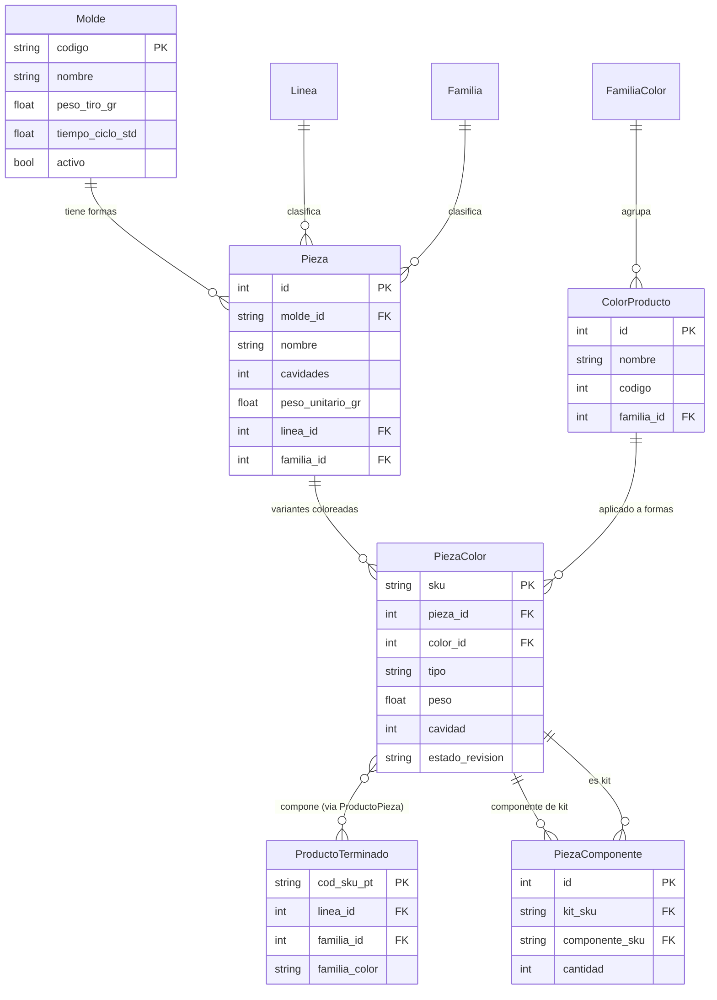

# TS-001: Creación Ágil de Molde-Producto-Pieza

> Especificación Técnica derivada de [[02_User_Stories/US-001_Creacion_Agil_Molde_Producto_Pieza|US-001]].

---

## 1. Resumen Ejecutivo

Esta especificación técnica cubre los cambios necesarios para:

1. **Normalizar el modelo relacional** separando Forma (Pieza) de Color, creando la entidad intersección `PiezaColor` (SKU de inventario).
2. **Corregir bugs** en el endpoint de creación en cascada (`POST /api/catalogo/configurar-producto`).
3. **Mover el selector de colores** del Paso 1 (Molde) al Paso 2b (después de definir Formas) en el wizard frontend.
4. **Alimentar Líneas y Familias dinámicamente** desde el backend en lugar de constantes hardcodeadas.
5. **Garantizar consistencia de color por colada** a nivel de modelo y validación.

---

## 2. Modelo de Datos — Diseño ER Propuesto

### 2.1. Diagrama ER



### 2.2. Mapeo: Nombres Actuales → Nombres Propuestos

| Concepto | Tabla Actual | Tabla Propuesta | Notas |
| :--- | :--- | :--- | :--- |
| Forma pura del molde | `molde_pieza` | **`pieza`** | Absorbe atributos de forma: `nombre`, `cavidades`, `peso_unitario_gr`, `linea_id`, `familia_id` |
| SKU coloreado de inventario | `pieza` | **`pieza_color`** | Gana FK `pieza_id` (forma) + `color_id` (color). Pierde `molde_pieza_id` (ya implícito via `pieza_id → molde_id`) |
| Color | `color_producto` | **`color_producto`** (sin cambio) | — |
| Kit | `pieza` (tipo=KIT) | **`pieza_color`** (tipo=KIT) | Un Kit sigue siendo un SKU coloreado agrupador |

### 2.3. Detalle de la Tabla `pieza` (NUEVA — antes `molde_pieza`)

| Atributo | Tipo | Nullable | Descripción |
| :--- | :--- | :--- | :--- |
| **id** | `Integer` PK | No | Auto-incremental |
| **molde_id** | `String(50)` FK → `molde.codigo` | No | Molde al que pertenece esta forma |
| **nombre** | `String(200)` | No | Nombre de la forma (ej: "Tapa Regadera") |
| **cavidades** | `Integer` | No | Número de cavidades para esta forma |
| **peso_unitario_gr** | `Float` | No | Peso de UNA pieza (gramos) |
| **linea_id** | `Integer` FK → `linea.id` | No | Línea de producto |
| **familia_id** | `Integer` FK → `familia.id` | No | Familia de producto |

**Constraints:**
- `UNIQUE(molde_id, nombre)` — Un molde no puede tener dos formas con el mismo nombre.

**Relaciones:**
- **Padre:** `Molde` (N:1)
- **Hijos:** `PiezaColor` (1:N) — variantes coloreadas de esta forma

### 2.4. Detalle de la Tabla `pieza_color` (RENOMBRADA — antes `pieza`)

| Atributo | Tipo | Nullable | Descripción |
| :--- | :--- | :--- | :--- |
| **sku** | `String(50)` PK | No | SKU único del inventario coloreado |
| **pieza_id** | `Integer` FK → `pieza.id` | Sí* | Forma pura a la que pertenece |
| **color_id** | `Integer` FK → `color_producto.id` | Sí | Color de inyección |
| **tipo** | `String(20)` | No | `SIMPLE`, `KIT`, `COMPONENTE` |
| **piezas** | `String(200)` | Sí | Nombre legible (ej: "Tapa Regadera Rojo") |
| **peso** | `Float` | Sí | Peso en gramos |
| **cavidad** | `Integer` | Sí | Cavidades (heredado de la forma) |
| **cod_pieza** | `Integer` | Sí | Legacy |
| **cod_col** | `String(10)` | Sí | Legacy |
| **cod_color** | `Integer` | Sí | Legacy |
| **color** | `String(50)` | Sí | Legacy nombre |
| **cod_extru** | `Integer` | Sí | Legacy |
| **tipo_extruccion** | `String(50)` | Sí | Legacy |
| **cod_mp** | `String(50)` | Sí | Legacy |
| **mp** | `String(100)` | Sí | Legacy |
| **tipo_color** | `String(50)` | Sí | Legacy |
| **estado_revision** | `String(20)` | No | `IMPORTADO`, `EN_REVISION`, `VERIFICADO` |

*\* Nullable para SKUs legacy importados del Excel que aún no tienen forma asignada.*

**Constraints:**
- `UNIQUE(pieza_id, color_id)` — No puede haber dos SKUs con la misma forma + color.

**Relaciones:**
- **Padres:** `Pieza` (N:1), `ColorProducto` (N:1)
- **Hijos:** `PiezaComponente` (1:N — como kit), `ProductoPieza` (N:M con ProductoTerminado)

---

## 3. Estrategia de Migración

> [!CAUTION]
> La migración involucra **renombrar tablas con datos existentes**. Requiere un script de migración Alembic cuidadoso que preserve la integridad referencial.

### 3.1. Plan de Migración (Alembic)

**Migración 1: Reestructurar tablas** (`rename_pieza_piezacolor`)

```
Paso 1: Renombrar tabla `pieza` → `pieza_color`
Paso 2: Renombrar tabla `molde_pieza` → `pieza`
Paso 3: Agregar columna `pieza.linea_id` (FK → linea.id) — copiar desde pieza_color legacy
Paso 4: Agregar columna `pieza.familia_id` (FK → familia.id) — copiar desde pieza_color legacy
Paso 5: Agregar columna `pieza_color.pieza_id` (FK → pieza.id) — poblar desde `pieza_color.molde_pieza_id` legacy
Paso 6: Agregar UNIQUE constraint en pieza_color(pieza_id, color_id)
Paso 7: Actualizar FKs en tablas dependientes:
        - producto_pieza.pieza_sku → pieza_color.sku
        - pieza_componente.kit_sku → pieza_color.sku
        - pieza_componente.componente_sku → pieza_color.sku
        - snapshot_composicion_molde.pieza_sku → pieza_color.sku
        - lote_color (si referencia Pieza)
Paso 8: Eliminar columna legacy `pieza_color.molde_pieza_id` (reemplazada por pieza_id)
```

### 3.2. Datos Legacy

- Las `pieza_color` importadas del Excel que no tienen `molde_pieza_id` (ahora `pieza_id`) quedarán con `pieza_id = NULL`. Se revisarán progresivamente (ya existe `estado_revision`).
- No se eliminan campos legacy (`cod_pieza`, `cod_col`, `cod_color`, etc.) en esta fase — solo se deprecan.

---

## 4. Endpoints API

### 4.1. [MODIFY] `POST /api/catalogo/configurar-producto`

**Archivo:** [rutas_catalogo.py](file:///c:/Users/esteb/gitprojects/envaperu-workspace-2/backend/app/api/rutas_catalogo.py#L676-L967)

**Cambios requeridos:**

#### Bug Fix 1: Variable `resultado` → `response_data` (US-001c)
- **Líneas 745, 756, 771, 783, 800, 817, 837, 849, 871, 873, 885, 897, 917, 949:** Reemplazar todas las ocurrencias de `resultado[...]` por `response_data[...]`.
- **Causa raíz:** La variable se inicializa como `response_data` (L702) pero se usa como `resultado` a partir de L745.

#### Bug Fix 2: `db.session.add` duplicado (US-001c)
- **Líneas 856-857:** Eliminar el segundo `db.session.add(kit_pieza)` + `db.session.flush()` duplicado. El primero en L853-854 es suficiente.

#### Bug Fix 3: Generación de SKU determinista (US-001c)
- **Línea 795:** Se mantendrá el esquema de concatenación actual (que usa el prefijo `MOL-` truncado y el nombre de la forma), pero se debe reforzar la integridad para evitar colisiones:

```python
# Mantenemos la lógica de concatenación pero agregamos validación robusta:
base_sku = molde_codigo.replace('MOL-', '')
sku_pieza = f"{base_sku}-{forma.nombre.upper().replace(' ', '-')[:10]}-C{color.codigo}"

# Si se detecta colisión, en lugar de truncar diferente, podemos lanzar un error claro
# o usar un sufijo si se requiere en el futuro. Por ahora la regla es:
# Mantener la fórmula de concatenación, pero garantizar que la dupla (molde_id, nombre_forma) 
# sea única en origen para que el SKU resultante no colisione.
```

- Aplicar el mismo patrón seguro en **L862** (componentes del Kit) y **L932** (pieza STD).

#### Refactor: Adaptar al nuevo modelo Pieza / PiezaColor (US-001a + US-001e)
- Los imports cambian: `from app.models.producto import PiezaColor, PiezaComponente, ...`
- Al crear formas (Paso 2): crear registros de la nueva tabla `Pieza` (antes `MoldePieza`).
- Al crear SKUs coloreados (Paso 3): crear registros de `PiezaColor` (antes `Pieza`) con `pieza_id = forma.id`.
- Al crear Kits (Paso 4): crear `PiezaColor` con `tipo='KIT'`.

#### Nuevo payload propuesto:

```json
{
  "molde": {
    "codigo": "MOL-REGADERA",
    "nombre": "Regadera Completa",
    "peso_tiro_gr": 85.0,
    "tiempo_ciclo_std": 30,
    "usar_existente": false
  },
  "formas": [
    { "nombre": "Tapa Regadera", "cavidades": 2, "peso_unitario_gr": 15.0 },
    { "nombre": "Base Regadera", "cavidades": 2, "peso_unitario_gr": 15.0 }
  ],
  "color_ids": [1, 3],
  "kit": { "nombre": "Regadera Completa", "sku_override": null },
  "linea_id": 1,
  "familia_id": 10,
  "producto_terminado": { "..." : "..." }
}
```

> **Cambio clave en payload:** `piezas` se renombra a `formas` para alinear con la semántica del modelo. `linea`/`cod_linea` se simplifica a `linea_id` (FK directo).

---

### 4.2. [NEW] `GET /api/catalogo/lineas`

**Archivo:** [rutas_catalogo.py](file:///c:/Users/esteb/gitprojects/envaperu-workspace-2/backend/app/api/rutas_catalogo.py)

**Descripción:** Devuelve todas las líneas de producto desde la BD.

**Request:** Sin parámetros.

**Response (200):**
```json
[
  { "id": 1, "codigo": 1, "nombre": "HOGAR" },
  { "id": 2, "codigo": 2, "nombre": "JUGUETES" },
  { "id": 3, "codigo": 3, "nombre": "INDUSTRIAL" }
]
```

**Entidades Involucradas:** [[Linea]] (tabla `linea`)

---

### 4.3. [NEW] `GET /api/catalogo/familias`

**Archivo:** [rutas_catalogo.py](file:///c:/Users/esteb/gitprojects/envaperu-workspace-2/backend/app/api/rutas_catalogo.py)

**Descripción:** Devuelve todas las familias de producto. Acepta filtro opcional por línea.

**Request:**

| Parámetro | Tipo | Requerido | Descripción |
| :--- | :--- | :--- | :--- |
| `linea_id` | `Integer` (query) | No | Filtrar familias por línea |

**Response (200):**
```json
[
  { "id": 1, "codigo": 14, "nombre": "PLAYEROS", "linea_id": 2 },
  { "id": 2, "codigo": 10, "nombre": "JARRAS", "linea_id": 1 }
]
```

> [!NOTE]
> Las entidades `Familia` y `Linea` son independientes en el dominio. El filtrado de familias por línea en el frontend se seguirá manejando mediante un mapeo de reglas de negocio en la aplicación (o atributos extendidos en el frontend), sin requerir una FK en la tabla `familia` de la BD.

**Entidades Involucradas:** [[Familia]], [[Linea]]

---

### 4.4. [MODIFY] `GET /api/catalogo/validar-orden-prereq`

**Cambio:** Usar `PiezaColor.color_id` en lugar de `ProductoTerminado.familia_color` para determinar compatibilidad Molde+Color → SKU existente (US-001b).

---

## 5. Modelos Backend (SQLAlchemy)

### 5.1. [MODIFY] `backend/app/models/molde.py`

**Cambios:**
- Renombrar clase `MoldePieza` → `Pieza`
- `__tablename__ = 'pieza'`
- Agregar `linea_id` FK → `linea.id`
- Agregar `familia_id` FK → `familia.id`
- Eliminar columna legacy `pieza_sku` (ya no necesaria)
- Actualizar `relationship` y `backref` para apuntar a `PiezaColor` en lugar de la antigua `Pieza`
- Actualizar `Molde.piezas` relationship: `db.relationship('Pieza', backref='molde', ...)`

### 5.2. [MODIFY] `backend/app/models/producto.py`

**Cambios:**
- Renombrar clase `Pieza` → `PiezaColor`
- `__tablename__ = 'pieza_color'`
- Reemplazar `molde_pieza_id` FK → nueva columna `pieza_id` FK → `pieza.id`
- Actualizar relación: `pieza_rel = db.relationship('Pieza', backref='variantes')`
- Agregar constraint: `UniqueConstraint('pieza_id', 'color_id', name='uq_pieza_color')`
- Actualizar `PiezaComponente`: las FK `kit_sku` y `componente_sku` apuntan a `pieza_color.sku`
- Actualizar `ProductoPieza`: la FK `pieza_sku` apunta a `pieza_color.sku`

### 5.3. [MODIFY] Otros Modelos que referencian `Pieza`

| Archivo | Tabla | Campo | Cambio |
| :--- | :--- | :--- | :--- |
| `models/orden.py` (si existe) | `snapshot_composicion_molde` | `pieza_sku` FK | → `pieza_color.sku` |
| `models/orden.py` | `lote_color` | Referencia a `ColorProducto` | Sin cambio (ya apunta a `color_producto.id`) |

---

## 6. Frontend — Componente ConfigurarProducto

### 6.1. [MODIFY] `frontend/src/components/ConfigurarProducto.jsx`

**Archivo:** [ConfigurarProducto.jsx](file:///c:/Users/esteb/gitprojects/envaperu-workspace-2/frontend/src/components/ConfigurarProducto.jsx)

#### Cambio 1: Eliminar constantes hardcodeadas (US-001d)

```diff
-// Líneas/Familias predefinidas (pueden venir del backend en el futuro)
-const LINEAS = [
-  { cod: 2, nombre: 'JUGUETES' },
-  { cod: 1, nombre: 'HOGAR' },
-  { cod: 3, nombre: 'INDUSTRIAL' },
-];
-
-const FAMILIAS = [
-  { cod: 14, nombre: 'PLAYEROS', linea_cod: 2 },
-  { cod: 15, nombre: 'BALDES', linea_cod: 2 },
-  { cod: 10, nombre: 'JARRAS', linea_cod: 1 },
-  { cod: 11, nombre: 'TAZONES', linea_cod: 1 },
-];
```

Reemplazar con estado dinámico:

```javascript
const [lineasOptions, setLineasOptions] = useState([]);
const [familiasOptions, setFamiliasOptions] = useState([]);
```

Y cargar en el `useEffect` inicial:

```javascript
const [lineasRes, familiasRes, coloresRes, moldesRes] = await Promise.all([
  obtenerLineas(),
  obtenerFamilias(),
  obtenerColores(),
  obtenerMoldes()
]);
setLineasOptions(lineasRes);
setFamiliasOptions(familiasRes);
```

#### Cambio 2: Mover selector de colores del Paso 1 al Paso 2b (US-001a)

**Estructura actual del Stepper:**
```
Paso 0: Molde + Línea + Familia + ⚠️ COLORES ⚠️
Paso 1: Formas (Piezas)
Paso 2: Kit (opcional)
Paso 3: Revisión y Envío
```

**Estructura propuesta:**
```
Paso 0: Molde + Línea + Familia (SIN colores)
Paso 1: Formas puras (Piezas) — nombre, cavidades, peso
Paso 2: Colores de Inyección (NUEVO paso dedicado)
         + Preview de N × C PiezasColor que se generarán
Paso 3: Kit (opcional, si >1 forma Y hay colores)
Paso 4: Revisión y Envío
```

**Detalle del nuevo Paso 2 (Colores):**
- Muestra un `Autocomplete multiple` con los colores disponibles (ya cargados).
- Debajo del selector, muestra un **preview en tabla** de las PiezaColor que se generarán:

```
┌──────────────────┬────────┬──────────────────────────────────┐
│ Forma (Pieza)    │ Color  │ SKU Generado (preview)           │
├──────────────────┼────────┼──────────────────────────────────┤
│ Tapa Regadera    │ Rojo   │ REGADERA-F1-C5                   │
│ Base Regadera    │ Rojo   │ REGADERA-F2-C5                   │
│ Tapa Regadera    │ Azul   │ REGADERA-F1-C8                   │
│ Base Regadera    │ Azul   │ REGADERA-F2-C8                   │
└──────────────────┴────────┴──────────────────────────────────┘
Total: 2 formas × 2 colores = 4 SKUs coloreados
```

#### Cambio 3: Renombrar labels del UI

| Elemento | Label Actual | Label Propuesto |
| :--- | :--- | :--- |
| Stepper Step 1 | "Definir Piezas" | "Definir Formas del Molde" |
| Card title | "Pieza {n}" | "Forma {n}" |
| Add button | "Agregar Otra Pieza" | "Agregar Otra Forma" |
| Step 2 (nuevo) | — | "Colores de Inyección" |

### 6.2. [MODIFY] `frontend/src/services/api.js`

**Archivo:** [api.js](file:///c:/Users/esteb/gitprojects/envaperu-workspace-2/frontend/src/services/api.js)

#### [NEW] Funciones a agregar:

```javascript
// ==================== CATÁLOGO LÍNEAS/FAMILIAS ====================

export const obtenerLineas = async () => {
  const response = await api.get('/catalogo/lineas');
  return response.data;
};

export const obtenerFamilias = async (lineaId = null) => {
  const params = lineaId ? { linea_id: lineaId } : {};
  const response = await api.get('/catalogo/familias', { params });
  return response.data;
};
```

#### [MODIFY] `configurarProductoCascada`:

```diff
 export const configurarProductoCascada = async (data) => {
-  const response = await api.post('/configurar-producto', data);
+  const response = await api.post('/catalogo/configurar-producto', data);
   return response.data;
 };
```

---

## 7. Validaciones de Integridad (US-001e)

### 7.1. Validación en el modelo (SQLAlchemy event)

Agregar un listener `before_flush` o un método `validate_kit_color_consistency()` en `PiezaComponente`:

```python
@db.validates('componente_sku')
def validate_same_color_kit(self, key, componente_sku):
    """
    Valida que todos los componentes de un Kit compartan el mismo color.
    Solo aplica si los componentes provienen del mismo molde.
    """
    # Implementación: al insertar un componente, verificar que su color_id
    # coincide con el color_id de los demás componentes del mismo kit.
    ...
```

### 7.2. Validación en el endpoint

En `POST /api/catalogo/configurar-producto`, la generación de Kits ya se hace por color (un loop `for color in colores`), por lo que por diseño no mezcla colores. La validación adicional es para llamadas API directas.

---

## 8. Impacto en Otros Módulos

### 8.1. [[Snapshot_Composicion_Molde]]

- La FK `pieza_sku` debe apuntar a `pieza_color.sku` (no cambia la columna, solo el target de la FK en el ORM).
- Conceptualmente el snapshot congela la composición del molde (formas + pesos). Si se quiere congelar la forma pura, considerar agregar `pieza_id` FK al snapshot (referencia a la nueva `pieza`).

### 8.2. [[Lote_Color]]

- El campo `Color` (FK → `ColorProducto`) no cambia.
- El campo `Producto SKU Output` (FK → `ProductoTerminado`) no cambia.
- Sin impacto directo.

### 8.3. [[Orden_Produccion]]

- `validar-orden-prereq` debe usar `PiezaColor.color_id` para buscar SKUs compatibles, **no** `ProductoTerminado.familia_color` (US-001b).

---

## 9. Plan de Verificación

### 9.1. Tests Automatizados

```bash
# Tests unitarios del modelo
pytest tests/test_pieza_model.py -v

# Tests del endpoint de creación en cascada
pytest tests/test_configurar_producto.py -v

# Test de migración
alembic upgrade head
alembic downgrade -1
alembic upgrade head
```

#### Tests clave a escribir:

| Test | Qué verifica |
| :--- | :--- |
| `test_crear_molde_con_formas_y_colores` | Crea Molde + 2 Formas + 2 Colores → 4 PiezaColor + 2 Kits |
| `test_sin_colores_crea_solo_formas` | Crea Molde + Formas sin colores → 0 PiezaColor |
| `test_kit_mismo_color` | Todos los componentes de un Kit tienen el mismo `color_id` |
| `test_kit_color_mixto_rechazado` | Intento de crear Kit con colores mixtos → Error 400 |
| `test_sku_determinista` | SKUs generados son únicos y reproducibles |
| `test_variable_response_data` | No arroja `NameError` con `resultado` |
| `test_no_db_add_duplicado` | Kit se inserta exactamente 1 vez |
| `test_lineas_endpoint` | `GET /api/catalogo/lineas` retorna lista válida |
| `test_familias_filtro_linea` | `GET /api/catalogo/familias?linea_id=1` retorna solo familias de esa línea |

### 9.2. Verificación Manual

- [ ] Wizard frontend: verificar que colores NO aparecen en Paso 0
- [ ] Wizard frontend: verificar que colores aparecen en Paso 2 (nuevo)
- [ ] Wizard frontend: verificar preview de N×C SKUs antes de enviar
- [ ] Wizard frontend: Líneas y Familias se cargan dinámicamente desde API
- [ ] Crear molde multi-pieza con 3 colores → verificar 6 PiezaColor + 3 Kits
- [ ] Crear molde single-pieza sin colores → verificar solo la Forma, 0 PiezaColor

---

## 10. Orden de Implementación Sugerido

| Fase | US | Descripción | Riesgo |
| :--- | :--- | :--- | :--- |
| **Fase 0** | US-001c | Bug fixes en endpoint (variable, duplicado, SKU) | 🟢 Bajo — no toca modelo |
| **Fase 1** | — | Migración Alembic: renombrar tablas + nuevas columnas | 🔴 Alto — toca BD prod |
| **Fase 2** | US-001a + US-001e | Refactor modelos SQLAlchemy + endpoint cascada | 🟡 Medio — requiere Fase 1 |
| **Fase 3** | US-001d | Nuevos endpoints `GET lineas` / `GET familias` | 🟢 Bajo — aditivo |
| **Fase 4** | US-001a | Frontend: mover colores, renombrar labels, cargar dinámico | 🟡 Medio — cambio UX |
| **Fase 5** | US-001b | Verificar que `familia_color` no participa en lógica | 🟢 Bajo — solo auditoría |

---

## 11. Decisiones Registradas (ADR)

> [!NOTE]
> **D1: Estrategia de Migración de Tablas**
> Se opta por la **Opción A (Rename)** (`ALTER TABLE pieza RENAME TO pieza_color`). Dado que actualmente no existen datos reales de producción que migrar (solo tests y datos mock), esta opción es la más rápida y limpia.

> [!NOTE]
> **D2: Independencia de Línea y Familia**
> Las tablas `linea` y `familia` se mantendrán **completamente independientes**. No se agregará una `linea_id` FK a `familia`. Cualquier lógica de asociación se manejará a nivel de lógica de aplicación o frontend.

> [!NOTE]
> **D3: Generación de SKUs**
> Se conservará la **fórmula actual de concatenación** (Ej: truncamientos, sufijos de color) en lugar de hashes o IDs numéricos. Para solucionar el problema de fragilidad, se enfocarán los esfuerzos en asegurar la integridad de los datos de entrada (asegurar nombres únicos por forma en el molde) para que la fórmula determinista no genere colisiones.
