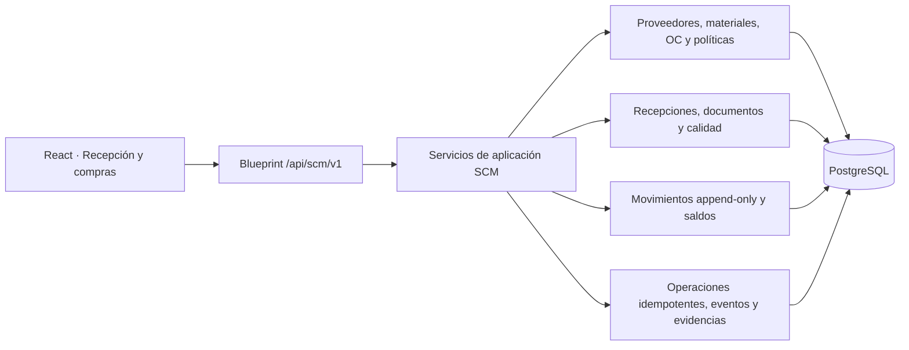
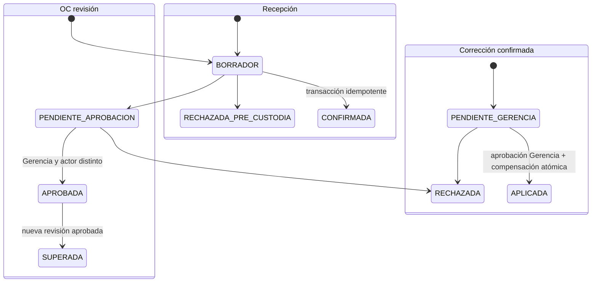

# TS-010A: Recepción Trazable de Materiales

## 1. Estado de la Decisión

US-010A cumple su Definición de Preparada. Esta Tech Spec traduce `REC-01` a `REC-46` a un diseño implementable en el backend Flask/SQLAlchemy, PostgreSQL y el frontend React/MUI existentes.

La especificación quedó **aprobada para desarrollo el 2026-07-21** por decisión expresa del usuario responsable. La implementación se conduce mediante [[DEV-010A_Recepcion_Trazable_Materiales]]. La configuración con nombres reales de ubicaciones, materiales, personas, motivos y balanza pertenece a la puerta de UAT y no debe convertirse en constantes de código.

La aprobación incluye construir el modelo de roles y capacidades SCM durante US-010A. La asignación final de permisos a usuarios humanos se difiere hasta el cierre del desarrollo, antes de habilitar operación multiusuario. Durante desarrollo y UAT controlado puede utilizarse el actor transitorio documentado, sin aceptar roles o capacidades enviados por el frontend.

### 1.1. Reglas funcionales cerradas el 2026-07-21

1. `OrdenCompraMaterial` es la autorización interna v1; una guía o factura del proveedor no la reemplaza.
2. Gerencia aprueba cada revisión de OC y debe ser un actor distinto de quien la creó.
3. En material virgen, si coincide el conteo de bolsas, gobierna la cantidad documental/nominal y `peso_interno` permanece `NO_MEDIDO`.
4. Una discrepancia de conteo de virgen requiere decisión explícita de Gerencia: aceptar cantidad documental, aceptar cantidad nominal contada o rechazar.
5. En material de segunda, cada bolsa se pesa manualmente y la suma gobierna el inventario.
6. Mientras no exista tolerancia numérica para segunda, la diferencia queda visible como `SIN_POLITICA` y no bloquea por sí sola la confirmación.
7. El lote externo es opcional por defecto y nunca se inventa; se conserva como `INFORMADO`, `NO_INFORMADO` o `ILEGIBLE`.
8. Toda corrección de una recepción confirmada requiere solicitud, evidencia y aprobación de Gerencia. No existen límites delegados en v1.
9. Una guía o factura puede respaldar varias recepciones físicas parciales; su identidad externa es única, pero su vínculo con recepción es N:M y no se marca como “consumida” por la primera recepción.
10. En material de segunda, cada pesaje representa una bolsa física individual. Al confirmar se crea una unidad de almacenamiento trazable por bolsa y se emite un código para sticker; su peso de recepción no vuelve a capturarse para darla de alta en almacén.

## 2. Alcance Técnico

Incluye:

- catálogo interno de proveedores y catálogo común de materiales recibibles;
- OC internas versionadas, aprobación de Gerencia y saldos parciales;
- documentos externos y evidencia persistente;
- borrador, rechazo previo a custodia y confirmación idempotente de recepción;
- dos modalidades de cantidad: virgen sin repesaje y segunda pesada bolsa por bolsa;
- lotes internos, retención documental, decisiones parciales de Calidad, ubicaciones y movimientos;
- correcciones compensatorias, devoluciones e historial de trazabilidad;
- contratos HTTP, UI operativa y pruebas desde dominio hasta E2E.

No incluye:

- OCR automático de guías o lectura de QR de bolsas;
- integración financiera, precios, impuestos, cuentas por pagar o reapertura comercial de una OC;
- captura directa desde la balanza de recepción; v1 transcribe la hoja manual;
- autenticación humana completa; el actor declarado es solo una transición de desarrollo;
- reserva, premezcla o consumo para OP, que pertenecen a US-010B;
- migrar el kardex de mangas de producto terminado al nuevo libro de materias primas.

## 3. Arquitectura y Límites

Se crea un módulo SCM separado del `kardex` legacy de mangas:



Reglas de dependencia:

- las rutas validan formato y delegan; no contienen transacciones de negocio;
- `app/services/scm_recepcion_service.py` y servicios hermanos son dueños de las transacciones;
- los modelos no llaman APIs ni escriben archivos;
- el inventario se modifica únicamente junto con un `MovimientoMaterial` append-only;
- `InventarioManga` y `MovimientoKardex` no se reutilizan: representan otro tipo de unidad física y actualmente usan cantidades `Float` y ubicaciones libres incompatibles con esta historia.

## 4. Convenciones Persistentes

- PK internas: `Integer` autoincremental, coherentes con el backend actual.
- Identidades visibles: códigos estables `String`, únicos y no reutilizables (`OCM-*`, `REC-*`, `LM-*`). Los prefijos son técnicos; la numeración final es configuración.
- Cantidades: `Numeric(15, 3)` en kg. Nunca `Float` para recepción, saldo o movimiento.
- Porcentajes: `Numeric(9, 6)`; se calculan solo si el denominador documental es mayor que cero.
- Tiempo: `DateTime(timezone=True)` en UTC; la UI presenta `America/Lima`.
- Actores: FK obligatoria a `trabajador.id` y snapshot de código/nombre en eventos aprobatorios.
- Catálogos y hechos se desactivan o compensan; no se borran si tienen referencias.
- Enums de dominio se almacenan como `String` con `CheckConstraint`, para que una migración controle su evolución.
- Todo registro mutable de cabecera lleva `version Integer NOT NULL DEFAULT 1` para control optimista.

## 5. Modelo de Datos

### 5.1. Catálogo común de materiales

Se introduce `scm_material` como supertipo recibible, sin eliminar `materia_prima` ni `colorante`:

| Tabla/cambio | Campos principales | Restricciones |
|---|---|---|
| `scm_categoria_recepcion` | `id`, `codigo`, `nombre`, `modalidad_default`, `lote_externo_obligatorio`, `recepcion_habilitada`, `activo`, `version` | `codigo` único; modalidad en `VIRGEN_CONFIANZA_PROVEEDOR`, `SEGUNDA_PESAJE_BOLSA`, `POR_CONFIGURAR`; versión optimista |
| `scm_material` | `id`, `codigo`, `nombre`, `clase`, `categoria_recepcion_id`, `unidad_base`, `activo`, `version` | `codigo` autogenerado según clase (`MP-*`, `COL-*`, `ADT-*`) y único; unidad base v1 `KG`; categoría activa y habilitada para poder recibir; versión optimista |
| `scm_capacidad` / `scm_rol_capacidad` | capacidad estable y relación N:M con `rol_operativo` | el servidor deriva capacidades desde los roles del `Trabajador`; nunca desde el body |
| `materia_prima` | añade `scm_material_id` | FK única; se vuelve `NOT NULL` después del backfill |
| `colorante` | añade `scm_material_id` y conserva la normalización `tipo=COLORANTE/ADITIVO` de US-006 | FK única; se vuelve `NOT NULL` después del backfill |

`scm_material` es la identidad usada por OC, recepción, lote e inventario. Las tablas legacy conservan detalles propios de receta y apuntan 1:1 al supertipo. Así todas las recepciones tienen una FK real y US-010B podrá reservar un material sin una referencia polimórfica débil.

Las altas y renombres del catálogo común escriben atómicamente la identidad 1:1 legacy. Para `MateriaPrima`, el espejo legacy `tipo` se deriva de `modalidad_default` (`VIRGEN` o `SEGUNDA`), no del nombre ni de un código de categoría concreto. `codigo`, `clase` y `unidad_base` son inmutables.

El seed mínimo de capacidades es: `PROVEEDOR_ADMINISTRAR`, `DOCUMENTO_PROVEEDOR_REGISTRAR`, `OC_CREAR`, `OC_APROBAR`, `RECEPCION_CONFIRMAR`, `ENTRADA_EXCEPCIONAL_REGULARIZAR`, `CALIDAD_RESOLVER`, `LIBERACION_DIRECTA_ADMINISTRAR`, `CORRECCION_SOLICITAR`, `CORRECCION_APROBAR`, `DEVOLUCION_REGISTRAR` y `CONFIG_RECEPCION_ADMINISTRAR`. En v1, `OC_APROBAR`, la decisión de discrepancia de virgen y `CORRECCION_APROBAR` se asignan al rol de Gerencia. La asignación a personas es configuración de UAT.

### 5.2. Proveedores y órdenes internas

| Tabla | Campos principales | Restricciones clave |
|---|---|---|
| `scm_proveedor` | `id`, `codigo`, `razon_social`, `ruc`, `activo`, `version`, timestamps | `codigo` autogenerado `PRV-*` y único; `ruc` normalizado a 11 dígitos y único cuando exista; versión optimista |
| `scm_orden_compra` | `id`, `codigo`, `proveedor_id`, `estado`, `version`, timestamps | cabecera estable; estados `ACTIVA`, `CERRADA`, `ANULADA` |
| `scm_orden_compra_revision` | `id`, `orden_id`, `numero`, `estado`, `creada_por_id`, `enviada_at`, `aprobada_por_id`, `aprobada_at`, `motivo_rechazo`, `version`, timestamps | único `(orden_id, numero)`; estados `BORRADOR`, `PENDIENTE_APROBACION`, `APROBADA`, `RECHAZADA`, `SUPERADA`; creador distinto de aprobador; versión optimista |
| `scm_orden_compra_linea` | `id`, `revision_id`, `numero_linea`, `material_id`, `cantidad_autorizada_kg`, `fecha_requerida`, `observacion` | cantidades positivas; único `(revision_id, numero_linea)` |

Una revisión aprobada es inmutable. Una nueva revisión no reescribe líneas ya imputadas; debe conservarlas o explicar su reemplazo. El saldo de línea se deriva de cantidad autorizada menos imputaciones de recepciones confirmadas. No se persiste un “saldo editable”.

La edición reemplaza líneas únicamente bajo lock y sólo cuando la revisión sigue `BORRADOR`. PostgreSQL rechaza `INSERT`, `UPDATE` o `DELETE` de líneas pertenecientes a una revisión en cualquier otro estado; la relación ORM no usa cascada destructiva.

### 5.3. Documentos y evidencias

| Tabla | Campos principales | Restricciones clave |
|---|---|---|
| `scm_documento_proveedor` | `id`, `proveedor_id`, `tipo`, `serie_normalizada`, `numero_normalizado`, `fecha_emision`, `cantidad_total_documental_kg`, metadatos de traslado | identidad externa única por proveedor/tipo/serie/número; no contiene una FK directa a recepción porque puede cubrir varias recepciones parciales |
| `scm_documento_proveedor_linea` | `id`, `documento_id`, `numero_linea`, `descripcion_original`, `codigo_proveedor`, `cantidad`, `unidad_original`, `cantidad_kg` | conserva texto externo sin crear materiales automáticamente |
| `scm_tipo_evidencia` | `id`, `codigo`, `nombre`, `mime_permitidos`, `activo` | catálogo administrable; el código no se reutiliza |
| `scm_requisito_evidencia` | `id`, `contexto`, `categoria_recepcion_id`, `tipo_evidencia_id`, `obligatorio`, `vigente_desde`, `vigente_hasta`, `activo` | regla configurable y versionable por contexto/categoría |
| `scm_adjunto` | `id`, `nombre_original`, `mime_detectado`, `bytes`, `sha256`, `contenido` (`LargeBinary`/`BYTEA`), `reemplaza_adjunto_id`, `creado_por_id`, `created_at` | máximo 10 MiB; SHA-256; MIME permitido `image/jpeg`, `image/png`, `application/pdf` |
| `scm_documento_adjunto` | `documento_id`, `adjunto_id`, `tipo_evidencia` | PK compuesta, sin duplicados |
| `scm_evento_adjunto` | `evento_id`, `adjunto_id`, `tipo_evidencia` | toda evidencia de excepción/corrección queda ligada a un evento |

V1 persiste los bytes en PostgreSQL para no depender del filesystem efímero de despliegue. Si el volumen real exige object storage, una migración futura conservará `sha256` e identidad; no se cambiará el contrato funcional.

Los tipos y requisitos de evidencia son configuración. El `scm_adjunto` concreto deja de ser editable o eliminable cuando se vincula a una recepción confirmada, aprobación, decisión de Calidad, corrección o devolución. Un error se corrige adjuntando una nueva evidencia con `reemplaza_adjunto_id` y un evento; el archivo anterior permanece en el historial.

### 5.4. Recepción, pesaje y lote

| Tabla | Campos principales | Restricciones clave |
|---|---|---|
| `scm_recepcion` | `id`, `codigo`, `proveedor_id`, `estado`, `es_excepcional`, `retencion_documental`, `motivo_excepcion_id`, `ubicacion_inicial_id`, `recibida_por_id`, `confirmada_at`, `version` | estados `BORRADOR`, `CONFIRMADA`, `RECHAZADA_PRE_CUSTODIA`; confirmada es inmutable |
| `scm_recepcion_documento` | `recepcion_id`, `documento_id` | N:M; un documento puede respaldar varias recepciones físicas parciales y una recepción puede reunir guía, factura u otros documentos |
| `scm_recepcion_linea` | `id`, `recepcion_id`, `numero_linea`, `material_id`, `modalidad`, `lote_externo_estado`, `lote_externo_codigo`, `bultos_documentados`, `bultos_recibidos`, `peso_nominal_bulto_kg`, `cantidad_documental_kg`, `peso_interno_estado`, `cantidad_medida_kg`, `cantidad_aceptada_kg`, `diferencia_kg`, `diferencia_pct`, `resultado_tolerancia`, `politica_tolerancia_id` | único `(recepcion_id, numero_linea)`; `cantidad_aceptada_kg > 0` al confirmar; coherencia por modalidad |
| `scm_recepcion_imputacion_oc` | `recepcion_linea_id`, `orden_compra_linea_id`, `cantidad_imputada_kg` | PK compuesta; suma por línea de recepción igual a cantidad aceptada ordinaria; no exceder saldo bajo lock |
| `scm_pesaje_bolsa` | `id`, `recepcion_linea_id`, `secuencia`, `peso_kg`, `balanza_codigo_snapshot`, `registrado_por_id`, `hoja_adjunto_id` | único `(recepcion_linea_id, secuencia)`; peso positivo; suma exacta usada por segunda |
| `scm_inspeccion_recepcion` | `id`, `recepcion_linea_id`, `criterio`, `resultado`, `observacion`, `registrado_por_id`, `evento_id` | único por línea/criterio; criterios mínimos de identidad, grado, empaque y contaminación |
| `scm_decision_cantidad` | `id`, `recepcion_linea_id`, `tipo`, `decision`, `cantidad_autorizada_kg`, `decidida_por_id`, `decidida_at`, `motivo`, `evento_id` | para discrepancia de conteo de virgen o fuera de tolerancia; actor con capacidad de Gerencia cuando corresponda |
| `scm_lote_material` | `id`, `codigo`, `material_id`, `proveedor_id`, `recepcion_linea_id`, `lote_externo_estado`, `lote_externo_codigo`, `created_at` | `codigo` global único; una línea confirmada genera un lote; no se reutiliza |
| `scm_unidad_almacenamiento_material` | `id`, `codigo`, `tipo`, `lote_material_id`, `pesaje_bolsa_id`, `peso_recepcion_kg`, `cantidad_actual_kg`, `ubicacion_id`, `estado_calidad`, `retencion_documental`, `estado`, `version`, timestamps | código global único para sticker; en v1 `tipo=BOLSA`; un pesaje solo origina una unidad; cantidad actual no negativa y nunca mayor al peso recibido |

Coherencia por modalidad:

- `VIRGEN_CONFIANZA_PROVEEDOR`: `peso_interno_estado=NO_MEDIDO`, `cantidad_medida_kg=NULL`; si conteos coinciden, `cantidad_aceptada_kg=cantidad_documental_kg`. Si no coinciden, exige `scm_decision_cantidad` de Gerencia.
- `SEGUNDA_PESAJE_BOLSA`: debe existir un detalle por cada bolsa declarada recibida; `cantidad_medida_kg=SUM(peso_kg)` y `cantidad_aceptada_kg=cantidad_medida_kg`. Sin política numérica, `resultado_tolerancia=SIN_POLITICA`.
- al confirmar `SEGUNDA_PESAJE_BOLSA`, cada `scm_pesaje_bolsa` genera exactamente una `scm_unidad_almacenamiento_material`; el sticker codifica la identidad estable de la unidad, no solo el peso ni un texto recreable;
- el peso recibido queda congelado. Movimientos posteriores cambian `cantidad_actual_kg`, ubicación o estado, pero nunca reescriben `peso_recepcion_kg`; una corrección aprobada se registra como evento y movimiento compensatorio;
- el lote externo `INFORMADO` exige código; `NO_INFORMADO` e `ILEGIBLE` exigen código nulo. Su ausencia solo bloquea si la categoría lo exige.

### 5.5. Ubicaciones, Calidad e inventario

| Tabla | Campos principales | Restricciones clave |
|---|---|---|
| `scm_ubicacion` | `id`, `codigo`, `nombre`, `padre_id`, `ambito`, `tipo`, `activo` | `codigo` único; US-010A solo admite `ambito=MATERIA_PRIMA` |
| `scm_saldo_material` | `lote_material_id`, `ubicacion_id`, `estado_calidad`, `retencion_documental`, `cantidad_kg`, `version` | proyección agregada única por lote/ubicación/estado/retención; para segunda debe reconciliar con la suma de unidades físicas activas |
| `scm_movimiento_material` | `id`, `operation_id`, `lote_material_id`, `unidad_almacenamiento_id` nullable, `tipo`, `cantidad_kg`, origen/destino de ubicación, Calidad y retención, `actor_id`, `evento_id`, `created_at` | append-only; `operation_id` único por efecto; segunda identifica la bolsa afectada y la cantidad positiva |
| `scm_decision_calidad` | `id`, `lote_material_id`, `cantidad_kg`, `estado_origen`, `estado_destino`, ubicaciones, `decidida_por_id`, `motivo_id`, `evento_id` | solo `PENDIENTE -> LIBERADO/BLOQUEADO/RECHAZADO` o decisión posterior explícita permitida |
| `scm_retencion_documental` | `id`, `recepcion_id`, `estado`, `motivo_id`, `creada_por_id`, `resuelta_por_id`, `resuelta_at`, `orden_vinculada_id`, `evento_id` | quien registra la excepción no la regulariza |

`scm_saldo_material` es una proyección transaccional, no la fuente histórica. Cada cambio de saldo exige un movimiento. La suma por lote y estado debe satisfacer los invariantes de US-010A; el stock disponible es únicamente `LIBERADO` y `retencion_documental=false`.

### 5.6. Políticas, correcciones, devoluciones e idempotencia

| Tabla | Campos principales | Restricciones clave |
|---|---|---|
| `scm_politica_tolerancia` | categoría, modalidad, versión, límites absoluto/porcentual, vigencia, activo, aprobador | versionada; ninguna fila equivale a `SIN_POLITICA` |
| `scm_politica_liberacion_directa` | material/proveedor, versión, requisitos, aprobador Calidad, aprobador Gerencia, vigencia | dos actores y capacidades; no retroactiva |
| `scm_correccion_recepcion` | `id`, `recepcion_id`, `tipo`, `estado`, `cantidad_delta_kg`, `valor_anterior_json`, `valor_nuevo_json`, `solicitada_por_id`, `motivo`, `aprobada_por_id`, timestamps, `evento_solicitud_id`, `evento_aplicacion_id` | estados `PENDIENTE_GERENCIA`, `RECHAZADA`, `APLICADA`; solicitante distinto de aprobador; aprobador Gerencia |
| `scm_devolucion_proveedor` | `id`, `codigo`, `proveedor_id`, `estado`, `registrada_por_id`, `motivo_id`, `documento_referencia`, `evento_id` | aplicada de forma idempotente; no reabre OC |
| `scm_devolucion_linea` | `devolucion_id`, `lote_material_id`, `ubicacion_id`, `estado_calidad`, `cantidad_kg` | solo desde `BLOQUEADO` o `RECHAZADO`; no excede saldo |
| `scm_operacion` | `operation_id` UUID, `endpoint`, `actor_id`, `request_sha256`, `estado_http`, `response_json`, `created_at` | PK `operation_id`; mismo ID+hash repite respuesta, mismo ID+otro hash da conflicto |
| `scm_evento` | `id`, `aggregate_type`, `aggregate_id`, `tipo`, `actor_id`, `actor_snapshot`, `motivo`, `before_json`, `after_json`, `operation_id` nullable, `occurred_at` | append-only; ninguna FK funcional permite borrado en cascada; PostgreSQL rechaza `UPDATE` y `DELETE` |

### 5.7. Configuración Administrable y CRUD Posterior

La configuración operativa no bloquea el modelo ni exige codificar personas reales:

| Configuración | Administración prevista | Tratamiento histórico |
|---|---|---|
| Participantes | reutilizar CRUD de `Trabajador` de TS-009; asignar o retirar `RolOperativo` y capacidades SCM | desactivar no borra eventos; cada hecho conserva actor y snapshot |
| Roles y capacidades | capacidades estables sembradas; relaciones rol-capacidad administrables por `CONFIG_RECEPCION_ADMINISTRAR` | los cambios afectan acciones futuras, no aprobaciones anteriores |
| Tipos/requisitos de evidencia | crear, editar mientras no tenga vigencia y desactivar; versionar cambios aplicables | cada evento conserva el requisito/política aplicada |
| Motivos, ubicaciones y categorías | CRUD lógico con `activo`; sin borrado si existen referencias | códigos y snapshots históricos permanecen consultables |
| Políticas de tolerancia/liberación | crear nueva versión, aprobar, activar o retirar | nunca se edita retroactivamente una versión usada |

“CRUD” significa crear, consultar, actualizar configuración aún no histórica y desactivar. No significa borrar participantes, políticas, archivos o catálogos ya referenciados. La primera entrega puede cargarlos mediante seed/comando idempotente; una pantalla administrativa posterior operará sobre las mismas tablas y no requerirá rediseñar la recepción.

## 6. Máquinas de Estado



No existe transición desde `CONFIRMADA` a `BORRADOR`, ni edición/borrado funcional de una recepción confirmada.

## 7. Contratos HTTP

Base: `/api/scm/v1`. Respuestas JSON en `snake_case`. Todo POST que cierre una transición aprobatoria, confirme custodia o produzca un movimiento físico requiere `Idempotency-Key: <uuid>`. Las altas de configuración y la edición de borradores usan versión optimista y generan `scm_evento`, pero no obligan al cliente a crear una operación idempotente; por eso `scm_evento.operation_id` puede ser nulo en esos casos.

Mientras no exista autenticación humana, `X-Actor-Id: <trabajador.id>` identifica un actor declarado validado server-side. Nunca se acepta un rol o capacidad enviado en el body. Este mecanismo no habilita producción multiusuario.

### 7.1. Endpoints

| Método y ruta | Resultado |
|---|---|
| `GET/POST /config/categorias-recepcion` | listar/crear categoría versionada; requiere capacidad para crear |
| `GET/PATCH /config/categorias-recepcion/{id}` | detalle/cambio lógico con código inmutable y `CONFIG_RECEPCION_ADMINISTRAR` |
| `GET/POST /materiales` | listar/crear identidad común mediante dual-write atómico |
| `GET/PATCH /materiales/{id}` | detalle/cambio versionado; código, clase y unidad inmutables |
| `GET/POST /proveedores` | listar/crear proveedor |
| `GET/PATCH /proveedores/{id}` | detalle y cambios no históricos; baja lógica |
| `GET/POST /documentos-proveedor` | listar/registrar identidad externa; `DOCUMENTO_PROVEEDOR_REGISTRAR` para crear |
| `GET/PATCH /documentos-proveedor/{id}` | detalle/cambio versionado de metadatos; proveedor, tipo, serie y número inmutables |
| `GET/POST /ordenes-compra-material` | listar/crear cabecera y revisión inicial |
| `GET /ordenes-compra-material/{id}` | revisiones, líneas, imputaciones y saldos derivados |
| `POST /ordenes-compra-material/{id}/revisiones` | crear nueva revisión borrador |
| `PATCH /ordenes-compra-material/{id}/revisiones/{numero}` | reemplazar líneas de una revisión `BORRADOR` con versión de OC y revisión |
| `POST /ordenes-compra-material/{id}/enviar-aprobacion` | cerrar edición de revisión |
| `POST /ordenes-compra-material/{id}/aprobar` | aprobación de Gerencia con segregación |
| `GET /recepciones/materiales/workspace` | capacidades efectivas y catálogos necesarios por la UI |
| `GET/POST /recepciones/materiales` | bandeja paginada / crear borrador |
| `GET/PATCH /recepciones/materiales/{id}` | consultar / editar solo borrador con `version` |
| `POST /recepciones/materiales/{id}/adjuntos` | multipart de evidencia validada |
| `POST /recepciones/materiales/{id}/decisiones-cantidad` | Gerencia resuelve discrepancia de conteo de virgen antes de confirmar |
| `POST /recepciones/materiales/{id}/rechazar-previo` | registrar rechazo sin inventario |
| `POST /recepciones/materiales/{id}/confirmar` | confirmar atómicamente y crear lotes/movimientos/saldos |
| `POST /recepciones/materiales/{id}/regularizar` | resolver retención documental por supervisor distinto |
| `POST /lotes-material/{id}/decisiones-calidad` | decisión total/parcial de Calidad |
| `POST /lotes-material/{id}/movimientos` | movimiento interno compatible |
| `GET /lotes-material/{id}/trazabilidad` | procedencia e historial hacia atrás |
| `POST /recepciones/materiales/{id}/correcciones` | solicitar corrección confirmada |
| `POST /correcciones-recepcion/{id}/resolver` | Gerencia rechaza o aprueba/aplica |
| `POST /devoluciones-proveedor` | devolución total/parcial desde saldo elegible |
| `GET/POST/PATCH /config/tipos-evidencia` | administración lógica de tipos de evidencia |
| `GET/POST/PATCH /config/requisitos-evidencia` | requisitos versionados por contexto/categoría |
| `GET/POST/PATCH /config/roles-capacidades` | asignación administrativa de capacidades a roles |
| `GET/POST/PATCH /config/motivos` | catálogo de motivos y baja lógica |
| `GET/POST/PATCH /config/ubicaciones` | catálogo jerárquico y compatibilidad de inventario |

Una categoría `POR_CONFIGURAR` nunca puede habilitar recepción. Puede utilizarse para conservar un material ambiguo y una línea de OC en borrador, pero enviar o aprobar revalida proveedor, material y categoría activos y bloquea el flujo con `MATERIAL_NOT_RECEIVABLE` mientras falte configuración.

### 7.2. Payload crítico de confirmación

```json
{
  "version": 3,
  "lineas": [
    {
      "recepcion_linea_id": 81,
      "modalidad": "SEGUNDA_PESAJE_BOLSA",
      "pesajes_bolsa": [
        {"secuencia": 1, "peso_kg": "24.830"},
        {"secuencia": 2, "peso_kg": "25.120"}
      ],
      "imputaciones_oc": [
        {"orden_compra_linea_id": 42, "cantidad_kg": "49.950"}
      ]
    }
  ]
}
```

El servidor recalcula sumas, diferencias, saldo de OC y cantidad aceptada. Nunca confía en totales calculados por el navegador. Para virgen, `pesajes_bolsa` se rechaza y la respuesta devuelve `peso_interno_estado=NO_MEDIDO` y `cantidad_medida_kg=null`.

### 7.3. Payload crítico de corrección

Solicitud:

```json
{
  "tipo": "CANTIDAD",
  "cantidad_delta_kg": "-5.000",
  "motivo": "Error de transcripción confirmado contra hoja manual",
  "adjunto_ids": [912]
}
```

Resolución de Gerencia:

```json
{
  "decision": "APROBAR",
  "motivo": "Evidencia revisada"
}
```

La aprobación y el movimiento compensatorio ocurren en una sola transacción. Si el saldo corregible ya fue consumido o devuelto, responde `409 CORRECTION_EXCEEDS_CORRECTABLE_STOCK` sin efectos parciales.

### 7.4. Errores

```json
{
  "error": {
    "code": "PURCHASE_ORDER_BALANCE_EXCEEDED",
    "message": "La imputación supera el saldo aprobado",
    "details": {"line_id": 42, "available_kg": "45.000"}
  }
}
```

| HTTP | Uso |
|---:|---|
| `400` | JSON, UUID, fecha o multipart mal formado |
| `403` | actor sin capacidad o segregación incumplida |
| `404` | agregado inexistente |
| `409` | versión obsoleta, operación idempotente conflictiva, documento duplicado, saldo insuficiente o transición inválida |
| `413` | adjunto mayor al límite |
| `415` | MIME no permitido |
| `422` | regla de dominio incumplida sin conflicto de concurrencia |

## 8. Transacciones y Concurrencia

### 8.1. Confirmar recepción

En una sola transacción PostgreSQL:

1. insertar o recuperar `scm_operacion`; comparar hash si ya existe;
2. bloquear la recepción y validar `BORRADOR`, `version` y actor;
3. bloquear documentos externos e imputaciones/líneas de OC con `SELECT ... FOR UPDATE`; permitir que el mismo documento respalde otra recepción parcial del mismo proveedor sin duplicar su identidad;
4. validar OC aprobada o excepción con motivo/evidencia y retención;
5. recalcular autoridad de cantidad por modalidad;
6. para virgen con conteo discrepante, exigir decisión previa de Gerencia;
7. para segunda, validar secuencias y sumar `scm_pesaje_bolsa` con `Decimal`;
8. validar lote externo, inspección mínima, ubicación y política vigente;
9. crear un `scm_lote_material` por línea, evento, movimiento `RECEPCION` y saldo `PENDIENTE`; para segunda, crear además una unidad física por pesaje con código de sticker y verificar que su suma reconcilie con el saldo;
10. aplicar liberación directa solo si cumple su política; se representa con otro movimiento de reclasificación;
11. vincular por N:M cada documento a la recepción —sin impedir futuros vínculos parciales—, persistir respuesta idempotente y hacer commit.

Cualquier excepción revierte operación, lotes, movimientos, saldos e imputaciones. Un `IntegrityError` por carrera se resuelve recargando `scm_operacion`: mismo hash devuelve la respuesta original; distinto hash produce `409 IDEMPOTENCY_CONFLICT`.

### 8.2. Calidad, movimiento, regularización y devolución

- bloquean con `FOR UPDATE` las filas de saldo afectadas;
- calculan disponibilidad dentro de la transacción;
- insertan movimiento y actualizan proyección juntos;
- incrementan `version` de la proyección;
- no permiten cantidades negativas ni destino de ámbito incompatible;
- una regularización cambia la dimensión de retención, no el estado de Calidad;
- una devolución exige saldo `BLOQUEADO` o `RECHAZADO`, un actor de Almacén con `DEVOLUCION_REGISTRAR` distinto de quien tomó la decisión de Calidad y no modifica recepción u OC histórica; no añade aprobación de Gerencia en v1.

### 8.3. Corrección

Solicitar no cambia inventario. Resolver como Gerencia valida actor distinto, bloquea corrección/recepción/saldos y, si aprueba:

- cantidad: crea movimiento compensatorio, ajusta saldo corregible y conserva el valor original;
- procedencia: conserva `before_json`/`after_json`, cambia únicamente la proyección vigente y no crea otro lote ni cantidad;
- aplica todo o nada y deja la solicitud `APLICADA` en el mismo commit.

SQLite sirve para pruebas unitarias y de contrato simples. No demuestra locks, aislamiento ni carreras; esas garantías exigen el perfil `postgres`.

## 9. Componentes de Backend

| Archivo objetivo | Responsabilidad |
|---|---|
| `app/models/scm_catalogos.py` | material común, categorías, proveedor, ubicación y motivos |
| `app/models/scm_compras.py` | OC, revisiones y líneas; los documentos externos siguen pendientes |
| `app/models/scm_recepcion.py` | recepción, líneas, pesajes, imputaciones, lotes y decisiones de cantidad |
| `app/models/scm_inventario.py` | saldos, movimientos, Calidad, retenciones, correcciones y devoluciones |
| `app/models/scm_auditoria.py` | operación idempotente, evento, adjunto y vínculos |
| `app/services/scm_service_support.py` | errores estructurados, actor/capacidades, versiones y validadores comunes |
| `app/services/scm_material_service.py` | identidad 1:1 y dual-write controlado por la transacción llamadora |
| `app/services/scm_material_catalog_service.py` | CRUD lógico de categorías/materiales y sincronización legacy |
| `app/services/scm_provider_service.py` | CRUD lógico, normalización RUC y eventos de proveedor |
| `app/services/scm_purchase_service.py` | versión/aprobación de OC y saldos derivados |
| `app/services/scm_recepcion_service.py` | borrador, confirmación y rechazo previo |
| `app/services/scm_inventory_service.py` | calidad, movimientos, regularización, corrección y devolución |
| `app/api/rutas_scm.py` | blueprint `/api/scm/v1` y serialización HTTP |
| `contracts/scm-recepcion-v1/contract.schema.json` | requests/responses críticos y enums |

La lógica de cantidad se implementa primero como funciones puras con `Decimal`, luego se orquesta desde servicios transaccionales.

## 10. Frontend

> [!INFO]
> **Avance 2026-07-22:** `/datos-maestros/materiales` ya consume la API persistente para `ScmMaterial`, `ScmProveedor` y `ScmCategoriaRecepcion`, incluyendo versionado y baja lógica. Los catálogos de ubicaciones, motivos y políticas no muestran fixtures en esta superficie mientras su contrato CRUD esté pendiente. La operación de recepción descrita debajo continúa como mock hasta completar sus comandos transaccionales.

La vista existente `RecepcionMateriales.jsx` es un prototipo probado con fuente `MOCK_LOCAL` en memoria. Ya materializa la navegación, las dos modalidades, OC y configuración; la implementación persistente debe:

1. reemplazar `obtenerRecepcionMateriales()` por un adaptador HTTP, manteniendo mock solo para tests de presentación;
2. separar componentes `ReceptionQueue`, `ReceptionDraft`, `ReceptionDetail`, `QualityDecision`, `ReceptionHistory` y `BagWeightGrid`;
3. mostrar para virgen `Peso interno: no medido`, nunca repetir el documental como medición;
4. mostrar para segunda una fila por bolsa, suma recalculada, documento, diferencia y estado `SIN_POLITICA`;
5. permitir imprimir o reimprimir el sticker de cada bolsa confirmada mostrando código trazable, material, peso recibido, lote interno y fecha; una reimpresión no crea otra unidad;
6. bloquear confirmación de virgen con conteo discrepante hasta vincular decisión de Gerencia;
7. añadir pantalla de `OrdenCompraMaterial` con revisión y aprobación;
8. ofrecer corrección confirmada como solicitud; solo el actor con capacidad de Gerencia ve la resolución;
9. mantener separados estado de Calidad, ubicación, retención documental, existencia física y disponible;
10. presentar conflictos `409` sin perder el borrador local y permitir recargar la versión vigente;
11. usar `ApiPendingButton` solo mientras la capacidad no esté implementada; al conectar cada endpoint, la acción debe habilitarse según capacidades devueltas por servidor.

Estados mínimos de UI: cargando, vacío, error recuperable, conflicto de versión, borrador guardado, confirmación en curso, confirmada, retenida, pendiente de Calidad, parcial, bloqueada/rechazada y operación repetida resuelta idempotentemente.

El mock ya representa virgen con `internalWeightStatus=NO_MEDIDO` y `measuredNetKg=null`, y segunda con detalle de bolsas, suma y diferencia `SIN_POLITICA`.

## 11. Seguridad y Privacidad

- `X-Actor-Id` es aceptable solo en desarrollo/UAT controlado. Producción exige sesión autenticada enlazada a `Trabajador` y capacidades server-side.
- Nunca confiar en capacidades, aprobadores, sumas, estados o saldos enviados por el frontend.
- Sanitizar nombre de archivo, detectar MIME por contenido, limitar tamaño y descargar con `Content-Disposition: attachment`.
- Las guías pueden contener RUC, placa, conductor, DNI/licencia y direcciones. El acceso a adjuntos se limita a Compras, Almacén, Calidad, Gerencia y Auditoría según capacidad.
- La política de conservación temporal y purga de adjuntos con datos personales debe aprobarse antes de producción; una purga legal conserva hash, metadatos y evento de disposición sin fingir que el archivo sigue disponible.
- Logs técnicos guardan IDs internos, `operation_id` y códigos de error; no registran contenido binario ni datos personales completos.
- SHA-256 verifica integridad, no reemplaza autorización ni antivirus. Archivos con tipo dudoso quedan rechazados, no servidos inline.
- Todo cambio de política, aprobación, excepción y corrección genera evento con snapshot de actor.

## 12. Migración y Despliegue

Flask-Migrate/Alembic ya está inicializado en `create_app()` y es el mecanismo productivo de esquema. `db.create_all()` y los scripts ad hoc quedan limitados a fixtures/artefactos legacy y no sustituyen una revisión versionada.

Fases:

1. `f02b00ae2e67`: baseline legacy reproducible para instalaciones nuevas y adopción sólo sobre restore aislado verificado;
2. `91f3774850d8`: fase expand aditiva, categorías, material común, capacidades, roles, backfill y FKs aún nullable;
3. desplegar primero el dual-write, drenar instancias antiguas y pausar todas las altas de material;
4. `58b3dd5878cd`: reconvergencia final y contrato `scm_material_id NOT NULL`, con downgrade preservador;
5. `23a5f8a99a0b`: proveedor, OC, revisión, línea, operación y evento; el downgrade aborta antes de borrar si cualquiera de las seis tablas contiene datos;
6. `7c1e4a9d2b6f`: documentos externos, relación N:M con recepciones, borradores, líneas y pesajes individuales; todavía sin custodia ni inventario;
7. continuar de forma aditiva con confirmación, unidades por bolsa/stickers, inventario y evidencia;
8. habilitar confirmación detrás de `SCM_RECEPCION_ENABLED` sólo después del perfil PostgreSQL, UAT y autorización independiente.

Rollback antes de habilitar confirmación: mantener apagado el feature flag y revertir sólo revisiones cuyo downgrade preserva datos o comprueba que están vacías. Después de crear hechos no se borran tablas ni eventos; se deshabilita escritura y se conserva lectura/auditoría. Ninguna de estas instrucciones autoriza operar sobre la base desplegada durante desarrollo.

## 13. Estrategia de Pruebas

### 13.1. Fixtures canónicos

- proveedor `PROV-TEST-01`, Gerencia `TRB-GER-01`, Compras `TRB-COM-01`, Almacén `TRB-ALM-01`, Calidad `TRB-CAL-01`;
- virgen: 200 bolsas x 25 kg, documento 5,000.000 kg, sin peso interno;
- segunda: pesos individuales cuya suma sea 624.850 kg frente a 625.000 kg documentados;
- OC con 1,250.000 kg y dos recepciones parciales de 625.000 kg;
- ubicaciones sintéticas de materias primas, incluyendo cuarentena, liberado, bloqueado y devolución;
- documentos y adjuntos sintéticos sin RUC, DNI, placa o direcciones reales.

Los valores de tolerancia usados en pruebas son fixtures, no políticas asumidas para planta.

### 13.2. Primera prueba RED

La primera `RED` será `REC-44` en `backend/tests/scm/test_recepcion_quantity_policy.py`:

> con material virgen, documento de 5,000.000 kg y conteo coincidente de 200 bolsas x 25 kg, la decisión devuelve cantidad aceptada 5,000.000 kg, fuente `DOCUMENTO_PROVEEDOR`, `peso_interno_estado=NO_MEDIDO` y `cantidad_medida_kg=None`.

Debe fallar inicialmente porque el motor de autoridad de cantidad y sus tipos aún no existen. Es la primera prueba porque protege la decisión más fácil de falsificar copiando el peso documental a un campo medido.

### 13.3. Mapa completo de escenarios

| ID | Nivel principal | Prueba objetivo |
|---|---|---|
| REC-01 | integración PostgreSQL | confirmar crea lote, entrada, saldo pendiente y evento |
| REC-02 | integración | borrador no crea movimiento ni saldo |
| REC-03 | dominio + integración | lotes externos distintos generan lotes internos distintos |
| REC-04 | dominio/API | lote obligatorio ilegible bloquea según política sin inventarlo |
| REC-05 | dominio | cantidad cero/negativa o escala inválida se rechaza |
| REC-06 | PostgreSQL/API | mismo `operation_id` y hash devuelve mismo resultado |
| REC-07 | PostgreSQL/API | mismo `operation_id` y hash distinto devuelve 409 |
| REC-08 | integración | Calidad reclasifica pendiente a liberado sin cambiar total |
| REC-09 | integración | bloqueo posterior conserva eventos y total físico |
| REC-10 | API | actor sin `CALIDAD_RESOLVER` recibe 403 |
| REC-11 | integración | movimiento cambia ubicación y conserva total |
| REC-12 | PostgreSQL | lock y constraint impiden saldo negativo |
| REC-13 | integración | corrección aprobada por Gerencia compensa y conserva original |
| REC-14 | contrato/API | trazabilidad devuelve proveedor, documentos, OC, lote y eventos |
| REC-15 | PostgreSQL | fallo inyectado revierte recepción completa |
| REC-16 | integración | recepción parcial deja saldo derivado abierto |
| REC-17 | integración | una recepción distribuye cantidad entre líneas de varias OC |
| REC-18 | dominio/contrato | documental, nominal y medido permanecen separados |
| REC-19 | integración | entrada sin OC crea retención y saldo no disponible |
| REC-20 | integración/API | supervisor distinto regulariza sin alterar Calidad |
| REC-21 | integración | Calidad resuelve incidencia de lote ilegible con evidencia |
| REC-22 | integración | liberación directa válida crea transición auditada |
| REC-23 | integración | retirar política solo afecta recepciones futuras |
| REC-24 | integración | decisión parcial mantiene saldo pendiente exacto |
| REC-25 | dominio | inspección fallida impide liberación directa |
| REC-26 | dominio/UI | selector ofrece solo ubicaciones activas de materia prima |
| REC-27 | dominio/API | destino de piezas devuelve 422 y no mueve |
| REC-28 | dominio | fixture con política calcula dentro de ambos límites |
| REC-29 | dominio/API | fuera de política activa exige decisión autorizada |
| REC-30 | contrato/UI | conserva conteos, nominal y ausencia de pesaje interno |
| REC-31 | integración | editar borrador cambia versión y no inventario |
| REC-32 | API | PATCH/DELETE de confirmada devuelve 409 |
| REC-33 | API/integración | sin aprobación de Gerencia la corrección no se aplica |
| REC-34 | integración | rechazo previo conserva evidencia y no crea lote |
| REC-35 | integración | devolución total crea salida y conserva recepción |
| REC-36 | integración | devolución parcial reduce solo cantidad seleccionada |
| REC-37 | PostgreSQL | concurrencia no permite devolver más que saldo |
| REC-38 | integración | corrección de procedencia conserva before/after y mismo lote |
| REC-39 | PostgreSQL | compensación no retira cantidad ya consumida/devuelta |
| REC-40 | API/integración | OC requiere revisión aprobada por Gerencia distinta |
| REC-41 | dominio/UI | documento externo sin OC solo permite flujo excepcional |
| REC-42 | contrato/UI | guía, conteo y peso interno usan campos/fuentes distintos |
| REC-43 | PostgreSQL/API | identidad externa duplicada no duplica recepción |
| REC-44 | dominio + integración | virgen usa documento y conserva `NO_MEDIDO` |
| REC-45 | dominio + integración | segunda suma cada bolsa y deja diferencia visible |
| REC-46 | dominio/API | lote opcional ausente confirma como `NO_INFORMADO` |

### 13.4. Distribución y comandos

- dominio: `pytest backend/tests/scm/test_*_policy.py`;
- integración rápida SQLite: servicios, restricciones portables y serialización;
- contrato: JSON Schema bajo `backend/contracts/scm-recepcion-v1`;
- PostgreSQL: idempotencia, locks, constraints, atomicidad y carreras `REC-06`, `REC-07`, `REC-12`, `REC-15`, `REC-37`, `REC-39`, `REC-43`;
- frontend Vitest: modalidades, `NO_MEDIDO`, bolsas, segregación visual, estados y conflictos;
- E2E único: aprobar OC, confirmar virgen, decisión parcial de Calidad y consulta de trazabilidad. No repetir las 46 variantes.

Comando base:

```powershell
powershell.exe -NoProfile -ExecutionPolicy Bypass -File .\scripts\test.ps1 -Component all
powershell.exe -NoProfile -ExecutionPolicy Bypass -File .\scripts\test.ps1 -Component backend -Postgres
```

## 14. Línea Base Revalidada el 2026-07-21

| Componente | Resultado |
|---|---|
| Backend rápido | `103 passed`, `1 skipped`, `3 deselected`; 20 warnings, principalmente `Query.get()` legacy y cache sin permiso dentro del sandbox |
| Frontend | `7` archivos, `30 passed`; `12` pruebas cubren el prototipo US-010A completo; build Vite verde. Fue necesario ejecutar fuera del sandbox porque esbuild no podía leer `vite.config.js` bajo el aislamiento |
| Módulo de pesaje | suite real: `84 passed`, `1 failed`; la única prueba de cierre/reuso de puerto pasó inmediatamente al repetirse de forma aislada (`1 passed`), registrada como intermitente preexistente |
| PostgreSQL opt-in | ejecutado al iniciar DEV-010A: `1 passed` tanto contra `envaperu_test` local aislada como contra `postgres:16-alpine` descartable en Docker Compose |

El fallo intermitente de `test_release_stop_signal_closes_runtime_and_reuses_port` no pertenece a US-010A. No se permite añadir nuevos fallos ni ocultarlo reduciendo la suite.

### 14.1. Estado incremental después del corte de compras y catálogos

| Gate | Resultado 2026-07-21 |
|---|---|
| Backend rápido | `135 passed`, `1 skipped`, `5 deselected`; excluye 2 pruebas live-server que requieren un Flask externo en `127.0.0.1:5000`; sólo warnings legacy conocidos |
| SCM rápido | `30 passed`, `4 deselected` |
| PostgreSQL local aislado | `4 passed`; incluye instalación nueva, `flask db check`, adopción, contract, OC/auditoría, documento compartido e inmutabilidad del detalle confirmado |
| Alembic | un único head `7c1e4a9d2b6f` |
| PostgreSQL 16 Docker | pendiente de repetir para este corte: el entorno Codex rechazó la elevación por cuota de ejecución antes de iniciar Docker; no fue un fallo de la suite |

Cada prueba PostgreSQL creó y eliminó un esquema único dentro de `envaperu_test`. Ningún gate leyó o escribió la base desplegada.

## 15. Observabilidad

Cada mutación de negocio registra `aggregate_type/id`, actor, tipo de evento y snapshots aplicables en `scm_evento`. Las transiciones confirmadas o físicas que exigen idempotencia registran además `operation_id`, resultado HTTP y correlación en `scm_operacion`. Duración y métricas se instrumentarán al conectar observabilidad operacional. Métricas mínimas:

- confirmaciones exitosas/rechazadas por código de dominio;
- conflictos idempotentes y de saldo;
- recepciones bajo retención documental;
- lotes pendientes/bloqueados y antigüedad;
- correcciones pendientes de Gerencia;
- diferencias `SIN_POLITICA` por categoría/modalidad.

No se incluyen RUC, DNI, placa, contenido de evidencia ni nombres completos en métricas.

## 16. Aprobación y Gates de Ejecución

- [x] revisión y aprobación del modelo, constraints y estrategia de material común;
- [x] aceptación de `BYTEA` con límite de 10 MiB para el piloto, sujeta a observar volumen real;
- [x] aprobación del modelo de acceso a evidencias y obligación de fijar el plazo de conservación antes de producción;
- [x] aprobación de los contratos objetivo para frontend y backend;
- [x] ejecución verde del harness PostgreSQL actual antes del primer merge que escriba inventario;
- [x] creación de la primera prueba `RED` de REC-44 antes de implementar el motor;
- [x] actualización del mock virgen para dejar de fingir un pesaje interno;
- [x] autenticación humana y asignación final de permisos registradas como gate obligatorio para producción multiusuario;
- [ ] configuración operativa de [[Validacion_Operativa_US-010A]] completada antes de UAT, sin bloquear fixtures de desarrollo.

Los elementos aún abiertos son gates de ejecución, merge o UAT; no reabren el diseño aprobado. US-010A no se considera implementada por la sola existencia de esta especificación.
