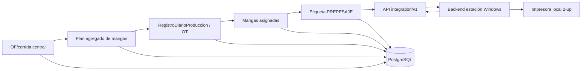

# TS-010C: OT Central, Planificación de Mangas y Etiquetado de Prepesaje

## 1. Estado de la decisión

Esta especificación convierte el primer corte de US-010C en un desarrollo vertical:

```text
OF/corrida liberada
  -> plan agregado de mangas
  -> OT diaria central
  -> asignación de cupos
  -> mangas identificadas
  -> etiquetas PREPESAJE
  -> impresión local 2-up
```

La API y PostgreSQL centrales son la autoridad de la OT, los cupos, las mangas, los correlativos y las etiquetas. La estación Windows ejecuta la impresión física y devuelve su resultado; no crea hechos autoritativos fuera de central.

El desarrollo local fue autorizado e implementado el 2026-07-28 sobre la base
R-core. La ausencia de órdenes técnicas reales adaptadas no se resolvió
inventando moldes ni convirtiendo referencias legacy: para desarrollo se usa un
dataset sintético normalizado y la primera OF real queda como UAT.

Las medidas se obtuvieron del módulo de pesaje productivo: soporte de `109 mm ×
50 mm`, `GAP 3 mm`, 203 DPI y dos columnas de `50 mm` (400 dots), con orígenes
X `24` y `464`. Todavía falta confirmar físicamente alineación, legibilidad y
comportamiento de falla incierta en la impresora piloto.

La asignación de personas a roles se configura al final del desarrollo. Las capacidades sí se crean con la migración y el servidor nunca acepta capacidades declaradas por el frontend.

### 1.1. Delta obligatorio de TS-010P

El corte implementado usa todavía nombres físicos y contratos donde OP significa
la orden técnica. Antes de UAT se adapta sin rehacer el núcleo:

| Implementación local | Contrato objetivo |
|---|---|
| `orden_produccion` técnica | `OrdenFabricacion` |
| `orden_id` de OT | `orden_fabricacion_id` / `orden_operacion_id` |
| OT con cambios de color | OT enlazada a una sola `CorridaFabricacion` |
| `scm_plan_manga_op` | plan de mangas OF |
| código `OP…-OT…-M…` | `OF…-OT…-M…` para mangas nuevas |
| payload visual `op_ot` | `of_ot`, plantilla `PREPESAJE_TSPL_2` |

Los UUID de OT, manga, etiqueta y pesaje permanecen. Los códigos/etiquetas v1
ya emitidos son inmutables y continúan resolviendo por `manga_id`. Véase
[[TS-010P_OP_Demanda_OF_OA_y_Migracion_Documental]].

## 2. Alcance técnico

Incluye:

- evolucionar `RegistroDiarioProduccion` en vez de crear otra cabecera OT;
- generar el correlativo central de OT y el correlativo de manga por OT;
- calcular el plan agregado al liberar o recalcular una OF/corrida;
- asignar cupos del plan a una OT diaria;
- CRUD de Tipos de manga y consumo de reglas de empaque aprobadas;
- crear mangas `NORMAL` y solicitar/aprobar mangas `EXTRA`;
- generar, imprimir e invalidar etiquetas `PREPESAJE`;
- diseño de impresión 2-up con una identidad distinta por columna;
- pantallas centrales de planificación, OT, mangas y autorizaciones;
- adaptador de impresión en la estación;
- auditoría, idempotencia, control optimista y permisos.

No incluye:

- leer la balanza o confirmar pesos: TS-010D;
- crear WIP o ejecutar prearmados: US-010F;
- ingresar una manga a almacén o crear Kardex: US-010I;
- operación offline del flujo SCM;
- borrar una OT, manga o etiqueta que tenga historia;
- convertir el `ControlPeso` legacy en el hecho SCM.

## 3. Arquitectura y propiedad de datos



Reglas:

- las rutas HTTP solo validan transporte y delegan;
- `ScmOtService`, `ScmPlanMangaService`, `ScmMangaService` y `ScmEtiquetaService` son dueños de las transacciones;
- toda mutación usa `ScmOperacion` y `ScmEvento`;
- la estación se autentica con su token técnico existente; el navegador local no conoce ese token;
- `Pesaje`, `PrintAttempt` y `GenerarOrdenTrabajo` legacy permanecen disponibles únicamente en el perfil legacy;
- el perfil SCM no persiste una OT o manga local autoritativa.

## 4. Convenciones persistentes

- PK internas centrales: `Integer`; identidades intercambiadas con estación: UUID.
- Cantidades: `Numeric(15, 3)`; peso unitario: `Numeric(12, 4)` en gramos.
- Tiempo físico: `DateTime(timezone=True)` UTC; fecha productiva: `Date`.
- Zona congelada del piloto: `America/Lima`.
- Códigos visibles no reutilizables: `OT-000001`, `TMG-000001` y `OP0084-OT001-M001`.
- Estados almacenados como `String` con `CheckConstraint`.
- Agregados editables llevan `version > 0`.
- El QR lleva IDs y versión; el código visible no es el contrato de identidad.
- Ningún cálculo de capacidad usa `Float`, `round()` binario ni `MAX(codigo) + 1`.

## 5. Modelo de datos

### 5.1. Evolución de `registro_diario_produccion`

La tabla existente conserva su PK `id`, `maquina_id` y `fecha`.
`fecha` pasa a exponerse como `fecha_operativa`; no se crea `orden_trabajo`
paralela. La FK legacy `orden_id` se migra a OF/corrida según TS-010P.

| Campo nuevo | Tipo | Regla |
|---|---|---|
| `public_id` | UUID | Único; identidad de integración. |
| `codigo_ot` | `String(32)` | Único, generado por el contador `ORDEN_TRABAJO`. |
| `estado` | `String(32)` | `BORRADOR`, `PLANIFICADA`, `EN_EJECUCION`, `CERRADA`, `ANULADA`, `MIGRADA_PENDIENTE_CLASIFICACION`. |
| `timezone_snapshot` | `String(64)` | `America/Lima` en el piloto. |
| `created_at`, `updated_at` | timestamp UTC | Auditoría técnica. |
| `iniciada_at`, `cerrada_at` | timestamp UTC nullable | No sustituyen `fecha_operativa`. |
| `created_by_id` | FK trabajador | Actor real. |
| `version` | integer | Control optimista. |

Para filas legacy:

- `public_id` se rellena;
- `codigo_ot` se rellena como `OT-LEGACY-{id}` y se marca como sintético;
- no se inventa una hora de creación histórica;
- `created_at` puede permanecer nulo con `created_at_source=LEGACY_NO_DISPONIBLE`;
- quedan fuera del piloto hasta conciliación explícita.

### 5.2. Maestros de empaque

US-010R es propietaria del modelo general; este corte consume estas tablas:

| Tabla | Campos mínimos | Restricciones |
|---|---|---|
| `scm_tipo_contenedor` | `id`, `codigo`, `clase`, `nombre`, `material`, dimensiones JSON, `tara_nominal_g`, `tolerancia_tara_g`, `peso_bruto_max_kg`, `activo`, `version`, timestamps | UI filtra `clase=MANGA`; código `TMG-*`; pesos no negativos y bruto máximo positivo |
| `scm_perfil_empacable` | `id`, `codigo`, `nombre`, `activo`, `version` | identidad estable |
| `scm_regla_empaque_revision` | perfil, tipo contenedor, revisión, capacidades, límites, tolerancias, estado, vigencia, hash | solo una revisión `APROBADA` vigente por combinación |

No se implementa una capacidad temporal dentro de `Manga` ni un JSON libre en
OF. TS-010C consume la base R-core implementada localmente.

### 5.3. Plan agregado y asignación diaria

| Tabla | Campos principales | Restricciones |
|---|---|---|
| `scm_plan_manga_op` (físico actual) | `id`, `orden_id`, `revision`, `estado`, `calculado_por_id`, `operation_id`, `content_hash`, timestamps | migra a una revisión activa por OF/corrida |
| `scm_plan_manga_op_linea` | plan, `lote_salida_pieza_color_id`, perfil, regla revisionada, tipo contenedor, cantidad objetivo, capacidad efectiva, mangas propuestas, snapshots de peso/tara/límites | único por plan y salida; cantidades no negativas; capacidad positiva |
| `scm_asignacion_plan_manga_ot` | línea de plan, OT, cantidad asignada, mangas asignadas, actor, fecha | no excede el saldo de la línea bajo lock |

El plan de OF/corrida es agregado: no crea IDs de manga. Las identidades nacen al asignar una OT, cuando ya existen fecha operativa, máquina y maquinista.

El cálculo sigue [[Perfil_Empaque]] y utiliza la menor capacidad entre unidades probadas y límites por peso. La última manga puede ser parcial.

### 5.4. Manga

| Campo | Regla |
|---|---|
| `id` | PK interna. |
| `public_id` | UUID global único. |
| `codigo` | `OP0084-OT001-M001`, global único. |
| `ot_id`, `plan_linea_id` | FKs obligatorias para salida simple. |
| `secuencia_ot` | Única por OT; no se reutiliza. |
| `tipo` | `NORMAL` o `EXTRA`. |
| `estado` | `PLANIFICADA`, `PREETIQUETADA`, `PESADA`, `ETIQUETADA_FINAL`, `PENDIENTE_RECEPCION_ALMACEN`, `ANULADA`. |
| `lote_articulo_id` | FK fuerte a `scm_lote_articulo`; la API deriva `content_lot_type`. En C-core enlaza un `LOTE_SALIDA_PIEZA_COLOR`. |
| snapshots | artículo, pieza-color, color, regla, tipo manga, peso unitario, tara y tolerancias. |
| cantidades | `planificada`, `asignada`, `confirmada` nullable, `contenida` nullable. |
| `maquinista_previsto_id` | Trabajador asignado; sí cuenta para la etiqueta. |
| extra | `motivo_extra_id`, `extra_solicitada_por_id`, `extra_aprobada_por_id`, `extra_aprobada_at`. |
| auditoría | `created_at`, `created_by_id`, `version`. |

Checks:

- `NORMAL` exige asignación de plan;
- `EXTRA` exige motivo y aprobación JP previa;
- cantidad asignada positiva;
- exactamente un lote/artículo principal mediante FK;
- una manga anulada nunca vuelve a activa;
- el cierre de OT se bloquea mientras tenga mangas activas sin pesar o anular.

### 5.5. Etiqueta

`scm_etiqueta_manga` implementa [[Etiqueta_Manga]]:

| Campo | Regla |
|---|---|
| `public_id` | `label_id` UUID único. |
| `manga_id`, `tipo`, `version` | único por manga/tipo/versión. |
| `estado` | `GENERADA`, `IMPRESA`, `FALLIDA_SIN_EMISION`, `EMISION_INCIERTA`, `INVALIDADA`. |
| `print_job_id` | UUID idempotente; puede agrupar 1 o 2 etiquetas. |
| `plantilla_version`, `payload_json`, `payload_hash` | evidencia exacta de lo enviado. |
| impresión | estación, impresor, timestamps, impresora, error técnico. |
| invalidación | actor JP, fecha, motivo y `reemplazada_por_id`. |

Una emisión `IMPRESA` consume el cupo. `EMISION_INCIERTA` se trata conservadoramente como posiblemente consumido hasta que JP invalide y reemplace. `FALLIDA_SIN_EMISION` permite reintentar el mismo `print_job_id`.

El QR `SCM_MANGA_LABEL` contiene:

```json
{
  "v": 1,
  "type": "SCM_MANGA_LABEL",
  "manga_id": "uuid",
  "label_id": "uuid",
  "label_type": "PREPESAJE",
  "label_version": 1
}
```

## 6. Transacciones principales

### 6.1. Liberar o recalcular la OF

1. lock de OF/corrida y revisión activa;
2. resolver salida, artículo, perfil y regla aprobada;
3. calcular capacidades con `Decimal`;
4. crear nueva revisión del plan y su hash;
5. superar la anterior sin editarla;
6. registrar evento.

No puede recalcularse si el cambio deja asignaciones existentes por encima del nuevo plan; primero se concilia.

### 6.2. Crear OT y asignar plan

Una transacción:

1. valida OF/corrida ejecutable, máquina, fecha y actor;
2. reserva `codigo_ot` con contador transaccional;
3. crea/evoluciona `RegistroDiarioProduccion`;
4. bloquea líneas de plan;
5. asigna cupos solicitados;
6. crea mangas y secuencias por OT;
7. guarda snapshots y eventos;
8. devuelve la OT completa.

El mismo `Idempotency-Key` y hash devuelve `201` original; otro hash devuelve `409 IDEMPOTENCY_CONFLICT`.

### 6.3. Impresión

1. central genera de 1 a 2 etiquetas y un `print_job_id`;
2. la estación obtiene el payload mediante API técnica;
3. imprime localmente;
4. acusa por etiqueta `IMPRESA`, `FALLIDA_SIN_EMISION` o `EMISION_INCIERTA`;
5. central actualiza estados sin crear otra OT o manga.

Reemplazar una etiqueta es otro comando, exige JP, invalida la anterior y crea nuevo `label_id`. No existe una acción genérica “reimprimir”.

## 7. API central

Base humana: `/api/scm/v1`. Base técnica de estación: `/api/integration/v1`.

| Método y ruta | Capacidad | Resultado |
|---|---|---|
| `GET /tipos-manga` | autenticado | listado activo/histórico |
| `POST /tipos-manga` | `TIPO_MANGA_ADMINISTRAR` | alta con código automático |
| `PUT /tipos-manga/{id}` | `TIPO_MANGA_ADMINISTRAR` | edición con `version` |
| `DELETE /tipos-manga/{id}` | `TIPO_MANGA_ADMINISTRAR` | baja lógica |
| `GET /ordenes-produccion/{op}/plan-mangas` | `PLAN_MANGA_VER` | revisión y saldo |
| `POST /ordenes-produccion/{op}/plan-mangas/recalcular` | `PLAN_MANGA_ADMINISTRAR` | nueva revisión |
| `POST /ordenes-produccion/{op}/ots` | `OT_CREAR` | OT y asignaciones |
| `GET /ots/{public_id}` | `OT_VER` | detalle y pendientes |
| `POST /ots/{id}/iniciar` | `OT_INICIAR` | transición |
| `POST /ots/{id}/cerrar` | `OT_CERRAR` | cierre si no hay pendientes |
| `POST /ots/{id}/mangas` | `MANGA_PLANIFICAR` | mangas normales |
| `POST /ots/{id}/mangas-extra/solicitudes` | `MANGA_EXTRA_SOLICITAR` | solicitud con motivo |
| `POST /mangas-extra/solicitudes/{id}/aprobar` | `MANGA_EXTRA_APROBAR` | JP crea cupo extra |
| `POST /mangas/{id}/etiquetas-prepesaje` | `MANGA_ETIQUETA_PRE_GENERAR` | reserva impresión |
| `POST /etiquetas/{id}/reemplazos` | `MANGA_ETIQUETA_REEMPLAZAR_APROBAR` | invalida y reemplaza |
| `GET /stations/{station}/print-jobs/{job}` | token estación | payload 1–2 etiquetas |
| `PUT /stations/{station}/print-jobs/{job}/result` | token estación | acuse idempotente |

Todas las mutaciones requieren `Idempotency-Key`. Las ediciones requieren `If-Match` o `version`; un conflicto devuelve `409 VERSION_CONFLICT`.

Errores estables:

- `OP_NOT_EXECUTABLE`
- `PACKAGING_RULE_MISSING`
- `PACKAGING_RULE_NOT_VIABLE`
- `PLAN_BALANCE_EXCEEDED`
- `OT_HAS_PENDING_MANGAS`
- `EXTRA_REQUIRES_JP_APPROVAL`
- `LABEL_ALREADY_EMITTED`
- `LABEL_INVALIDATED`
- `IDEMPOTENCY_CONFLICT`

## 8. Frontend

### 8.1. Aplicación central

- En la lectura de OF: tarjeta “Plan de mangas” por salida, capacidad, mangas propuestas, asignadas y saldo.
- En creación de OT: fecha operativa, máquina, turno, maquinista y asignación de cupos.
- En detalle OT: lista de mangas con estados, cantidad, salida, tipo y etiqueta vigente.
- En autorizaciones: solicitudes de manga extra y reemplazo de etiqueta para JP.
- En maestros: CRUD “Tipos de manga”.

Estados obligatorios: cargando, vacío, error recuperable, conflicto de versión, sin regla aprobada, plan agotado y éxito.

### 8.2. Estación

El perfil `SCM_V2_CONNECTED` añade una pantalla local:

- buscar/leer OT central;
- seleccionar mangas listas;
- generar un trabajo 2-up;
- previsualizar ambas columnas;
- imprimir y reportar cada resultado;
- no editar OF, OT, pieza-color, maquinista, tipo o cantidad.

Cerrar el navegador no detiene el backend local. La estación no abre acceso entrante desde central.

## 9. Seguridad y permisos

Las capacidades y roles semilla se gobiernan por [[Matriz_Roles_Capacidades_SCM_Produccion]]. Este corte siembra, como mínimo:

- `OT_VER`, `OT_CREAR`, `OT_INICIAR`, `OT_CERRAR`;
- `PLAN_MANGA_VER`, `PLAN_MANGA_ADMINISTRAR`;
- `MANGA_PLANIFICAR`, `MANGA_ANULAR`;
- `MANGA_EXTRA_SOLICITAR`, `MANGA_EXTRA_APROBAR`;
- `MANGA_ETIQUETA_PRE_GENERAR`;
- `MANGA_ETIQUETA_REEMPLAZAR_SOLICITAR`, `MANGA_ETIQUETA_REEMPLAZAR_APROBAR`;
- `TIPO_MANGA_ADMINISTRAR`.

`MANGA_EXTRA_APROBAR`, `MANGA_ANULAR` y `MANGA_ETIQUETA_REEMPLAZAR_APROBAR` se asocian al rol semilla `JEFE_PRODUCCION`. Solicitante y aprobador se conservan aunque sean la misma persona solo si la política final lo permite; por defecto se exige actor distinto para una solicitud formal.

La migración no escribe `trabajador_rol`. La asignación a usuarios humanos es una puerta posterior al desarrollo y previa a producción multiusuario.

## 10. Migraciones y compatibilidad

Se implementaron dos revisiones Alembic consecutivas desde `a61c8d2f4e90`:

1. `b72d9e3a5f01`: expansión aditiva de OT y lote SCM fuerte;
2. `c83e0f4b6a12`: plan, asignaciones, mangas, solicitudes extra, trabajos de
   impresión y etiquetas.

La migración es aditiva:

- no renombra ni elimina `registro_diario_produccion.fecha`;
- no elimina correlativos ni pesajes locales legacy;
- amplía `correlativo_catalogo` con `ORDEN_TRABAJO` y `TIPO_MANGA`;
- usa un contador propio bloqueado por OT para `secuencia_ot`, no un `MAX + 1`;
- backfill legacy es determinístico y no finge timestamps;
- downgrade solo se admite en entorno sin hechos SCM nuevos.

La estación añade las migraciones SQLite v7, v8 y v9 para
`scm_label_print_attempt`, con `print_job_id`, `label_id`, hash, resultado,
error y timestamps. Es una bitácora técnica append-only, no una copia
autoritativa de Manga. V8 permite conservar varios intentos de una etiqueta:
`FALLIDA_SIN_EMISION` puede reintentarse; `IMPRESA` y `EMISION_INCIERTA` no se
sobrescriben. V9 conserva `rendered_payload_hash`, el SHA-256 del TSPL exacto
que incorporó la fecha/hora física de ese intento.

## 11. Estrategia de pruebas

### 11.1. Primera prueba RED

`test_plan_op_no_materializa_mangas_hasta_asignar_ot`:

- OF/corrida con salida de 250 unidades y capacidad 100;
- al liberar propone `100/100/50`;
- todavía existen cero mangas;
- al asignar 150 a una OT crea exactamente dos identidades `100/50`.

Debe fallar primero porque hoy no existen plan agregado, regla de empaque ni identidad central de manga.

### 11.2. Mapeo ATDD

| Escenario | Nivel y prueba |
|---|---|
| OTC-01 | integración PostgreSQL: creación central de OT |
| OTC-02 | integración: replay del mismo comando |
| OTC-03 | integración: mismo UUID con otro hash |
| OTC-04 | servicio: OF no ejecutable |
| OTC-05 | contrato estación: fallo de impresión no duplica OT |
| OTC-06 | integración: emisión previa obliga reemplazo |
| OTC-07 | servicio/UI: detalles variables dentro de OT |
| OTC-08 | servicio: manga referencia salida exacta |
| OTC-09 | UI/impresora: dos etiquetas distintas por hoja |
| OTC-10 | UI/impresora: lote impar con segunda columna vacía |
| OTC-11 | integración: anulación auditada de manga no usada |
| OTC-12 | contrato: ningún pesaje crea o infiere OT |
| OTC-13 | E2E: central caída bloquea perfil SCM |
| OTC-14 | servicio: balance de ejecución separado |
| OTC-15 | contrato diferido C/F: prearmado consume saldo WIP |
| OTC-16 | proyección: avance operativo incremental |
| OTC-17 | concurrencia PostgreSQL: un cuerpo, un destino |
| OTC-18 | integración: manga pendiente bloquea cierre |
| OTC-19 | servicio: cantidad simple asignada antes de pesar |
| OTC-20 | validación: sin cantidad autoritativa no se imprime |
| OTC-21 | contrato diferido C/F: crédito en línea conocido |
| OTC-22 | unitario Decimal: cálculo desde revisión aprobada |
| OTC-23 | integración: ausencia de regla bloquea |
| OTC-24 | unitario: override nunca supera límites |
| OTC-25 | integración: plan automático al liberar OF |
| OTC-26 | concurrencia: asignación no excede saldo |
| OTC-27 | integración/seguridad: extra exige JP y motivo |
| OTC-28 | integración: nuevo label, misma manga/cupo |
| OTC-29 | integración: fecha operativa independiente |
| OTC-30 | contrato diferido C/R: salida terminal PT |

OTC-15, OTC-17, OTC-21 y el contenido terminal de OTC-30 prueban contratos compartidos, pero su implementación productiva queda en US-010F/US-010R. C-core no inventa estructuras temporales para satisfacerlos.

### 11.3. Infraestructura real

PostgreSQL real es obligatorio para:

- locks de saldo del plan;
- unicidad de correlativos;
- idempotencia concurrente;
- checks y triggers de inmutabilidad.

Impresora y Windows reales son obligatorios para aprobar 2-up, `EMISION_INCIERTA` y dimensiones. Los tests unitarios no sustituyen esa UAT.

Comandos de baseline antes del primer RED:

```powershell
powershell -ExecutionPolicy Bypass -File .\scripts\test.ps1 -Component backend
powershell -ExecutionPolicy Bypass -File .\scripts\test.ps1 -Component pesaje
cd .\frontend
npm test -- --run
npm run build
cd ..\modulo-pesaje\frontend
npm test -- --run
npm run build
```

Los resultados vigentes están registrados en [[Baseline_TS-010R_C_D_2026-07-24]]. La ejecución del 2026-07-16 se conserva solo como antecedente.

## 12. Observabilidad

Eventos mínimos:

- `OP_MANGA_PLAN_CALCULATED`
- `OT_CREATED`, `OT_STARTED`, `OT_CLOSED`
- `MANGA_PLANNED`, `MANGA_EXTRA_REQUESTED`, `MANGA_EXTRA_APPROVED`
- `PRE_LABEL_GENERATED`, `PRE_LABEL_PRINTED`, `PRE_LABEL_PRINT_UNCERTAIN`
- `LABEL_INVALIDATED`, `LABEL_REPLACED`

Métricas:

- planes sin regla;
- cupos planificados/asignados/impresos;
- mangas extra por motivo;
- trabajos fallidos o inciertos por estación/impresora;
- OT con mangas pendientes.

No se incluyen nombres, tokens, QR completos ni payloads personales en logs.

## 13. Puerta de aprobación

- [x] Autoridad central y frontera de impresión local definidas.
- [x] OT/RDP unificados.
- [x] Manga y etiqueta poseen identidades distintas.
- [x] Plan agregado y creación diaria de identidades separados.
- [x] Manga extra, anulación y reemplazo tienen autorización JP.
- [x] Todos los escenarios OTC tienen nivel de prueba.
- [x] Base R-core disponible para perfiles, reglas y artículos.
- [x] Baseline actual registrada en [[Baseline_TS-010R_C_D_2026-07-24]]; suites rápidas y PostgreSQL verdes.
- [x] Dataset sintético normalizado reproducible validado para desarrollo.
- [ ] Primera OF real del modelo normalizado validada en UAT.
- [ ] Impresora 2-up validada físicamente.
- [x] Aprobación expresa para desarrollo recibida.

## 14. Estado de implementación local — 2026-07-28

- autoridad central de OT, plan, mangas, extras, anulaciones y etiquetas;
- API humana con autorización e idempotencia y API técnica de estación;
- migración aditiva que conserva OT y pesajes legacy sin reinterpretarlos;
- UI central `Producción > OT y mangas`;
- UI local `Etiquetas SCM`;
- plantilla `PREPESAJE_TSPL_1` 2-up con identidad y QR distintos por columna;
- fecha/hora local de impresión visible y hash del TSPL exacto;
- evidencia local append-only y acuse central de impresión;
- roles/capacidades semilla creados, sin asignar personas automáticamente;
- pruebas de servicio, compatibilidad legacy, migraciones SQLite y PostgreSQL,
  contrato 1/2 columnas y reintento tras fallo sin emisión.

El código está listo para UAT local, no para declarar producción. Las puertas
restantes son la adaptación TS-010P, la prueba física en la impresora piloto y la primera OF
normalizada real. El pesaje SCM y la etiqueta final pertenecen a TS-010D.
