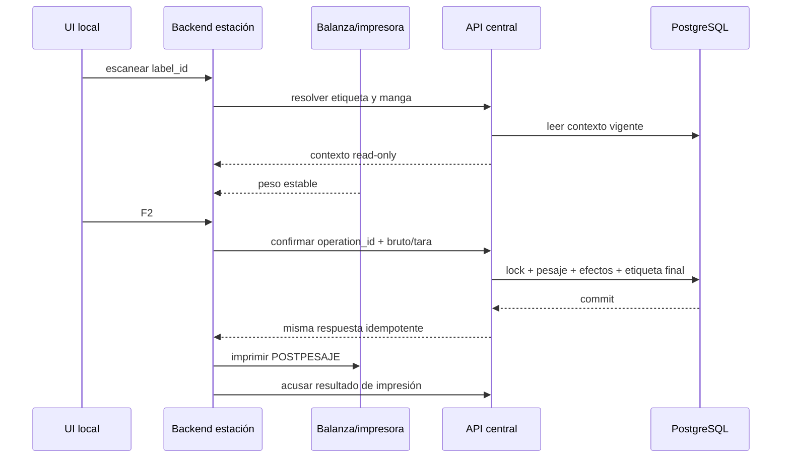

# TS-010D: Pesaje Conectado de Mangas y Etiquetado Final

## 1. Estado de la decisión

Esta especificación implementa `US-010D-core` para mangas de salida simple:

```text
escanear etiqueta PREPESAJE
  -> resolver manga central
  -> capturar bruto estable
  -> aplicar tara
  -> F2
  -> confirmar pesaje idempotente
  -> generar etiqueta POSTPESAJE
  -> imprimir localmente
  -> PENDIENTE_RECEPCION_ALMACEN
```

La estación no solicita OF, OT, pieza, color, cantidad ni maquinista al
operario. Para salida simple, el QR resuelve ese contexto y el pesaje confirma
implícitamente la cantidad asignada. En WIP/PT, la cantidad ya fue confirmada
por Armado y es de solo lectura.

El piloto SCM es conectado: si central no está disponible, F2 permanece bloqueado y no se guarda un hecho de negocio offline. La continuidad offline de `MONITORED_LEGACY` puede coexistir, pero no se convierte en pesaje SCM.

El pesaje no crea `InventarioManga`, `MovimientoKardex`, ubicación ni disponibilidad. US-010D termina en `PENDIENTE_RECEPCION_ALMACEN`; [[US-010I_Ingreso_Almacen_Mangas_y_Nacimiento_Kardex|US-010I]] realizará el nacimiento posterior de Kardex.

El desarrollo local fue autorizado el 2026-07-28. La validación con balanza e
impresora físicas continúa como puerta para producción, no para construir el
incremento local.

### 1.1. Adaptación OP/OF

El núcleo de pesaje no cambia: QR, `manga_id`, captura, idempotencia, tara,
etiqueta final y estado logístico permanecen. Antes de UAT:

- los read models muestran OF–OT, no OP técnica–OT;
- mangas nuevas usan código `OF…-OT…-M…`;
- etiquetas existentes conservan textos/códigos originales;
- la OP de demanda se consulta por asignaciones y no se solicita al operario;
- la plantilla postpesaje recibe la misma evolución de versión que prepesaje.

### 1.2. Adaptación WIP/PT armado

El flujo anterior de “pesaje que confirma implícitamente cantidad” permanece
solo para salida simple de fabricación. Para una manga WIP/PT:

```text
CERRAR_MANGA_ARMADO
  -> cantidad real + BOM + consumos + genealogía
  -> CERRADA_ARMADO_PENDIENTE_PESAJE

CONFIRMAR_PESAJE_MANGA
  -> bruto + tara + neto
  -> PENDIENTE_RECEPCION_ALMACEN
```

La cantidad PT ya fue contada y confirmada por el responsable de Armado. La
estación la muestra como solo lectura y rechaza mangas que no estén cerradas.
Todas las mangas PT requieren pesaje. Un fallo de pesaje no compensa ni revierte
el cierre productivo.

## 2. Alcance técnico

Incluye:

- escaneo y resolución central del QR versionado de etiqueta;
- captura de balanza con estabilidad y tres decimales;
- registro central idempotente de bruto, tara y neto;
- confirmación implícita de la cantidad asignada solo para salida simple;
- lectura de cantidad confirmada por Armado para WIP/PT;
- separación de kg físicos y kg estándar atribuibles a la OT;
- fecha operativa separada de la hora real de pesaje;
- alerta por diferencia superior a un día calendario;
- etiqueta `POSTPESAJE` y bitácora local de impresión;
- simulador SVG 2-up generado desde el mismo payload y coordenadas TSPL;
- reintento seguro ante respuesta perdida;
- reemplazo de etiqueta con autorización JP;
- corrección compensatoria y auditable;
- transición hasta `PENDIENTE_RECEPCION_ALMACEN`;
- vistas de operación y consulta en tiempo real.

No incluye:

- crear OT, cupos o mangas: TS-010C;
- confirmar una cantidad digitada por el maquinista;
- inferir unidades desde kg;
- operar sin conexión;
- ingresar almacén o crear Kardex;
- ejecutar transformaciones WIP/producto completo: US-010F las cierra antes de
  llegar a Balanza;
- reutilizar `POST /api/sync/pesajes` como contrato final.

## 3. Arquitectura



La regla crítica es “central primero, impresión después”. Una impresión fallida nunca revierte un pesaje confirmado.

Componentes:

- central: `ScmMangaQueryService`, `ScmPesajeMangaService`, `ScmCorreccionPesajeService`, `ScmEtiquetaService`;
- estación: ampliar `CentralApiClient`, coordinador F2, adaptador de balanza y `ScmLabelPrintAttempt`;
- frontend estación: pantalla SCM separada del flujo legacy;
- frontend central: consulta de pesajes, alertas y correcciones.

## 4. Modelo central

### 4.1. `scm_pesaje_manga`

| Campo | Tipo/regla |
|---|---|
| `id`, `public_id` | PK interna y UUID global. |
| `manga_id` | FK única para el pesaje inicial vigente. |
| `operation_id` | FK única a `scm_operacion`. |
| `source_system`, `station_id` | identidad técnica de origen. |
| `capture_id` | UUID hijo determinístico. |
| `peso_bruto_kg` | `Numeric(15,3)`, positivo. |
| `tara_kg` | `Numeric(15,3)`, no negativa y menor que bruto. |
| `peso_fisico_neto_kg` | `Numeric(15,3)`, bruto menos tara. |
| `tara_fuente` | `TIPO_MANGA`, `MEDIDA_AUTORIZADA` o `CORRECCION`. |
| `cantidad_confirmada` | copia exacta de cantidad asignada en flujo normal. |
| `fuente_cantidad` | `PLAN_CONFIRMADO_POR_PESAJE`. |
| `kg_produccion_ot` | `Numeric(15,3)`, masa estándar atribuible a la OT. |
| `pesada_at` | timestamp UTC del hecho. |
| `timezone_snapshot` | `America/Lima`. |
| `fecha_local_pesaje` | date derivada para auditoría. |
| `dias_desfase_operativo` | entero firmado contra `OT.fecha_operativa`. |
| `alerta_fecha` | boolean. |
| `motivo_desfase_id`, `motivo_desfase_texto` | opcionales; pueden enriquecer la alerta sin bloquear al Maquinista. |
| `pesado_por_id` | actor real de sesión. |
| snapshots | OT, OF/corrida, maquinista previsto, contenido, tipo de manga y regla. |
| `created_at` | timestamp UTC. |

Checks:

- pesos con máximo tres decimales de kg;
- `neto = bruto - tara`;
- cantidad confirmada positiva;
- antes de fecha operativa se rechaza salvo comando de corrección autorizado;
- más de un día posterior exige motivo;
- `manga_id`, `operation_id` y `(source_system, capture_id)` son únicos.

No contiene `ubicacion_id`, `estado_inventario` editable ni FK a `MovimientoKardex`.

### 4.2. Correcciones

`scm_correccion_pesaje_manga` conserva:

- pesaje original;
- estado `PENDIENTE`, `RECHAZADA`, `APLICADA`;
- valores propuestos de bruto, tara, cantidad o fecha;
- motivo y evidencia;
- solicitante y aprobador;
- evento de compensación;
- nueva proyección vigente.

El hecho original no se actualiza ni elimina. Si US-010I ya ingresó la manga, una corrección que afecte inventario requiere un flujo compensatorio de US-010I; D no escribe el Kardex directamente.

### 4.3. Estado de manga y etiqueta final

En la transacción de pesaje:

1. `PREETIQUETADA -> PESADA`;
2. se crea `scm_pesaje_manga`;
3. se genera etiqueta `POSTPESAJE` `GENERADA`.

Después del acuse de impresión:

- `IMPRESA` lleva la manga a `ETIQUETADA_FINAL`;
- el servicio la proyecta inmediatamente a `PENDIENTE_RECEPCION_ALMACEN`;
- `FALLIDA_SIN_EMISION` permite reintentar el mismo trabajo;
- `EMISION_INCIERTA` mantiene el pesaje y exige reemplazo JP;
- la etiqueta `PREPESAJE` continúa válida para comprobar identidad.

La transición final no crea inventario. Se expone:

```json
{
  "estado": "PENDIENTE_RECEPCION_ALMACEN",
  "estado_inventario": "NO_INGRESADA",
  "ubicacion_id": null
}
```

## 5. Cálculos

### 5.1. Peso físico

```text
peso_fisico_neto_kg =
  quantize_0_001(peso_bruto_kg - tara_kg)
```

La tara predeterminada es el snapshot del Tipo de manga. Un override exige capacidad, motivo y actor. La estación no altera el valor maestro.

### 5.2. Cantidad

```text
cantidad_confirmada = manga.cantidad_asignada
fuente_cantidad = PLAN_CONFIRMADO_POR_PESAJE
```

No existe input de cantidad en el flujo normal. Una diferencia posterior es una corrección autorizada, no una edición del pesaje.

### 5.3. Kg de producción de la OT

Para una salida simple:

```text
kg_produccion_ot =
  cantidad_confirmada
  * peso_unitario_snapshot_gr
  / 1000
```

Para WIP o producto transformado, US-010F provee las atribuciones por componente. El neto físico nunca se asigna íntegramente a la OT cuando contiene piezas de producción anterior.

### 5.4. Fecha operativa

```text
fecha_local_pesaje = date(pesada_at at time zone timezone_snapshot)
dias_desfase = fecha_local_pesaje - ot.fecha_operativa
```

- `0`: normal;
- `1`: permitido sin alerta bloqueante;
- `>1`: permitido con alerta no bloqueante;
- `<0`: bloqueado salvo corrección autorizada.

El avance siempre se agrupa por `OT.fecha_operativa`.

## 6. Transacción `CONFIRMAR_PESAJE_MANGA`

Request:

```json
{
  "operation_id": "uuid",
  "label_id": "uuid",
  "capture_id": "uuid-deterministico",
  "peso_bruto_kg": "25.420",
  "tara_kg": "0.120",
  "tara_fuente": "TIPO_MANGA",
  "pesada_at": "2026-07-24T12:31:09-05:00",
  "motivo_desfase_id": null
}
```

Algoritmo:

1. canonicalizar request y resolver `ScmOperacion`;
2. si existe mismo operation/hash, devolver la respuesta guardada;
3. si existe operation con otro hash, `409`;
4. lock de etiqueta, manga, OT, asignación y saldo WIP simple;
5. validar token de estación, actor humano, etiqueta vigente y estado;
6. validar fecha, tara, estabilidad y cantidad asignada;
7. calcular neto y kg de OT con `Decimal`;
8. debitar la reserva/saldo de salida simple por la cantidad confirmada;
9. crear pesaje y snapshots;
10. cambiar estado y generar etiqueta final;
11. registrar eventos y respuesta idempotente;
12. commit único.

Una cantidad menor a la asignada se procesa solamente mediante comando de conciliación/corrección y libera remanente en la misma transacción. Una mayor nunca aplica un débito parcial.

## 7. API

### 7.1. Integración estación

| Método y ruta | Uso |
|---|---|
| `GET /api/integration/v1/manga-labels/{label_id}/resolve` | contexto read-only |
| `POST /api/integration/v1/manga-weighings` | confirmar pesaje simple |
| `GET /api/integration/v1/operations/{operation_id}` | recuperar acuse perdido |
| `GET /api/integration/v1/labels/{label_id}/print-payload` | etiqueta final |
| `PUT /api/integration/v1/labels/{label_id}/print-result` | acuse de impresión |

La estación envía:

- `Authorization: Bearer <station-token>`;
- `Idempotency-Key: <operation_id>`;
- `X-Station-Version`;
- `X-Correlation-Id`.

El actor humano se resuelve desde una sesión local autenticada o un mecanismo provisional gobernado; no se acepta `actor_id` arbitrario como autoridad.

### 7.2. API humana

| Método y ruta | Capacidad |
|---|---|
| `GET /api/scm/v1/mangas/{id}/pesaje` | `MANGA_PESAJE_VER` |
| `POST /api/scm/v1/pesajes/{id}/correcciones` | `PESAJE_CORRECCION_SOLICITAR` |
| `POST /api/scm/v1/correcciones-pesaje/{id}/aprobar` | `PESAJE_CORRECCION_APROBAR` |
| `POST /api/scm/v1/etiquetas/{id}/reemplazos` | `MANGA_ETIQUETA_REEMPLAZAR_APROBAR` |
| `GET /api/scm/v1/ots/{id}/avance` | `OT_VER` |

Errores estables:

- `CENTRAL_CONNECTION_REQUIRED`
- `LABEL_INVALIDATED`
- `MANGA_ALREADY_WEIGHED`
- `MANGA_NOT_READY`
- `SCALE_READING_UNSTABLE`
- `INVALID_TARE`
- `OPERATIONAL_DATE_IN_FUTURE`
- `RESERVATION_EXPIRED`
- `QUANTITY_RECONCILIATION_REQUIRED`
- `IDEMPOTENCY_CONFLICT`

## 8. Estación Windows

### 8.1. Persistencia local

No se reutiliza `Pesaje` legacy para el hecho SCM. Se añade:

`scm_label_print_attempt`

- `id`;
- `operation_id`, `capture_id`, `manga_id`, `label_id`, `print_job_id`;
- `payload_hash`;
- `printer_name`;
- `attempted_at_utc`, `completed_at_utc`;
- `result=PENDING|SUCCEEDED|FAILED|UNCERTAIN`;
- error técnico.

Puede conservar la respuesta central para recuperación de impresión, pero no admite crear un pesaje si central no confirmó.

### 8.2. Interacción

1. escanear;
2. mostrar OF-OT, manga, maquinista, pieza-color, color, tipo y cantidad como solo lectura;
3. mostrar bruto, tara y neto con tres decimales;
4. habilitar F2 solo con lectura estable y central disponible;
5. deshabilitar F2 al primer submit;
6. recuperar por `operation_id` si la respuesta se pierde;
7. imprimir etiqueta final;
8. mostrar resultado y quedar lista para el siguiente escaneo.

Una misma persona puede ser maquinista y operador de balanza; se conservan ambos roles contextuales.

### 8.3. Etiqueta final

Visible y compacta:

- fecha/hora impresión;
- fecha OT;
- `OF-OT`;
- maquinista;
- pieza-color/artículo;
- color;
- código manga;
- `NORMAL` o `EXTRA`;
- `KG FÍSICO`;
- `KG PROD. OT`;
- QR `SCM_MANGA_LABEL`.

El payload exacto y la plantilla quedan versionados. El diseño sigue siendo 2-up.

## 9. Seguridad

Se aplica [[Matriz_Roles_Capacidades_SCM_Produccion]]. Capacidades mínimas:

- `MANGA_PESAR`;
- `MANGA_PESAJE_VER`;
- `MANGA_ETIQUETA_POST_IMPRIMIR`;
- `MANGA_ETIQUETA_REEMPLAZAR_SOLICITAR`;
- `MANGA_ETIQUETA_REEMPLAZAR_APROBAR`;
- `PESAJE_CORRECCION_SOLICITAR`;
- `PESAJE_CORRECCION_APROBAR`;
- `PESAJE_TARA_OVERRIDE`.

La estación solo puede operar sobre mangas resueltas por central y registra `station_id`. El rol semilla `JEFE_PRODUCCION` aprueba reemplazos; la política de aprobación de correcciones se asigna al cierre de desarrollo.

La migración crea roles/capacidades y sus asociaciones, pero nunca asigna roles a trabajadores. Token técnico de estación y autorización del actor humano son controles independientes.

## 10. Migraciones y compatibilidad

Central añade una revisión Alembic posterior a TS-010C:

- `scm_pesaje_manga`;
- `scm_correccion_pesaje_manga`;
- checks, índices y triggers append-only;
- capacidades nuevas.

La estación añade la tabla SQLite de intentos de impresión y una bandera de perfil `SCM_V2_CONNECTED`.

Compatibilidad:

- `/api/sync/pesajes` sigue deshabilitado en el perfil SCM;
- `Pesaje`, `ControlPeso` e `InventarioManga` legacy no se migran automáticamente;
- QR posicional con `;` no es aceptado como identidad SCM;
- no se cambia el significado histórico de `registro_diario_produccion.total_kg_real`; las vistas nuevas consultan la proyección SCM.

## 11. Estrategia de pruebas

### 11.1. Primera prueba RED

`test_confirmar_pesaje_no_crea_kardex`:

- manga simple preetiquetada y cantidad asignada;
- confirmar bruto `25.420`, tara `0.120`;
- existe un único pesaje `25.300`;
- manga queda pendiente de recepción;
- `MovimientoKardex` e `InventarioManga` no cambian.

Debe fallar antes de implementar porque hoy el modelo SCM de manga/pesaje no existe y el modelo legacy mezcla pesaje con otras proyecciones.

### 11.2. Mapeo ATDD

| Escenario | Nivel y prueba |
|---|---|
| PSD-01 | contrato/UI: escaneo resuelve contexto read-only |
| PSD-02 | integración: bruto/tara/neto y cantidad implícita |
| PSD-03 | concurrencia estación/central: doble F2 |
| PSD-04 | integración: replay tras respuesta perdida |
| PSD-05 | integración: mismo UUID, peso distinto |
| PSD-06 | API/UI: manga ya pesada |
| PSD-07 | estación/integración: impresión incierta y reemplazo |
| PSD-08 | E2E: central caída bloquea F2 sin fila local |
| PSD-09 | servicio: manga anulada/no lista |
| PSD-10 | integración: previsto y actor real distintos |
| PSD-11 | contrato: QR legacy rechazado/conciliado |
| PSD-12 | integración: corrección compensatoria |
| PSD-13 | contrato D/F: neto compuesto separado de crédito |
| PSD-14 | integración D/F: replay compuesto |
| PSD-15 | integración: manga pendiente bloquea cierre OT |
| PSD-16 | contrato D/F: cierre contextual |
| PSD-17 | corrección: plan 100, confirmación corregida 98 |
| PSD-18 | integración: reserva vencida |
| PSD-19 | unitario/contrato D/F: IDs hijos determinísticos |
| PSD-20 | integración: 98 libera 2; 102 no debita parcial |
| PSD-21 | unitario/integración: desfase 0, 1 y >1 |
| PSD-22 | integración PostgreSQL: cero Kardex |
| PSD-23 | contrato: QR invalidado señala vigente |

PSD-13, PSD-14, PSD-16 y PSD-19 se implementan con el adaptador US-010F. D-core fija el contrato y no simula genealogía con porcentajes.

### 11.3. Pruebas de propiedad

- `neto == bruto - tara`;
- ninguna respuesta produce más de tres decimales;
- replay no aumenta conteos;
- el peso nunca determina cantidad;
- `dias_desfase` usa fecha local de Lima;
- toda manga pesada queda sin ubicación hasta US-010I.

### 11.4. Infraestructura y baseline

PostgreSQL real: locks, idempotencia y append-only.  
Balanza real: estabilidad, precisión y COM.  
Impresora real: 2-up, fallo antes/después de emisión y lectura QR.

Baseline requerida:

```powershell
powershell -ExecutionPolicy Bypass -File .\scripts\test.ps1 -Component backend
powershell -ExecutionPolicy Bypass -File .\scripts\test.ps1 -Component pesaje
powershell -ExecutionPolicy Bypass -File .\scripts\test-sync-e2e.ps1
cd .\frontend
npm test -- --run
npm run build
cd ..\modulo-pesaje\frontend
npm test -- --run
npm run build
```

La baseline del 2026-07-16 sirve como antecedente de TE-004, no como línea base vigente de TS-010D.

## 12. Observabilidad

Eventos:

- `MANGA_SCAN_RESOLVED`
- `MANGA_WEIGHING_CONFIRMED`
- `MANGA_WEIGHING_REPLAYED`
- `MANGA_WEIGHING_DATE_DRIFT`
- `POST_LABEL_GENERATED`, `POST_LABEL_PRINTED`, `POST_LABEL_PRINT_UNCERTAIN`
- `WEIGHING_CORRECTION_REQUESTED`, `WEIGHING_CORRECTION_APPLIED`
- `MANGA_PENDING_WAREHOUSE`

Métricas:

- pesajes confirmados/rechazados por estación;
- latencia F2 a commit;
- replays e idempotency conflicts;
- diferencia peso físico vs teórico;
- pesajes con desfase >1 día;
- etiquetas finales fallidas/inciertas;
- mangas pendientes de almacén.

Los logs no incluyen token, QR completo ni datos personales innecesarios.

## 13. Rollout y rollback

1. desplegar esquema central con rutas deshabilitadas;
2. desplegar estación con `SCM_V2_CONNECTED=false`;
3. validar contrato y token en staging;
4. ejecutar UAT física con OF/OT de prueba;
5. activar una sola estación;
6. observar y ampliar.

El kill switch deshabilita nuevas confirmaciones SCM, no elimina pesos ya aceptados. El rollback de aplicación debe seguir leyendo hechos nuevos; no se ejecuta downgrade destructivo después del primer pesaje.

## 14. Puerta de aprobación

- [x] Flujo conectado y autoridad central definidos.
- [x] Actor, cantidad, fecha operativa y tiempo físico separados.
- [x] Peso físico y kg de producción OT separados.
- [x] Impresión fallida no revierte el pesaje.
- [x] Manga termina sin Kardex.
- [x] Todos los escenarios PSD tienen nivel de prueba.
- [x] TS-010C aprobada e implementada localmente.
- [x] Baseline vigente registrada en [[Baseline_TS-010R_C_D_2026-07-24]]; suites rápidas y PostgreSQL verdes.
- [ ] Balanza e impresora reales validadas.
- [ ] Dataset real de manga simple validado.
- [x] Aprobación expresa para desarrollo local recibida el 2026-07-28.

## 15. Avance de implementación local — 2026-07-28

- [x] Simulador web de `PREPESAJE_TSPL_1` a 109 × 50 mm, 203 DPI y 2-up.
- [x] QR real incluido en la imagen SVG de prueba.
- [x] Primer modelo/migración append-only de `scm_pesaje_manga`.
- [x] Esquema de etiquetas ampliado para `POSTPESAJE`.
- [x] Confirmación central idempotente y resolución por QR.
- [x] Coordinador F2 conectado y etiqueta `POSTPESAJE_TSPL_1`.
- [x] Acuse y recuperación de operación postpesaje.
- [x] UI local de operación SCM sin inputs de contexto/peso/tara.
- [x] Migración central aplicada exclusivamente a `enva_test`.
- [x] Reemplazo y corrección postpesaje desde UI central.
- [x] Consulta central de pesaje original, proyección vigente e historial.
- [x] QR alineado al sticker productivo de pesaje: `L`, módulo `4`,
  `X + 120` y preview `120 × 120 dots`.
- [x] Migración de correcciones `e05a2c8d4f31` validada en PostgreSQL y
  aplicada exclusivamente a `enva_test`.
- [x] Regresión local: 64 SCM central, 13 PostgreSQL, 96 backend de estación,
  18 frontend de estación y 93 frontend central.
- [ ] UAT con balanza e impresora físicas.
