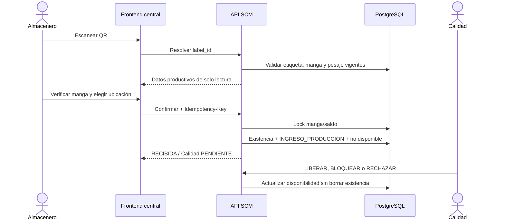

# TS-010I: Recepción de Mangas y Nacimiento de Kardex

## 1. Resultado implementado

El incremento local implementa la frontera autoritativa:

```text
PENDIENTE_RECEPCION_ALMACEN
  -> escaneo QR + verificación física + ubicación compatible
  -> RECIBIDA / existencia física / INGRESO_PRODUCCION
  -> Calidad PENDIENTE (no disponible)
  -> LIBERADA | BLOQUEADA | RECHAZADA
```

El pesaje no crea inventario. Almacén no vuelve a pesar ni contar y no puede
editar artículo, color, cantidad o pesos. Solo Calidad `LIBERADA` aporta saldo
libre a Planificación.

## 2. Alcance

Incluye:

- resolución central por QR final;
- uso alternativo de la preetiqueta solo si central encuentra pesaje y
  etiqueta final impresa vigentes;
- búsqueda manual por código con capacidad específica;
- sesiones opcionales de recepción por almacenero y punto de ingreso;
- verificación de presencia, bolsa cerrada/sin daño y coincidencia de etiquetas;
- rechazo previo sin nacimiento de inventario;
- ubicación activa compatible con la clase de `ArticuloSCM`;
- existencia física 1:1 con la manga;
- movimiento `INGRESO_PRODUCCION` y saldo físico/no disponible en una sola
  transacción idempotente;
- decisiones posteriores `LIBERADA`, `BLOQUEADA` y `RECHAZADA`;
- propagación compensatoria al Kardex si se aprueba una corrección de cantidad
  o peso después de la recepción;
- frontend central para lector QR, custodia, rechazos y Calidad.

No incluye todavía:

- criterios concretos de inspección por clase de artículo; gerencia, Calidad y
  Producción deben definirlos;
- reversa excepcional completa con solicitud y aprobación segregada;
- picking, traslado y consumo de la existencia: TS-010H;
- recepción offline;
- decisión masiva de Calidad.

## 3. Arquitectura



## 4. Modelo persistente

### 4.1. Cambios al saldo agregado

`scm_saldo_inventario` añade:

| Campo | Regla |
|---|---|
| `cantidad_no_disponible` | `Numeric(15,3)`, no negativa |

```text
cantidad_libre =
  cantidad_fisica - cantidad_reservada - cantidad_no_disponible
```

Constraint:

```text
reservada + no_disponible <= fisica
```

### 4.2. Compatibilidad de ubicación

`scm_ubicacion_inventario.clases_articulo_json` enumera las clases admitidas.
Una lista vacía significa ubicación general. Semillas del piloto:

| Código | Clases |
|---|---|
| `RECEPCION_PIEZAS_WIP` | `PIEZA_COLOR`, `SUBENSAMBLE_WIP` |
| `RECEPCION_PT` | `PRODUCTO_TERMINADO` |

### 4.3. `scm_sesion_recepcion_manga`

Agrupa actor, punto de ingreso, apertura y cierre. No vuelve atómica una
recepción múltiple: cada manga conserva comando y resultado propios.

### 4.4. `scm_existencia_manga`

Proyección física 1:1 por `manga_id`:

- etiqueta resuelta y forma de resolución;
- artículo, saldo y ubicación;
- movimiento inicial;
- cantidad y peso neto snapshot;
- actor/fecha de recepción;
- estado logístico `RECIBIDA_ALMACEN | REVERSADA`;
- Calidad `PENDIENTE | LIBERADA | BLOQUEADA | RECHAZADA`;
- actor, fecha, motivo y evidencia de Calidad;
- `version` para concurrencia optimista.

### 4.5. `scm_rechazo_recepcion_manga`

Registro append-only de una negativa previa a custodia. No cambia la manga, no
crea saldo y no genera `INGRESO_PRODUCCION`.

## 5. Resolución de identidad

1. `POSTPESAJE` impresa: resolución `QR_FINAL`.
2. `PREPESAJE` impresa: resolución `QR_PREETIQUETA`, únicamente cuando central
   confirma una etiqueta final impresa vigente de la misma manga.
3. código visible: `CODIGO_MANUAL`, exige capacidad específica.

Una etiqueta invalidada, no impresa o de una manga anulada no es recibible. El
QR solo transporta identidad; cantidades y pesos se leen de central.

## 6. Transacción `CONFIRMAR_RECEPCION_MANGA`

Request:

```json
{
  "label_id": "uuid",
  "sesion_id": "uuid-opcional",
  "ubicacion_codigo": "RECEPCION_PIEZAS_WIP",
  "presencia_confirmada": true,
  "bolsa_cerrada": true,
  "coincidencia_etiquetas": true
}
```

Algoritmo:

1. validar actor e `Idempotency-Key`;
2. resolver identidad y comprobar pesaje final;
3. bloquear manga y saldo por artículo/ubicación;
4. rechazar segunda existencia o ubicación incompatible;
5. sumar cantidad confirmada al físico y no disponible;
6. crear `INGRESO_PRODUCCION`;
7. crear existencia 1:1 con Calidad `PENDIENTE`;
8. cambiar manga a `RECIBIDA`;
9. persistir evento y respuesta idempotente;
10. commit único.

Un replay exacto devuelve la respuesta anterior. La misma clave con otro
request responde conflicto. Otra clave para la misma manga responde
`MANGA_YA_RECIBIDA`.

## 7. Calidad y disponibilidad

| Decisión | Físico | No disponible | Libre |
|---|---:|---:|---:|
| `PENDIENTE` | conserva | incluye manga | 0 para esa manga |
| `LIBERADA` | conserva | retira manga | físico menos reserva |
| `BLOQUEADA` | conserva | incluye manga | 0 |
| `RECHAZADA` | conserva | incluye manga | 0 |

Una manga liberada no puede bloquearse o rechazarse si posee reserva propia.
La decisión exige `version`, motivo y capacidad correspondiente.

## 8. Corrección posterior al ingreso

La aprobación de una corrección de pesaje consulta si existe una manga bajo
custodia. Si existe:

1. bloquea existencia y saldo;
2. calcula diferencia de cantidad contra el snapshot recibido;
3. valida reservas y no disponibilidad;
4. crea `AJUSTE_POSITIVO` o `AJUSTE_NEGATIVO` enlazado a la corrección;
5. actualiza cantidad/peso snapshot;
6. conserva manga `RECIBIDA` y la recepción original auditable.

No sobrescribe el movimiento inicial ni vuelve a pedir recepción.

## 9. API central

| Método y ruta | Capacidad | Uso |
|---|---|---|
| `GET /api/scm/v1/recepcion-mangas` | `RECEPCION_MANGA_VER` | pendientes, existencias, rechazos y ubicaciones |
| `GET /recepcion-mangas/resolver-etiqueta/{label_id}` | `RECEPCION_MANGA_VER` | contexto read-only |
| `GET /recepcion-mangas/resolver-codigo/{codigo}` | `RECEPCION_MANGA_BUSCAR_MANUAL` | contingencia manual |
| `POST /recepcion-mangas/sesiones` | `RECEPCION_MANGA_CONFIRMAR` | abrir sesión |
| `POST /recepcion-mangas/sesiones/{id}/cerrar` | `RECEPCION_MANGA_CONFIRMAR` | cerrar sesión propia |
| `POST /recepcion-mangas/confirmar` | `RECEPCION_MANGA_CONFIRMAR` | aceptar custodia |
| `POST /recepcion-mangas/rechazar` | `RECEPCION_MANGA_RECHAZAR` | rechazo previo |
| `POST /recepcion-mangas/{existencia_id}/calidad` | capacidad por decisión | disponibilidad posterior |

Los comandos exigen `X-Actor-Id` e `Idempotency-Key: UUID`.

## 10. UX por actor

### Almacén

- foco automático en el campo compatible con lector QR;
- no requiere mouse para resolver un escaneo terminado en Enter;
- muestra cantidad/pesos/OT/fecha como solo lectura;
- preselecciona ubicación compatible;
- exige tres checks físicos explícitos;
- comunica que aceptar custodia crea físico bloqueado, no saldo libre;
- permite registrar rechazo sin crear inventario.

### Calidad

- entra directamente a custodia/Calidad;
- ve manga, artículo, ubicación, cantidad y estado;
- registra decisión, motivo y evidencia;
- no puede editar el hecho productivo.

### Consulta

- Kardex muestra físico, reservado, no disponible y libre por separado.

## 11. Roles iniciales

- `ALMACEN_RECEPCION`: ver, confirmar, rechazar y búsqueda manual;
- `CALIDAD`: ver, liberar, bloquear y rechazar;
- `JEFE_PRODUCCION`, `SUPERVISOR`, `GERENCIA`, `AUDITORIA_CONSULTA`: consulta;
- la reversa futura pertenecerá al solicitante y al Jefe de Producción con
  segregación de actores.

## 12. Errores funcionales

- `ETIQUETA_INVALIDADA`;
- `PESAJE_FINAL_REQUERIDO`;
- `MANGA_NO_RECIBIBLE`;
- `MANGA_YA_RECIBIDA`;
- `VERIFICACION_FISICA_INCOMPLETA`;
- `UBICACION_INCOMPATIBLE`;
- `SESION_RECEPCION_INVALIDA`;
- `CONFLICTO_CONCURRENCIA`;
- `RECEIVED_MANGA_INVENTORY_CONFLICT`.

La UI muestra el mensaje del dominio y conserva el contexto accionable.

## 13. Migración

Revisión `f51d9a7c6b24`, posterior a `f50c8a6b4e13`:

- añade campos de ubicación y no disponibilidad;
- reemplaza checks de saldo y manga;
- crea las tres tablas de recepción;
- crea capacidades y asociaciones iniciales;
- crea ubicaciones piloto idempotentes.

La migración no altera pesajes legacy ni inventa mangas para el conteo inicial.

## 14. Pruebas

Pruebas automatizadas cubren:

- pesar e imprimir no crea inventario;
- recepción crea una existencia y un solo movimiento;
- replay no duplica existencia, movimiento ni saldo;
- Calidad pendiente mantiene libre cero;
- liberar vuelve disponible la cantidad;
- corrección posterior crea ajuste compensatorio y conserva `RECIBIDA`;
- cálculo de cobertura resta `cantidad_no_disponible`.
- la vista de Almacén confirma las tres verificaciones sin redigitar cantidad;
- la vista de Calidad oculta el escaneo y registra una decisión auditada.

Comandos:

```text
backend\.venv\Scripts\python.exe -m pytest tests\scm\test_scm_ot_service.py -q
backend\.venv\Scripts\python.exe -m pytest tests\scm\test_scm_inventory_pilot.py -q
npm.cmd run build
```

## 15. Puertas pendientes

1. [x] ejecutar migración y semilla en PostgreSQL local;
2. [ ] UAT con lector QR real;
3. [ ] validar con Calidad qué atributos inspecciona por clase;
4. [ ] diseñar/implementar reversa excepcional segregada;
5. [ ] aprobar US-010H con Producción, Armado y Almacén y completar su TS;
6. [ ] no desplegar a central hasta aprobar las puertas anteriores.

La verificación local del 2026-08-03 cerró con 72 pruebas SCM backend, 98
pruebas frontend completas en ejecución secuencial, 2 pruebas focalizadas de
esta vista, build de producción y recorrido visual de escritorio/móvil por los
roles `ALMACEN_RECEPCION` y `CALIDAD`.
