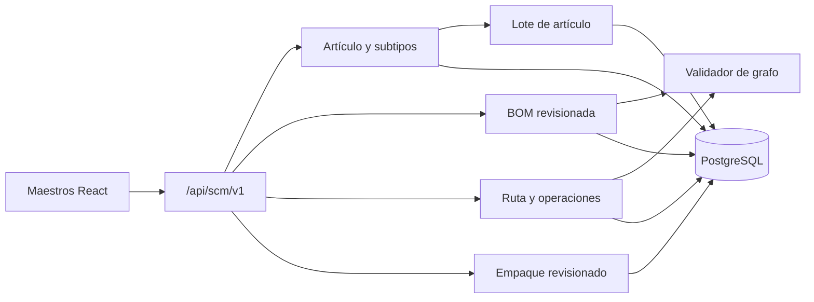

# TS-010R: Artículos, BOM, Rutas, WIP y Perfiles de Empaque

## 1. Estado de la decisión

US-010R reemplaza el kit autorreferencial de `PiezaColor` con un modelo industrial normalizado:

```text
Artículo SCM
  -> Estructura/BOM revisionada
  -> Ruta revisionada
  -> Operaciones con una autoridad
  -> Lotes de pieza, WIP o producto
  -> Perfil y regla de empaque revisionada
```

La especificación integral conserva pendientes una ruta real completa, mediciones físicas de mangas y la política de Calidad en proceso. El 2026-07-24 el usuario responsable aprobó expresamente el corte técnico `R-core` para construir los maestros que desbloquean TS-010C. R-runtime/F permanece en refinamiento.

Se confirmó que no existían kits operativos que debieran convertirse. Los
fixtures de demostración fueron retirados, la evidencia local quedó en cero y
el contract `a61c8d2f4e90` fue aplicado en `enva_test` el 2026-07-25. La misma
revisión continúa bloqueándose ante cualquier fila encontrada en otro ambiente.

Los roles y capacidades se crean durante el desarrollo según [[Matriz_Roles_Capacidades_SCM_Produccion]]. No se asignan automáticamente a trabajadores.

## 2. Cortes de implementación

### 2.1. R-core — requerido por TS-010C

- identidad común de artículos y subtipos 1:1;
- BOM multinivel y aprobación sin ciclos;
- rutas, operaciones, precedencias y autoridad ejecutora;
- Tipo de contenedor, Perfil empacable y Regla de empaque;
- CRUD y aprobaciones;
- retiro funcional de `KIT` en API/frontend;
- fase expand y verificación reproducible del legacy.

### 2.2. R-runtime — entregado antes de US-010F

- lote común de artículo y subtipos pieza/WIP/PT;
- saldo y reserva de piezas buenas en proceso;
- cabeceras de Orden/Ejecución de operación;
- contrato de genealogía;
- tablas que US-010F usará para consumos y acreditaciones.

TS-010C puede comenzar después de R-core. Los escenarios de ejecución WIP permanecen rojos hasta R-runtime + US-010F.

## 3. Alcance y exclusiones

Incluye:

- maestros y revisiones de artículo, BOM, ruta y empaque;
- validación de grafos y snapshots;
- supertipo relacional de lote para evitar FKs polimórficas débiles;
- base de saldo WIP de piezas sueltas;
- códigos automáticos `WIP-*`;
- autorización server-side y segregación creador/aprobador;
- migración expand/contract del kit no utilizado;
- frontend de maestros.

No incluye:

- solver de planificación de demanda: US-010P;
- confirmar operaciones/consumos reales: US-010F;
- pesar: US-010D;
- recibir en almacén: US-010I;
- costeo, despacho o IA;
- inventar capacidades físicas todavía no medidas;
- migrar automáticamente kits de demo a datos productivos.

## 4. Arquitectura



Servicios:

- `ScmArticuloService`;
- `ScmEstructuraService`;
- `ScmRutaService`;
- `ScmEmpaqueService`;
- `ScmGraphValidationService`;
- `ScmLoteArticuloService`;
- `ScmWipBalanceService`.

Las rutas no administran transacciones. Aprobaciones, retiros y cambios de saldo usan `ScmOperacion` y `ScmEvento`.

## 5. Convenciones

- PK internas: `Integer`; identidad de integración: UUID.
- Unidad discreta inicial: `UN`.
- Cantidades de composición: `Numeric(15,6)`; para `UN`, deben ser enteras.
- Pesos: kg `Numeric(15,3)` y gramos unitarios `Numeric(12,4)`.
- Códigos visibles inmutables: código existente de `PiezaColor`/PT o `WIP-000001`.
- Tiempo físico UTC; vigencias con zona.
- Revisión aprobada o retirada: inmutable.
- Baja lógica; no hay cascadas destructivas sobre hechos.
- Toda edición usa `version`; toda mutación idempotente usa `ScmOperacion`.

## 6. Artículo SCM y lote común

### 6.1. Artículo

| Tabla | Campos | Restricciones |
|---|---|---|
| `scm_articulo` | `id`, `public_id`, `codigo`, `nombre`, `clase`, `unidad_base`, `activo`, `version`, timestamps | código y UUID únicos; clase `PIEZA_COLOR`, `SUBENSAMBLE_WIP`, `PRODUCTO_TERMINADO`; unidad inicial `UN` |
| `scm_articulo_pieza_color` | `articulo_id`, `pieza_color_sku` | PK/FK 1:1; SKU único |
| `scm_definicion_wip` | `articulo_id`, descripción, `requiere_calidad`, timestamps | artículo clase WIP |
| `scm_articulo_producto` | `articulo_id`, `producto_terminado_id` | PK/FK 1:1; producto único |

`scm_articulo.codigo` reutiliza el código estable del subtipo para `PiezaColor` y PT. Los WIP usan el contador `SUBENSAMBLE_WIP -> WIP-*`.

Triggers PostgreSQL garantizan:

- exactamente un subtipo compatible;
- no cambiar `clase`, `codigo` o `unidad_base`;
- desactivar no borra el subtipo;
- `PiezaColor.tipo=KIT` se rechaza desde la fase expand.

### 6.2. Lote común

Para que Manga, genealogía y reservas usen una FK real:

| Tabla | Regla |
|---|---|
| `scm_lote_articulo` | `id`, UUID, código, artículo, clase, cantidad acreditada, estado de Calidad, `event_time`, `record_time`, actor |
| `scm_lote_pieza_color` | 1:1 con `lote_salida_pieza_color.id` |
| `scm_lote_wip` | 1:1; estructura/ruta/orden que lo produjo |
| `scm_lote_producto` | 1:1; producto, estructura y operación terminal |

La API puede exponer `content_lot_type`, pero deriva del subtipo. Manga persiste `lote_articulo_id`; no almacena un par débil `tipo + id` como única integridad.

Los wrappers de `LoteSalidaPiezaColor` se crean durante el snapshot/liberación
de OF. Los lotes WIP/PT se acreditan posteriormente por US-010F o una operación
terminal `ORDEN_FABRICACION`.

## 7. BOM multinivel

### 7.1. Tablas

| Tabla | Campos principales | Restricciones |
|---|---|---|
| `scm_estructura_revision` | artículo resultado, número, estado, notas, hash, creador/aprobador, vigencia, version, timestamps | único `(articulo_resultado_id, numero_revision)` |
| `scm_estructura_componente` | revisión, secuencia, artículo componente, cantidad, unidad, merma técnica opcional separada | cantidad positiva; único por revisión/componente |

Estados:

```text
BORRADOR -> PENDIENTE_APROBACION -> APROBADA -> RETIRADA
                           \-> RECHAZADA
```

Solo `BORRADOR` es editable. Una revisión aprobada se retira, no se reabre.

### 7.2. Aprobación sin ciclos

La aprobación:

1. adquiere `pg_advisory_xact_lock(hashtext('scm_bom_approval_graph'))`;
2. bloquea revisión y líneas;
3. valida artículos activos, unidad y cantidades;
4. incorpora la candidata a un CTE recursivo de revisiones aprobadas;
5. rechaza si el resultado vuelve a ser ancestro de sí mismo;
6. canonicaliza líneas y guarda `content_hash`;
7. registra actor y evento;
8. publica la revisión.

El lock global es intencional: las aprobaciones son poco frecuentes y evita que dos transacciones publiquen simultáneamente un ciclo indirecto.

No se copian cantidades de BOM a las operaciones de ruta.

## 8. Ruta de producción

### 8.1. Tablas

| Tabla | Campos principales | Restricciones |
|---|---|---|
| `scm_centro_trabajo` | código, nombre, tipo, activo, version | maestro configurable |
| `scm_ruta_revision` | artículo objetivo PT, número, estado, hash, creador/aprobador, vigencia, version | una revisión aprobada vigente por objetivo |
| `scm_operacion_ruta` | ruta, clave, secuencia visible, nombre, tipo, `executor_kind`, centro, artículo salida, estructura revisionada nullable, permite concurrente | único `(ruta_id, clave)` |
| `scm_operacion_precedencia` | ruta, operación anterior, operación siguiente | sin autorrelación; unique |

`executor_kind`:

- `ORDEN_FABRICACION`: estructura nula cuando el molde/snapshot gobierna la
  salida; ejecución mediante OF/OT;
- `ORDEN_ENSAMBLE`: estructura aprobada obligatoria y compatible con la salida.

Una operación terminal `ORDEN_FABRICACION` puede producir directamente
`PRODUCTO_TERMINADO`. Esto no crea una operación de armado artificial.

### 8.2. Validación

La aprobación de ruta:

- valida un DAG mediante CTE;
- exige una salida por operación;
- exige que la operación terminal produzca el artículo objetivo;
- valida una sola autoridad ejecutora;
- valida estructuras aprobadas de operaciones `ORDEN_ENSAMBLE`;
- guarda hash de operaciones y aristas;
- impide editar la revisión aprobada.

La secuencia visible sirve para UI; las aristas gobiernan precedencia.

## 9. Empaque

### 9.1. Tablas

| Tabla | Campos principales | Restricciones |
|---|---|---|
| `scm_tipo_contenedor` | código, clase, nombre, material, dimensiones JSON, tara, tolerancia, bruto máximo, activo, version | `TMG-*` para clase MANGA; valores físicos no negativos |
| `scm_perfil_empacable` | código, nombre, descripción física, activo, version | código único |
| `scm_articulo_perfil` | artículo, perfil, `es_predeterminado`, activo | máximo un predeterminado activo por artículo |
| `scm_regla_empaque` | perfil, tipo contenedor | único por combinación |
| `scm_regla_empaque_revision` | revisión, estado, objetivo un, máximo probado un, neto operativo máximo, margen, tolerancias, hash, creador/aprobador, vigencia | límites positivos; revisión aprobada inmutable |

Una regla solo se aprueba si:

- existe una medición declarada como físicamente probada;
- `cantidad_objetivo_un <= cantidad_maxima_probada_un`;
- tara superior y margen dejan un límite neto positivo;
- perfil y contenedor están activos.

### 9.2. Cálculo

Se implementa como función pura `Decimal` compartida por C/F:

```text
tara_superior_kg =
  (tara_nominal_g + tolerancia_tara_g) / 1000

limite_neto_por_bruto_kg =
  peso_bruto_max_kg - tara_superior_kg - margen_seguridad_kg

limite_neto_efectivo_kg =
  min(peso_neto_operativo_max_kg, limite_neto_por_bruto_kg)

capacidad_por_peso =
  floor(limite_neto_efectivo_kg * 1000 / peso_unitario_snapshot_g)

capacidad_efectiva =
  min(cantidad_objetivo_un,
      cantidad_maxima_probada_un,
      capacidad_por_peso)
```

Si algún divisor/límite es no positivo: `PACKAGING_RULE_NOT_VIABLE`.

Un override operativo puede reducir cantidad o usar una tara real autorizada. Nunca aumenta máximos; la historia que crea el plan conserva actor, motivo y snapshots.

## 10. Saldo de piezas en proceso y runtime WIP

### 10.1. Piezas buenas aún no embolsadas

| Tabla | Regla |
|---|---|
| `scm_saldo_wip_salida` | un lote de pieza, acreditado, reservado, consumido, disponible, version |
| `scm_reserva_wip_salida` | lote, destino, cantidad, estado, vencimiento, operation_id |
| `scm_movimiento_wip_salida` | append-only; crédito, reserva, liberación, consumo, corrección |

Invariante:

```text
disponible = acreditado - reservado - consumido
disponible >= 0
```

PostgreSQL locks y movimientos gobiernan la concurrencia. La tabla no es Kardex de Almacén.

### 10.2. Operación y genealogía

R-runtime introduce las cabeceras:

- `scm_orden_operacion`;
- `scm_ejecucion_operacion`;
- `scm_confirmacion_operacion`;
- `scm_consumo_operacion`;
- `scm_genealogia_lote`.

US-010F será propietaria del comando compuesto que consume entradas y acredita WIP/PT. TS-010R solo fija:

- FKs a artículo/lote/estructura/ruta;
- IDs hijos determinísticos;
- cantidades discretas;
- una salida principal;
- genealogía append-only;
- ninguna acreditación de PT para una operación intermedia;
- ninguna creación automática de Kardex.

## 11. API

Base: `/api/scm/v1`.

### Artículos

| Método/ruta | Capacidad |
|---|---|
| `GET /articulos` y `GET /articulos/{id}` | `ARTICULO_VER` |
| `POST /articulos/wip` | `ARTICULO_ADMINISTRAR` |
| `PUT /articulos/wip/{id}` | `ARTICULO_ADMINISTRAR` |
| `DELETE /articulos/wip/{id}` | `ARTICULO_ADMINISTRAR`, baja lógica |

PiezaColor y ProductoTerminado se crean en sus maestros actuales; el servicio crea atómicamente su identidad `scm_articulo`.

### Estructuras

| Método/ruta | Capacidad |
|---|---|
| `GET /articulos/{id}/estructuras` | `ESTRUCTURA_VER` |
| `POST /articulos/{id}/estructuras` | `ESTRUCTURA_ADMINISTRAR` |
| `PUT /estructuras/{id}` | `ESTRUCTURA_ADMINISTRAR` |
| `POST /estructuras/{id}/enviar` | `ESTRUCTURA_ADMINISTRAR` |
| `POST /estructuras/{id}/aprobar` | `ESTRUCTURA_APROBAR` |
| `POST /estructuras/{id}/retirar` | `ESTRUCTURA_APROBAR` |

### Rutas

| Método/ruta | Capacidad |
|---|---|
| `GET /productos/{id}/rutas` | `RUTA_VER` |
| `POST /productos/{id}/rutas` | `RUTA_ADMINISTRAR` |
| `PUT /rutas/{id}` | `RUTA_ADMINISTRAR` |
| `POST /rutas/{id}/aprobar` | `RUTA_APROBAR` |
| `POST /rutas/{id}/retirar` | `RUTA_APROBAR` |

### Empaque

| Método/ruta | Capacidad |
|---|---|
| `GET/POST/PUT/DELETE /tipos-contenedor` | `EMPAQUE_VER` / `EMPAQUE_ADMINISTRAR` |
| `GET/POST/PUT/DELETE /perfiles-empacables` | `EMPAQUE_VER` / `EMPAQUE_ADMINISTRAR` |
| `GET/POST/PUT /reglas-empaque` | `EMPAQUE_VER` / `EMPAQUE_ADMINISTRAR` |
| `POST /reglas-empaque/{id}/aprobar` | `EMPAQUE_APROBAR` |
| `POST /reglas-empaque/calcular` | `EMPAQUE_VER` |

Todas las mutaciones usan `Idempotency-Key`; borradores editables usan `version`.

Errores estables:

- `ARTICLE_SUBTYPE_MISMATCH`
- `LEGACY_KIT_NOT_SUPPORTED`
- `STRUCTURE_CYCLE`
- `STRUCTURE_NOT_APPROVABLE`
- `ROUTE_CYCLE`
- `EXECUTOR_KIND_INCOMPATIBLE`
- `OUTPUT_ARTICLE_INCOMPATIBLE`
- `PACKAGING_RULE_NOT_VIABLE`
- `PACKAGING_OVERRIDE_EXCEEDS_LIMIT`
- `CREATOR_CANNOT_APPROVE`

## 12. Frontend

En Datos maestros / Producción:

1. **Artículos SCM:** lectura unificada y alta de WIP WIP.
2. **Estructuras:** editor de árbol/BOM por revisión.
3. **Rutas:** operaciones en tabla con precedencias y autoridad; un grafo es opcional.
4. **Perfiles de empaque:** contenedores, perfiles y reglas con calculadora.
5. **Aprobaciones:** bandeja según capacidades efectivas.

Los formularios de `PiezaColor` eliminan `KIT` y `COMPONENTE` como clasificación productiva. Ser componente es una relación en BOM, no un tipo intrínseco.

Estados obligatorios:

- sin estructura/ruta/regla;
- borrador;
- pendiente de aprobación;
- aprobada/retirada;
- ciclo detectado;
- conflicto de versión;
- regla inviable;
- sin permiso.

## 13. Roles y autorización

Se aplica íntegramente [[Matriz_Roles_Capacidades_SCM_Produccion]].

La migración:

- crea capacidades R/C/D que falten;
- crea roles semilla que falten;
- agrega asociaciones rol-capacidad esperadas;
- no elimina asociaciones existentes;
- no escribe `trabajador_rol`.

El servicio `ensure_initial_scm_configuration()` debe dejar de omitir asociaciones cuando un rol ya existe. La prueba de idempotencia ejecuta el seed dos veces y espera cero duplicados.

## 14. Migración expand/contract

Head actual previo: `b7e9f1a4d510`.

### R1 — Expand

- capacidades y roles semilla;
- `scm_articulo` y subtipos;
- backfill 1:1 de PiezaColor y PT;
- BOM, rutas y empaque;
- lote común y wrappers de salida;
- API nueva;
- rechazo de nuevas altas `KIT`;
- frontend nuevo sin borrar todavía tablas/columnas legacy.

### R2 — Precondición y adaptación

Consultas por ambiente:

```sql
SELECT count(*) FROM pieza_color WHERE upper(trim(tipo)) = 'KIT';
SELECT count(*) FROM pieza_componente;
```

También se registra una muestra de códigos si el conteo no es cero. La migración aborta sin borrar.

Antes de R2:

- sustituir `backend/seed.py`;
- sustituir fixtures de `backend/tests/test_molde.py`;
- retirar rutas API que crean/actualizan kits;
- comprobar que ninguna vista consume `componentes` legacy.

### R3 — Contract

Solo con evidencia cero:

- eliminar `pieza_componente`;
- eliminar `pieza_color.tipo`;
- retirar modelos/imports/rutas legacy;
- conservar backup y reporte de precondición.

Estado local: completado mediante `a61c8d2f4e90`. La auditoría posterior confirma
que no existen `pieza_componente` ni `pieza_color.tipo`. El downgrade solo
reconstruye una tabla vacía y clasifica las variantes existentes como `SIMPLE`.

El downgrade destructivo se bloquea si existen artículos, estructuras, rutas, reglas o lotes nuevos. Una aplicación anterior no puede escribir después de R3.

## 15. Estrategia de pruebas

### 15.1. Primera prueba RED

`test_aprobar_estructura_rechaza_ciclo_indirecto`:

- A aprobado contiene B;
- B aprobado contiene C;
- borrador C contiene A;
- aprobar C devuelve `STRUCTURE_CYCLE`;
- C permanece no publicada.

Debe fallar antes de implementar porque hoy `PiezaComponente` solo evita duplicados de pareja y no valida el grafo.

### 15.2. Mapeo ATDD

| Escenario | Nivel |
|---|---|
| RWE-01 | integración: confirmar WIP acredita WIP, no PT |
| RWE-02 | unitario/integración: explosión multinivel |
| RWE-03 | servicio: ciclo directo |
| RWE-04 | PostgreSQL: ciclo indirecto y aprobación serializada |
| RWE-05 | integración F: 400 + 600 completa una orden |
| RWE-06 | unitario: perfil físico selecciona capacidad 100 |
| RWE-07 | propiedad Decimal: menor límite por peso |
| RWE-08 | unitario: 250 -> 100/100/50 |
| RWE-09 | contrato D: cantidad no inferida |
| RWE-10 | integración: snapshots sobreviven nuevas revisiones |
| RWE-11 | integración C/F: manga anulada no genera saldo |
| RWE-12 | migración PostgreSQL: contract con cero filas |
| RWE-13 | migración PostgreSQL: dato inesperado aborta |
| RWE-14 | API/modelo: ruta no admite cantidades BOM |
| RWE-15 | integración: una sola autoridad ejecutora |
| RWE-16 | unitario/API: regla inviable no crea plan |
| RWE-17 | servicio/seguridad: override solo reduce |
| RWE-18 | API/UI: KIT rechazado y opción WIP disponible |
| RWE-19 | integración: operación terminal `ORDEN_FABRICACION` acredita PT |

RWE-01, RWE-05 y confirmaciones de RWE-11 se completan con US-010F. Sus contratos y fixtures se fijan aquí.

### 15.3. Pruebas adicionales

- propiedad: cualquier DAG aprobado permanece acíclico;
- concurrencia: dos aprobaciones no introducen ciclo;
- inmutabilidad de revisiones aprobadas en PostgreSQL;
- unicidad 1:1 de subtipos;
- seed de roles idempotente y sin asignaciones humanas;
- cálculo de empaque sin `Float`;
- contract migration bloqueada por fixtures inesperados;
- no existe alta `tipo=KIT` en API ni UI.

PostgreSQL real es obligatorio para CTE, advisory lock, triggers, migraciones y concurrencia.

## 16. Baseline requerida

Antes del primer RED:

```powershell
powershell -ExecutionPolicy Bypass -File .\scripts\test.ps1 -Component backend
powershell -ExecutionPolicy Bypass -File .\scripts\test.ps1 -Component frontend
powershell -ExecutionPolicy Bypass -File .\scripts\test.ps1 -Component pesaje
cd .\frontend
npm run build
cd ..\modulo-pesaje\frontend
npm test
npm run build
```

La suite PostgreSQL se ejecutará cuando Docker/servicio de pruebas esté disponible:

```powershell
powershell -ExecutionPolicy Bypass -File .\scripts\test.ps1 -Component backend -Postgres
```

Fallos preexistentes deben documentarse por nombre; no se acepta “la suite ya fallaba” sin evidencia.

## 17. Observabilidad

Eventos:

- `ARTICLE_CREATED`, `ARTICLE_DEACTIVATED`;
- `STRUCTURE_SUBMITTED`, `STRUCTURE_APPROVED`, `STRUCTURE_RETIRED`;
- `ROUTE_APPROVED`, `ROUTE_RETIRED`;
- `PACKAGING_RULE_APPROVED`, `PACKAGING_RULE_RETIRED`;
- `LEGACY_KIT_PRECONDITION_FAILED`;
- `WIP_BALANCE_CREDITED`, `WIP_RESERVED`, `WIP_CONSUMED`.

Métricas:

- artículos sin estructura/ruta/perfil;
- revisiones pendientes;
- aprobaciones rechazadas por ciclo;
- reglas inviables;
- usos de override;
- filas legacy bloqueando contract.

## 18. Puerta de aprobación

### R-core

- [x] Artículo y subtipos con FKs reales.
- [x] BOM y ruta separadas.
- [x] Ciclos y concurrencia definidos.
- [x] Empaque físico revisionado.
- [x] Retiro de KIT con expand/contract.
- [x] Capacidades y roles semilla definidos sin asignar personas.
- [x] Los 19 escenarios tienen nivel de prueba.
- [ ] Ruta real completa validada.
- [ ] Medición real de pieza suelta y prearmado.
- [x] Baseline actual registrada en [[Baseline_TS-010R_C_D_2026-07-24]]; suites rápidas y PostgreSQL verdes.
- [x] Aprobación expresa para desarrollo R-core recibida el 2026-07-24.

### R-runtime/F

- [x] Lote común y contrato de genealogía definidos.
- [x] Saldo WIP de pieza separado de Kardex.
- [ ] Política de Calidad en proceso validada.
- [ ] Tech Spec de US-010F aprobada.
- [ ] E2E real de prearmado validado.
