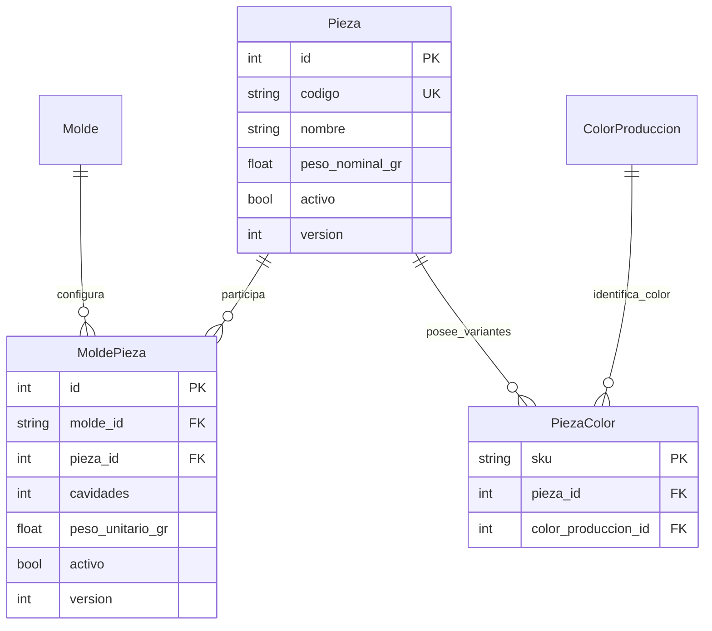

# TS-012: Normalización de la relación Molde-Pieza N:M

## 1. Estado y alcance de la decisión

Esta Tech Spec correctiva queda **aprobada para desarrollo el 2026-07-22**. Establece que `Pieza` es un maestro global y que su participación física en un molde se modela mediante `MoldePieza`.

La decisión sustituye únicamente las definiciones anteriores que ubicaban `molde_id`, `cavidades` o el peso operativo directamente en `Pieza`, o que describían `Molde -> Pieza` como 1:N. No modifica las demás decisiones de [[TS-001_Creacion_Agil_Molde_Producto_Pieza|TS-001]], [[TS-002_Refactor_CRUD_Molde_Pieza_Producto|TS-002]], [[US-007_Normalizar_ProductoTerminado_PiezaColor_Salidas_OP|US-007]], [[US-009_Normalizar_Trabajadores_Maquinas_y_Vistas_Catalogo|US-009]] ni [[US-010P_Planificar_Demanda_ProductoTerminado_y_Generar_OP|US-010P]].

Esta corrección es transversal al catálogo y a producción. **No forma parte funcional de US-010A**, que continúa limitada a recepción trazable de materiales.

> [!IMPORTANT] Identificadores posteriores
> [[TS-013_Codigos_Correlativos_Automaticos_Catalogo|TS-013]] sustituye la estrategia de generación de códigos para altas nuevas. `Pieza.codigo`, `PiezaColor.sku`, `ProductoTerminado.cod_sku_pt` y `Molde.codigo` usan correlativos backend; esta TS conserva autoridad sobre la relación N:M y la preservación de identificadores históricos.

> [!IMPORTANT] Clasificación Línea-Familia
> [[TS-014_Normalizacion_Linea_Familia_NM_y_CRUD|TS-014]] define que cualquier clasificación global de `Pieza` debe ser un par activo de la asociación N:M `LineaFamilia`. Esta TS conserva autoridad sobre `MoldePieza`, cavidades y pesos operativos.

## 2. Motivo

Una misma pieza puede ser producida por más de un molde. El número de cavidades y el peso operativo dependen de la combinación concreta `Molde + Pieza`, no de la identidad global de la pieza. Mantener esos atributos en `Pieza` produciría duplicados artificiales y haría imposible representar dos moldes con configuraciones distintas para la misma salida.

La relación canónica queda así:



## 3. Modelo canónico

### 3.1. `Pieza`: maestro global

`Pieza` representa una forma o salida abstracta reutilizable. Sus atributos mínimos son:

| Campo | Regla |
| :--- | :--- |
| `id` | PK existente; no cambia durante la migración. |
| `codigo` | Identificador estable y único del maestro. |
| `nombre` | Nombre descriptivo; no constituye una clave de identidad. |
| `linea_id`, `familia_id` | Clasificación global opcional; si se informa, ambos IDs deben formar una `LineaFamilia` activa. |
| `peso_nominal_gr` | Referencia descriptiva de la pieza; no gobierna el cálculo operativo de un molde. |
| `activo` | Baja lógica del maestro. |
| `version` | Control de concurrencia optimista. |

`Pieza` **no contiene** `molde_id` ni `cavidades`. Dos piezas con el mismo nombre no se fusionan automáticamente: el nombre puede ser ambiguo y no demuestra identidad industrial.

### 3.2. `MoldePieza`: configuración de la relación

`MoldePieza` es la entidad de intersección entre `Molde` y `Pieza`.

| Campo | Regla |
| :--- | :--- |
| `id` | PK técnica estable de la configuración. |
| `molde_id` | FK obligatoria a `Molde`. |
| `pieza_id` | FK obligatoria a `Pieza`. |
| `cavidades` | Entero mayor que cero para esa combinación. |
| `peso_unitario_gr` | Peso operativo mayor que cero usado por ese molde para esa pieza. |
| `activo` | Permite desvincular sin borrar historial. |
| `version` | Control de concurrencia optimista de la configuración. |

Restricciones:

- `UNIQUE(molde_id, pieza_id)` evita duplicar la misma configuración;
- `CHECK(cavidades > 0)`;
- `CHECK(peso_unitario_gr > 0)`;
- `CHECK(version > 0)`.

Los cálculos vigentes de un molde usan únicamente asociaciones activas:

```text
cavidades_totales = SUM(MoldePieza.cavidades)
peso_neto_tiro_gr = SUM(
    MoldePieza.cavidades * MoldePieza.peso_unitario_gr
)
```

### 3.3. `PiezaColor`: variante física global

`PiezaColor` continúa siendo el SKU físico inventariable formado por `Pieza + ColorProduccion`. Su identidad no incorpora el molde, porque cualquiera de los moldes activos asociados a la pieza puede producir la misma variante.

- se conserva la FK `pieza_id`;
- se conserva el SKU existente;
- la combinación lógica `pieza_id + color_id` permanece única;
- los campos legacy `cavidad` o `peso`, si todavía existen, quedan en solo compatibilidad y **no son fuente autoritativa** para cálculos ni edición.

## 4. Reglas de catálogo y API

1. El CRUD del maestro `Pieza` administra datos globales y nunca solicita cavidades.
2. La composición de un molde administra registros `MoldePieza`: seleccionar una pieza existente o crear una nueva, definir cavidades y peso operativo, editar la relación y desactivarla.
3. Desactivar `MoldePieza` no desactiva ni elimina `Pieza` o sus `PiezaColor`.
4. Desactivar `Pieza` requiere validar referencias vigentes, pero no borra asociaciones ni SKUs históricos.
5. Las consultas de moldes compatibles para una `PiezaColor` recorren `PiezaColor -> Pieza -> MoldePieza -> Molde` y filtran asociaciones y moldes activos.
6. La salida serializada de la composición distingue `molde_pieza_id` de `pieza_id`; `cavidades` y `peso_unitario_gr` pertenecen a la primera.
7. La actualización exige la `version` observada y rechaza escrituras obsoletas con conflicto de concurrencia.
8. Crear o reclasificar una `Pieza` valida el par N:M activo definido por [[TS-014_Normalizacion_Linea_Familia_NM_y_CRUD|TS-014]]; no usa fallbacks de catálogo.

Contrato mínimo de una fila de composición:

```json
{
  "molde_pieza_id": 18,
  "pieza_id": 7,
  "pieza_codigo": "PZ-000007",
  "pieza_nombre": "Tapa regadera",
  "cavidades": 2,
  "peso_unitario_gr": 30.0,
  "activo": true,
  "version": 3
}
```

## 5. Snapshot de Orden de Producción

Al crear una OP, el sistema copia la composición activa del molde. En el esquema vigente cada salida congela:

- `pieza_id` como FK a la `Pieza` abstracta;
- `pieza_codigo_snapshot` y `pieza_nombre_snapshot` como evidencia legible e inmutable;
- `cavidades` de la asociación elegida;
- `peso_unitario_gr` operativo de la asociación elegida;
- el molde queda identificado en la cabecera de la OP.

Los valores operativos copiados son autoritativos para esa OP. Una edición posterior de `Pieza` o `MoldePieza` no recalcula ni altera identidad, nombre, cavidades o pesos históricos.

La migración estructural de US-007 conserva el antiguo valor bajo `pieza_sku_legacy`, nullable y sin FK, solo como evidencia de una eventual importación. Las OP nuevas no lo pueblan. La revisión técnica ya se ejecutó sobre snapshots de demostración en `enva_test`, sin inferir la fila cuya `PiezaColor` no estaba vinculada a una `Pieza` abstracta. Dado que todavía no existen OP legacy reales, la reconciliación de negocio se certificará al probar el primer caso histórico según [[../02_User_Stories/US-007_Normalizar_ProductoTerminado_PiezaColor_Salidas_OP#12.1. Pendiente condicionado: backfill de la primera OP legacy|US-007 §12.1]].

### 5.1. Cavidades dañadas o temporalmente fuera de servicio

Una cavidad dañada durante una corrida es una excepción operativa de la OP, no un cambio silencioso del maestro. La cantidad efectiva se registra en el snapshot o ajuste versionado de esa OP, con motivo, actor y fecha. Solo una decisión técnica explícita y separada puede actualizar posteriormente `MoldePieza.cavidades` como nueva configuración maestra.

## 6. Migración sin reinterpretar datos

La migración debe ser conservadora y auditable:

1. Crear `molde_pieza` con sus restricciones.
2. Por cada `Pieza` existente, crear una asociación usando sus antiguos `molde_id`, `cavidades` y `peso_unitario_gr`.
3. Preservar explícitamente el identificador anterior como `molde_pieza.id` cuando sea necesario para mantener compatibles las referencias existentes a “forma”.
4. Mantener sin cambios `Pieza.id`, todos los `PiezaColor.pieza_id` y todos los SKUs.
5. Generar un `Pieza.codigo` estable para registros que aún no lo tengan, sin usar el nombre como identidad y siguiendo [[TS-013_Codigos_Correlativos_Automaticos_Catalogo|TS-013]].
6. Renombrar o copiar el peso global histórico como `Pieza.peso_nominal_gr`; el valor operativo migrado vive en `MoldePieza.peso_unitario_gr`.
7. Validar conteos y referencias antes de retirar `Pieza.molde_id` y `Pieza.cavidades`.
8. Ajustar la secuencia de `molde_pieza.id` después de insertar IDs explícitos.

No se permite durante esta migración:

- deduplicar piezas por nombre;
- cambiar IDs de pieza;
- regenerar o renombrar SKUs;
- inventar relaciones adicionales entre piezas y moldes;
- modificar snapshots históricos.

El downgrade solo es seguro mientras cada pieza conserve exactamente una asociación representable por el modelo antiguo. Si una pieza ya participa en cero o en varios moldes, debe bloquearse en vez de perder información.

## 7. Interfaz esperada

### 7.1. Maestro de piezas

Muestra código, nombre, clasificación, peso nominal, estado, versión, cantidad de variantes y moldes vinculados. No permite editar cavidades.

### 7.2. Detalle de molde

Muestra la composición como filas de `MoldePieza`. Permite:

- vincular una pieza global existente;
- crear una pieza global y vincularla en el mismo flujo;
- editar cavidades y peso operativo de la asociación;
- desactivar o reactivar el vínculo;
- abrir el maestro o las variantes `PiezaColor` sin confundir sus identidades.

## 8. Escenarios de aceptación

### NMP-01: Una pieza compartida por dos moldes

**Dado** una pieza global “Tapa regadera”  
**Cuando** se vincula al molde A con 2 cavidades y al molde B con 4 cavidades  
**Entonces** existe una sola `Pieza` y dos `MoldePieza`  
**Y** ambas configuraciones conservan sus valores independientes.

### NMP-02: Editar una asociación no altera otra

**Dado** la pieza compartida del escenario NMP-01  
**Cuando** se cambia a 3 cavidades únicamente la asociación del molde A  
**Entonces** el molde B continúa con 4 cavidades  
**Y** no cambia ningún SKU de `PiezaColor`.

### NMP-03: Desvincular conserva el maestro y el inventario

**Dado** una pieza con variantes de color y dos moldes activos  
**Cuando** se desactiva su asociación con uno de los moldes  
**Entonces** la pieza y sus SKUs siguen activos  
**Y** el molde restante sigue apareciendo como alternativa productiva.

### NMP-04: La OP congela la composición

**Dado** una OP cuya revisión congeló 2 cavidades y 30 g  
**Cuando** el maestro cambia después a 4 cavidades y 29.5 g  
**Entonces** la revisión existente continúa calculando con 2 cavidades y 30 g  
**Y** una nueva revisión puede adoptar la configuración vigente.

### NMP-05: Una cavidad dañada es excepción de OP

**Dado** un molde configurado con 4 cavidades  
**Cuando** una OP se ejecuta temporalmente con una cavidad dañada  
**Entonces** su revisión o ajuste registra 3 cavidades efectivas, motivo y actor  
**Y** `MoldePieza.cavidades` permanece en 4 hasta una revisión técnica explícita del maestro.

### NMP-06: La migración preserva identidades

**Dado** piezas, variantes y SKUs existentes  
**Cuando** se aplica la migración N:M  
**Entonces** no cambia ningún `Pieza.id`, `PiezaColor.pieza_id` ni SKU  
**Y** no se fusionan registros por coincidencia de nombre.

## 9. Estrategia de pruebas

| Nivel | Garantía |
| :--- | :--- |
| Dominio unitario | Cálculos por asociación activa y aislamiento entre dos moldes. |
| Integración PostgreSQL | Restricciones, migración con IDs explícitos, secuencia, preservación de FKs/SKUs y downgrade protegido. |
| Contrato API | DTO distingue pieza global de asociación; concurrencia por versión y baja lógica. |
| Interfaz | El maestro no edita cavidades; el detalle del molde cubre alta, edición y desvinculación. |
| Regresión de OP | Snapshots conservan cavidades y peso aunque cambie el catálogo. |

La primera prueba `RED` debe crear una sola `Pieza` vinculada a dos moldes con valores distintos. Debe fallar con el esquema 1:N anterior y pasar únicamente cuando `MoldePieza` sea la fuente operativa.

## 10. Definición de terminado

1. El esquema y el ORM representan `Molde <-> Pieza` como N:M mediante `MoldePieza`.
2. El CRUD de piezas separa el maestro global de la composición del molde.
3. Cavidades y peso operativo se leen y escriben solo en `MoldePieza`.
4. `PiezaColor` conserva identidad global por pieza y color, sin regenerar SKUs.
5. La migración preserva IDs, referencias e historia sin deduplicar nombres.
6. Los snapshots de OP continúan siendo inmutables y las cavidades dañadas se registran como excepción de ejecución.
7. Las pruebas unitarias, PostgreSQL, API, interfaz y regresión afectadas están verdes.
