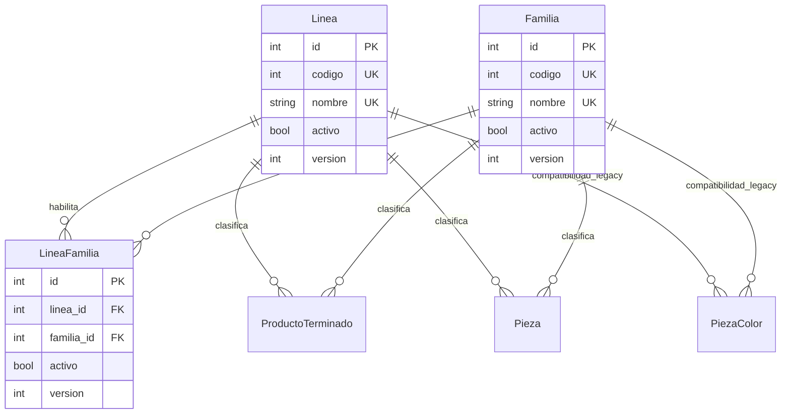

# TS-014: Normalización Línea-Familia N:M y CRUD de clasificación

> [!IMPORTANT] Autoridad refinada el 2026-08-10
> La relación N:M y la validación de cualquier par informado permanecen vigentes. La decisión [[../../../20_Registro_Decisiones/2026-08-10_Autoridad_de_Clasificacion_Comercial_en_ProductoTerminado|ProductoTerminado como autoridad comercial]] sustituye únicamente la propagación obligatoria hacia Pieza/PiezaColor: Pieza puede quedar sin clasificación técnica y PiezaColor no la necesita para existir.

## 1. Estado y autoridad de la decisión

Esta Tech Spec correctiva queda **aprobada para desarrollo el 2026-07-22**. Establece que una [[Linea|Línea]] puede contener varias [[Familia|Familias]] y que una misma Familia puede estar disponible en varias Líneas. La relación canónica es N:M mediante [[LineaFamilia]].

Esta decisión sustituye expresamente:

- D2 de [[TS-001_Creacion_Agil_Molde_Producto_Pieza|TS-001]], que declaraba Línea y Familia completamente independientes;
- cualquier mapeo hardcodeado o regla exclusiva del frontend para decidir qué familias pertenecen a una línea;
- cualquier endpoint que ignore `linea_id` y devuelva todas las familias como si fueran compatibles;
- los fallbacks silenciosos a Línea o Familia con ID `1`, a `HOGAR` o al primer registro encontrado.

`Linea` y `Familia` conservan identidades y ciclos de vida propios, pero su **compatibilidad seleccionable** depende de una asociación activa `LineaFamilia`. `Familia` de producto no debe confundirse con [[FamiliaColor]], que clasifica acabados de color y permanece fuera de esta relación.

La especificación cubre el CRUD lógico y versionado de los dos maestros, la asociación y desasociación, la validación del par en entidades consumidoras, el filtrado de interfaz, la importación y las capacidades futuras. No cambia los correlativos `ML`, `PZ`, `PC` y `PT` definidos por [[TS-013_Codigos_Correlativos_Automaticos_Catalogo|TS-013]].

## 2. Modelo canónico



### 2.1. `Linea`

| Campo | Regla |
| :--- | :--- |
| `id` | PK técnica existente e inmutable. |
| `codigo` | Entero obligatorio y único; los valores existentes se conservan. |
| `nombre` | Nombre obligatorio y único. |
| `activo` | `true` por defecto; una baja siempre es lógica. |
| `version` | Entero positivo, inicia en `1` y aumenta en cada escritura. |

La unicidad de código y nombre se mantiene aun cuando la fila esté inactiva: una baja no libera identidades para reutilización.

### 2.2. `Familia`

Posee los mismos atributos y reglas de ciclo de vida que `Linea`:

| Campo | Regla |
| :--- | :--- |
| `id` | PK técnica existente e inmutable. |
| `codigo` | Entero obligatorio y único; no se regenera durante la migración. |
| `nombre` | Nombre obligatorio y único. |
| `activo` | `true` por defecto; una baja siempre es lógica. |
| `version` | Entero positivo, inicia en `1` y aumenta en cada escritura. |

### 2.3. `LineaFamilia`

`LineaFamilia` materializa una combinación permitida:

| Campo | Regla |
| :--- | :--- |
| `id` | PK técnica estable. |
| `linea_id` | FK obligatoria a `linea.id`, con borrado físico restringido. |
| `familia_id` | FK obligatoria a `familia.id`, con borrado físico restringido. |
| `activo` | Indica si la combinación puede usarse en nuevas clasificaciones. |
| `version` | Entero positivo incremental administrado por el backend. |

Restricciones e índices:

- `UNIQUE(linea_id, familia_id)` evita duplicar el mismo par, esté activo o inactivo;
- `CHECK(version > 0)` en los tres modelos;
- índice `(linea_id, activo)` para filtrar familias de una línea;
- índice `(familia_id, activo)` para consultar las líneas de una familia;
- las FKs usan semántica `RESTRICT`; el flujo funcional no ejecuta borrados físicos.

Una reactivación reutiliza la misma fila e incrementa `version`; nunca crea un segundo registro para el mismo par. En este incremento, la versión de `LineaFamilia` es evidencia de cambio administrada por el servidor y no un precondicionante enviado por el cliente.

## 3. Invariantes de negocio

1. Una combinación es seleccionable solo si `Linea.activo`, `Familia.activo` y `LineaFamilia.activo` son verdaderos.
2. Toda clasificación nueva o modificada con Línea y Familia debe apuntar a una combinación seleccionable.
3. Una FK válida por separado no demuestra que el par sea válido.
4. No se puede inactivar una Línea, Familia o `LineaFamilia` mientras **cualquier** `ProductoTerminado`, `Pieza` o `PiezaColor` conserve una referencia al maestro o al par. El sistema responde `409` y exige reclasificar primero.
5. La baja y la desasociación son lógicas; nunca eliminan físicamente catálogos, asociaciones ni historia.
6. Los códigos y nombres únicos no se reutilizan después de una baja lógica.
7. Actualizar, inactivar o reactivar los maestros `Linea` y `Familia` exige la versión observada. Una versión obsoleta produce `409 VERSION_CONFLICT` sin aplicar cambios parciales. En `LineaFamilia`, el backend incrementa `version` al asociar, desasociar o reactivar, pero POST y DELETE no exigen esa versión al cliente.
8. El backend es la autoridad de validación. Filtrar opciones en el frontend mejora la experiencia, pero no reemplaza esta regla.
9. No existe un par por defecto. La ausencia de una selección obligatoria produce un error explícito, no una asignación a ID `1`, `HOGAR` ni a la primera Familia.

## 4. Validación en entidades consumidoras

La validación común debe ejecutarse dentro de la misma transacción que crea o actualiza al consumidor.

### 4.1. `ProductoTerminado`

`linea_id` y `familia_id` son obligatorios. El par debe existir activo y sus dos maestros deben estar activos. La misma regla aplica a la fase de identidad del ProductoTerminado; no se propaga automáticamente a Molde, Pieza o variante.

### 4.2. `Pieza`

La clasificación puede permanecer vacía cuando la pieza legítimamente no esté clasificada. Si se informa uno de los dos campos, ambos pasan a ser obligatorios y deben formar un par activo. No se acepta una Línea sin Familia ni una Familia sin Línea.

### 4.3. `PiezaColor`

Las columnas de clasificación de una variante son compatibilidad legacy. En altas ordinarias:

- si existe `pieza_id`, la variante puede crearse aunque la Pieza no tenga clasificación técnica;
- mientras las columnas legacy `PiezaColor.linea_id` y `familia_id` sigan presentes, no se escriben como autoridad comercial; si un consumidor legacy exige conservar un par, éste debe coincidir con la clasificación técnica informada de Pieza;
- una variante legacy todavía no vinculada a `Pieza` puede conservar su par actual, pero una modificación de clasificación debe proporcionar ambos IDs y usar una asociación activa.

Esta compatibilidad no convierte `PiezaColor` en nueva fuente de verdad ni cancela la eliminación posterior de la duplicación prevista por US-007.

### 4.4. Servicio de validación

La aplicación debe centralizar la comprobación del par para no implementar reglas diferentes en cada ruta. El resultado distingue al menos:

- maestro inexistente;
- maestro inactivo;
- par no asociado;
- asociación inactiva;
- clasificación incompleta.

No se añade en este incremento una FK compuesta desde los consumidores: existen columnas opcionales y datos legacy, y la solución debe seguir siendo portable a PostgreSQL y SQLite. Las FKs simples actuales permanecen y el servicio backend garantiza la combinación activa. Una restricción compuesta podrá evaluarse después de retirar duplicaciones y nulabilidad legacy.

## 5. Contrato API

Todas las listas funcionales excluyen inactivos por defecto. Las pantallas administrativas pueden solicitar `include_inactive=true`.

### 5.1. CRUD de Líneas

| Método | Ruta | Resultado |
| :--- | :--- | :--- |
| `GET` | `/api/catalogo/lineas` | Lista Líneas; `include_inactive=true` agrega las inactivas para administración. |
| `POST` | `/api/catalogo/lineas` | Crea con `codigo`, `nombre`; responde fila con `version=1`. |
| `PUT` | `/api/catalogo/lineas/{id}` | Edita nombre, código o estado permitido usando `version`. |
| `DELETE` | `/api/catalogo/lineas/{id}?version={version}` | Baja lógica con optimistic lock; nunca elimina la fila. |

### 5.2. CRUD de Familias

| Método | Ruta | Resultado |
| :--- | :--- | :--- |
| `GET` | `/api/catalogo/familias` | Lista Familias; `linea_id` filtra por asociación activa y `include_inactive=true` habilita administración. |
| `POST` | `/api/catalogo/familias` | Crea con `codigo`, `nombre`; responde fila con `version=1`. |
| `PUT` | `/api/catalogo/familias/{id}` | Edita usando la `version` observada. |
| `DELETE` | `/api/catalogo/familias/{id}?version={version}` | Baja lógica con optimistic lock; nunca elimina la fila. |

`GET /api/catalogo/familias?linea_id={id}` y la ruta anidada siguiente deben aplicar la misma consulta autoritativa; no usan un mapeo del frontend.

### 5.3. Asociación Línea-Familia

| Método | Ruta | Resultado |
| :--- | :--- | :--- |
| `GET` | `/api/catalogo/lineas/{linea_id}/familias` | Familias asociadas; activas por defecto. |
| `POST` | `/api/catalogo/lineas/{linea_id}/familias` | Con `familia_id`, crea o reactiva el par; con el objeto `familia`, crea Familia y `LineaFamilia` atómicamente. |
| `DELETE` | `/api/catalogo/lineas/{linea_id}/familias/{familia_id}` | Desasocia lógicamente y bloquea si hay referencias. |

Una asociación ya activa no genera duplicados. `POST` opera sobre la fila inactiva cuando debe reactivarla. El servidor incrementa `LineaFamilia.version` en cada cambio; el cliente no la envía como precondición en este incremento. La respuesta de asociación incluye `id`, ambos IDs, `activo`, `version` y los catálogos relacionados como evidencia del estado confirmado.

El payload acepta exactamente una alternativa: `{ "familia_id": 7 }` o `{ "familia": { "codigo": 14, "nombre": "BALDES" } }`. En la segunda forma, Familia y asociación se confirman o revierten dentro de la misma transacción. Un formulario contextual dependiente de una Línea —incluido el alta guiada de PT— no puede usar primero `POST /api/catalogo/familias`, porque un éxito global sin `LineaFamilia` no deja un valor seleccionable para ese contexto.

Ejemplo de Familia serializada dentro de una Línea:

```json
{
  "id": 7,
  "codigo": 14,
  "nombre": "BALDES",
  "activo": true,
  "version": 2,
  "asociacion": {
    "id": 18,
    "activo": true,
    "version": 3
  }
}
```

### 5.4. Errores mínimos

| HTTP | Código | Condición |
| :---: | :--- | :--- |
| `400` | `CLASIFICACION_INCOMPLETA` | Solo se recibió Línea o solo Familia. |
| `400` | `LINEA_FAMILIA_NO_ASOCIADA` | Los maestros existen, pero el par nunca fue habilitado. |
| `400` | `LINEA_FAMILIA_INACTIVA` | El par o uno de sus maestros está inactivo. |
| `404` | `CATALOGO_NO_ENCONTRADO` | No existe la Línea, Familia o asociación solicitada. |
| `409` | `VERSION_CONFLICT` | La versión enviada ya no es la vigente. |
| `409` | `CATALOGO_EN_USO` | Una baja o desasociación dejaría referencias clasificadas. |
| `409` | `CATALOGO_DUPLICADO` | Código, nombre o par vulnera unicidad. |

Ningún error de validación puede dejar creada una asociación o entidad parcial.

## 6. Interfaz de usuario

### 6.1. Administración

La ruta `/datos-maestros/clasificacion` incorpora la vista funcional `LineasFamiliasAdmin` con:

- listado, búsqueda y filtro por estado;
- alta y edición de cada maestro;
- baja lógica y reactivación con confirmación;
- visualización de `codigo`, `nombre`, `activo` y `version`;
- gestión de Familias asociadas desde una Línea y de Líneas asociadas desde una Familia;
- mensaje de conflicto cuando otro usuario ya cambió la versión;
- explicación de las referencias que bloquean una baja o desasociación.

No se presenta un borrado físico. Un registro inactivo continúa visible al habilitar el filtro administrativo correspondiente.

### 6.2. Selectores dependientes

En todos los formularios de `ProductoTerminado`, `Pieza`, `PiezaColor` legacy y Configuración Rápida:

1. se selecciona primero la Línea activa;
2. el selector de Familia consulta o filtra solo asociaciones activas de esa Línea;
3. cambiar la Línea limpia una Familia que ya no sea compatible;
4. guardar vuelve a validar el par en backend;
5. al editar un dato histórico con clasificación hoy inactiva, la UI puede mostrarla como referencia no seleccionable, pero exige una combinación activa si el usuario modifica la clasificación.

Los estados de carga, lista vacía y error deben distinguir “la Línea no tiene Familias asociadas” de una falla de red. No se vuelve a constantes hardcodeadas cuando falla la API.

## 7. Importación

Los importadores que crean o actualizan `ProductoTerminado`, `Pieza` o `PiezaColor` deben resolver Línea y Familia por los identificadores o referencias externas soportadas y validar el par activo antes de persistir.

Reglas:

1. No se asigna automáticamente `HOGAR`, ID `1`, la primera Línea ni la primera Familia.
2. Una fila con clasificación incompleta o combinación no asociada se reporta como error de importación con fila y valores originales.
3. La importación ordinaria no crea ni asocia maestros silenciosamente. El catálogo debe prepararse antes o usarse un flujo explícito con la capacidad de gestión correspondiente.
4. Un lote de importación mantiene su política transaccional existente, pero nunca confirma una fila con un par inválido.
5. Los códigos externos se conservan como referencias; no sustituyen `linea.id`, `familia.id` ni la asociación normalizada.

El backfill de la migración es una reconciliación inicial excepcional y no autoriza ese comportamiento para importaciones futuras.

## 8. Migración y backfill

La migración debe ser conservadora:

1. Agregar `activo=true` y `version=1` como columnas no nulas a `linea` y `familia`, con `CHECK(version > 0)`.
2. Crear `linea_familia` con sus FKs restrictivas, unicidad, estado, versión e índices.
3. Construir el conjunto `UNION DISTINCT(linea_id, familia_id)` desde:
   - `producto_terminado`;
   - `pieza`;
   - `pieza_color`.
4. Omitir pares donde alguno de los IDs sea nulo y evitar relaciones huérfanas.
5. Insertar una sola asociación activa con `version=1` por par válido encontrado.
6. Validar conteos: todo consumidor con ambos IDs debe encontrar exactamente una `LineaFamilia`.
7. Mantener intactos IDs, códigos, nombres, SKUs, BOM, relaciones `MoldePieza` y snapshots.

El backfill interpreta como autorizadas únicamente las combinaciones ya utilizadas por datos existentes. No genera el producto cartesiano Línea × Familia ni inventa asociaciones adicionales.

La migración no agrega una FK compuesta desde consumidores por la compatibilidad legacy descrita en la sección 4.4. El downgrade puede retirar la tabla y las columnas añadidas sin modificar los pares almacenados en consumidores, pero perdería la configuración N:M; requiere respaldo y no debe ejecutarse como una operación funcional de desasociación.

## 9. Permisos futuros

La autenticación humana y la matriz final de permisos continúan diferidas según la decisión vigente del proyecto. Esta TS reserva las siguientes capacidades sin asignarlas automáticamente a ningún rol:

| Capacidad futura | Alcance |
| :--- | :--- |
| `CATALOGO_LINEA_GESTIONAR` | Crear, editar, inactivar y reactivar Líneas. |
| `CATALOGO_FAMILIA_GESTIONAR` | Crear, editar, inactivar y reactivar Familias. |
| `CATALOGO_LINEA_FAMILIA_GESTIONAR` | Asociar, desasociar y reactivar pares. |

Las lecturas necesarias para formularios pueden formar parte del acceso general al catálogo. Hasta que el control de acceso humano se active, la UI no debe fingir que ocultar botones constituye seguridad; los contratos quedan preparados para aplicar capacidades en backend al cierre del desarrollo funcional.

## 10. Escenarios de aceptación

### LFN-01: Una Familia pertenece a varias Líneas

**Dado** la Familia `BALDES` y las Líneas `HOGAR` e `INDUSTRIAL`<br>
**Cuando** el administrador asocia la Familia a ambas Líneas<br>
**Entonces** existen dos filas `LineaFamilia` activas<br>
**Y** existe un único maestro `Familia` para `BALDES`.

### LFN-02: Filtro autoritativo por Línea

**Dado** `BALDES` asociada a HOGAR y `CONTENEDORES` asociada solo a INDUSTRIAL<br>
**Cuando** el formulario consulta Familias para HOGAR<br>
**Entonces** recibe `BALDES` y no `CONTENEDORES`<br>
**Y** la respuesta proviene de `LineaFamilia`, no de constantes del frontend.

### LFN-03: CRUD lógico y versionado

**Dado** una Línea activa con `version=2` y sin referencias<br>
**Cuando** el administrador la inactiva enviando la versión vigente<br>
**Entonces** la fila permanece, queda `activo=false` y pasa a `version=3`<br>
**Y** deja de aparecer en listas funcionales.

### LFN-04: Escritura obsoleta

**Dado** dos formularios abiertos sobre la misma Familia en versión 4<br>
**Cuando** uno guarda y el otro intenta guardar después con versión 4<br>
**Entonces** la segunda escritura recibe `409 VERSION_CONFLICT`<br>
**Y** no sobrescribe el cambio confirmado.

### LFN-05: Par inválido rechazado

**Dado** Línea y Familia activas que no están asociadas entre sí<br>
**Cuando** se intenta crear un ProductoTerminado con sus IDs<br>
**Entonces** la API responde `LINEA_FAMILIA_NO_ASOCIADA`<br>
**Y** no crea el producto ni reserva entidades parciales del wizard.

### LFN-06: Baja segura

**Dado** un `ProductoTerminado`, `Pieza` o `PiezaColor` que conserva el par HOGAR-BALDES<br>
**Cuando** se intenta inactivar HOGAR, BALDES o su asociación<br>
**Entonces** la API responde `409 CATALOGO_EN_USO`<br>
**Y** no modifica estados ni versiones.

### LFN-07: Selector limpia una Familia incompatible

**Dado** un formulario con HOGAR-BALDES seleccionado<br>
**Cuando** el usuario cambia la Línea a INDUSTRIAL y BALDES no está asociada<br>
**Entonces** el selector limpia la Familia y muestra solo opciones compatibles<br>
**Y** el backend rechazaría igualmente el par anterior si se enviara de forma directa.

### LFN-08: `PiezaColor` no contradice a `Pieza`

**Dado** una Pieza clasificada como HOGAR-BALDES<br>
**Cuando** se crea una variante de color<br>
**Entonces** su clasificación efectiva se deriva de la Pieza<br>
**Y** no se acepta una pareja distinta en columnas legacy.

### LFN-09: Backfill sin producto cartesiano

**Dado** consumidores existentes que usan HOGAR-BALDES e INDUSTRIAL-BALDES<br>
**Cuando** se ejecuta la migración<br>
**Entonces** se crean exactamente ambas asociaciones una vez<br>
**Y** no se asocian automáticamente otras Familias existentes.

### LFN-10: Importación sin fallback

**Dado** una fila importada con Línea HOGAR y una Familia no asociada<br>
**Cuando** el importador intenta persistirla<br>
**Entonces** reporta la fila y el par inválido<br>
**Y** no sustituye la Familia por la primera disponible ni crea la asociación.

## 11. Estrategia de pruebas

| Nivel | Cobertura mínima |
| :--- | :--- |
| Dominio unitario | Par activo, clasificación incompleta, asociación inactiva, herencia de PiezaColor y bloqueo por referencias. |
| Migración PostgreSQL | Columnas, checks, FKs `RESTRICT`, índices, `UNION DISTINCT`, preservación de datos y backfill exacto. |
| Migración SQLite | Upgrade/downgrade portable y mismo conjunto de asociaciones iniciales. |
| Contrato API | CRUD, filtros, asociación/reactivación, baja lógica, errores y versión obsoleta. |
| Frontend | CRUD completo, filtro por Línea, limpieza de selección incompatible, inactivas y conflictos. |
| Importación | Resolución válida, rechazo por par inexistente/inactivo y ausencia de fallbacks. |
| Regresión | Altas simples, wizard, BOM, Molde-Pieza, variantes, códigos y snapshots existentes. |

La primera prueba `RED` consulta Familias para una Línea que comparte una Familia con otra Línea y exige únicamente sus asociaciones activas. Debe fallar mientras `GET /api/catalogo/familias?linea_id=...` ignore el filtro o dependa de un mapeo local.

## 12. Definición de terminado

1. `Linea`, `Familia` y `LineaFamilia` implementan estado lógico; los maestros usan optimistic lock y la asociación conserva versión incremental del servidor.
2. La migración crea únicamente los pares existentes y preserva toda identidad e historia.
3. Los dos maestros tienen CRUD funcional y ninguna ruta ejecuta borrado físico.
4. Asociación, desasociación y reactivación respetan unicidad, versión y referencias.
5. `ProductoTerminado`, `Pieza`, `PiezaColor`, wizard e importadores validan el mismo par activo en backend.
6. Todos los selectores de Familia filtran por la Línea elegida sin constantes hardcodeadas ni fallbacks.
7. Las capacidades futuras están reservadas, pero ninguna se asigna implícitamente a un rol.
8. Los escenarios LFN-01 a LFN-10 tienen evidencia automatizada en los niveles indicados y la regresión permanece verde.
