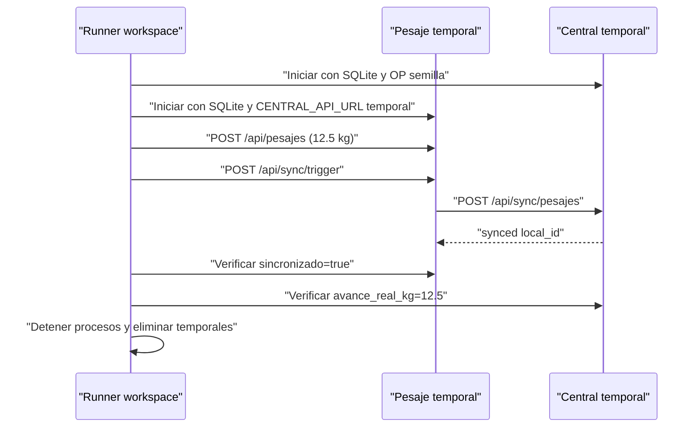

# TS-TE-003: Contratos Central-Pesaje y E2E Aislado

## 1. Decisión

La integración actual de pesajes se congela como contrato de caracterización `sync-pesajes-legacy-v1`. El workspace conserva el artefacto canónico y cada repositorio consumidor/proveedor conserva una copia para poder probarse de forma independiente. El CI del workspace compara SHA-256 antes de ejecutar el E2E.

Se usa JSON Schema Draft 2020-12 y `jsonschema` únicamente como dependencia de desarrollo. No se añade validación al request productivo ni una dependencia runtime.

## 2. Responsabilidades

| Elemento | Propietario | Responsabilidad |
|---|---|---|
| Contrato canónico | Workspace | Fuente de integración entre SHAs fijados |
| Copia proveedor | Backend central | Validar respuesta real del endpoint |
| Copia consumidor | Módulo de pesaje | Validar serialización y consumo del acuse |
| `test-contracts.ps1` | Workspace | Detectar drift y ejecutar ambos lados |
| `test-sync-e2e.py` | Workspace | Orquestar procesos y comprobar recorrido HTTP |

## 3. Contrato Request

`POST /api/sync/pesajes` recibe un objeto con `pesajes[]`. Cada elemento conserva los catorce campos emitidos actualmente por `_pesaje_to_sync_payload`, incluidos campos opcionales representados como `null`. `local_id` es un entero local y no se interpreta como identidad global.

El esquema usa `additionalProperties: false` para que una modificación unilateral sea visible. Agregar, retirar o renombrar campos requiere actualizar canónico, copias y pruebas en el mismo cambio coordinado.

## 4. Contrato Response

La respuesta 2xx contiene obligatoriamente:

| Campo | Semántica legacy |
|---|---|
| `success` | Resultado global comunicado por central |
| `message` | Mensaje humano actual |
| `synced[].local_id` | IDs locales confirmados |
| `errors[].local_id` | ID rechazado, posiblemente nulo |
| `errors[].error` | Motivo textual |

Los errores HTTP no 2xx permanecen fuera de este esquema porque el consumidor actual los transforma a su resultado local sin interpretar un body contractual.

## 5. Compatibilidad y Evolución

- `legacy-v1` no recibe promesa de compatibilidad futura más allá de proteger el sistema durante la transición.
- Un cambio incompatible debe usar un contrato y endpoint versionado nuevo; no se modifica silenciosamente este artefacto.
- El futuro contrato trazable no reutilizará `local_id` como clave idempotente global.
- La retirada de `legacy-v1` exigirá comprobar que ninguna estación desplegada lo consume.

## 6. E2E Aislado

Los puertos se reservan dinámicamente. Los servidores de soporte viven bajo `tests/support`, desactivan reloader y background sync, y nunca usan la base configurada para operación.

## 7. Matriz de Pruebas

| Garantía | Nivel | Archivo/comando |
|---|---|---|
| Payload emitido cumple request | Contrato consumidor | `modulo-pesaje/backend/tests/test_sync_contract.py` |
| Acuse marca IDs confirmados | Contrato consumidor | mismo archivo |
| Endpoint cumple response | Contrato proveedor | `backend/tests/test_sync_contract.py` |
| Copias no divergen | Integración workspace | `scripts/test-contracts.ps1` |
| Sincronización real entre procesos | E2E | `scripts/test-sync-e2e.ps1` |

## 8. Primera Prueba RED

La primera prueba valida `_pesaje_to_sync_payload` contra `contract.schema.json`. Antes del enabler falla porque no existe artefacto contractual ni `jsonschema` en dependencias de desarrollo. El GREEN añade solo caracterización; no modifica el serializador productivo.

## 9. Riesgos y Controles

| Riesgo | Control |
|---|---|
| Confundir contrato verde con idempotencia | Nombre `legacy-v1` y exclusiones explícitas |
| Copias divergentes | Hash SHA-256 en workspace |
| E2E toca datos reales | URLs, puertos y SQLite generados por ejecución |
| Procesos quedan activos | `finally`, terminate, timeout y kill de respaldo |
| Mock oculta incompatibilidad HTTP | E2E separado usa procesos y red reales |
