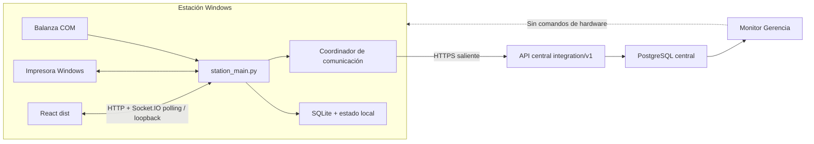
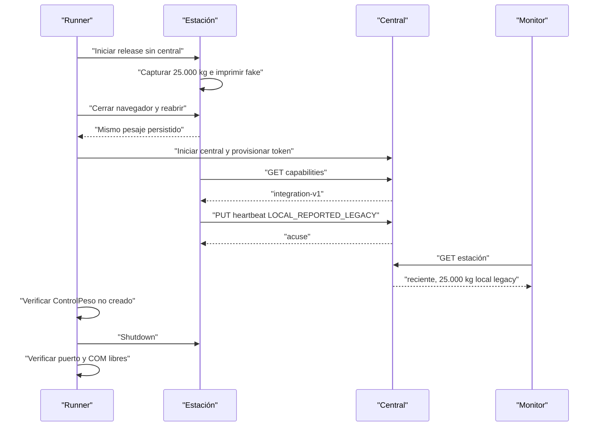

# TS-TE-004: Despliegue y Comunicación de la Estación de Pesaje

## 1. Decisión Ejecutiva

El módulo de pesaje se desplegará como una **estación edge Windows offline-first** y no como un frontend remoto ni como un servidor accesible desde la red.

El primer perfil conectado será `MONITORED_LEGACY`:

1. La balanza, impresora, UI, API local y SQLite permanecen en la PC de planta.
2. React se compila previamente y es servido por el mismo backend local.
3. Flask-SocketIO se ejecuta en modo `threading` sobre Waitress, con transporte Socket.IO `polling` explícito.
4. El runtime escucha exclusivamente en `127.0.0.1` y posee una sola instancia.
5. Windows inicia y supervisa el proceso independientemente del navegador.
6. La estación inicia todas las comunicaciones hacia el backend central.
7. Central recibe heartbeat, resúmenes y continuidad legacy para US-011, sin controlar hardware.
8. El envío antiguo `POST /api/sync/pesajes` permanece deshabilitado; `station-legacy-continuity-v1` replica datos del piloto sin crear `ControlPeso`.
9. Las cantidades reportadas por heartbeat son informativas y nunca crean inventario.
10. US-010D será la única responsable de habilitar el evento de pesaje idempotente, la unidad logística y el movimiento de inventario definitivos.

La estación podrá operar completamente offline. La conexión central añade observabilidad y catálogos, no una dependencia para aceptar un peso.

## 2. Razón de la Decisión

### 2.1. Socket.IO

Socket.IO no bloquea el despliegue. El problema actual es que `socketio.run()` cae en el servidor de desarrollo cuando no están instalados eventlet o gevent. La documentación de Flask-SocketIO indica que ese fallback no está destinado a producción.

Para una estación con un navegador local no se requiere escalado horizontal ni WebSocket. El modo `threading` soporta long-polling y necesita un WSGI multihilo capaz de atender solicitudes concurrentes. Waitress es un servidor WSGI productivo, puro Python y compatible con Windows.

Referencias:

- [Flask-SocketIO deployment](https://flask-socketio.readthedocs.io/en/latest/deployment.html)
- [Flask-SocketIO introduction](https://flask-socketio.readthedocs.io/en/latest/intro.html)
- [python-socketio server](https://python-socketio.readthedocs.io/en/stable/server.html)
- [Waitress documentation](https://docs.pylonsproject.org/projects/waitress/en/latest/)

Se realizó un spike el 2026-07-16 con Python `3.12.13`, Flask-SocketIO `5.3.6`, python-socketio `5.16.3` y Waitress `3.0.2`. Un cliente se conectó por loopback con `transport=polling`, informó `connected=True` y el proceso fue retirado sin dejar un servidor de pesaje activo.

WebSocket puede evaluarse posteriormente. No forma parte de la puerta de salida del piloto.

### 2.2. Empaquetado

Electron y PyInstaller no serán requisitos del primer piloto conectado. La opción de menor incertidumbre es un release Windows versionado que contiene:

- código backend;
- `frontend/dist` ya compilado;
- requirements bloqueadas;
- wheelhouse offline;
- scripts PowerShell de instalación y operación;
- manifiesto de versión y checksums.

El instalador crea el entorno virtual en la PC objetivo usando Python 3.12 y `pip --no-index`. El entorno virtual nunca se copia entre computadoras porque conserva rutas absolutas y puede quedar obsoleto, como ocurrió con el `.venv` encontrado durante esta auditoría.

Node.js, Vite y acceso a Internet no son dependencias de runtime.

## 3. Baseline Verificada

### 3.1. Resultados ejecutados el 2026-07-16

| Verificación | Resultado |
|---|---|
| Backend estación | `10 passed`; 1 warning por `.pytest_cache` sin permiso. |
| Contrato proveedor central | `1 passed`. |
| Backend central completo | `75 passed`, `1 skipped`, `3 deselected`; warnings legacy de SQLAlchemy y cache. |
| E2E `legacy-v1` | `12.5 kg` llegó a central y la estación recibió acuse local. |
| Build React de estación | `121 modules transformed`; bundle generado correctamente. |
| Spike Waitress + Socket.IO | Conexión polling exitosa en loopback. |

Comandos de baseline:

```powershell
powershell -ExecutionPolicy Bypass -File .\scripts\test.ps1 -Component pesaje
powershell -ExecutionPolicy Bypass -File .\scripts\test.ps1 -Component backend
powershell -ExecutionPolicy Bypass -File .\scripts\test-sync-e2e.ps1
cd .\modulo-pesaje\frontend
npm run build
```

### 3.2. Qué demuestra la baseline

- proveedor y consumidor entienden el payload `sync-pesajes-legacy-v1`;
- un pesaje ideal con máquina y OP sembradas puede recorrer HTTP entre dos procesos;
- el acuse esperado cambia `sincronizado=True` localmente;
- la UI compila;
- Socket.IO polling funciona sobre Waitress en un smoke aislado.

### 3.3. Qué no demuestra

- autenticación, TLS o autorización de estación;
- funcionamiento con la dirección real de central;
- resolución DNS, firewall, proxy o pérdida intermitente de red;
- idempotencia cuando central confirma y se pierde la respuesta;
- concurrencia entre worker automático y sincronización manual;
- lotes parciales, reintentos grandes o errores `401`, `409`, `422`, `429` y `5xx`;
- catálogo de moldes, trabajadores, máquinas, colores o piezas;
- reserva y reconciliación de correlativos;
- heartbeat o monitor de Gerencia;
- reinicio de Windows, instancia única, shutdown o liberación de COM;
- backup y restauración de la SQLite desplegada;
- balanza e impresora físicas;
- comportamiento UI cuando guardar funciona e imprimir falla;
- exactitud de tres decimales, tara, bruto, neto o unidad logística.

Por tanto, una baseline verde de TE-003 no autoriza activar `legacy-v1` como integración productiva.

## 4. Auditoría de Comunicación Actual

### 4.1. Fronteras encontradas

| Flujo actual | Ruta central | Uso | Cobertura existente | Decisión |
|---|---|---|---|---|
| Comprobación de conexión | `GET /api/ordenes` | Antes de enviar pesajes | Solo recorrido indirecto E2E | Sustituir por capabilities/health dedicado. |
| Envío de pesajes | `POST /api/sync/pesajes` | Worker cada 300 s y trigger manual | Contrato y E2E legacy | Conservar para caracterización; deshabilitar en release piloto. |
| Descarga de moldes | `GET /api/moldes/exportar` | Acción manual | Sin contrato consumidor/proveedor | Sustituir por snapshot versionado. |
| Consulta de correlativo | `GET /api/talonarios/siguiente` | Fallback si no hay cache | Pruebas centrales, no integración | No habilitar en perfil conectado. |
| Reserva de correlativos | `POST /api/talonarios/reservar` | Reposición de cache | Pruebas centrales, no E2E estación | Diferir hasta contrato de lease y reconciliación. |

No existe actualmente heartbeat, identidad de estación, autenticación técnica, catálogo completo ni endpoint de capabilities.

### 4.2. URL central inconsistente

`CENTRAL_API_URL` significa “URL que ya termina en `/api`” para pesajes y moldes, pero Orden de Trabajo necesita quitar ese sufijo antes de volver a añadirlo. `_get_central_api()` usa `rstrip('/api')`, que elimina cualquier combinación final de esos caracteres en lugar de retirar un sufijo exacto.

Se sustituirá por:

```text
CENTRAL_ORIGIN=https://scm.envaperu.example
INTEGRATION_PREFIX=/api/integration/v1
```

`CENTRAL_ORIGIN` no puede contener path, query ni fragmento. Todas las rutas se construyen mediante un único `CentralApiClient` y una función de join estructurada.

### 4.3. Lagunas críticas

| Severidad | Evidencia | Consecuencia | Tratamiento |
|---|---|---|---|
| Crítica | Central no guarda `local_id`, `station_id` ni UUID de evento. | Una respuesta perdida y reintento duplican `ControlPeso`. | Legacy deshabilitado; US-010D crea contrato idempotente. |
| Crítica | No existe autenticación en rutas de central o estación. | Cualquier cliente con red podría invocar rutas mutables. | Token por estación; central limitado a LAN/VPN hasta tener auth humana. |
| Crítica | Un pesaje sincronizado puede editarse o borrarse localmente sin corrección central. | Divergencia silenciosa. | Rutas destructivas fuera del perfil release; correcciones finales en US-010D. |
| Alta | `DEBUG=True` y reloader pueden crear procesos y workers adicionales. | Puerto retenido y sincronización duplicada. | Perfil release sin reloader, mutex antes de `create_app()`. |
| Alta | Worker automático y trigger manual no comparten lock. | Dos envíos concurrentes del mismo lote. | Coordinador único; legacy no se ejecuta en piloto. |
| Alta | React usa URLs absolutas y Vite en runtime. | No existe artefacto same-origin ni lifecycle único. | Servir `dist` desde Waitress/Flask. |
| Alta | Guardar e imprimir son dos llamadas; la UI reporta un único error. | Repetir F2 puede crear un segundo pesaje. | `capture_id` idempotente y estado de impresión separado. |
| Alta | El catálogo borra y repuebla un cache parcial sin revisión ni hash. | Datos incompletos o antiguos sin señal confiable. | Snapshot versionado, staging y swap transaccional. |
| Alta | La UI activa usa correlativo manual; el componente cacheado está sin montar y llama rutas inexistentes. | El supuesto flujo central de talonarios no representa la operación real. | `MANUAL_LEGACY` explícito; no habilitar lease sin historia funcional. |
| Alta | `_run_migrations()` silencia cualquier excepción y no añade todas las columnas del modelo. | Una base histórica puede iniciar parcialmente o fallar después. | Migraciones versionadas y fallo de startup ante schema incompatible. |
| Media | Operadores y colores están hardcodeados; máquina y pieza viajan como texto. | Drift respecto de US-009 y resolución central frágil. | Snapshot de catálogos con IDs/códigos estables. |
| Media | Peso se almacena como `Float` y UI/etiqueta redondean a una décima. | No conserva el estándar acordado de kg con tres decimales. | Mostrar y transportar tres decimales; modelo final pertenece a US-010D. |
| Media | `/avance/resumen` agrupa todo lo no cerrado, sin ventana temporal. | La UI puede llamar “hoy” a acumulados históricos. | Resúmenes con ventana y zona horaria explícitas. |
| Media | No existen pruebas del frontend de estación. | El build no detecta rutas o errores de interacción. | Añadir Vitest y Testing Library antes del refactor UI. |

## 5. Topología Objetivo



### 5.1. Reglas de frontera

- No existe conexión central hacia la estación.
- No se publica `5050` en LAN, router, túnel o nube.
- Socket.IO no cruza la frontera de la PC.
- El navegador no conoce `CENTRAL_ORIGIN` ni el token de estación.
- Solo el backend local se comunica con central.
- El monitor consume exclusivamente datos persistidos por central.
- Una caída central no cambia la readiness local si SQLite y la captura siguen seguras.

## 6. Perfiles de Operación

| Perfil | Central | Pesajes a central | Uso |
|---|---|---|---|
| `STANDALONE_OFFLINE` | Desactivado | Ninguno | Contingencia o estación no provisionada. |
| `MONITORED_LEGACY` | Heartbeat, historial incremental y comandos de datos | Réplica legacy sin inventario SCM | Perfil obligatorio del primer piloto conectado. |
| `LEGACY_SYNC_COMPAT` | Contrato TE-003 | `legacy-v1` | Solo desarrollo, pruebas y transición autorizada; no release normal. |
| `SCM_V2` | Integración completa | Evento idempotente US-010D | Perfil futuro. |

El binario de release no aceptará `LEGACY_SYNC_COMPAT` sin una bandera explícita de soporte y un banner permanente. No será el valor por defecto.

## 7. Runtime Local

### 7.1. Entrada productiva

Se añadirá `station_main.py` separado de `run.py`:

1. cargar configuración desde una ruta absoluta;
2. adquirir mutex de estación;
3. validar directorios y permisos;
4. abrir SQLite y comprobar schema;
5. crear Flask sin iniciar workers durante imports;
6. iniciar Waitress en `127.0.0.1` con 4 threads;
7. iniciar coordinador de heartbeat/catalog después de readiness;
8. esperar señal local de parada;
9. ejecutar shutdown ordenado.

`run.py` se mantiene como entrada de desarrollo y nunca es invocado por la tarea Windows de producción.

### 7.2. Waitress y Socket.IO

Configuración release:

```text
async_mode=threading
Socket.IO transport=polling
host=127.0.0.1
threads=4
debug=false
use_reloader=false
CORS same-origin
```

El frontend utilizará rutas relativas:

```javascript
axios.create({ baseURL: '/api' })
io({ transports: ['polling'] })
```

No se configurará `cors_allowed_origins='*'`. Flask-SocketIO aplicará same-origin.

### 7.3. Servir React

Flask recibirá una ruta absoluta a `frontend/dist` y ofrecerá:

- `/assets/*` como archivos estáticos con cache por hash;
- `/` como `index.html` sin cache prolongado;
- fallback SPA únicamente para rutas de UI;
- `/api/*` y `/socket.io/*` nunca caen al fallback SPA.

Vite usará `base: '/'`. `npm run dev` y `vite preview` quedan fuera de scripts productivos.

### 7.4. Instancia única

Antes de construir la app se adquiere un mutex Windows:

```text
Local\EnvaPeruPesaje-{station_id}
```

Si ya existe:

- el segundo proceso no crea app, DB, worker ni puerto COM;
- registra `INSTANCE_ALREADY_RUNNING`;
- termina con código no cero conocido;
- el launcher puede abrir la UI existente sin reiniciar la estación.

Task Scheduler también usará `MultipleInstancesPolicy=IgnoreNew`, pero el mutex es la garantía dentro de la aplicación.

## 8. Supervisión Windows

### 8.1. Decisión para piloto

Se utilizará Task Scheduler al iniciar sesión con la cuenta dedicada de la estación:

- tarea `EnvaPeru-Pesaje-Station`;
- proceso oculto;
- una sola instancia;
- inicio aun cuando central no esté disponible;
- 3 reintentos, separados por 1 minuto;
- sin bucle infinito de reinicio;
- historial de tarea habilitado;
- working directory absoluto del release activo.

Task Scheduler admite una política `RestartOnFailure`. Referencia: [Microsoft Task Scheduler RestartOnFailure](https://learn.microsoft.com/en-us/windows/win32/taskschd/taskschedulerschema-restartonfailure-settingstype-element).

Un servicio Windows queda como alternativa futura, después de comprobar permisos de spooler y COM con la cuenta de servicio.

### 8.2. Navegador

Un acceso directo abre `http://127.0.0.1:5050`. Cerrar todas las pestañas no detiene la estación. El estado del servidor se controla con la tarea y `station-control.ps1`, no con el ciclo de vida del navegador.

### 8.3. Parada ordenada

`station-control.ps1 stop` señaliza un evento Windows protegido para la misma cuenta:

```text
Local\EnvaPeruPesajeStop-{station_id}
```

El runtime realiza, en orden:

1. cambia readiness a `STOPPING`;
2. rechaza nuevas capturas;
3. detiene lectura y reconexión de balanza;
4. cierra puertos COM;
5. espera impresiones en curso dentro del timeout;
6. detiene coordinador de comunicación;
7. confirma/rollback de transacciones locales;
8. cierra servidor Waitress;
9. libera mutex y puerto.

El timeout inicial será 10 segundos. Un kill forzado posterior queda registrado por el launcher como `FORCED_STOP`.

## 9. Release e Instalación

### 9.1. Artefacto

Nombre:

```text
envaperu-pesaje-{semver}-win-x64.zip
```

Contenido:

```text
manifest.json
checksums.sha256
backend/
frontend/dist/
wheels/
requirements-runtime.lock
scripts/install.ps1
scripts/update.ps1
scripts/rollback.ps1
scripts/station-control.ps1
```

`manifest.json` contiene versión semántica, SHA del módulo, hashes de contratos y versión mínima de Python.

### 9.2. Directorios instalados

```text
C:\Program Files\EnvaPeru\Pesaje\launcher\
C:\Program Files\EnvaPeru\Pesaje\releases\{version}\
C:\ProgramData\EnvaPeru\Pesaje\config\
C:\ProgramData\EnvaPeru\Pesaje\secrets\
C:\ProgramData\EnvaPeru\Pesaje\data\pesajes.db
C:\ProgramData\EnvaPeru\Pesaje\backups\
C:\ProgramData\EnvaPeru\Pesaje\logs\
C:\ProgramData\EnvaPeru\Pesaje\run\
```

Código y datos nunca comparten directorio. Actualizar una versión no mueve ni elimina `ProgramData`.

### 9.3. Instalación offline

El instalador:

1. valida Windows x64 y Python 3.12;
2. verifica SHA-256 del release;
3. crea un venv nuevo dentro del release;
4. instala con `pip --no-index --find-links wheels`;
5. valida importaciones y versión;
6. crea directorios y ACL;
7. provisiona o recupera `station_id`;
8. instala la tarea Windows;
9. ejecuta migración en una copia de la DB;
10. realiza health check antes de activar el release.

El runtime requirements se separará de herramientas de build y pruebas. PyInstaller, pytest y compiladores no se instalarán en la estación.

### 9.4. Activación y rollback

El launcher lee `ProgramData\run\active-release.json`. Una actualización:

1. hace backup;
2. instala la nueva versión en paralelo;
3. ejecuta migración y smoke sobre una copia;
4. detiene la versión activa;
5. cambia el puntero de release;
6. inicia y espera readiness;
7. revierte el puntero si falla.

Se conservarán al menos el release activo y el anterior.

## 10. Configuración y Secretos

### 10.1. Configuración no secreta

Archivo `ProgramData\config\station.env`:

```dotenv
STATION_CODE=PESAJE-PLANTA-01
STATION_MODE=MONITORED_LEGACY
LOCAL_HOST=127.0.0.1
LOCAL_PORT=5050
SOCKET_TRANSPORT=polling
SCALE_PORT=COM4
SCALE_BAUD_RATE=9600
PRINTER_TYPE=TSPL
PRINTER_NAME=TSC TE200
CENTRAL_ORIGIN=https://scm.envaperu.example
HEARTBEAT_SECONDS=30
CATALOG_REFRESH_MINUTES=360
LEGACY_WEIGHT_SYNC_ENABLED=false
TIMEZONE=America/Lima
```

Reglas:

- release rechaza `LOCAL_HOST` distinto de loopback;
- release rechaza un `CENTRAL_ORIGIN` con path o credenciales;
- HTTP central solo se permite mediante `ALLOW_INSECURE_CENTRAL=true` en un perfil LAN explícito;
- `DEBUG` y `use_reloader` no son configurables en release;
- falta de token deja estado `CENTRAL_NOT_PROVISIONED`, no habilita acceso anónimo.

### 10.2. Identidad y token

- `station_id`: UUID generado una vez y persistido fuera del release;
- `station_code`: código humano único administrado por central;
- token: 256 bits aleatorios, mostrado una vez al provisionar;
- estación: token protegido con Windows DPAPI para la cuenta de tarea;
- central: solo hash SHA-256 del token de alta entropía;
- rotación: credencial nueva solapada durante una ventana corta;
- revocación: detiene comunicación central, no borra ni bloquea pesajes locales.

El token no aparece en `.env`, logs, heartbeat ni UI.

## 11. Persistencia Local

### 11.1. SQLite

Configuración objetivo:

```text
PRAGMA foreign_keys=ON
PRAGMA journal_mode=WAL
PRAGMA synchronous=FULL
PRAGMA busy_timeout=5000
```

La DB no se ubicará en red compartida. Se mantendrá una sola instancia escritora de aplicación.

### 11.2. Migraciones

Se elimina `_run_migrations()` como mecanismo productivo. Se usarán migraciones versionadas, con tabla de versión y orden determinista.

Cada arranque:

- comprueba versión de schema;
- bloquea captura si la DB es más nueva que el binario;
- no ignora errores DDL;
- no ejecuta migraciones destructivas automáticamente;
- exige backup antes de migrar;
- registra inicio, fin, versión anterior y nueva.

### 11.3. Modelos técnicos nuevos locales

#### `StationIdentity`

| Campo | Tipo | Regla |
|---|---|---|
| `station_id` | UUID/text PK | Inmutable. |
| `station_code` | String unique | Identificador visible. |
| `created_at_utc` | DateTime | Inmutable. |
| `provisioned_at_utc` | DateTime nullable | Alta central. |

#### `StationRuntimeState`

Mantiene `boot_id`, versión, último inicio limpio, último shutdown, último heartbeat aceptado, estado de central y error resumido.

#### `CatalogSnapshotMeta`

Mantiene revisión, ETag/hash, fecha generada, fecha recibida, estado de validación y snapshot anterior disponible.

#### `LocalCaptureIdentity`

Añade `capture_id` UUID unique a un pesaje local para impedir duplicación por doble F2 o reintento HTTP. No sustituye el futuro `source_event_id` de US-010D, pero puede reutilizarse durante la migración si cumple su contrato.

#### `PrintAttempt`

Registra intento, impresora, fecha, resultado y error resumido. Imprimir no cambia el hecho de que el pesaje ya fue guardado.

#### `PesajeCorrectionRequest`

Registro append-only de una solicitud local de corrección. No modifica el `Pesaje` original ni representa una aprobación o un movimiento de inventario central.

| Campo | Regla |
|---|---|
| `request_id` | UUID unique usado como `Idempotency-Key`. |
| `request_payload_hash` | Detecta reutilización de la clave con otro payload. |
| `pesaje_id` | FK `RESTRICT` al pesaje original. |
| `requested_at_utc` | Fecha inmutable de solicitud. |
| `requested_by` | Actor obligatorio. |
| `action` | Solo `CORRECT` o `VOID`. |
| `reason` | Motivo obligatorio. |
| `evidence_reference` | Evidencia opcional y prudente. |
| `proposed_changes_json` | Propuesta normalizada; vacía para `VOID`. |
| `original_snapshot_json` | Copia inmutable del estado observado al solicitar. |
| `source_classification` | Clasificación de trazabilidad del pesaje fuente. |
| `status` | `PENDING_LOCAL_REVIEW` o `REQUIRES_CENTRAL_REVIEW`. |

El outbox de eventos de inventario se implementará con US-010D. Heartbeat utiliza latest-value coalescido, no una cola histórica durable.

## 12. Backup y Restauración

### 12.1. Backup

- API de backup SQLite o conexión consistente;
- ejecución diaria y antes de actualización/migración;
- nombre con `station_id`, schema y UTC;
- integrity check posterior;
- retención piloto: 14 copias diarias, configurable;
- no sobrescribir la última copia válida;
- registrar tamaño, hash y resultado.

### 12.2. Restauración

La restauración nunca se hace sobre un proceso activo:

1. detener estación ordenadamente;
2. conservar la DB dañada con sufijo de incidente;
3. restaurar a una ruta temporal;
4. ejecutar integrity check y migraciones compatibles;
5. comparar `station_id`, máximos IDs y conteos;
6. activar el archivo restaurado;
7. iniciar y verificar readiness;
8. no reenviar automáticamente pesajes legacy ya marcados.

## 13. Migración de la Estación Offline Existente

La DB actualmente desplegada se considera una fuente legacy que debe preservarse, no sobrescribirse.

### 13.1. Descubrimiento

El instalador solicitará o detectará la ruta actual y generará un reporte de solo lectura:

- hash y tamaño;
- `PRAGMA integrity_check`;
- tablas y columnas;
- conteo de pesajes activos, eliminados, sincronizados y pendientes;
- máximo ID;
- correlativos disponibles, usados y anulados;
- fecha mínima y máxima;
- totales kg por estado.

### 13.2. Importación

1. detener BAT y comprobar que `5050` y COM están libres;
2. copiar la DB original a backup inmutable;
3. copiarla a `ProgramData\data`;
4. ejecutar migraciones versionadas sobre la copia;
5. generar `station_id`;
6. clasificar registros:

| Estado anterior | Clasificación migrada | Acción automática |
|---|---|---|
| `sincronizado=true` | `LEGACY_ACKNOWLEDGED_UNVERIFIABLE` | No reenviar. |
| `sincronizado=false`, activo | `LOCAL_ONLY_LEGACY` | No enviar a ControlPeso; incluir solo en resumen local. |
| `deleted_at != null` | `LEGACY_VOID_LOCAL` | Preservar; no contar ni enviar. |

No se inventará `station_id` histórico en central ni se intentará emparejar por peso/fecha.

### 13.3. Conciliación

Antes de activar el release se comparan DB original y migrada:

- conteos por clasificación;
- suma kg a tres decimales;
- IDs mínimos/máximos;
- correlativos;
- últimos 20 registros;
- capacidad de abrir sticker histórico sin imprimir.

La DB original permanece intacta para rollback.

## 14. Cliente Central Único

Se introducirá `CentralApiClient`; ninguna ruta Flask invocará `requests` directamente.

### 14.1. Responsabilidades

- construir URLs desde `CENTRAL_ORIGIN`;
- mantener `requests.Session`;
- añadir `Authorization`, `User-Agent`, versión y correlación;
- aplicar timeouts separados de conexión/lectura;
- clasificar respuestas;
- aplicar backoff y jitter;
- ocultar secretos en logs;
- exponer métricas de último intento y acuse;
- impedir solicitudes de negocio en `STANDALONE_OFFLINE`.

### 14.2. Política inicial

| Operación | Connect | Read | Reintento |
|---|---:|---:|---|
| Capabilities | 3 s | 5 s | Sí, backoff. |
| Heartbeat | 3 s | 5 s | Coalescer; solo importa el último. |
| Catálogo | 3 s | 30 s | Sí, conserva snapshot previo. |
| `legacy-v1` | 3 s | 30 s | Solo perfil compat; sin promesa idempotente. |

Backoff de comunicación: `5, 15, 30, 60, 120, 300` segundos más jitter. `429` respeta `Retry-After`.

### 14.3. Clasificación de errores

| Condición | Estado | Acción |
|---|---|---|
| DNS, timeout, conexión | `CENTRAL_UNREACHABLE` | Operar local; backoff. |
| `401/403` | `AUTH_ERROR` | No reintentar agresivamente; alertar soporte. |
| `404` capabilities | `CENTRAL_INCOMPATIBLE` | No usar rutas legacy como fallback silencioso. |
| `409` | `CONTRACT_CONFLICT` | Conservar local; requerir actualización/diagnóstico. |
| `422` | `PAYLOAD_REJECTED` | No repetir igual indefinidamente. |
| `429` | `RATE_LIMITED` | Respetar servidor. |
| `5xx` | `CENTRAL_ERROR` | Backoff; sin bloquear captura. |
| Certificado inválido | `TLS_ERROR` | No desactivar validación automáticamente. |

## 15. Contratos Centrales `integration-v1`

Los esquemas canónicos vivirán en `contracts/` y tendrán copias verificables en proveedor y consumidor, siguiendo TE-003.

### 15.1. Autenticación común

```http
Authorization: Bearer <station-token>
X-Station-Version: 1.1.0
X-Correlation-Id: <uuid>
```

Central resuelve el token a una única estación activa. Un token de otra estación no puede escribir heartbeat bajo un `station_id` diferente.

### 15.2. Capabilities

```http
GET /api/integration/v1/capabilities
```

Respuesta `200`:

```json
{
  "api_version": "integration-v1",
  "server_time_utc": "2026-07-16T15:00:00Z",
  "minimum_station_version": "1.1.0",
  "supported_contracts": {
    "heartbeat": ["station-heartbeat-v1"],
    "catalog": ["station-catalog-v1"],
    "weight_event": [
      "sync-pesajes-legacy-v1",
      "station-production-progress-v1",
      "station-legacy-history-v1",
      "station-legacy-continuity-v1"
    ]
  },
  "features": {
    "monitoring": true,
    "catalog_snapshot": true,
    "legacy_weight_ingest_enabled": false,
    "remote_hardware_commands": false,
    "pilot_data_commands": true
  }
}
```

Este endpoint sustituye `GET /api/ordenes` como prueba de conectividad.

### 15.3. Heartbeat

```http
PUT /api/integration/v1/stations/{station_id}/heartbeat
Idempotency-Key: {heartbeat_id}
```

Request:

```json
{
  "contract_version": "station-heartbeat-v1",
  "heartbeat_id": "1e1ca03d-f03a-49ff-8726-a8fbd94554c9",
  "boot_id": "e8ee06ac-7284-4426-96fe-ec7be2100b65",
  "sequence": 48,
  "generated_at_utc": "2026-07-16T14:59:58Z",
  "app_version": "1.1.0-pilot",
  "mode": "MONITORED_LEGACY",
  "uptime_seconds": 1432,
  "components": {
    "process": "READY",
    "database": "READY",
    "scale": "CONNECTED_LISTENING",
    "printer": "AVAILABLE",
    "catalog": "CURRENT"
  },
  "communication": {
    "last_central_ack_utc": "2026-07-16T14:59:29Z",
    "state": "ONLINE",
    "legacy_unsynced_count": 3,
    "oldest_legacy_unsynced_at_utc": "2026-07-16T14:31:00Z",
    "last_error_code": null
  },
  "context": {
    "op": "OP-2026-0041",
    "ot": "001238",
    "machine_code": "INY-05",
    "shift": "DIURNO"
  },
  "last_capture": {
    "capture_id": "f59bfd7e-7cc5-4103-b038-e8bfe6c7d726",
    "captured_at_utc": "2026-07-16T14:58:42Z",
    "weight_kg": "25.000",
    "print_state": "PRINTED"
  },
  "local_summary": {
    "source": "LOCAL_REPORTED_LEGACY",
    "timezone": "America/Lima",
    "window_start": "2026-07-16T00:00:00-05:00",
    "window_end": "2026-07-16T09:59:58-05:00",
    "bags": 19,
    "weight_kg": "475.000"
  }
}
```

Respuesta `200`:

```json
{
  "accepted": true,
  "station_id": "6d560049-9809-431d-b09f-a6658c7f08cd",
  "heartbeat_id": "1e1ca03d-f03a-49ff-8726-a8fbd94554c9",
  "received_at_utc": "2026-07-16T15:00:00Z",
  "next_heartbeat_seconds": 30
}
```

Reglas:

- central usa su hora de recepción para recencia;
- conserva también hora de origen y calcula clock skew;
- repetir `heartbeat_id` no crea historial duplicado;
- una secuencia menor dentro del mismo `boot_id` no reemplaza estado más nuevo;
- un heartbeat atrasado puede guardarse para diagnóstico sin volver atrás el estado actual;
- no se reenvía un backlog de heartbeats después de una desconexión: se envía el último estado;
- `local_summary` nunca llama a rutas de kardex ni crea `ControlPeso`.

Defaults piloto configurables:

- heartbeat: 30 segundos;
- `ATRASADA`: 90 segundos sin recepción;
- `SIN_COMUNICACION`: 5 minutos;
- alerta de cola legacy: más de 30 minutos o más de 20 registros.

### 15.4. Consulta de monitor

```http
GET /api/monitoring/v1/weighing-stations
GET /api/monitoring/v1/weighing-stations/{station_id}
```

Son endpoints centrales de lectura. Devuelven estado calculado, fuente de totales, último heartbeat, componentes y errores resumidos. No exponen token, IP local, puerto COM detallado ni rutas de control.

No se crearán endpoints centrales `connect`, `disconnect`, `print`, `delete`, `reopen` o `shutdown` para la estación.

### 15.5. Snapshot de catálogo

```http
GET /api/integration/v1/catalog-snapshot
If-None-Match: "{revision-hash}"
```

Respuesta `200` contiene:

- `contract_version`;
- `revision_id` UUID;
- `generated_at_utc`;
- `content_sha256`;
- máquinas activas y sus códigos estables;
- trabajadores activos y roles operativos;
- moldes activos;
- piezas abstractas necesarias para resolver moldes;
- `PiezaColor` físicas;
- `ColorProduccion` y `FamiliaColor` necesarias;
- relación molde-pieza con cavidades y pesos snapshot.

Respuesta `304` mantiene el snapshot local.

La estación:

1. descarga a staging;
2. valida JSON Schema, hash y referencias;
3. comprueba que un molde no resuelva piezas ambiguas;
4. activa el snapshot completo en una transacción;
5. conserva la revisión anterior;
6. muestra antigüedad y estado `STALE` cuando corresponda.

No se vuelve a ejecutar `MoldePiezasCache.query.delete()` antes de validar todo el snapshot.

### 15.6. Pesajes legacy

`POST /api/sync/pesajes` permanece disponible para TE-003 y estaciones existentes expresamente identificadas. No se modifica silenciosamente.

En `MONITORED_LEGACY`:

- no se llama;
- `sincronizado` histórico no se interpreta como inventario confiable;
- heartbeat reporta conteos y kg locales separados;
- el monitor etiqueta `LOCAL_REPORTED_LEGACY`;
- central no crea `ControlPeso` por heartbeat.

Activar ingestión productiva requiere US-010D con, como mínimo, `station_id`, `source_event_id` UUID, unique constraint central, lote de salida, unidad logística y semántica de corrección.

### 15.7. Talonarios y Orden de Trabajo

La integración actual no se habilitará durante TE-004:

- la UI activa usa `correlativo_manual`;
- el componente de cache no está montado y contiene rutas incompatibles;
- central reserva números sin identificar estación o lease;
- usados y anulados localmente no se reconcilian con central;
- un modo manual puede duplicar números.

El perfil piloto conserva `MANUAL_LEGACY` de forma visible. El diseño de un lease offline con propiedad de estación, estados `RESERVED/USED/VOID` e idempotencia se resolverá en una historia funcional de ejecución/OT o dentro de US-010C. No se esconderá dentro de este enabler.

## 16. Modelos Centrales de Monitoreo

### 16.1. `EstacionPesaje`

| Campo | Tipo | Restricción |
|---|---|---|
| `station_id` | UUID PK | No reutilizable. |
| `codigo` | String unique | `PESAJE-PLANTA-01`. |
| `nombre` | String | Visible. |
| `ubicacion` | String | Lógica, no IP. |
| `estado_admin` | Enum | `ACTIVA`, `MANTENIMIENTO`, `RETIRADA`. |
| `token_hash` | String | Nunca devuelve token. |
| `created_at_utc` | DateTime | Auditoría. |
| `retired_at_utc` | DateTime nullable | Auditoría. |

### 16.2. `EstacionEstadoActual`

Relación 1:1 con estación. Conserva último heartbeat aplicable, boot/sequence, tiempos de origen/recepción, versión, modo, estados de componentes, cola, último error, contexto, última captura y resumen local. Los campos usados para filtrar el dashboard serán columnas; el payload completo validado puede conservarse como JSON para diagnóstico.

### 16.3. `EstacionEstadoHistorial`

Conserva eventos relevantes, no necesariamente cada heartbeat:

- inicio con nuevo `boot_id`;
- cambio de estado de componente;
- entrada/salida de error;
- cambio de versión;
- mantenimiento;
- recuperación de comunicación.

`heartbeat_id` es unique. La retención se parametriza y no bloquea el estado actual.

### 16.4. Índices

- unique `estacion_pesaje.codigo`;
- unique `estacion_estado_historial.heartbeat_id`;
- índice `estado_actual.received_at_utc`;
- índice `estado_actual.communication_state`;
- índice historial `(station_id, received_at_utc)`.

PostgreSQL es obligatorio para validar concurrencia y upsert idempotente antes de release central.

## 17. Fiabilidad de Captura e Impresión Local

Aunque US-010D definirá el pesaje SCM final, TE-004 debe evitar duplicación operacional del piloto.

### 17.1. Crear pesaje

El frontend genera `capture_id` UUID antes de F2 y lo conserva hasta recibir respuesta concluyente.

```http
POST /api/local/v1/pesajes
Idempotency-Key: {capture_id}
```

La primera ejecución crea `201`. Repetir la misma clave y payload devuelve `200` con el mismo registro. La misma clave con payload distinto devuelve `409 IDEMPOTENCY_CONFLICT`.

El backend valida al menos:

- peso numérico positivo y dentro del máximo técnico configurado;
- OP presente;
- fecha válida;
- payload JSON;
- strings con límites;
- snapshot de contexto visible.

Los requisitos de lote de salida, pieza exacta, tara, bruto/neto y cantidad se añaden con US-010D.

### 17.2. Impresión

Guardar e imprimir son resultados separados:

```text
SAVED_PRINTED
SAVED_PRINT_PENDING
SAVED_PRINT_FAILED
```

Si imprimir falla, la UI dice “Pesaje guardado; impresión fallida” y ofrece reintentar sobre el mismo `capture_id`. Nunca solicita repetir F2 para resolver la impresora.

### 17.3. Edición y eliminación

En perfil release:

- `POST /api/pesajes` devuelve `403 LEGACY_CAPTURE_DISABLED`;
- `PUT /api/pesajes/{id}`, `DELETE /api/pesajes/{id}` y `POST /api/pesajes/bulk-delete` devuelven `403 DESTRUCTIVE_MUTATION_DISABLED`;
- `POST /api/pesajes/marcar-sincronizado` devuelve `403 MANUAL_SYNC_DISABLED` fuera de testing o migración controlada;
- `LEGACY_MIGRATION_MODE` no es un permiso operativo y debe permanecer falso durante el piloto;
- la UI no ofrece edición destructiva, eliminación, bulk delete ni marcado manual de sincronización;
- `POST /api/local/v1/pesajes/{id}/corrections` registra una solicitud idempotente `CORRECT` o `VOID`, con actor, motivo, evidencia opcional, snapshot original y propuesta;
- `GET /api/local/v1/pesajes/{id}/corrections` devuelve el historial append-only;
- la primera solicitud devuelve `201`, el replay exacto `200` y una clave reutilizada con otro payload `409 IDEMPOTENCY_CONFLICT`;
- el pesaje original permanece sin cambios en sus campos operativos;
- una fuente `LEGACY_ACKNOWLEDGED_UNVERIFIABLE` produce `REQUIRES_CENTRAL_REVIEW`; las demás producen `PENDING_LOCAL_REVIEW`.

Este flujo es deliberadamente provisional: captura la intención y la evidencia sin fingir que existe adjudicación central. La aprobación, rechazo, compensación de inventario, kardex y semántica definitiva de ajuste/void pertenecen a US-010D.

## 18. Tiempo, Ventanas y Precisión

- persistencia técnica en UTC;
- zona operativa `America/Lima` para turnos y presentación;
- heartbeat conserva `generated_at_utc` y `received_at_utc`;
- el monitor no llama “hoy” a `/avance/resumen` actual;
- cada resumen declara `window_start`, `window_end` y zona;
- kg se presenta con tres decimales;
- contratos transmiten kg como string decimal de tres posiciones durante el piloto;
- no se redondea a una décima antes de persistir o agregar;
- la migración compara sumas con `Decimal`, aunque el legado provenga de Float.

El modelo canónico definitivo de bruto, tara, neto y gramos pertenece a US-010D.

## 19. Health y Observabilidad Local

### 19.1. Liveness

```http
GET /api/local/v1/health/live
```

`200` si el proceso y event loop local responden. No toca central ni hardware.

### 19.2. Readiness

```http
GET /api/local/v1/health/ready
```

`200 READY` cuando DB, schema, directorios e instancia primaria permiten una captura segura. `503` incluye códigos estructurados si falla almacenamiento, migración o shutdown.

Central inaccesible produce `DEGRADED_CENTRAL`, pero no `503`, en una estación offline-first.

### 19.3. Componentes

La balanza y la impresora tienen estados independientes:

- `CONNECTED_LISTENING`, `DISCONNECTED`, `RECONNECTING`, `ERROR`;
- `AVAILABLE`, `UNAVAILABLE`, `NO_VERIFICADO`.

`PrinterService._connected` por sí solo no prueba que el último trabajo haya salido físicamente. El monitor muestra “último envío aceptado por spooler”, no “etiqueta impresa físicamente”.

### 19.4. Logs

JSON Lines o formato estructurado equivalente con:

- UTC;
- nivel y componente;
- `station_id`, versión y `boot_id`;
- `capture_id`, heartbeat/correlation ID cuando aplique;
- código de evento estable;
- mensaje sin secreto ni payload completo.

Rotación en `ProgramData\logs`, 10 MB por archivo, 10 archivos iniciales. Logs bajo el código instalado dejan de utilizarse.

## 20. Matriz de Fallos

| Fallo | Captura local | UI local | Comunicación | Acción automática |
|---|---|---|---|---|
| Central caída | Disponible | Banner degradado | Backoff | Heartbeat se coalesce. |
| Token inválido | Disponible | `AUTH_ERROR` | Pausada | Esperar reprovisión. |
| Contrato incompatible | Disponible | `INCOMPATIBLE` | Ruta incompatible bloqueada | Conservar datos. |
| Catálogo inválido | Disponible con snapshot previo | `CATALOG_STALE` | Reintento programado | No borrar cache bueno. |
| SQLite no disponible | Bloqueada | Error crítico | Heartbeat no confiable | Readiness 503. |
| Disco lleno | Bloqueada antes de confirmar | Error crítico | Logs de emergencia | No afirmar guardado. |
| Balanza desconectada | Bloqueada para captura automática | Reconectando | Heartbeat informa | Reintento COM. |
| Impresora falla | Pesaje guardado | `SAVED_PRINT_FAILED` | Heartbeat informa | Reimpresión del mismo registro. |
| Socket.IO cae | Backend sigue operativo | Reconectando | Sin efecto central | Polling reconecta. |
| Browser cierra | Disponible | Sin cliente | Sin efecto | Servidor continúa. |
| Segundo proceso | Primera instancia continúa | Abrir UI existente | Sin segundo worker | Proceso nuevo sale. |
| Reloj local incorrecto | Disponible con alerta | Clock skew | Central usa recepción | Soporte corrige reloj. |

## 21. Seguridad

### 21.1. Estación

- bind loopback comprobado por test;
- firewall bloquea puerto aun ante error de configuración;
- same-origin; sin CORS wildcard;
- endpoints aceptan JSON y validan content type;
- controles administrativos no usan HTTP remoto;
- cuenta Windows dedicada sin privilegios administrativos diarios;
- ACL: operador lee/ejecuta release; runtime escribe solo ProgramData;
- secretos DPAPI;
- logs sin token.

### 21.2. Central

Los endpoints `integration/v1` exigen token de estación y TLS fuera de un piloto LAN aislado. El monitor no debe exponerse públicamente mientras el sistema central carezca de autenticación humana global. Hasta entonces se limita a LAN/VPN y reglas de red.

La autenticación de estación no corrige por sí sola las demás rutas centrales actualmente anónimas; ese riesgo debe permanecer visible como gate de despliegue externo.

### 21.3. Secuencia de autenticación humana

Por decisión registrada en
[[2026-07-17_Autenticacion_Humana_Diferida_Hasta_Cierre_Funcional]], login,
sesiones y RBAC humano se implementarán al final del desarrollo funcional. No son
precondición para construir o probar el monitor central dentro de un entorno
controlado.

Hasta entonces:

- la autenticación técnica estación-central continúa obligatoria;
- las rutas humanas anónimas no se publican en Internet;
- loopback, LAN restringida o VPN son controles temporales de despliegue;
- `requested_by`, trabajador o rol son actores declarados, no identidad
  autenticada;
- no se acepta un login cosmético ni autorización basada solo en frontend.

La autenticación humana sigue siendo gate obligatorio antes de un despliegue
productivo multiusuario, externo o sobre una red no confiable.

## 22. Frontend de Estación

### 22.1. Refactor mínimo

- API y Socket.IO same-origin;
- estado servidor, balanza, impresora y central separados;
- `capture_id` estable durante reintento;
- guardado e impresión con mensajes distintos;
- tres decimales;
- banner `MONITORED_LEGACY`;
- fuente y ventana en avances;
- acciones no soportadas retiradas del perfil release;
- acción de corrección abre un formulario con original visible, propuesta, actor, motivo y evidencia opcional;
- la UI confirma que la solicitud fue registrada y que el original permanece intacto;
- catálogos locales muestran revisión y antigüedad;
- componente `GenerarOrdenTrabajo` muerto se elimina o se deja fuera del bundle de producción con prueba de rutas.

### 22.2. Infraestructura de pruebas

Se añadirá Vitest, Testing Library y jsdom al frontend del módulo. El build no sustituye pruebas de interacción.

Pruebas mínimas:

- F2 doble envía el mismo `capture_id`;
- impresión fallida no crea otro pesaje;
- pérdida/reconexión de polling;
- central caída no bloquea F2;
- totales legacy están etiquetados;
- no aparecen bulk delete, marcar sincronizado ni control remoto en release;
- una solicitud `CORRECT` o `VOID` se envía una sola vez por `Idempotency-Key` y no altera la fila original;
- catálogo stale conserva opciones previas;
- rutas de OT visibles coinciden con backend.

## 23. Estrategia de Contratos

Artefactos canónicos nuevos:

```text
contracts/station-capabilities-v1/
contracts/station-heartbeat-v1/
contracts/station-catalog-v1/
```

Cada uno contiene:

- JSON Schema Draft 2020-12;
- request/response o snapshot de ejemplo;
- versión explícita;
- `additionalProperties: false` donde corresponda;
- copias en central y estación;
- test de hash entre copias;
- provider test central;
- consumer test estación.

`sync-pesajes-legacy-v1` no se amplía con campos opcionales silenciosos. US-010D creará un contrato y endpoint nuevos.

## 24. Estrategia TDD

### 24.1. Primera prueba RED

La primera prueba será `test_release_profile_serves_ui_and_socketio_same_origin`:

1. inicia el entrypoint productivo en un puerto libre;
2. exige `DEBUG=False` y ausencia de reloader;
3. obtiene `/` y un asset de `dist`;
4. conecta Socket.IO por polling al mismo origen;
5. comprueba que un segundo proceso no arranca.

Falla hoy porque no existe `station_main.py`, Flask no sirve `dist`, el cliente usa URLs absolutas y no existe mutex.

### 24.2. Secuencia RED -> GREEN -> REFACTOR

1. **Runtime:** perfil release, static UI, Waitress polling y mutex.
2. **Lifecycle:** shutdown, COM doubles y liberación de puerto.
3. **Persistencia:** rutas ProgramData, migraciones, backup/restore.
4. **Captura:** `capture_id`, estados de impresión y UI.
5. **Identidad:** provisionamiento y token.
6. **Capabilities:** contrato proveedor/consumidor.
7. **Heartbeat:** upsert, recencia, secuencia y coalescing offline.
8. **Monitor:** read model central y vista de US-011.
9. **Catálogo:** snapshot, staging, ETag y fallback.
10. **Release:** wheelhouse, instalación, actualización y rollback.
11. **Piloto:** smoke físico y pérdida de red real.

TE-003 permanece verde en cada paso. Ningún GREEN de heartbeat habilita ingestión legacy.

## 25. Matriz de Pruebas

| Garantía | Nivel | Evidencia prevista |
|---|---|---|
| Perfil release y config inválida | Unit/integration estación | `test_release_config.py` |
| Same-origin UI + polling | E2E proceso | `test-station-runtime-e2e.py` |
| Instancia única y shutdown | E2E proceso Windows | `test-station-lifecycle.ps1` |
| COM no se abre en tests | Unit con adapter fake | `test_scale_lifecycle.py` |
| F2 idempotente | API + UI | pytest + Vitest |
| Impresión separada | Unit/API/UI | fake spooler + Vitest |
| Migración legacy | Integration SQLite temporal | fixtures por versiones |
| Backup restaurable | Integration filesystem/SQLite | `test_backup_restore.py` |
| Token ligado a estación | Integration central | pytest |
| Capabilities | Contract provider/consumer | JSON Schema |
| Heartbeat repetido | PostgreSQL integration | unique/upsert concurrente |
| Secuencia atrasada | Unit central | clock controlado |
| Central caída | E2E dos procesos | proxy/fault server temporal |
| Catálogo inválido | Contract/integration | snapshot anterior intacto |
| Puertos no expuestos | E2E Windows | bind/listener assertion |
| Build offline | CI Windows | wheelhouse sin red |
| Update/rollback | E2E install sandbox | dos releases temporales |
| Balanza e impresora reales | Smoke manual | ficha de evidencia piloto |

### 25.1. Mapeo TE-004

| Criterio | Pruebas principales |
|---|---|
| TE-004-01 | build de release, manifest y wheelhouse offline. |
| TE-004-02 | mutex y Task Scheduler multiple instance. |
| TE-004-03 | polling connect/disconnect/reconnect. |
| TE-004-04 | shutdown y liberación HTTP/COM. |
| TE-004-05 | restart limitado y diagnóstico. |
| TE-004-06 | E2E central caída, captura e impresión fake. |
| TE-004-07 | backup, integrity check y restore. |
| TE-004-08 | loopback, firewall y same-origin. |
| TE-004-09 | contrato y estado central de heartbeat. |
| TE-004-10 | install/update/rollback. |
| TE-004-11 | route map sin mutaciones legacy locales inseguras y sin comandos centrales de hardware. |
| TE-004-12 | smoke físico firmado. |

### 25.2. Mapeo US-011

| Escenario | Pruebas principales |
|---|---|
| US-011-01/02 | recencia con reloj central. |
| US-011-03 | operación local con central caída. |
| US-011-04/09 | etiquetas de fuente normalizada, legacy y pendiente. |
| US-011-05 | ausencia de comandos de hardware y comandos de datos auditados. |
| US-011-06 | dos `station_id` con mismos IDs locales. |
| US-011-07 | `heartbeat_id` repetido. |
| US-011-08 | boot nuevo y estado persistente. |
| US-011-10 | mantenimiento sin falsa alerta. |

## 26. E2E Objetivo del Piloto



La comprobación “`ControlPeso` no creado” es una garantía central del piloto monitorizado.

## 27. Fases de Implementación

### Fase A: Caracterización y guardrails

- agregar tests frontend;
- crear enum de perfiles;
- bloquear legacy sync por defecto;
- caracterizar doble F2, impresión fallida y rutas OT;
- unificar URL central.

### Fase B: Runtime desplegable

- `station_main.py`;
- Waitress/polling;
- React same-origin;
- mutex, health y shutdown;
- ProgramData y migraciones;
- release offline.

### Fase C: Monitor conectado

- identidad/token;
- capabilities y heartbeat;
- modelos centrales;
- endpoints read-only;
- frontend central US-011.

### Fase D: Catálogo conectado

- contrato snapshot;
- máquinas, trabajadores, moldes, piezas y colores;
- staging/ETag/fallback;
- retirar listas hardcodeadas.

### Fase E: Piloto físico

- migrar copia de DB existente;
- instalar tarea;
- probar COM/spooler;
- cortar/restaurar red;
- reiniciar Windows;
- probar backup/restore y rollback;
- observar al menos un turno sin habilitar ingestión legacy.

### Fase posterior: US-010D

- evento de pesaje idempotente;
- lote de salida y `PiezaColor` exacta;
- bruto, tara, neto y cantidad;
- unidad logística y QR versionado;
- correcciones y kardex;
- retiro de `legacy-v1`.

## 28. Componentes y Archivos Previstos

### Estación backend

- `app/config.py`: perfiles y rutas absolutas;
- `app/__init__.py`: app factory sin side effects;
- `station_main.py`: runtime productivo;
- `app/runtime/lifecycle.py`: mutex, stop y orden de servicios;
- `app/runtime/health.py`: liveness/readiness;
- `app/integration/central_client.py`;
- `app/integration/heartbeat.py`;
- `app/integration/catalog.py`;
- `app/models/station.py`;
- `app/models/catalog_cache.py`;
- `app/models/print_attempt.py`;
- `migrations/`;
- `tests/` ampliado.

### Estación frontend

- servicios same-origin;
- estado de captura/impresión;
- estado central y modo;
- catálogos cacheados;
- Vitest/Testing Library;
- retiro de componente OT muerto o feature flag.

### Central backend

- modelos de estación;
- autenticación de integración;
- capabilities;
- heartbeat;
- snapshot de catálogo;
- monitor read-only;
- migraciones y pruebas PostgreSQL.

### Workspace

- contratos canónicos;
- runners E2E runtime/monitor;
- build release offline;
- pruebas de hashes;
- runbooks.

## 29. Riesgos y Controles

| Riesgo | Control |
|---|---|
| Polling pierde fluidez | Smoke con frecuencia real; un cliente local y 4 threads. WebSocket queda opción posterior. |
| Task Scheduler no accede a spooler/COM | Ejecutar con cuenta de estación al logon; smoke físico obligatorio. |
| Token central se filtra | DPAPI, hash central y redacción de logs. |
| Heartbeat se interpreta como inventario | Campo `source`, endpoints separados y test de ausencia de `ControlPeso`. |
| Migración altera DB original | Trabajar sobre copia y conservar hash/backup. |
| Snapshot central incompleto | Schema, hash, staging y fallback. |
| Python desaparece o cambia | Validar 3.12 y crear venv por release desde wheelhouse. |
| UI duplica pesaje tras error de impresión | `capture_id` unique y estados separados. |
| Central se publica sin auth humana | Gate LAN/VPN; no exposición pública. |
| Alcance invade US-010D | Legacy monitor no crea inventario; contrato de pesaje queda fuera. |

## 30. Decisiones Cerradas

1. Estación edge independiente y offline-first.
2. Waitress `3.0.x`, Flask-SocketIO threading y polling para el piloto.
3. Un solo proceso local y loopback.
4. React compilado servido same-origin; sin Node en runtime.
5. Release versionado con venv creado en destino y wheelhouse offline.
6. Task Scheduler al logon para el piloto.
7. Datos y logs en ProgramData.
8. Identidad UUID y token por estación.
9. Capabilities y heartbeat nuevos; `/api/ordenes` no es health.
10. Catálogo mediante snapshot completo y versionado.
11. `legacy-v1` deshabilitado en `MONITORED_LEGACY`.
12. Talonarios conectados fuera de TE-004 hasta definir lease/reconciliación.
13. Guardado e impresión son resultados independientes.
14. Gerencia no controla hardware remotamente.

## 31. Pendientes de Aprobación Técnica

- confirmar que la PC piloto posee Python 3.12 instalable offline;
- confirmar cuenta Windows dedicada y permisos de impresora/COM;
- definir hostname real de central y si el piloto inicial será HTTPS o LAN aislada;
- fijar ubicación visible de la estación y código `PESAJE-PLANTA-01`;
- acordar ventana de instalación y duración del piloto de un turno;
- decidir si el catálogo snapshot entra antes o después del primer heartbeat.

Estos pendientes no reabren la arquitectura. Determinan parámetros y orden de despliegue.

## 32. Definición de Lista Para Desarrollo

- [x] Arquitectura local-central definida.
- [x] Runner Socket.IO seleccionado y smoke inicial ejecutado.
- [x] Perfil de piloto y frontera legacy definidos.
- [x] Baseline y lagunas verificadas registradas.
- [x] Contratos capabilities, heartbeat y catálogo especificados semánticamente.
- [x] Persistencia, migración, backup y rollback definidos.
- [x] Lifecycle Windows y directorios definidos.
- [x] Primera prueba RED y secuencia TDD definidas.
- [x] Criterios TE-004 y US-011 mapeados.
- [x] Runtime release same-origin implementado y probado.
- [x] Parada ordenada probada con dobles y Socket.IO polling activo.
- [ ] Parámetros de PC, cuenta y central confirmados.
- [x] Schemas JSON canónicos creados durante el primer RED/GREEN.
- [ ] TS aprobada y registrada en `04_Approved_for_Dev`.

## 33. Registro de Implementación

### 33.1. Incremento 1: runtime release same-origin

Implementado el 2026-07-16 mediante TDD:

1. **RED:** `test_release_profile_serves_ui_and_socketio_same_origin` falló porque no existía `backend/station_main.py`.
2. **GREEN:** se añadió el entrypoint Waitress, UI compilada, health local, polling same-origin y mutex por estación.
3. **RED:** el contrato del cliente detectó las URLs absolutas y WebSocket en React.
4. **GREEN:** Axios usa `/api`, Socket.IO usa el origen actual y solo `polling`, y Vite compila con base `/`.
5. **RED/GREEN:** `start-windows.bat` dejó de iniciar Flask y Vite como procesos separados y ahora invoca únicamente el runtime release.

Archivos principales:

- `modulo-pesaje/backend/station_main.py`;
- `modulo-pesaje/backend/app/runtime/single_instance.py`;
- `modulo-pesaje/backend/app/runtime/static_ui.py`;
- `modulo-pesaje/backend/app/runtime/health.py`;
- `modulo-pesaje/backend/tests/test_release_runtime.py`;
- `modulo-pesaje/frontend/src/services/api.js`;
- `modulo-pesaje/frontend/src/services/socket.js`;
- `modulo-pesaje/start-windows.bat`.

Evidencia obtenida:

- suite estación: `13 passed`;
- build Vite: `121 modules transformed`;
- `GET /api/local/v1/health/live`: `LIVE`, `RELEASE`, Waitress, sin debug ni reloader;
- `GET /api/local/v1/health/ready`: `READY` con SQLite accesible;
- bundle real servido desde `/assets/*`;
- Socket.IO conectado por `polling` y origen ajeno rechazado con `400`;
- segunda instancia rechazada con `INSTANCE_ALREADY_RUNNING` y código `73`;
- render real inspeccionado sin errores de consola.

Al terminar este incremento todavía quedaban pendientes el shutdown ordenado, cierre de COM, persistencia en ProgramData, migraciones versionadas, backup/restore, heartbeat central, catálogo snapshot, wheelhouse y Task Scheduler. `MONITORED_LEGACY` continuó sin sincronización legacy de pesajes.

### 33.2. Incremento 2: parada ordenada y liberación de recursos

Implementado el 2026-07-16 mediante TDD:

1. **RED:** no existían `station_control.py`, el evento de parada ni `RuntimeState`.
2. **GREEN:** se añadió el evento `Local\EnvaPeruPesajeStop-{station_id}`, su comando de control y el estado `STARTING -> READY -> STOPPING -> STOPPED`.
3. **RED/GREEN:** readiness devuelve `503 STOPPING` y las mutaciones HTTP quedan bloqueadas mientras termina la estación.
4. **RED/GREEN:** la espera de reconexión de balanza pasó de `sleep(3)` a un evento interrumpible; shutdown espera el listener y cierra serial sin un nuevo intento de conexión.
5. **RED/GREEN:** la impresora deja de aceptar trabajos, drena una impresión activa dentro del timeout y luego se desconecta.
6. **RED/GREEN:** un fallo de un recurso queda registrado, pero no impide intentar cerrar los demás recursos y Waitress; una parada incompleta retorna código no cero.
7. **RED:** un cliente Socket.IO polling activo reveló bloqueo y `WinError 10038` al cerrar el trigger de Waitress prematuramente.
8. **GREEN:** el servidor deja primero de aceptar conexiones, cierra Engine.IO sin espera circular, drena workers y finalmente cierra trigger y canales.

Interfaces operativas:

- `modulo-pesaje/backend/station_control.py stop --station-id {station_id}`;
- `modulo-pesaje/station-control.ps1 stop` para automatización;
- `modulo-pesaje/stop-windows.bat` para operación local sin depender de la política de scripts PowerShell.

Evidencia obtenida:

- suite estación: `18 passed`;
- parada y segundo arranque exitosos con el mismo `station_id` y puerto;
- prueba de polling mantiene un cliente conectado durante la señal de stop;
- smoke con la pestaña React real: `RUNTIME_STOPPING`, `RUNTIME_STOPPED`, `stderr` vacío y puerto `5050` liberado;
- reinicio posterior: health `LIVE` y `READY`, UI disponible y consola del navegador sin errores;
- no se añadió endpoint HTTP de apagado ni se utilizó terminación forzada en el flujo nuevo.

TE-004-04 queda cubierta por pruebas automatizadas para HTTP, mutex, listener serial doble y drenaje de impresión doble. Su aceptación física continúa pendiente hasta comprobar el COM y la impresora reales en la PC piloto.

Después de este incremento permanecen pendientes ProgramData, migraciones versionadas, backup/restore, heartbeat central, catálogo snapshot, wheelhouse, Task Scheduler y smoke físico. La ingestión legacy de pesajes sigue deshabilitada.

### 33.3. Incremento 3: persistencia versionada y recuperacion

Implementado el 2026-07-17 mediante TDD:

1. **RED:** no existian `app.storage`, un layout persistente ni una tabla de version; el release apuntaba a `backend/instance/pesajes.db`.
2. **GREEN:** el release resuelve por defecto `%PROGRAMDATA%\EnvaPeru\Pesaje`, separa `config`, `secrets`, `data`, `backups`, `logs` y `run`, y conserva `--database-path` solo como override de transicion/pruebas.
3. **RED/GREEN:** se fijaron `foreign_keys=ON`, `journal_mode=WAL`, `synchronous=FULL` y `busy_timeout=5000` para cada conexion SQLite.
4. **RED/GREEN:** `_run_migrations()` fue retirado. `schema_migrations` aplica en orden `v1 legacy_baseline` y `v2 lote_salida_pieza_color_traceability`; los errores DDL ya no se silencian y un schema mas nuevo detiene el startup.
5. **RED/GREEN:** toda base legacy con tablas recibe un backup valido antes de migrarse. El segundo arranque es idempotente y no genera otro backup si no hay versiones pendientes.
6. **RED/GREEN:** los backups usan la API de SQLite, nombre con estacion/schema/UTC, manifiesto JSON, SHA-256, tamano, `integrity_check`, motivo y retencion configurable de 14 copias validas.
7. **RED/GREEN:** restore rechaza hash corrupto o `station_id` distinto, migra una copia temporal, consolida WAL en una segunda copia SQLite, compara conteos y maximos IDs, preserva la base reemplazada como incidente y recien entonces activa el archivo.
8. **RED/GREEN:** `station_storage.py` ofrece `backup`, `verify`, `migrate` y `restore`; migracion y restauracion usan el mutex de estacion y se bloquean mientras el runtime esta activo.

Interfaces operativas:

- `modulo-pesaje/backup-windows.bat` para el backup diario/manual;
- `modulo-pesaje/backend/station_storage.py backup --reason {motivo}`;
- `modulo-pesaje/backend/station_storage.py verify {backup}`;
- `modulo-pesaje/backend/station_storage.py migrate`;
- `modulo-pesaje/backend/station_storage.py restore {backup}`.

Evidencia obtenida:

- `10 passed` en las pruebas nuevas de persistencia y recuperacion;
- suite completa de estacion: `28 passed`;
- fixture legacy conserva pesaje `id=41`, 30.000 kg, observacion y correlativo `30041`;
- backup previo `schema-v0` con manifiesto valido antes de la migracion;
- restauracion probada conservando la base sustituida y rechazo de backup alterado;
- smoke release: backup en caliente, restore bloqueado con runtime activo, stop, restore efectivo, copia `incident-*`, reinicio y health `LIVE/READY`;
- `compileall` y `git diff --check` sin errores.

TE-004-07 queda automatizada a nivel SQLite/filesystem y TE-004-04 protege restore mediante instancia unica. Aun quedan pendientes la programacion diaria con Task Scheduler, el flujo de instalacion que copia explicitamente la DB legacy desplegada a ProgramData, heartbeat central, catalogo snapshot, wheelhouse, update/rollback y smoke fisico. La sincronizacion legacy de pesajes permanece deshabilitada.

### 33.4. Incremento 4: captura idempotente e impresion durable

Implementado el 2026-07-17 mediante TDD:

1. **RED:** F2 creaba por `POST /api/pesajes`; guardar e imprimir compartian un unico `catch`, y repetir F2 despues de una falla podia crear otro registro.
2. **GREEN:** `POST /api/local/v1/pesajes` exige `Idempotency-Key` UUID. Primera ejecucion devuelve `201`; replay exacto devuelve `200` y el mismo pesaje; reutilizar la clave con otro payload devuelve `409 IDEMPOTENCY_CONFLICT`.
3. **RED/GREEN:** el backend normaliza el payload antes de calcular SHA-256 y valida peso positivo, maximo tecnico, OP, fecha ISO, limites de strings, peso unitario y lote de salida opcional.
4. **RED/GREEN:** schema `v3 idempotent_capture_and_print_attempts` agrega `capture_id`, `capture_payload_hash` y `print_attempts`. La actualizacion desde v2 crea y valida un backup `schema-v2` antes de aplicar DDL y conserva los pesajes existentes.
5. **RED/GREEN:** cada impresion persiste primero un intento `PENDING`; luego registra `SUCCEEDED` o `FAILED`, impresora, UTC y error resumido. Una excepcion de hardware tambien queda durable y no revierte el pesaje.
6. **RED/GREEN:** React congela UUID y payload mientras la captura sea inconclusa. Cuando guardar fue confirmado, libera la sesion aunque imprimir falle; el reintento llama solo a `/print` con el mismo `capture_id`.
7. **GREEN:** la UI separa `SAVED_PRINTED`, `SAVED_PRINT_PENDING` y `SAVED_PRINT_FAILED`, muestra “Pesaje guardado; impresión fallida” de forma persistente y ofrece “Reintentar impresión”. La reimpresión desde la lista alimenta el mismo estado.
8. **REFACTOR:** el vocabulario visible cambia de “Color del producto” a “Color de pieza”; todos los kg se presentan con tres decimales, la lista reciente separa peso y metadatos, y la navegación móvil contiene su propio scroll horizontal sin ensanchar la página.
9. **HARDENING:** dependencias compatibles de produccion fueron actualizadas. `npm audit --omit=dev` queda en cero vulnerabilidades; no se aplico `--force` para ocultar los avisos restantes de Vite/Vitest mediante un salto mayor no evaluado.

Archivos principales:

- `modulo-pesaje/backend/app/routes/local_capture.py`;
- `modulo-pesaje/backend/app/services/capture_service.py`;
- `modulo-pesaje/backend/app/services/print_attempt_service.py`;
- `modulo-pesaje/backend/app/models/print_attempt.py`;
- `modulo-pesaje/backend/app/models/pesaje.py`;
- `modulo-pesaje/backend/app/storage/migrations.py`;
- `modulo-pesaje/backend/tests/test_capture_idempotency.py`;
- `modulo-pesaje/frontend/src/services/captureFlow.js`;
- `modulo-pesaje/frontend/src/components/CaptureResultNotice.jsx`;
- `modulo-pesaje/frontend/src/App.jsx`.

Evidencia obtenida:

- pruebas focalizadas de captura y persistencia: `16 passed`;
- suite completa de estacion: `40 passed`;
- frontend: `3 passed` con Vitest y Testing Library;
- build Vite: `125 modules transformed`;
- migracion release real v2 -> v3 con backup previo y health `READY`;
- smoke HTTP: `201` inicial, `200` en replay con el mismo `id`, y conflicto de payload rechazado como `IDEMPOTENCY_CONFLICT`;
- impresora no disponible: dos reintentos generaron intentos `FAILED` distintos y permanecio un solo pesaje para el `capture_id`;
- inspeccion de escritorio y viewport de 390 px sin solapamiento ni overflow de pagina en el flujo de pesaje;
- dependencias distribuidas: `npm audit --omit=dev` con `0 vulnerabilities`.

TE-004-05 queda cubierta para la idempotencia local del piloto y TE-004-06 cubre el fallo de impresora con doble de pruebas y rechazo real del entorno sin impresora. Aceptar fisicamente una etiqueta, verificar COM/balanza y confirmar el nombre de impresora siguen pendientes en la PC piloto. Tambien permanecen pendientes heartbeat central, catalogo snapshot, instalacion offline, Task Scheduler, update/rollback y el evento SCM definitivo de US-010D.

### 33.5. Incremento 5: inmutabilidad y solicitudes de corrección

Implementado el 2026-07-17 mediante TDD:

1. **RED:** las rutas legacy permitían crear, editar, hacer soft delete, eliminar en masa y marcar `sincronizado`; la lista React exponía acciones destructivas.
2. **GREEN:** el perfil `RELEASE` bloquea esas mutaciones con errores `403` estructurados. Solo testing no-release o una migración explícitamente controlada pueden usar las excepciones necesarias.
3. **RED/GREEN:** schema `v4 append_only_correction_requests` crea `pesaje_correction_requests` con FK restrictiva, UUID idempotente, hash de payload, actor, motivo, evidencia opcional, propuesta, snapshot original, clasificación fuente y estado.
4. **RED/GREEN:** `POST /api/local/v1/pesajes/{id}/corrections` acepta solo `CORRECT` o `VOID`; exige actor y motivo, valida cambios permitidos y rechaza correcciones sin efecto.
5. **RED/GREEN:** la primera solicitud devuelve `201`, el replay exacto devuelve `200` con el mismo registro y una reutilización conflictiva devuelve `409 IDEMPOTENCY_CONFLICT`.
6. **GREEN:** ninguna solicitud modifica peso, contexto, observaciones, `deleted_at` ni estado de sincronización del pesaje original.
7. **GREEN:** los pesajes `LEGACY_ACKNOWLEDGED_UNVERIFIABLE` quedan `REQUIRES_CENTRAL_REVIEW`; las capturas locales quedan `PENDING_LOCAL_REVIEW`.
8. **GREEN:** la UI elimina selección masiva, editar y eliminar. La acción visible abre una solicitud de corrección con snapshot original, propuesta, actor, motivo y evidencia opcional.
9. **REFACTOR:** el historial mantiene badges de acción, clasificación y estado; la tabla usa scroll interno en móvil y no ensancha la página.

Archivos principales:

- `modulo-pesaje/backend/app/models/pesaje_correction_request.py`;
- `modulo-pesaje/backend/app/services/correction_request_service.py`;
- `modulo-pesaje/backend/app/runtime/mutation_guard.py`;
- `modulo-pesaje/backend/app/routes/local_capture.py`;
- `modulo-pesaje/backend/app/routes/pesajes.py`;
- `modulo-pesaje/backend/app/storage/migrations.py`;
- `modulo-pesaje/backend/tests/test_release_traceability_guardrails.py`;
- `modulo-pesaje/frontend/src/components/GestionPesajes.jsx`;
- `modulo-pesaje/frontend/src/components/GestionPesajes.release.test.jsx`;
- `modulo-pesaje/frontend/src/services/api.js`.

Evidencia obtenida:

- pruebas focalizadas backend: `19 passed`;
- suite completa backend: `54 passed`;
- frontend: `5 passed` en 3 archivos con Vitest y Testing Library;
- build Vite: `125 modules transformed`;
- migración release real v3 -> v4 con backup previo `schema-v3`, manifiesto `VALID`, SHA-256 e `integrity_check: ok`;
- SQLite verificado con `schema_version=4`, tabla de correcciones presente y una solicitud append-only de smoke;
- smoke HTTP real: cinco mutaciones legacy rechazadas con `403`; solicitud inicial `201`, replay `200`, conflicto `409` y pesaje original intacto;
- health posterior a migración: `READY` sin issues;
- QA escritorio 1440 x 900 y móvil 390 x 844: modal contenido, cero controles fuera del viewport, scroll horizontal solo dentro de la tabla y cero errores de consola.

Con este incremento queda implementado el guardrail local de 17.3 para el piloto. No queda implementada la adjudicación de la solicitud ni un ajuste de inventario: ambos siguen siendo alcance obligatorio de US-010D antes de ingerir pesajes como eventos SCM definitivos.

### 33.6. Incremento 6: capabilities y heartbeat de monitoreo

Implementado el 2026-07-17 mediante TDD y un E2E aislado:

1. **RED:** no existían los contratos `station-capabilities-v1` y `station-heartbeat-v1`, identidad central de estación, token ligado a una estación ni estado latest-value.
2. **GREEN:** se añadieron schemas JSON canónicos y ejemplos en `contracts/`, con copias byte a byte verificadas en proveedor y consumidor.
3. **RED/GREEN:** central expone capabilities autenticado, heartbeat idempotente y consultas read-only de monitor. Un Bearer token resuelve exactamente una estación activa; reutilizarlo para otro `station_id` devuelve `403`.
4. **RED/GREEN:** repetir el mismo `heartbeat_id` y payload reutiliza la recepción; la misma clave con otro payload devuelve `409 IDEMPOTENCY_CONFLICT`. Una secuencia atrasada se conserva para diagnóstico sin reemplazar el estado actual.
5. **GREEN:** heartbeat solo alimenta `EstacionEstadoActual`, recepciones e historial técnico. `local_summary.source` queda explícitamente `LOCAL_REPORTED_LEGACY` y nunca crea `ControlPeso` ni movimientos SCM.
6. **RED/GREEN:** schema local `v5 station_monitoring_identity` crea `StationIdentity` y `StationRuntimeState`. El UUID sobrevive reinicios y se diferencia del código humano `PESAJE-PLANTA-01`.
7. **RED/GREEN:** `CentralApiClient` usa un solo origen, una `requests.Session`, Bearer token, versión, correlación, timeouts `3/5`, clasificación estable de errores y mensajes sin secretos. HTTP remoto se rechaza salvo opt-in explícito `ALLOW_INSECURE_CENTRAL=true`; loopback permanece disponible para desarrollo.
8. **RED/GREEN:** el token se provisiona por entrada oculta o stdin controlado y se guarda cifrado con Windows DPAPI; central conserva únicamente SHA-256. Sin token se publica `CENTRAL_NOT_PROVISIONED` y no se hacen llamadas anónimas.
9. **GREEN:** el worker usa backoff `5, 15, 30, 60, 120, 300` más jitter y coalescing latest-value. Una caída central deja readiness local en `READY` y no bloquea nuevas capturas.
10. **GREEN:** React consulta health local cada 30 segundos y muestra el estado central separado del estado de balanza. El encabezado y la navegación conservan sus límites responsivos.
11. **HARDENING:** la migración central crea únicamente cuatro tablas de monitoreo y es idempotente; no usa `db.create_all()` sobre el SCM completo.
12. **E2E:** se levantaron central y estación aislados, se provisionó token DPAPI, se verificó heartbeat, se cortó central, se capturaron tres pesajes offline, se reinició central y se confirmó el estado actual sin crear `ControlPeso`.

Interfaces implementadas:

- `GET /api/integration/v1/capabilities`;
- `PUT /api/integration/v1/stations/{station_id}/heartbeat`;
- `GET /api/monitoring/v1/weighing-stations`;
- `GET /api/monitoring/v1/weighing-stations/{station_id}`;
- `flask --app run.py provision-weighing-station ...`;
- `backend/station_control.py identity`;
- `backend/station_control.py provision-token`;
- `backend/scripts/migrate_station_monitoring.py`.

Evidencia obtenida:

- backend central: `83 passed, 1 skipped, 3 deselected`;
- backend de estación: `69 passed`;
- frontend de estación: `7 passed` en 4 archivos;
- build Vite: `126 modules transformed`;
- E2E: `4` pesajes locales, `3` heartbeats aceptados y `0 ControlPeso`;
- migración real release v4 -> v5 con backup previo verificado, SHA-256 e `integrity_check=ok`;
- estación real en `127.0.0.1:5050`: `LIVE`, `READY`, schema `5`, UUID persistido y `CENTRAL_NOT_PROVISIONED` sin issues locales;
- QA DOM en escritorio y `390 x 844`: sin overflow de página, scroll horizontal contenido en navegación y consola sin errores.

Con este incremento queda implementado el transporte de observabilidad de la Fase C, no toda la Fase C. Siguen pendientes la pantalla central de US-011, el snapshot de catálogo, wheelhouse/instalador, Task Scheduler y las pruebas físicas de balanza e impresora. La pantalla puede desarrollarse y demostrarse antes de la autenticación humana dentro de un entorno controlado; su exposición externa continúa bloqueada hasta el enabler final. La sincronización legacy de pesajes permanece deshabilitada y US-010D continúa siendo necesaria para convertir capturas adjudicadas en eventos SCM.

### 33.7. Incremento 7: dashboard temporal de avance por OP

Implementado el 2026-07-17 mediante TDD como [[US-011A_Dashboard_Gerencial_Avance_Pesajes|US-011A]]:

1. **RED:** el heartbeat solo acumulaba todas las capturas del dia y tomaba OP/OT de la ultima fila, por lo que dos OP podian aparecer como un unico total.
2. **GREEN:** se creo el contrato independiente `station-production-progress-v1` con snapshot movil de 31 dias agrupado por fecha, OP, OT, molde, color, maquina y turno. Se anuncia como un elemento adicional de `supported_contracts.weight_event` para no romper la forma cerrada de `station-capabilities-v1` en estaciones anteriores.
3. **GREEN:** la estacion normaliza dimensiones, suma con precision de tres decimales y genera un `report_id` UUIDv5 estable para el mismo contenido. Un soft delete produce un snapshot y una identidad nuevos.
4. **GREEN:** central autentica la estacion, valida ventana, fechas, pesos y unicidad dimensional; el replay exacto reutiliza el acuse y una clave conflictiva devuelve `409`.
5. **GREEN:** cada snapshot reemplaza transaccionalmente la ventana de esa estacion. Un grupo retirado no permanece ni se suma dos veces.
6. **GREEN:** el read model agrega por OP, recupera la meta desde `OrdenProduccion.calculo_peso_produccion` y calcula porcentaje con `ROUND_HALF_UP`. Una OP inexistente o meta cero retorna porcentaje `null`.
7. **GREEN:** React expone `/pesaje/avance`, filtros de fecha/OP/maquina/turno, metricas, estado de comunicacion y detalle por OT/molde/color/maquina/turno.
8. **GREEN:** la fuente `LOCAL_REPORTED_LEGACY` y la advertencia de no inventario permanecen visibles; ninguna ruta crea `ControlPeso`, Kardex o unidad logistica.
9. **REFACTOR:** los filtros se apilan hasta `lg`; la vista usa tabla en escritorio y filas compactas en movil sin overflow de pagina.
10. **E2E:** se corto central, se capturaron cuatro pesajes, se restauro la comunicacion y el dashboard reconstruyo `115.000 kg`, cuatro bolsas y una OP con `115.0%` sobre meta de `100.000 kg`.

Interfaces implementadas:

- `PUT /api/integration/v1/stations/{station_id}/production-progress`;
- `GET /api/monitoring/v1/production-progress?date=AAAA-MM-DD`;
- `/pesaje/avance`;
- `station-production-progress-v1`;
- tablas `estacion_reporte_avance_recepcion` y `estacion_avance_produccion`.

Evidencia obtenida:

- backend central: `89 passed, 1 skipped, 3 deselected`;
- backend de estacion: `72 passed`;
- frontend central: `20 passed` en 6 archivos;
- build Vite: `1091 modules transformed`;
- ESLint focalizado del incremento: verde;
- E2E: `4` pesajes, `3` heartbeats, `3` reportes de avance, `4` filas vigentes y `0 ControlPeso`;
- QA responsive: 390 x 844, ancho intermedio de 909 px y 1440 x 900 sin overflow horizontal;
- detalle desplegable verificado sin mezclar OP/OT.

Con este incremento queda disponible el dashboard temporal priorizado por Gerencia. Todavia permanecen pendientes el inventario completo de estaciones sin actividad, catalogo snapshot, instalador/wheelhouse, Task Scheduler, pruebas fisicas y el evento SCM definitivo de US-010D.

### 33.8. Incremento 8: incidente de logging y transporte en PC piloto

Implementado el 2026-07-18 mediante TDD a partir de un fragmento real de la consola de planta, anterior al pull del runtime release:

1. **EVIDENCIA:** `RotatingFileHandler` intentaba renombrar `scale_module_20260716.log` y Windows devolvia `WinError 32` porque otro handler del mismo proceso mantenia abierto el archivo.
2. **CAUSA:** `balanza`, `pesaje`, `sticker` y otros componentes creaban handlers independientes sobre la misma ruta. Cada muestra serial agregaba dos lineas `DEBUG` y una `INFO`, incluso para `0.0 kg`, por lo que el archivo alcanzaba 5 MB rapidamente y cada lectura repetia el traceback de rollover.
3. **GREEN:** todos los loggers de componente propagan a un unico logger padre y comparten exactamente un `ResilientRotatingFileHandler` por proceso.
4. **GREEN:** release escribe en `%PROGRAMDATA%\EnvaPeru\Pesaje\logs\scale_module.log`; desarrollo usa `instance/logs`. El codigo instalado deja de ser un directorio de escritura.
5. **GREEN:** formato temporal UTC, nivel de archivo `INFO`, 10 MB y 10 rotaciones por defecto. Las muestras seriales continuas pasan a `DEBUG`; conexiones, desconexiones, capturas y fallos conservan niveles operativos.
6. **GREEN:** si un proceso externo bloquea el renombrado, la rotacion se aplaza 300 segundos, el registro actual se conserva y no se imprime `--- Logging error ---` por cada muestra.
7. **GREEN:** incluso `backend/run.py`, reservado a desarrollo, desactiva reloader para no duplicar workers, puerto COM ni descriptores.
8. **CONFIRMADO PREVIAMENTE:** el `500` de `/socket.io/?transport=websocket` provenia del Werkzeug legacy. El launcher release usa Waitress, mismo origen, cuatro threads y `transport=polling`; la UI no solicita WebSocket.

Pruebas de regresion:

- un solo handler y una sola ruta para loggers de balanza y pesaje;
- ruta release ligada a `STATION_LOG_DIR`;
- rollover con `PermissionError` conserva el registro sin traceback de logging;
- una lectura `0.0 kg` no invoca `INFO`;
- launcher release y launcher de desarrollo sin reloader;
- suite completa de estación: `76 passed`.

Interpretacion operativa del fragmento: la lectura serial seguia funcionando y los endpoints de estado/pesajes respondian `200`; el error de logging no prueba perdida de pesajes. Sin embargo, la inundacion de consola ocultaba errores reales y el `500` de WebSocket podia causar reconexiones innecesarias. Ambos quedan cubiertos en el release nuevo.

Gate de despliegue: no hacer pull y arrancar directamente sobre la PC piloto. Antes se debe detener el runtime legacy, identificar y respaldar su SQLite activa, verificarla, copiarla mediante un procedimiento controlado a ProgramData, ejecutar migraciones versionadas y comparar conteos/IDs antes de iniciar el release. El instalador y runbook de actualizacion/rollback siguen pendientes y son el siguiente incremento de TE-004.

### 33.9. Incremento 9: importacion segura de SQLite legacy

Implementado el 2026-07-18 mediante TDD para cerrar el gate operativo del incremento anterior:

1. **RED:** no existia un comando de importacion y el instalador ejecutaba `create_app()` sobre la ruta SQLite legacy, por lo que una actualizacion podia modificar el unico archivo productivo antes de respaldarlo.
2. **GREEN:** `station_storage.py import-legacy` abre el origen en modo lectura y genera la fotografia mediante la API `sqlite3_backup`; no usa `copy`, `xcopy` ni copia cruda del archivo principal.
3. **GREEN:** antes de migrar registra SHA-256, `PRAGMA integrity_check`, version, conteos e IDs maximos. Una fuente corrupta o sin tabla `pesajes` se rechaza sin activar destino.
4. **GREEN:** la fuente se vuelve a inspeccionar antes de activar. Si cambia durante la preparacion se presume que el backend legacy sigue escribiendo y el proceso se cancela.
5. **GREEN:** las migraciones se ejecutan sobre archivos temporales; una segunda fotografia SQLite consolida WAL y el resultado se activa con `os.replace` solo despues de validar integridad y metricas.
6. **GREEN:** si existe un destino, se crea primero un backup con manifiesto `VALID`. Un destino con datos exige `--replace-existing`; uno ajeno al esquema EnvaPeru nunca se reemplaza.
7. **GREEN:** la copia `incident-*.db` de la base sustituida tambien usa `sqlite3_backup` y `integrity_check`; se elimino el ultimo uso de copia cruda para bases activas.
8. **GREEN:** `import-legacy-windows.bat` valida argumentos, entorno Python y ausencia de listener en `5050`. La salida concluyente es `LEGACY_IMPORT_COMPLETE` con evidencia de origen, backup y destino.
9. **GREEN:** `install-windows.bat` ya no abre ni inicializa ninguna base. Instalar dependencias y construir React queda separado de importar/migrar datos.
10. **RUNBOOK:** `modulo-pesaje/RUNBOOK_ACTUALIZACION_PC_PILOTO.md` documenta precondiciones, hash previo, pull, importacion, smoke test, rollback y el limite de no volver al legacy despues de generar pesajes nuevos sin conciliacion.

Pruebas de regresion:

- origen preservado byte a byte y migracion activada con registros/IDs esperados;
- fuente corrupta rechazada sin reemplazar el destino;
- destino con datos protegido salvo confirmacion explicita;
- mutex de estacion activa bloquea la operacion;
- instalador incapaz de invocar `create_app` o `init_db.py`;
- archivo focalizado de backup/restauracion: `10 passed`;
- suite completa de estacion: `81 passed`.

Con este incremento queda cerrado el mecanismo de migracion de datos del piloto y existe rollback previo a operacion productiva. Siguen pendientes ejecutar el runbook fisicamente en la PC de planta, validar balanza/impresora reales y empaquetar un instalador offline reproducible con wheelhouse.

### 33.10. Evidencia con la SQLite real de planta

Ejecutado el 2026-07-18 sobre una descarga de `pesajes.db` de la PC piloto, siempre en almacenamiento local aislado:

1. **ORIGEN:** SQLite de `2,060,288` bytes, SHA-256 `7939F1D68C8B361F5495498769D0056CC3DA3B4E0864AB03CC78A45D580F62C6` e `integrity_check=ok`.
2. **MIGRACION:** schema legacy `v0` migrado a `v5`; se preservaron `11,676` filas, `max(pesajes.id)=11699`, una OP cerrada y el hash del archivo fuente sin cambios.
3. **REPORTE REAL:** la ventana del 2026-06-18 al 2026-07-18 genero `574` grupos, `3,751` capturas activas, `32,800.100 kg` y `66` cadenas OP distintas.
4. **AISLAMIENTO SCM:** central recibio un reporte y heartbeats, mientras `control_peso` permanecio en `0`. El flujo continua siendo `LOCAL_REPORTED_LEGACY` y no crea inventario.
5. **CORTE 2026-07-18:** dashboard central mostro `59` bolsas, `347.100 kg`, `5` OP y una estacion reciente. OP-200 agrego `110.800 kg` y desplego dos detalles de la misma OT: CELESTE `50.100 kg`/9 bolsas y SANDIA `60.700 kg`/11 bolsas.
6. **QA UI:** resumen, filtros, estados, cinco OP y detalle se renderizaron en `/pesaje/avance`; no hubo errores ni warnings de consola.
7. **COBERTURA LEGACY:** OP, maquina y molde estan poblados en todas las filas. Faltan turno en `772`, OT en `472`, operador en `51`, color en `45` y peso teorico en `293`.
8. **LIMITE DE TRAZABILIDAD:** `pieza_sku` y `pieza_nombre` estan vacios en el 100%; no existen FK de trabajador/maquina/color, `capture_id`, lote de salida ni estacion de origen historica.
9. **CALIDAD:** hay `227` soft deletes, `23` huecos de IDs compatibles con borrados fisicos antiguos, variantes de mayusculas y una colision canonica entre `OP-213` y `OP-0213`.
10. **META CENTRAL:** el proveedor central aislado no tenia catalogo de OP, por lo que las cinco OP del dia quedaron correctamente como `OP_NOT_FOUND`, sin producto, meta ni porcentaje inventados.

Conclusion del ensayo: la migracion, agrupacion, transporte y visualizacion con datos reales quedan demostrados. El siguiente gate no es Socket.IO ni SQLite: es conectar contra una base central que contenga las OP reales y definir una conciliacion no destructiva de alias OP antes de habilitar porcentajes de avance para Gerencia.

### 33.11. Despliegue provisional publico en Render

Ejecutado el 2026-07-18 por decision expresa de usar temporalmente infraestructura publica antes de incorporar autenticacion humana:

1. **PROYECTO:** los servicios quedaron asignados al entorno `Production` del proyecto Render `envaperu-scm`, junto con el PostgreSQL existente `envaperu scm database`.
2. **BACKEND:** `envaperu-scm-api` quedo publicado en `https://envaperu-scm-api.onrender.com` desde la rama `codex/render-provisional-dashboard` y el commit `ac19297`.
3. **FRONTEND:** `envaperu-scm-dashboard` quedo publicado en `https://envaperu-scm-dashboard.onrender.com` desde la rama `codex/render-provisional-dashboard` y el commit `81dee8c`.
4. **RUTA GERENCIAL:** `https://envaperu-scm-dashboard.onrender.com/pesaje/avance` abre directamente mediante rewrite SPA y consume la API de Render mediante `VITE_API_URL`; no depende de `localhost`.
5. **BASE INICIAL:** PostgreSQL tenia cero tablas. El primer arranque creo `37` tablas con un bootstrap idempotente y sin semillas; el segundo ensayo local del mismo comando creo `0` tablas adicionales.
6. **LIMITACION DE MIGRACION:** `db.create_all()` se acepta solo para inicializar esta base provisional vacia. No reemplaza una cadena de migraciones versionadas ni se debe usar para evolucionar un esquema con datos.
7. **SALUD:** `GET /api/health` verifica tambien `SELECT 1` contra PostgreSQL. Render lo reporto `live` y la respuesta publica fue `status=ok`, `database=available`.
8. **ESTADO FUNCIONAL:** `GET /api/monitoring/v1/production-progress?date=2026-07-18` respondio `200` con cero bolsas, cero OP y cero estaciones. Es un estado vacio valido, no datos mock.
9. **QA:** backend central `91 passed, 1 skipped, 3 deselected`; frontend central `20 passed`; build Vite productivo correcto. La ruta publica renderizo sin errores de consola y sin superposiciones visibles.
10. **SECRETOS:** la credencial de API y la conexion PostgreSQL se suministraron solo durante la operacion y como variables de Render; no fueron escritas en Git ni en el vault. La credencial de API debe rotarse por haber sido compartida en la conversacion.
11. **RIESGO ACEPTADO:** las rutas humanas siguen anonimas y el frontend/API son publicos. Este despliegue es exclusivamente provisional y debe incorporar autenticacion, restriccion de origen y politica de retiro antes de convertirse en produccion estable.
12. **DATOS REALES PENDIENTES:** no se exporto la SQLite de planta a Render ni se provisiono una estacion historica. Esa transferencia requiere aprobacion explicita del dato operacional o la ejecucion del runbook en la PC de balanza para publicar desde `PESAJE-PLANTA-01`.

Resultado: la infraestructura publica y el recorrido frontend -> API -> PostgreSQL estan operativos. El siguiente gate es autorizar la carga historica real o provisionar la estacion fisica; ambas opciones deben preservar la etiqueta `LOCAL_REPORTED_LEGACY` y no crear inventario SCM.

### 33.12. Incremento 12: continuidad y comandos auditados del piloto

Implementado localmente el 2026-07-18 mediante TDD para eliminar la brecha entre la fotografía importada y los pesajes posteriores:

1. **CONTRATO:** `station-legacy-continuity-v1` define cursor, deltas de hasta 500 filas, snapshot de cierres, comandos y acuses.
2. **CAPABILITIES:** central anuncia el contrato y `pilot_data_commands=true`; `remote_hardware_commands` permanece `false`.
3. **CENTRAL:** `estacion_delta_pesaje_legacy` conserva idempotencia de lotes y `estacion_comando_piloto` conserva actor, motivo, objetivo, entrega, aplicación y error.
4. **ESTACIÓN:** cada ciclo consulta el cursor, publica IDs posteriores, consulta comandos, aplica soft delete/cierre/reapertura en SQLite y devuelve el acuse.
5. **LECTURA ÚNICA:** la importación completa deja de ser una fotografía aislada. Las filas incrementales participan en `/pesaje/ordenes` y `/pesaje/avance`; el snapshot agregado solo es fallback para estaciones sin detalle en esa fecha.
6. **OPERACIÓN:** `/pesaje/ordenes` incorpora cierre, reapertura y soft delete individual con responsable y motivo obligatorios.
7. **OFFLINE-FIRST:** un comando puede quedar `PENDING` o `DELIVERED` hasta el siguiente ciclo; la captura e impresión local no dependen de central.
8. **AISLAMIENTO:** estas acciones no llaman el sync antiguo, no escriben `ControlPeso`, no crean Kardex y no controlan periféricos.

Interfaces añadidas:

- `GET /api/integration/v1/stations/{station_id}/legacy-history/sync-state`;
- `PUT /api/integration/v1/stations/{station_id}/legacy-history/deltas/{batch_id}`;
- `GET /api/integration/v1/stations/{station_id}/pilot-commands`;
- `POST /api/integration/v1/stations/{station_id}/pilot-commands/{command_id}/ack`;
- `POST /api/monitoring/v1/pilot-commands`.

Evidencia local:

- backend central: `101 passed, 1 skipped, 3 deselected`;
- backend de estación: `85 passed`;
- frontend central: `22 passed`;
- build Vite: `1095 modules transformed`;
- ESLint focalizado y compilación Python sin errores;
- warning no bloqueante: chunk principal Vite mayor a 500 kB, pendiente de code splitting.

Orden de despliegue obligatorio: API central y migración, frontend central y finalmente estación física. Desplegar primero la estación produciría una incompatibilidad visible de capabilities, aunque la captura local seguiría disponible.
