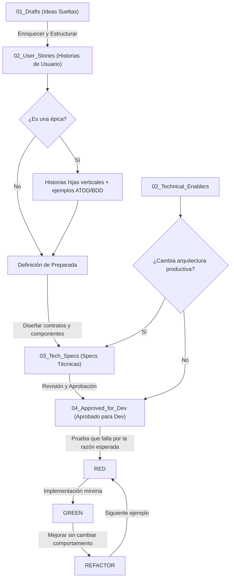

# Pipeline de Desarrollo y Especificaciones

Este directorio contiene las especificaciones y requerimientos organizados según el flujo de desarrollo del proyecto. Facilita la transición de ideas crudas a especificaciones técnicas y finalmente a código listo para ser generado/implementado. Los Technical Enablers forman un carril paralelo para trabajo técnico transversal que no representa una historia de usuario.

## Fases del Pipeline

El pipeline de desarrollo se divide en cuatro carpetas principales:

### 1. [[01_Drafts/README|01_Drafts]]
- **Propósito:** Ideas sueltas o requerimientos crudos de la fábrica.
- **Uso:** Punto de partida para anotar necesidades de producción, incidencias del día a día, o ideas preliminares de optimización sin estructura rígida.

### 2. [[02_User_Stories/README|02_User_Stories]]
- **Propósito:** Historias de usuario (User Stories) enriquecidas.
- **Uso:** Define formalmente el *quién*, *qué* y *para qué*, junto con criterios de aceptación detallados y escenarios de comportamiento.

#### Puerta de Refinamiento

- Una épica no genera una Tech Spec monolítica.
- Se divide en historias hijas que entregan resultados observables de extremo a extremo.
- Cada hija define invariantes, ejemplos ATDD/BDD, datos de prueba, errores, reintentos, correcciones y fuera de alcance.
- Solo una historia que cumple su Definición de Preparada pasa a Tech Spec.

### 2B. [[02_Technical_Enablers/README|02_Technical_Enablers]]

- **Propósito:** Trabajo técnico transversal que habilita historias o reduce riesgo y deuda.
- **Uso:** Define problema, evidencia, capacidad, criterios técnicos y Definition of Done.
- **Regla:** No puede resolver silenciosamente decisiones de negocio pendientes.
- **Ruta:** Si altera arquitectura productiva genera `TS-TE-XXX`; si solo afecta tooling reversible puede pasar directamente a aprobación.

### 3. [[03_Tech_Specs/README|03_Tech_Specs]]
- **Propósito:** Contratos de API, esquemas de BD, y componentes de UI.
- **Uso:** Especifica la arquitectura técnica del requerimiento, modelos de base de datos a modificar/crear, endpoints, y bocetos/interfaces de usuario.

### 4. [[04_Approved_for_Dev/README|04_Approved_for_Dev]]
- **Propósito:** Especificaciones listas y aprobadas para que el agente de IA genere código.
- **Uso:** Contiene la documentación final consolidada que el agente de IA consumirá directamente como instrucción definitiva para programar las características pedidas.

## Relación entre ATDD y TDD

- **Antes de la Tech Spec:** ATDD/BDD define qué comportamiento aceptará el negocio sin fijar tablas, endpoints o componentes.
- **En la Tech Spec:** cada escenario se asigna al nivel de prueba adecuado y se concretan los contratos.
- **Durante el desarrollo:** TDD implementa un comportamiento por vez mediante `BASELINE -> RED -> GREEN -> REFACTOR`.
- **Al integrar:** una prueba E2E corta demuestra el recorrido principal; las variantes permanecen en pruebas unitarias, de integración y contrato.
