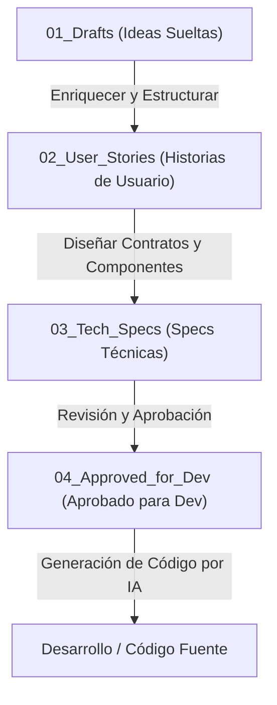

# Pipeline de Desarrollo y Especificaciones

Este directorio contiene las especificaciones y requerimientos organizados según el flujo de desarrollo del proyecto. Facilita la transición de ideas crudas a especificaciones técnicas y finalmente a código listo para ser generado/implementado.

## Fases del Pipeline

El pipeline de desarrollo se divide en cuatro carpetas principales:

### 1. [[01_Drafts/README|01_Drafts]]
- **Propósito:** Ideas sueltas o requerimientos crudos de la fábrica.
- **Uso:** Punto de partida para anotar necesidades de producción, incidencias del día a día, o ideas preliminares de optimización sin estructura rígida.

### 2. [[02_User_Stories/README|02_User_Stories]]
- **Propósito:** Historias de usuario (User Stories) enriquecidas.
- **Uso:** Define formalmente el *quién*, *qué* y *para qué*, junto con criterios de aceptación detallados y escenarios de comportamiento.

### 3. [[03_Tech_Specs/README|03_Tech_Specs]]
- **Propósito:** Contratos de API, esquemas de BD, y componentes de UI.
- **Uso:** Especifica la arquitectura técnica del requerimiento, modelos de base de datos a modificar/crear, endpoints, y bocetos/interfaces de usuario.

### 4. [[04_Approved_for_Dev/README|04_Approved_for_Dev]]
- **Propósito:** Especificaciones listas y aprobadas para que el agente de IA genere código.
- **Uso:** Contiene la documentación final consolidada que el agente de IA consumirá directamente como instrucción definitiva para programar las características pedidas.
