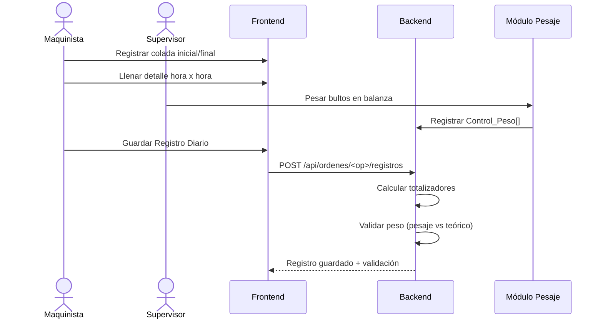

# Flujo: Cierre de Turno de Producción

## Pasos del Proceso

## Validación al Cierre
- `total_coladas_calculada = colada_final - colada_inicial`
- `total_kg_real` prioriza pesajes sobre cálculos
- Discrepancia > 5 Kg genera alerta de revisión
