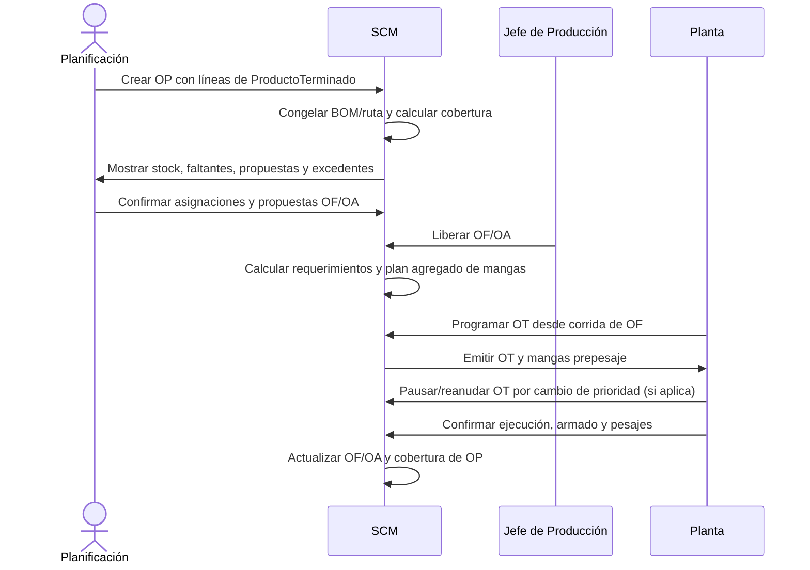

# Flujo: de demanda a ejecución

## Flujo normal

Una pausa por prioridad se aplica a la OT, no a la OP. La OF/OA solo se
proyecta como pausada cuando todas sus OT o corridas ejecutables pendientes
están pausadas. La pausa conserva hechos, reservas y mangas; liberar una
reserva exige una acción autorizada y una nueva revisión de cobertura.

## Entradas de la OP

1. Una o más líneas de `ProductoTerminado`.
2. Cantidad entera por línea.
3. Fecha de necesidad.
4. Prioridad.
5. Origen y referencia.

La OP no solicita molde, máquina, ciclo o receta.

## Configuración de OF

1. Molde y snapshot de composición.
2. Operación/ruta congelada.
3. Máquina prevista.
4. Parámetros técnicos.
5. Corridas por color con ciclos enteros.
6. Salidas, kg estándar y excedentes.

La OF puede proponerse desde varias líneas de OP o crearse excepcionalmente para
stock, muestra, reproceso o prueba con motivo y autorización.

## Reglas

- Una OP puede generar cero, una o varias OF/OA.
- Una OF/OA puede cubrir varias OP mediante asignaciones cuantificadas.
- Liberar OF/OA congela la configuración ejecutable.
- La OT referencia una OF y corrida exactas.
- El formulario legacy de creación técnica pasa a `OF excepcional`.
- La impresión técnica anterior de OP pasa a ser impresión de OF.
- Los pesajes y documentos legacy conservan sus identificadores originales.
