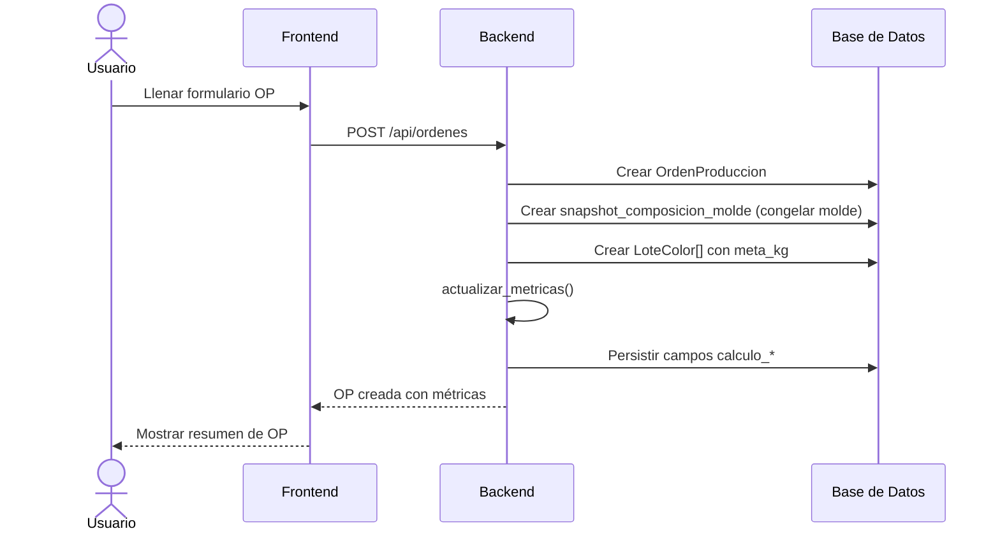

# Flujo: Creación de Orden de Producción

## Pasos del Proceso

## Inputs Requeridos
1. **Producto (SKU)** — selección de catálogo
2. **Molde** — selección → congela en [[Snapshot_Composicion_Molde]]
3. **Máquina** — selección
4. **Fecha inicio** — fecha planificada
5. **Parámetros técnicos** — T. ciclo, horas turno, peso colada
6. **Lotes de color** — cada uno con `meta_kg`

## Reglas de Negocio
- El molde se congela al momento de crear → cambios posteriores al molde no afectan OPs existentes
- `actualizar_metricas()` se ejecuta en cascada
- La OP nace con `activa = true`
