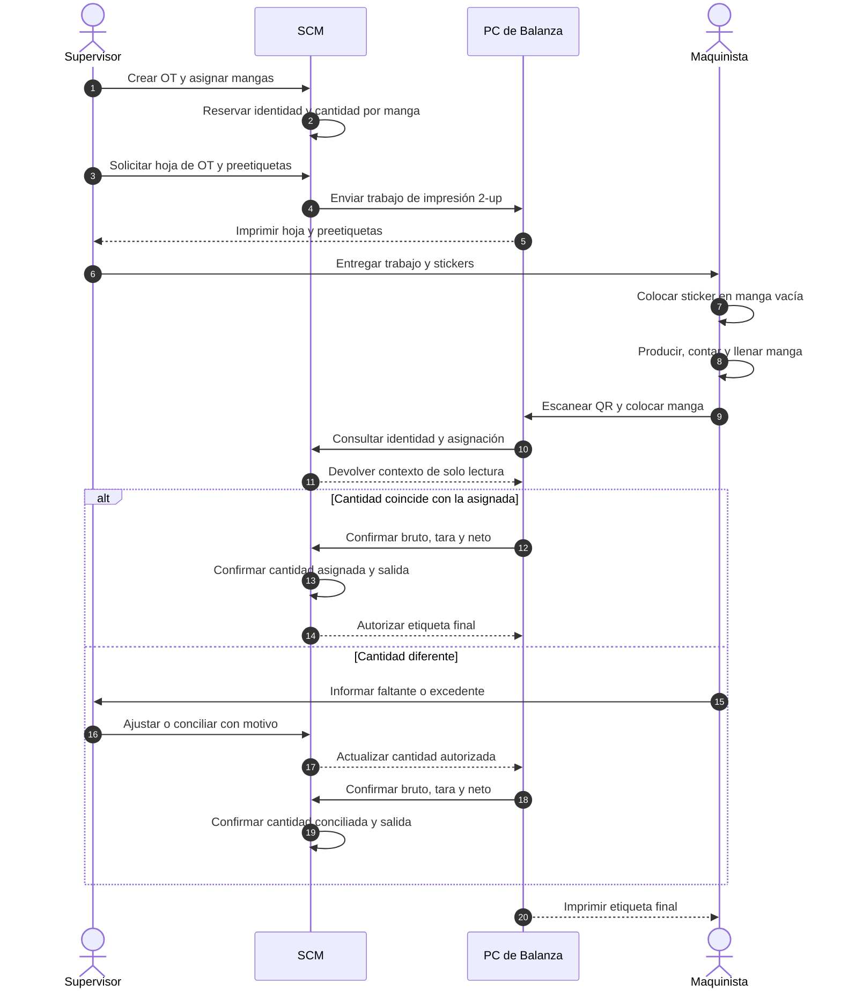

# Distribución de stickers y pesaje sin PC en máquina

La flecha `Supervisor -> Maquinista` representa una entrega física. No existe
una interfaz SCM en la máquina. El maquinista no digita la cantidad ni elige
documentos; el QR recupera la asignación preparada por el supervisor.
