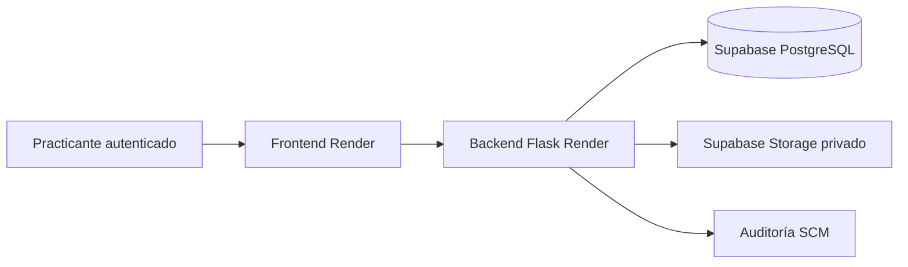

# Plan de despliegue para carga de maestros — Render + Supabase

## Objetivo

Habilitar un entorno restringido donde el practicante pueda cargar datos
maestros reales, usando Render para frontend/backend y Supabase para PostgreSQL
y almacenamiento de imágenes, sin mezclar esos datos con `envaperu_test` ni
perder la capacidad de reversa.

## Estado de partida

- El backend Flask y el frontend Vite tienen configuración básica para Render.
- El backend usa `DATABASE_URL` y Alembic; la revisión local vigente es
  `f69b8c4e6d10`.
- Las imágenes de ProductoTerminado y PiezaColor se almacenan hoy como `bytea`
  (`imagen_data`) en PostgreSQL y se sirven mediante endpoints del backend.
- No existe S3 configurado ni una abstracción de almacenamiento.
- `Cambiar perfil` y `X-Actor-Id` son mecanismos UAT, no autenticación real.
- El árbol de trabajo contiene cambios locales todavía no versionados; no debe
  desplegarse hasta obtener una revisión reproducible y pruebas verdes.

## Auditoría de Render — 2026-08-05

Workspace confirmado: `Esteban Jose's workspace`
(`tea-d0pb0a6uk2gs739emc90`).

- Frontend: `envaperu-scm-dashboard`, sitio estático, rama
  `codex/render-provisional-dashboard`, auto-deploy desactivado.
- Backend: `envaperu-scm-api`, Flask/Gunicorn en Virginia, rama
  `codex/render-provisional-dashboard`, auto-deploy desactivado.
- PostgreSQL: `envaperu scm database`, PostgreSQL 18, plan gratuito, disponible
  y con vencimiento informado por Render para el **2026-08-10**.
- El health check de la API responde correctamente.
- La estación de pesaje continúa enviando heartbeats, deltas e información de
  avance al backend desplegado; no se debe congelar ni reemplazar la base sin
  una ventana coordinada.
- La base no tiene tabla `alembic_version` ni las tablas nuevas de Ingeniería
  SCM. Corresponde al esquema anterior del piloto.
- Volumen aproximado observado: 13 232 pesajes legacy, 13 133 heartbeats,
  11 676 filas importadas, 1 507 deltas y 1 075 reportes de recepción.
- Los maestros SCM tradicionales están vacíos salvo un molde; no existen
  trabajadores, roles, piezas, piezas-color, productos terminados, máquinas ni
  órdenes de producción cargadas en esa base.

### Decisión posterior a la auditoría

La migración será **híbrida**:

1. preservar y trasladar a Supabase toda la telemetría operativa real de la
   estación;
2. no trasladar mocks de maestros desde `envaperu_test`;
3. aplicar de forma controlada el esquema SCM actual sobre el destino;
4. iniciar los maestros reales con un único Gerente General y acceso
   autenticado para el practicante;
5. mantener el backend anterior y la base Render como reversa hasta conciliar
   las escrituras del corte.

El despliegue actual está varias revisiones por detrás del código UAT local. No
se debe publicar el árbol de trabajo local directamente: primero se fijará una
versión reproducible y se ejecutarán pruebas automáticas.

## Auditoría de Supabase — 2026-08-05

Proyecto encontrado: `envaperu-SCM` (`ykhzvthmuxuqshyfdosm`), organización
`envaperu`, región `us-west-2`, estado `ACTIVE_HEALTHY`.

- El proyecto ya contiene un esquema SCM antiguo creado por la migración
  `20260318203129_create_all_tables`.
- Las tablas de negocio están vacías y `alembic_version` no contiene una
  revisión; no se puede ejecutar el Alembic actual suponiendo una base nueva.
- No existe ningún bucket de Storage.
- El esquema no contiene las tablas actuales de Ingeniería SCM ni la
  telemetría de estación que hoy vive en Render.
- Veintisiete tablas de `public` tienen RLS desactivado. Si se expone la API de
  Supabase con una clave pública, esas tablas podrían quedar accesibles. Antes
  de entregar acceso se deberá elegir una de estas estrategias:
  - acceso exclusivo del backend a PostgreSQL y revocación del acceso API para
    tablas de negocio; o
  - habilitar RLS y definir políticas asociadas a la identidad autenticada.
- Se detectaron claves foráneas sin índices de apoyo; se corregirán después de
  estabilizar el esquema funcional y antes de medir carga.

### Uso propuesto del proyecto existente

El proyecto puede reutilizarse porque no contiene datos de negocio, pero la
recreación o limpieza de `public` será una operación destructiva y requerirá
aprobación específica. Antes de ejecutarla se generará un inventario del
esquema, se comparará contra el Alembic vigente y se conservará un respaldo de
definición.

## Proyecto Supabase definitivo — 2026-08-05

Se creó un proyecto nuevo y limpio llamado `envaperu-scm`:

- referencia: `swsovpdcbomvfhomplnc`;
- organización: `envaperu`;
- región: `us-east-1`;
- estado: `ACTIVE_HEALTHY`;
- tablas `public`: 137;
- revisión Alembic: `f71d0e6f8b32`;
- bucket privado `catalog-images`: creado, con límite de 2 MB y MIME permitidos
  `image/jpeg`, `image/png` e `image/webp`.

Este proyecto sustituye como destino al proyecto anterior `envaperu-SCM`. Su
región queda alineada con el backend de Render en Virginia.

El esquema completo fue ensayado primero en una base PostgreSQL local limpia y
luego aplicado al proyecto definitivo. Las 137 tablas tienen RLS activo. Se
revocó el acceso directo a tablas, secuencias y funciones para `anon` y
`authenticated`, incluyendo sus privilegios predeterminados futuros. La
función interna `rls_auto_enable()` solo puede ejecutarse directamente desde
roles server-side. También se fijó el `search_path` de las funciones internas
SCM.

El acceso elegido para el piloto es **exclusivamente a través del backend
Flask**. Por ello, los avisos informativos de RLS sin políticas son esperados:
la API automática de Supabase no debe acceder a las tablas de negocio. La base
continúa vacía de participantes y maestros; no se trasladaron mocks locales.

## Incremento implementado en código — 2026-08-05

- Se incorporó almacenamiento de imágenes con modos `database` y
  `supabase_s3`.
- ProductoTerminado y PiezaColor conservan `imagen_data` como copia temporal y
  agregan clave de objeto, hash SHA-256 y tamaño.
- Los endpoints existentes cargan, leen y eliminan mediante el servicio de
  almacenamiento; ante una caída de Storage conservan la reversa a PostgreSQL.
- Las claves son deterministas por tipo e identificador, de modo que cambiar
  una imagen reemplaza el objeto esperado y no acumula archivos huérfanos.
- CORS admite una lista explícita mediante `ALLOWED_ORIGINS`.
- La conexión SQL activa comprobación de vida y reciclaje del pool.
- Se documentaron variables de ejemplo sin credenciales reales.

Validación ejecutada:

- cadena Alembic completa sobre PostgreSQL limpio hasta `f71d0e6f8b32`;
- `flask db check` sin cambios de esquema pendientes;
- 26 pruebas dirigidas de catálogo e imágenes aprobadas;
- regresión rápida completa: 284 aprobadas, 1 omitida por OCR opcional y 16
  pruebas de perfiles especiales excluidas por la configuración predeterminada;
- perfil PostgreSQL real: 14 aprobadas y 1 omitida por OCR opcional; la cadena
  completa crea una base limpia, llega a `f71d0e6f8b32` y no deja drift;
- configuración S3 probada con cliente simulado, incluido fallback y fallos de
  borrado.

Las credenciales S3 server-side se generaron y quedaron guardadas directamente
como variables privadas del backend `envaperu-scm-api` en Render. No fueron
copiadas al repositorio ni documentadas en el vault. Se mantiene
`CATALOG_IMAGE_KEEP_DATABASE_COPY=true` para el primer corte.

Pendiente antes del corte:

1. guardar en Render la URL de Supavisor de sesión con SSL, sin exponer la
   contraseña;
2. respaldar y trasladar la telemetría real de la base Render durante una
   ventana coordinada;
3. fijar una revisión reproducible y desplegar el código ya validado;
4. sustituir el selector UAT de actor por autenticación real antes de entregar
   acceso externo al practicante.

Las dos URLs de PostgreSQL necesarias para el respaldo se capturarán mediante
un formulario local de PowerShell con `Read-Host -AsSecureString` y se
conservarán temporalmente cifradas con DPAPI dentro de `.codex_tmp`. No se
pegarán en chats, documentos ni archivos versionados. El archivo cifrado se
eliminará después de validar la migración.

## Bloqueos antes de entregar acceso

1. Proteger el entorno con autenticación real o un control de acceso externo.
2. Vincular la identidad autenticada con un único `Trabajador`; el cliente no
   debe poder escoger libremente `X-Actor-Id` en un entorno remoto.
3. Sustituir el serial temporal `9999999` de `Haitian 3000`.
4. Definir si las fotografías representativas serán cargadas por el practicante.
5. Crear un commit y una rama de despliegue reproducible en backend y frontend.

## Arquitectura objetivo



Las credenciales de PostgreSQL y S3 permanecen únicamente en variables secretas
del backend. El frontend conserva los endpoints actuales de imagen; el backend
resuelve el objeto en Storage y evita exponer credenciales S3.

## Decisión de datos

Antes de migrar se auditará la base actual de Render:

- **Inicio limpio — recomendado para carga de maestros:** aplicar Alembic hasta
  `head`, crear solamente la identidad administrativa inicial y dejar que el
  practicante cargue maestros reales. No trasladar mocks UAT.
- **Migración completa:** usarla solo si Render contiene datos reales que deben
  conservarse. Requiere inventario de tablas, conteos, dump, restauración,
  validación de secuencias y conciliación funcional.

No se copiará automáticamente `envaperu_test` a Supabase.

## Fases

### 1. Auditoría de Render

- confirmar workspace, servicios, ramas, regiones y auto-deploy;
- identificar la base PostgreSQL conectada y su revisión Alembic;
- medir tablas, filas, imágenes `bytea` y datos reales frente a mocks;
- conservar un respaldo lógico previo a cualquier cambio.

### 2. Proyecto Supabase

- crear proyecto en una región compatible con Render;
- obtener conexión directa para migraciones y dump/restore;
- usar Supavisor en modo sesión para el backend si la conectividad exige IPv4;
- exigir SSL en `DATABASE_URL`;
- crear bucket privado `catalog-images`;
- generar credenciales S3 exclusivamente server-side.

Variables previstas:

```text
DATABASE_URL
CATALOG_IMAGE_STORAGE=supabase_s3
SUPABASE_S3_ENDPOINT
SUPABASE_S3_REGION
SUPABASE_S3_ACCESS_KEY_ID
SUPABASE_S3_SECRET_ACCESS_KEY
SUPABASE_STORAGE_BUCKET=catalog-images
ALLOWED_ORIGINS
```

### 3. Adaptación de imágenes

- introducir un servicio de almacenamiento con backend `database` y
  `supabase_s3`;
- agregar `imagen_storage_key`, conservando temporalmente `imagen_mime` y
  `imagen_data` para reversa;
- escribir objetos nuevos en Storage y leer primero Storage con fallback a
  `bytea`;
- ejecutar backfill idempotente de imágenes existentes;
- verificar hash, MIME, tamaño y disponibilidad antes de limpiar binarios;
- retirar `imagen_data` solamente en un incremento posterior.

Claves implementadas:

```text
catalog/pieza-color/{id}/image
catalog/producto-terminado/{id}/image
```

### 4. Migración PostgreSQL

Para migración completa:

1. activar ventana de solo lectura;
2. tomar `pg_dump` de esquema `public` con `--no-owner --no-acl`;
3. restaurar en Supabase mediante conexión directa;
4. ejecutar `flask db upgrade`;
5. validar revisión Alembic, conteos, claves foráneas, secuencias y muestras;
6. ejecutar pruebas de lectura/escritura sin apuntar todavía al público.

Para inicio limpio se omiten dump y restore; se aplican migraciones y bootstrap
controlado.

### 5. Despliegue y corte

- desplegar primero backend contra Supabase y validar `/api/health`;
- comprobar participantes, permisos, catálogos e imágenes;
- desplegar frontend con `VITE_API_URL` del backend;
- restringir CORS al dominio del frontend;
- ejecutar una carga de maestro de prueba y su baja lógica;
- habilitar al practicante solo después del smoke test.

## Reversa

- no eliminar ni modificar la base Render durante el primer corte;
- conservar su `DATABASE_URL` y dump fechado;
- mantener fallback de imágenes a `bytea` durante una versión completa;
- ante error, restaurar las variables anteriores del backend y redesplegar;
- conciliar cualquier escritura producida durante la ventana antes de reintentar.

## Corte ejecutado — 2026-08-05

- Respaldo custom completo de Render: 21 740 616 bytes, SHA-256
  `1ABD078FB9A25D3839424A8D609E76A77F1B2E4565CD805104AD8CC4839B6C62`.
- Se compararon 157 columnas de 13 tablas de estación; la firma de esquema fue
  idéntica entre origen y destino.
- Se trasladaron 13 232 pesajes legacy, 11 676 filas importadas, 1 507 deltas,
  1 075 reportes y 855 avances, sin claves foráneas huérfanas.
- El último pase incorporó los eventos históricos creados durante el despliegue.
  La base Render antigua terminó con 13 258 heartbeats y Supabase recibió el
  heartbeat siguiente después del corte.
- Backend Render desplegado desde `f7e6d57`; health check `200`, PostgreSQL
  disponible y CORS limitado al dashboard oficial.
- Frontend Render desplegado desde `fb9174f`; build y smoke visual aprobados,
  sin la etiqueta interna `UAT local`.
- Bucket privado probado con escritura, lectura y eliminación real.
- Bootstrap funcional: solo `TRB-000001`, Gerente General activo, con 115
  capacidades efectivas. No se cargaron maestros mock.

La reversa local y las credenciales DPAPI permanecen en `.codex_tmp`, excluido
de Git. Deben eliminarse después de la ventana de observación. Las credenciales
de PostgreSQL deben rotarse porque sus valores iniciales fueron compartidos en
el canal de trabajo; la rotación debe completarse antes de entregar acceso.

El despliegue técnico no sustituye el control de acceso humano: `Cambiar
perfil` y `X-Actor-Id` siguen siendo mecanismos del piloto. El dashboard no se
debe compartir externamente con el practicante hasta incorporar autenticación
real o una barrera de acceso equivalente.

## Criterios de salida

- autenticación y actor server-side verificados;
- Alembic en `head` y health check saludable;
- creación, edición, desactivación y auditoría de maestros aprobadas;
- carga, lectura, cambio y eliminación de imagen aprobadas;
- ningún mock UAT mezclado con maestros reales;
- respaldo y reversa probados;
- guía de carga inicial entregada al practicante.

## Referencias oficiales

- https://supabase.com/docs/guides/database/connecting-to-postgres
- https://supabase.com/docs/guides/storage/s3/authentication
- https://supabase.com/docs/guides/deployment/database-migrations
- https://render.com/docs/deploy-flask
- https://render.com/docs/configure-environment-variables
