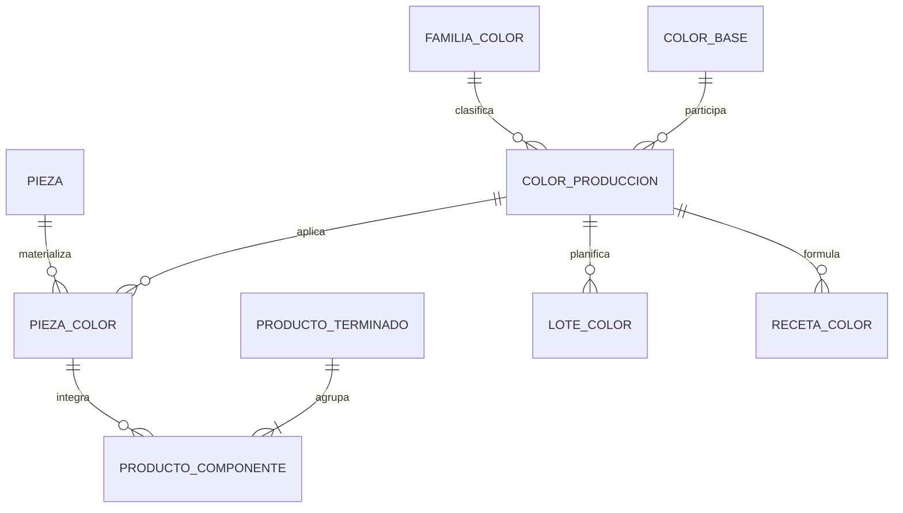

# ADR: Reemplazo del concepto "ColorProducto" por "ColorBase" y "ColorProduccion"

> [!IMPORTANT] Refinamiento posterior de composición
> Esta decisión sigue vigente para colores. La afirmación de que `ProductoTerminado` agrupa directamente N `PiezaColor` quedó limitada al primer corte: [[2026-07-24_Prearmado_Parcial_como_WIP_y_Empaque_Normalizado]] adopta una estructura multinivel de artículos que puede incluir WIP y termina en hojas `PiezaColor`.

## Contexto

El modelo actual cuenta con una clase `ColorProducto` que tiene una relación "muchos a uno" con `FamiliaColor` (es decir, cada `ColorProducto` pertenece a una sola familia). Históricamente, este modelo nació en diciembre de 2025 y arrastró conceptos comerciales hacia la estructura física de las piezas.

Un análisis empírico profundo de los SKUs reales (Excel) reveló que:
1. Los colores base (ej. ROJO, AZUL) **aparecen en múltiples familias** (SOLIDO, TRANSPARENTE, etc.).
2. Existen códigos/nombres que se repiten entre familias.
3. El producto terminado (`ProductoTerminado`) mantiene una clasificación comercial de familia que frecuentemente **contradice** la familia real de sus piezas.

Por lo tanto, la cardinalidad actual (`ColorProducto` -> única `FamiliaColor`) es inválida. La decisión anterior (ADR "Revalorización de FamiliaColor como Clave de Receta") intentó solventar el problema añadiendo la familia a la clave de la receta, pero mantenía la estructura defectuosa de `ColorProducto`.

## Decisión

Se decide erradicar el concepto legado `ColorProducto` y reemplazarlo por un modelo normalizado de tres componentes:

1. **`ColorBase`**: Representa el pigmento/color puro (ROJO, AZUL, AMARILLO). **No tiene relación** con ninguna familia.
2. **`FamiliaColor`**: Representa el acabado (SOLIDO, PASTEL, CARAMELO, TRANSPARENTE, NEON).
3. **`ColorProduccion`**: Es la tabla intermedia/combinación operacional (`ColorBase` + `FamiliaColor`). Ej: "ROJO SÓLIDO".

### Implicancias Arquitectónicas

- `PiezaColor` (el SKU físico de la pieza) ahora es la combinación de `Pieza` + `ColorProduccion`.
- `ProductoTerminado` pierde definitivamente todos los campos de color (`familia_color`, `cod_familia_color`, `familia_color_id`) y se convierte puramente en una Lista de Materiales (BOM) que agrupa N `PiezaColor`. El SKU importado se conserva solo como identificador.
- Las recetas (fórmulas) y los lotes (OP) se asocian directamente a `ColorProduccion`. Al seleccionar un color en la OP, se elige un `ColorProduccion` (ej. ROJO SÓLIDO), no solo una base.

## Consecuencias

1. **Refactorización masiva:** 37+ archivos referencian `ColorProducto` explícitamente y deberán ser actualizados.
2. **Limpieza de ProductoTerminado:** Se eliminará definitivamente la lógica de match por familia en rutas de producción. Las salidas se resolverán estrictamente como `Pieza` + `ColorProduccion`.
3. **Actualización del Módulo de Pesaje:** El módulo de pesaje deberá referenciar el `lote_salida_pieza_color_id` correcto. El texto del color enviado al pesaje será solo un snapshot de impresión, no una FK.
4. **Migrador de SKUs:** El script `migrar_skus.py` deberá ser reescrito para no mezclar las variantes de color ni forzar dependencias inválidas.

## Reemplazo
Este ADR **reemplaza y anula** al ADR previo `2026-07-11_Revalorizacion_FamiliaColor_Clave_Receta.md`, ya que aborda el problema de raíz mediante la normalización del dominio.
