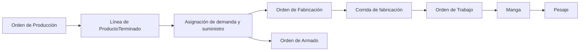

# Separación OP, OF, OA y OT con cobertura N:M

## Contexto

La entidad persistida actualmente como `OrdenProduccion` no representa una
necesidad de `ProductoTerminado`. Es una instrucción técnica por molde: congela
composición, cavidades, pesos, ciclo, colores, recetas, coladas y parámetros de
máquina. El `ProductoTerminado` que contiene es opcional y referencial porque un
molde puede producir varias `PiezaColor`, WIP o incluso una salida que no esté
destinada todavía a un producto comercial.

US-010P introdujo correctamente una necesidad anterior mediante
`SolicitudProduccion`, líneas de `ProductoTerminado`, explosión multinivel y
asignaciones N:M. Sin embargo, mantener el nombre OP para la instrucción de
molde mezcla dos responsabilidades:

1. decidir **qué producto y cantidad necesita el negocio**;
2. decidir **cómo, con qué molde y mediante qué operaciones se fabricará**.

La Hoja de Producción diaria, RDP u Orden de Trabajo pertenece a un tercer
nivel: la ejecución concreta por fecha, máquina y personal.

## Decisión

### 1. Orden de Producción

`OrdenProduccion` será el documento de demanda productiva. Su cabecera puede
contener una o más `OrdenProduccionLinea`; cada línea solicita una cantidad
entera de `ProductoTerminado`, con fecha requerida, prioridad y origen.

La OP:

- expresa qué necesita el negocio y cuándo;
- congela las revisiones de estructura y ruta usadas para planificar;
- muestra cobertura por stock, WIP, fabricación y armado;
- no contiene molde, máquina, cavidades, ciclo, receta ni maquinista como
  atributos autoritativos;
- puede completarse sin fabricar cuando el stock elegible cubre toda la demanda.

En interfaz puede comenzar con una sola línea por simplicidad, pero el agregado
no impone una OP distinta por cada producto.

### 2. Orden de Fabricación

La entidad técnica actualmente llamada `OrdenProduccion` evoluciona a
`OrdenFabricacion`.

Una OF gobierna una campaña técnica de fabricación por molde. Congela:

- molde y revisión de su composición;
- cavidades y pesos por pieza;
- parámetros de ciclo, colada y máquina prevista;
- una o más corridas o lotes de fabricación, cada uno con un único
  `ColorProduccion`, receta, ciclos enteros y salidas esperadas;
- coproductos, excedentes inevitables, consumo previsto y merma técnica.

La OF puede producir `PiezaColor`, WIP o `ProductoTerminado` según la salida de
la operación de ruta congelada. Que el resultado sea un producto final no
obliga a crear una Orden de Armado.

Se admite una OF sin OP para `REPOSICION_STOCK`, `MUESTRA`, `REPROCESO`,
`PRUEBA_TECNICA` u otro motivo gobernado. Estas excepciones conservan actor,
motivo y autorización del Jefe de Producción según política.

### 3. Orden de Armado

`OrdenArmado` es la especialización ejecutable para una operación que consume
artículos y produce WIP o `ProductoTerminado`. Congela BOM, ruta, cantidades y
componentes, y conserva genealogía de cada resultado.

Una OP puede requerir cero, una o varias OA. Una OA también puede existir para
reposición de WIP o producto bajo una fuente de demanda gobernada.

### 4. Orden de Trabajo

`OrdenTrabajo` continúa siendo el nombre canónico de
`RegistroDiarioProduccion` / Hoja de Producción diaria. Es una porción
despachada de una OF para una fecha productiva, máquina y turno.

Para el piloto de inyección, una OT referencia exactamente:

- una OF liberada;
- una corrida/lote de fabricación y, por tanto, un color;
- una máquina;
- una fecha operativa y turno;
- un maquinista previsto, sin impedir registrar relevos auditados.

Una OF puede ejecutarse mediante varias OT. Un cambio de molde o color que
constituya otra corrida no se oculta dentro de la misma OT.

### 5. Relación de cobertura

OP, OF y OA no forman un árbol rígido. La cobertura se representa mediante
`AsignacionDemandaSuministro`, relación N:M entre una línea de OP y una salida
planificada o confirmada de una orden ejecutable.

La asignación conserva, como mínimo:

- `orden_produccion_linea_id`;
- identidad de la salida de OF/OA o del stock elegible;
- cantidad `PLANIFICADA`, `COMPROMETIDA`, `SATISFECHA` y `CANCELADA`;
- origen, versión y timestamps;
- reserva o lote físico cuando esa granularidad ya exista.

Una OF puede cubrir varias OP y una OP puede requerir varias OF/OA. El campo
`generated_from_op_id`, si se conserva, es solo auditoría de origen y no
sustituye esta relación.

### 6. Identificación de mangas

Una manga de fabricación pertenece operativamente a una OT y a su OF. Su código
humano no incluirá una OP como si fuera padre singular.

Formato recomendado:

```text
OF0042-OT0301-M003
```

El QR usa el `public_id` estable y versionado de la manga. El código humano no
es clave primaria ni se interpreta para reconstruir relaciones. La OP puede
mostrarse como referencia únicamente cuando exista una sola asignación y el
espacio lo permita.

### 7. Documentos imprimibles

| Documento | Audiencia | Contenido |
|---|---|---|
| OP | Planificación, gerencia y ventas | Productos, cantidades, fechas, prioridad y cobertura |
| OF | Jefatura y preparación técnica | Molde, composición, colores, recetas, coladas, parámetros y objetivos |
| OT | Supervisor y maquinista | Trabajo de la fecha, máquina, color, maquinista y mangas |
| OA | Armado | Componentes, operación, cantidades y salida WIP/PT |
| Etiqueta de manga | Maquinista, balanza y almacén | OF–OT, artículo/color, manga, tipo y QR |

El PDF actual llamado OP se convierte en la impresión técnica de OF. Los
resultados reales no se escriben manualmente sobre la OP u OF: se proyectan
desde OT, confirmaciones, mangas y pesajes.

## Modelo lógico



## Compatibilidad y migración

1. Las filas actuales de `orden_produccion` se preservan como OF; no se
   reinterpretan como demanda de `ProductoTerminado`.
2. Sus números visibles `OP-*` pueden conservarse como
   `codigo_legacy_op`/alias histórico. Las OF nuevas usan correlativo `OF-*`.
3. Los pesajes, RDP/OT y referencias legacy conservan sus IDs. La migración
   cambia la semántica del padre técnico, no reescribe hechos físicos.
4. `SolicitudProduccion` y `SolicitudProduccionLinea`, todavía sin operación
   legacy real, evolucionan a la nueva OP y sus líneas.
5. El formulario `OP excepcional` pasa a `OF excepcional`.
6. El endpoint y nombre físico de tabla pueden mantener un adaptador temporal;
   el contrato nuevo no debe continuar publicando la ambigüedad.
7. US-010C/D ya implementadas localmente conservan OT, mangas, QR, pesajes e
   idempotencia. La adaptación principal es sustituir la referencia operativa
   OP por OF y versionar el contrato.

## Estados separados

| Agregado | Estados mínimos |
|---|---|
| OP | `BORRADOR`, `APROBADA`, `PLANIFICADA`, `EN_COBERTURA`, `COMPLETADA`, `CANCELADA` |
| OF/OA | `BORRADOR`, `LIBERADA`, `PROGRAMADA`, `EN_EJECUCION`, `CERRADA`, `ANULADA` |
| OT | `PLANIFICADA`, `EMITIDA`, `EN_CURSO`, `FINALIZADA`, `CERRADA`, `ANULADA` |

Calidad, inventario, impresión y sincronización mantienen estados ortogonales.
Cerrar un documento no implica liberar Calidad ni ingresar una manga al Kardex.

## Roles

- Planificación crea/aprueba OP y confirma asignaciones.
- Jefe de Producción libera OF/OA y autoriza excepciones o ampliaciones.
- Supervisor programa y emite OT.
- Maquinista ejecuta la OT y utiliza mangas preplanificadas sin digitar contexto.
- Operador de balanza escanea, pesa y confirma; una persona puede acumular ambos
  roles si posee las capacidades.

Los permisos se asignarán por capacidades y no mediante condicionales por
nombre de rol.

## Consecuencias

- El lenguaje del dominio coincide con la responsabilidad real de cada
  documento.
- La producción directa de PT, el WIP, el armado y la reposición de piezas no
  requieren excepciones conceptuales.
- La consolidación de demanda no pierde trazabilidad.
- La estación de pesaje conserva una interacción mínima.
- US-010P requiere nueva Tech Spec antes de desarrollar persistencia.
- US-010B debe reservar materiales contra OF, no contra la OP de demanda.
- Los dashboards agregan ejecución OF/OT y calculan cobertura de OP mediante
  asignaciones, sin duplicar cantidades almacenadas.

## Alternativas descartadas

### Mantener la OP técnica y crear otro documento de demanda

Descartada porque perpetúa que “Orden de Producción” signifique molde y obliga
a inventar otro nombre para el documento que realmente ordena producir
productos terminados.

### OP como padre 1:N obligatorio de OF y OA

Descartada porque impide consolidar varias demandas en una campaña, producir
componentes para stock o cubrir una demanda parcialmente desde inventario.

### Una OF por ProductoTerminado

Descartada porque el molde puede generar múltiples piezas/coproductos y esas
salidas pueden abastecer varios productos.

### Incluir OP en la identidad de la manga

Descartada porque una salida de OF puede cubrir varias OP. El QR debe resolver
relaciones por IDs, no por parsing de texto.
